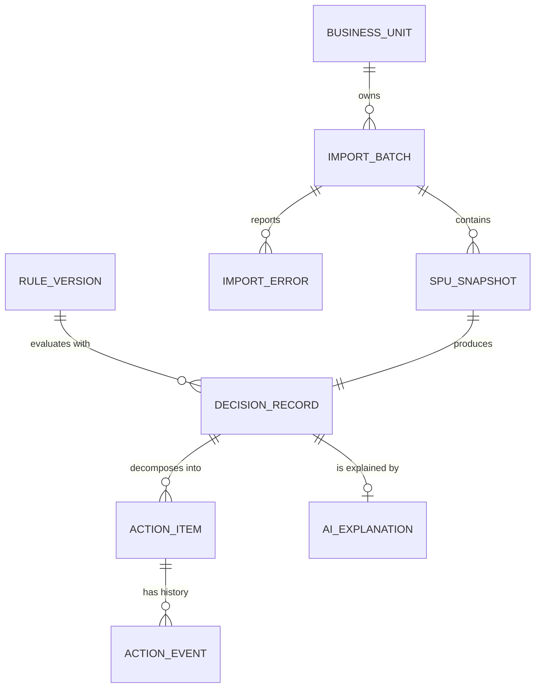
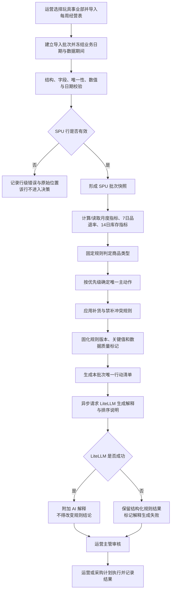
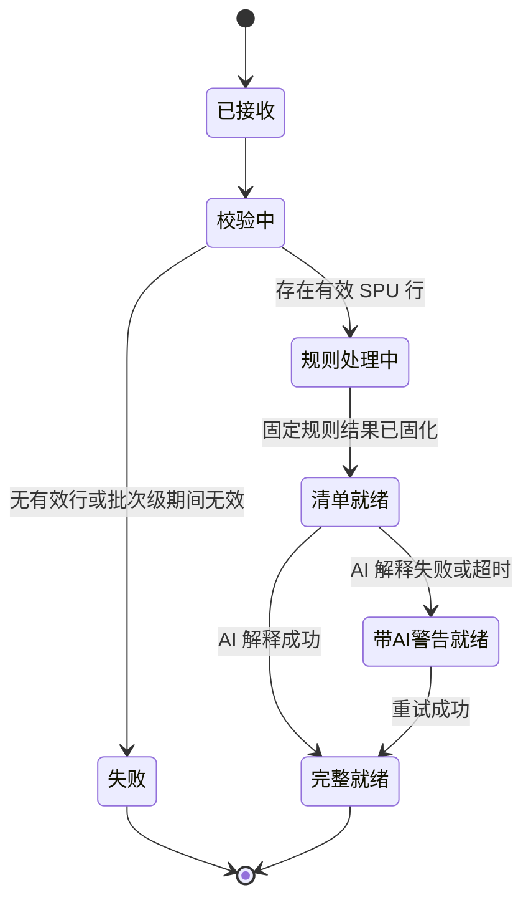
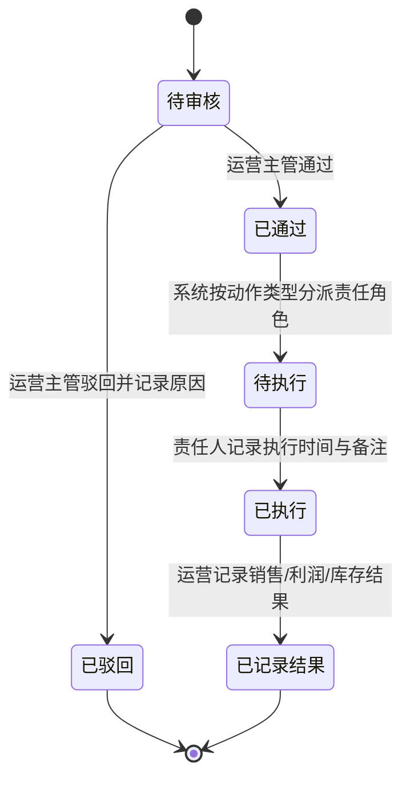
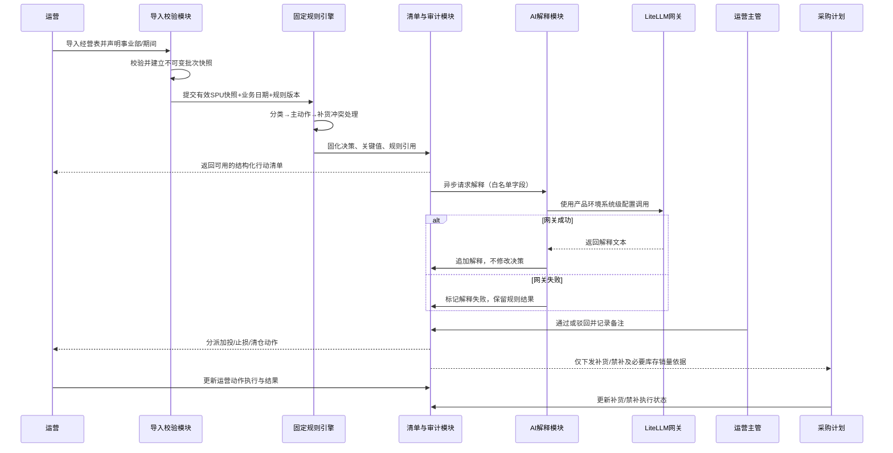

# r1-architect.md · 架构师主笔章节

> 写作基线：已确认的 `output/PRD-V0.md`、`drafts/source-baseline.md`、`drafts/id-registry.md`、`evidence/商品链接字段核验.md`。阶段 2—4 仍为跳过状态；以下技术内容均为满足 F01—F08 的逻辑架构建议，不代表已确认的技术栈选型。

## §3 核心算法 / 目标函数

### 3.1 决策问题定位

本产品不是预测或组合优化系统，也不需要 CP-SAT、SCIP、Gurobi 等优化求解器。首版决策是对每个 SPU 独立执行的确定性规则判定：输入同一导入批次、同一规则版本和同一业务基准日，必须得到相同的商品分类、主动作和补货结论（F02、F03、F08；REQ-F02-01～REQ-F02-03、REQ-F03-01～REQ-F03-03；NFR-001、NFR-005）。

选择固定规则表而不是优化求解器的原因：

- 规则阈值、动作优先级和冲突关系均已由业务确认，不存在需要求解的全局预算分配目标。
- 每个 SPU 可独立判定，复杂度为 `O(n)`；引入优化器会增加参数校准和可解释性成本，却不会提高规则符合度。
- AI 只负责解释、非覆盖式优化提示及优先级说明，不参与商品分类或动作裁决（F04；REQ-F04-01～REQ-F04-03）。

该选择的代价是：系统不会自动求出跨 SPU 的最优投放预算或采购数量；这些能力不属于 V0，不能由 AI 越权补齐。

### 3.2 变量、周期与有效性

对导入批次 `b` 中的 SPU `i`，定义：

| 符号 | 含义 | 有效性约束 |
|---|---|---|
| `D_b` | 批次业务基准日 | 按 `Asia/Shanghai` 的业务日期冻结，不随页面访问时间变化 |
| `L_i` | 上架日期 | 必须可解析；否则商品类型为“数据异常” |
| `S_i` | 上一个完整自然月扣除退款后的净销售额 | 必须与批次声明的数据期间一致 |
| `P_i` | 上一个完整自然月表内“经营准利润率” | 直接采用数据支持表口径，不按旧公式重算 |
| `R_i` | 最近 7 天品退件数 ÷ 最近 7 天已销售件数 | 只有周期已校验且分母有效时才参与规则 |
| `W_i` | 仓内库存数量 | 补货判断条件必需 |
| `T_i` | 在途库存数量 | 补货判断条件必需 |
| `Q14_i` | 最近 14 天销量 | 补货判断条件必需 |
| `A_i` | 主动作 | `清仓/止损/观察/加投/维持/不判定`，同一 SPU 至多一个 |
| `B_i` | 补货结论 | `禁止补货/补货/不补货/不生成` |

`D_b` 的用途是让历史批次可重放。新品条件按自然月位移表达为：

```text
is_new(i, b) := D_b < add_months(L_i, 2)
```

即上架未满 2 个月为新品；不得用“当前打开页面的日期”重算历史批次，也不得把无法解析的上架日期猜成默认值。

### 3.3 商品分类函数

商品分类 `C_i` 按“先新品、后非新品销售额分层”求值：

```text
若 L_i 无效：                         C_i = 数据异常
若 is_new(i, b)：                     C_i = 新品
若非新品且 S_i 缺失：                 C_i = 数据异常
若非新品且 S_i >= 100000：            C_i = 大爆款
若非新品且 20000 <= S_i < 100000：    C_i = 小爆款
若非新品且 S_i < 20000：              C_i = 淘汰商品
```

所有金额比较使用同一币种和未格式化的数值；阈值边界按上式包含等号，不允许由显示层四舍五入后的值参与判断（F02、F03；REQ-F02-01、REQ-F03-01）。

### 3.4 主动作候选与唯一化

固定动作优先级为：

```text
清仓 > 止损 > 观察 > 加投 > 维持
```

规则引擎先产生候选动作，再选择优先级最高者作为唯一主动作 `A_i`（REQ-F03-02）。候选集合如下：

#### 新品

```text
P_i >= -0.20  -> 加投
P_i <  -0.20  -> 观察
P_i 缺失      -> 不判定（待补数）
```

#### 大爆款

```text
P_i < 0                                      -> 清仓候选
P_i < 0.05                                   -> 止损候选
R_i 有效且 R_i > 0.015                       -> 观察候选
P_i >= 0.10 且 R_i 有效且 R_i <= 0.015       -> 加投候选
候选集合为空                                 -> 维持
```

#### 小爆款

```text
P_i < 0.05                                   -> 清仓候选
P_i < 0.10                                   -> 止损候选
R_i 有效且 R_i > 0.015                       -> 观察候选
P_i >= 0.15 且 R_i 有效且 R_i <= 0.015       -> 加投候选
候选集合为空                                 -> 维持
```

#### 淘汰商品

```text
A_i = 清仓
```

对大爆款和小爆款，`P_i` 缺失时无法排除优先级更高的清仓或止损，因此不输出较低优先级的观察、加投或维持，统一标记为“不判定（待补数）”。这是保证动作优先级正确的降级约束，不使用缺失值的默认数替代（REQ-F03-02、NFR-001）。淘汰商品的清仓来自销售额分类，不依赖利润率。

`R_i` 缺失、统计周期不是最近 7 天或分母无效时，按“品退数据未校验”处理：不触发观察，也不能证明 `R_i <= 1.5%`，因此不能触发依赖该条件的加投；清仓和止损仍可由有效利润率独立触发（REQ-F02-02、REQ-F03-02）。

### 3.5 补货函数与冲突约束

补货结论必须在主动作之后计算，避免运营止损而采购继续补货（REQ-F03-03）：

```text
若 A_i ∈ {清仓, 止损}：
    B_i = 禁止补货

否则若 C_i = 新品：
    B_i = 不生成（新品首版不判断补货）

否则若 C_i 或 A_i 为“不判定”：
    B_i = 不生成（前置决策数据不足）

否则若 W_i、T_i、Q14_i 任一缺失：
    B_i = 不生成（库存数据不足）

否则令 avg14_i = Q14_i / 14：
    若 avg14_i = 0：B_i = 不生成（无近期销售）
    否则 days_i = (W_i + T_i) / avg14_i
         days_i < 30：B_i = 补货
         days_i >= 30：B_i = 不补货
```

约束说明：

- `禁止补货` 是由清仓/止损强制产生的业务结论；即使库存字段缺失也必须输出。
- `不补货` 表示数据完整且库存可售天数不少于 30 天；`不生成` 表示无法或不应判断。两者不得合并为同一枚举值。
- 加投与补货可以同时存在；清仓或止损与补货不可同时存在。
- 现有样本缺少 `W_i/T_i/Q14_i`，因此试跑只能生成“不生成（库存数据不足）”或由清仓/止损带出的“禁止补货”，不能推测库存可售天数。

### 3.6 清单优先级与 AI 边界

主动作优先级分层由固定规则决定。AI 可在同一动作层内给出排序解释或非覆盖式优化提示，但不得改变 `C_i/A_i/B_i`，也不得补造缺失指标（F04、F05；REQ-F04-01～REQ-F04-03、REQ-F05-01～REQ-F05-03）。

架构建议采用“两层结果”而不是让模型返回最终动作：

1. **确定性层**：规则引擎输出商品分类、主动作、补货结论、触发规则、关键值、数据质量标记和动作优先级层级。
2. **解释层**：LiteLLM 仅消费白名单后的结构化结果，输出问题说明、关键依据表述、动作解释和不改变结论的优化提示。

若解释层失败，行动清单仍按固定动作优先级和稳定 SPU 标识排序，显示结构化依据及“AI 解释生成失败”；不得删除建议或回退为模型猜测（REQ-F04-03、NFR-004）。同动作内更细的代理指标顺序尚未被业务确认，不在本架构稿中固化为新规则。

### 3.7 规则版本与参数治理

- 阈值属于已确认的产品规则，不由模型或历史数据自动校准。
- 每次决策绑定不可变的 `rule_version`；规则变更只影响新批次，不回写旧批次。
- 如后续需要调整阈值，架构建议先用历史批次做只读重放，展示受影响 SPU 数量和动作变化，再由业务流程确认新版本；重放结果不得覆盖原建议。
- 当前 10—20 个 SPU 的规则计算为线性扫描。未经技术负责人确认，不写入具体语言、数据库、队列或数值 SLA；唯一硬约束是规则计算不得依赖 LiteLLM 完成，AI 延迟不能阻塞固定结论可用。

---

## §4 数据需求 + 数据模型

### 4.1 数据优先级

| 优先级 | 数据 | 粒度 | 来源 | 频率 | 缺失时行为 | 对应需求 |
|---|---|---|---|---|---|---|
| 必需 | SPU ID、名称、店铺、平台、责任运营、上架日期 | SPU | 数据支持部门经营表 | 每周一批 | ID/日期无效的行不进入决策 | F01、REQ-F01-01～REQ-F01-02 |
| 必需 | 上一完整自然月净销售额、销量、订单数 | SPU × 自然月 | 数据支持部门经营表 | 每周导入、月度口径 | 无法完成非新品分类或展示依据 | F02、REQ-F02-01 |
| 必需 | 表内经营准利润率、经营准利润值、推广费用 | SPU × 自然月 | 数据支持部门经营表 | 每周导入、月度口径 | 不生成依赖利润的动作 | F02、F03、REQ-F02-01、REQ-F03-02 |
| 条件必需 | 最近 7 天品退件数、已销售件数或已验证的品退率，并带周期起止日 | SPU × 7 日滚动窗 | 数据支持部门经营表 | 每周 | 不触发观察，也不触发依赖低品退率的加投 | F02、F03、REQ-F02-02、REQ-F03-02 |
| 条件必需 | 仓内库存、在途库存、最近 14 天销量，并带统计截止日 | SPU × 14 日滚动窗 | 数据支持部门经营表 | 每周 | 不生成补货建议；止损/清仓仍输出禁止补货 | F02、F03、REQ-F02-03、REQ-F03-03 |
| 审计必需 | 批次、业务日期、数据期间、规则版本、原始关键值、生成时间、操作者与状态事件 | 批次/SPU/动作事件 | 产品系统 | 随导入与状态变化 | 不得发布不可追溯建议 | F06、F08、REQ-F06-01～REQ-F06-03、REQ-F08-01～REQ-F08-02 |
| 首版排除 | SKU、评价文本、退款/退货原因、广告计划/单元/关键词/素材 | 非 SPU 汇总粒度 | 当前无可靠来源 | 不适用 | 不接入、不推断、不输出明细级动作 | 已确认非目标 |

首批样本的销售、利润和费用期间固定解释为 `2026-06-01` 至 `2026-06-30`；源表“上一周”表头是错误标注。导入层应要求显式期间元数据，不能仅从自然语言表头推断。

### 4.2 核心实体关系



数据关系说明：

- `SPU_SNAPSHOT` 是某个导入批次中的 SPU 经营事实快照，不是可被下一周覆盖的“最新商品表”。
- 每个有效 `SPU_SNAPSHOT` 在同一 `RULE_VERSION` 下最多对应一个 `DECISION_RECORD`。
- 一个 `DECISION_RECORD` 可拆为最多两个 `ACTION_ITEM`：一个主动作项、一个补货/禁补项。这样可让同一 SPU 的加投和补货分别分配给运营与采购计划，同时仍保留一个统一决策来源。
- `AI_EXPLANATION` 与规则结果分离；其失败或重试不改变 `DECISION_RECORD` 和 `ACTION_ITEM`。
- 审核、执行、结果和驳回原因以追加式 `ACTION_EVENT` 保存，不覆盖历史事件。

采用批次快照而不是只维护“最新值”的权衡：需要更多存储，但能满足历史清单不被覆盖、规则重放、审计和 515 类跨部门断点追踪（F05、F06、F08；NFR-005）。

### 4.3 Schema 草案

#### ImportBatch（导入批次）

| 字段 | 含义与大致类型 | 约束 |
|---|---|---|
| `batch_id` | 全局唯一字符串 | 不可复用 |
| `business_unit_id` | 事业部标识 | V0 为玩具事业部 |
| `business_date` | `Asia/Shanghai` 业务日期 | 创建后冻结，驱动新品年龄计算 |
| `period_start/period_end` | 自然日期 | 月度指标对应上一完整自然月；首批为 2026-06-01～2026-06-30 |
| `source_file_digest` | 文件内容摘要 | 用于识别重复输入，不能替代人工确认期间 |
| `source_name` | 源文件显示名 | 不含本地绝对路径 |
| `batch_status` | 受控枚举 | 接收、校验中、规则处理中、清单就绪、带 AI 警告就绪、失败 |
| `valid_row_count/invalid_row_count` | 非负整数 | 与行级校验结果勾稽 |
| `created_at/created_by` | 时间点/内部账号标识 | 用于审计 |

#### SpuSnapshot（SPU 批次快照）

| 字段 | 含义与大致类型 | 约束 |
|---|---|---|
| `batch_id + spu_id` | 批次内复合唯一键 | 重复 SPU 行不得进入计算 |
| `spu_name/store/platform` | 文本 | 原值留存并用于展示 |
| `operator_ref` | 内部责任运营标识或显示值 | 仅授权角色可见；不需要发送 LiteLLM |
| `launch_date` | 自然日期，可空 | 无法解析时记录原值和校验错误 |
| `net_sales_prev_month` | 金额数值，可空 | 扣除退款后，绑定 `period_start/end` |
| `sales_units_prev_month/order_count_prev_month` | 非负数值，可空 | 作为依据，不替代净销售额分类 |
| `operating_profit_rate/value` | 比率/金额，可空 | 采用源表“经营准利润率/值”；保留原始值 |
| `promotion_expense` | 金额数值，可空 | 只支持 SPU 汇总粒度 |
| `quality_return_count_7d/sold_units_7d` | 非负整数，可空 | 分子不得大于数据定义允许范围，分母为 0 时比率无效 |
| `quality_return_rate_7d` | 比率，可空 | 应由分子分母复算；仅周期已核验时有效 |
| `quality_period_start/end/verified` | 日期/布尔标记 | 防止把月度或未知周期值当 7 日值 |
| `warehouse_qty/in_transit_qty/sales_units_14d` | 非负数值，可空 | 三者齐全才可计算库存可售天数 |
| `inventory_as_of_date/sales14_end_date` | 自然日期，可空 | 说明库存截点与 14 日窗口 |
| `raw_row_ref` | 源表工作表与行号 | 指向原始输入位置，便于修正 |
| `data_quality_flags` | 受控标记列表 | 日期错位、期间未校验、缺字段等 |

#### RuleVersion 与 DecisionRecord

| 实体/字段 | 含义与大致类型 | 约束 |
|---|---|---|
| `RuleVersion.rule_version` | 不可变版本标识 | 决策发布后不可原地修改 |
| `RuleVersion.effective_from` | 生效业务日期 | 仅新批次使用；历史批次不重算覆盖 |
| `DecisionRecord.decision_id` | 全局唯一字符串 | 关联批次和 SPU |
| `category` | 新品/大爆款/小爆款/淘汰商品/数据异常 | 由固定规则生成 |
| `main_action` | 清仓/止损/观察/加投/维持/不判定 | 同一决策仅一个 |
| `replenishment_action` | 禁止补货/补货/不补货/不生成 | 必须满足冲突约束 |
| `inventory_days` | 非负数值，可空 | 仅三项库存输入完整且 14 日均销大于 0 时存在 |
| `triggered_rule_refs` | 规则标识列表 | 指向商品分类、主动作和补货判定依据 |
| `key_input_snapshot` | 结构化关键值 | 保存判断时实际使用的值、周期、阈值与有效性标记 |
| `decision_created_at` | 时间点 | 与批次、规则版本共同支持重放 |

#### ActionItem、AIExplanation 与 ActionEvent

| 实体/字段 | 含义与大致类型 | 约束 |
|---|---|---|
| `ActionItem.action_type` | 主动作/补货动作 | UI 可合并展示，执行责任必须独立 |
| `ActionItem.action_value` | 加投、止损、观察、清仓、补货、禁止补货等 | 与 `DecisionRecord` 一致，不允许 AI 改写 |
| `ActionItem.owner_role` | 运营/采购计划 | 加投、止损、清仓归运营；补货/禁补归采购计划 |
| `ActionItem.workflow_state` | 待审核、已通过、已驳回、待执行、已执行、已记录结果 | 只能按状态机转换 |
| `AIExplanation.status` | 待生成/已生成/生成失败 | 与行动状态解耦 |
| `AIExplanation.problem/evidence/action_text` | 文本 | 只能解释固定结论，不得出现源数据不存在的事实 |
| `AIExplanation.model_request_ref` | 非敏感调用追踪标识 | 不保存部署密钥 |
| `ActionEvent.event_type` | 审核通过/驳回/分派/执行/记录结果等 | 追加写入，不修改旧事件 |
| `ActionEvent.actor_ref/occurred_at/note` | 内部账号、时间点、备注 | 按角色权限控制读取 |

### 4.4 导入、批次与一致性

#### 强一致边界

以下数据必须在同一批次快照和同一规则版本下强一致：

1. 原始行引用、规范化 SPU 指标和数据质量标记。
2. 商品分类、主动作、补货结论、触发规则和关键值。
3. 由一个 SPU 决策拆出的主动作项与补货/禁补项。
4. 每次状态迁移及其操作者、时间、备注。

批次一旦发布为清单，不得被下一周导入覆盖。修正源数据应创建新批次或显式的修正批次，不得静默改写旧决策（F05、F08；REQ-F05-01、REQ-F08-01～REQ-F08-02；NFR-005）。

#### 可最终一致边界

- AI 解释可在规则结论之后异步生成；失败时固定结论立即可用。
- 清单筛选索引、统计汇总等只读派生视图可最终一致，但不得改变动作事实。
- LiteLLM 调用状态可重试，重试必须绑定原 `decision_id`，不得产生第二份动作结论。

#### 导入幂等建议

架构建议以事业部、数据期间和源文件内容摘要组合识别疑似重复导入，并要求操作者确认是否创建新批次。摘要只用于防误操作，不能因文件名相同就覆盖历史。这是实现建议，具体交互需在设计阶段确认。

### 4.5 时区、编码、PII 与 AI 数据边界

- **业务日期**：自然月、7 日窗口、14 日窗口、新品满 2 个月和批次业务日期均按 `Asia/Shanghai` 解释。
- **事件时间**：架构建议以绝对时间点保存，展示时转换为 `Asia/Shanghai`；任何导出同时带明确时区，避免跨日歧义。
- **编码**：文本与标识统一使用 UTF-8；SPU ID 作为字符串处理，避免前导零丢失。
- **PII 边界**：已确认首版经营数据不包含消费者个人信息；不得接入订单收件人、手机号、地址、评价者身份等个人数据。系统账号和责任运营标识属于内部身份信息，按最小权限保存，不是模型解释所需字段。
- **LiteLLM 白名单**：只发送 SPU 展示身份、经过校验的经营指标、周期、固定动作、触发阈值和必要的数据质量标记；不发送系统级部署密钥、账号凭据、操作日志、内部人员标识或原始整表。
- **日志**：日志与导出不得记录 LiteLLM 部署密钥；模型请求日志不得包含白名单之外的源字段。
- **保留**：具体保留年限尚未由业务或合规确认，不能在 PRD 中虚构数值；V0 至少要保证试点期间的批次、决策和状态事件不被新批次覆盖。正式归档和清理周期需在技术方案阶段按企业制度确认。

### 4.6 表头合计与原始值策略

现有文件第 1 行合计与 10 条可见明细不一致。F01 只处理通过校验的 SPU 明细行，汇总由系统基于有效明细重新计算；源表合计不得参与商品分类或动作判断。表内“经营准利润率”当前为静态值但已复算一致，系统需保留源值与期间，不得将错误表头“上一周”继承为业务口径（REQ-F01-02、REQ-F02-01、REQ-F08-01）。

---

## §6 流程图 + 状态机

### 6.1 核心决策流程



映射：导入与校验对应 F01；指标对应 F02；规则对应 F03；AI 对应 F04；清单对应 F05；审核执行对应 F06；各节点读取和输出受 F07 约束；批次、规则和事件追溯对应 F08。

### 6.2 批次状态机



“带 AI 警告就绪”仍是可审核、可执行的有效清单；不能因 LiteLLM 故障将批次标为规则失败（REQ-F04-03、NFR-004）。周内状态更新不触发规则重算；下一周数据建立新批次。

### 6.3 行动状态机



状态约束：

- 驳回不删除原始规则、关键值或动作项；驳回原因作为事件追加保存。
- 主动作项和补货动作项可有不同执行角色与状态，但共享同一 `decision_id`，确保运营止损与采购禁补可以互相追溯。
- 未经运营主管通过，不进入待执行；执行人与查看字段受 F07 权限控制（REQ-F06-01～REQ-F06-03、REQ-F07-01～REQ-F07-02）。
- 规则结果不可被状态操作改写；如业务认为规则错误，应修正数据或发布新规则版本，在新批次中重新判定。

### 6.4 跨模块时序



该时序不包含自动写入广告、采购或库存系统；执行仍为人工轻闭环。

---

## §9 风险与依赖（架构部分）

### 9.A 架构选择与权衡

| 架构建议 | 选择理由 | 具体失败模式 | 缓解 | 对应需求 |
|---|---|---|---|---|
| 固定规则引擎与 AI 解释分层 | 保证动作可复算，模型只增强可读性 | 模型输出与规则动作冲突，运营误把模型文本当结论 | 动作字段只读；AI 只接收已判定结果；冲突文本不发布；LiteLLM 失败时结构化结论仍可用 | F03、F04；REQ-F03-01～REQ-F03-03、REQ-F04-01～REQ-F04-03；NFR-001、NFR-004 |
| 批次快照不可变 | 历史清单、规则和执行结果可追溯 | 新周数据覆盖旧指标，无法解释当时为何止损或补货 | 每次导入创建新批次；状态事件追加；修正使用新/修正批次 | F05、F08；REQ-F05-01、REQ-F08-01～REQ-F08-02；NFR-005 |
| 一个决策拆分主动作项和补货动作项 | 同一 SPU 可同时加投与补货，也能把止损同步为禁补 | 只存一个状态导致运营已止损、采购仍看到旧补货 | 两个动作项共享 decision_id 和规则来源，分别分派、分别追踪 | F03、F06、F07；REQ-F03-03、REQ-F06-02、REQ-F07-02 |
| 业务日期与事件时间分离 | 自然月、新品年龄和滚动窗口需要本地业务日期，事件需唯一时点 | 页面重开后新品分类变化，或 UTC 跨日导致期间错位 | 批次冻结 Asia/Shanghai 业务日期；事件保存绝对时间并按该时区展示 | F02、F08；REQ-F02-01、REQ-F08-01；NFR-005 |
| 逻辑规范化模型，物理存储技术待定 | 明确实体和一致性边界，同时不虚构技术栈 | 过早绑定数据库后，权限/审计能力不匹配造成返工 | 先锁定 Schema、事务边界和追溯要求；由技术方案阶段选择物理实现 | F01～F08 |

### 9.B 外部能力与配置责任

| 外部能力 | 用途 | 凭据归属 | 配置角色 | 配置入口 | 作用域 | 生命周期 | 所属阶段 | 失败/降级 | 对应 REQ/AC |
|---|---|---|---|---|---|---|---|---|---|
| 数据支持部门每周经营表 | 提供 SPU 销售、利润、推广、品退及可用库存事实 | 不涉及模型凭据；源文件访问按现有内部流程 | 数据支持部门提供，运营导入 | 产品导入入口 | 玩具事业部导入批次 | 每周一新批次；历史批次不覆盖 | V0 MVP | 未提供新表时不生成新清单，保留历史清单；字段缺失按行级/指标级降级 | REQ-F01-01、REQ-F01-02；AC-F01-01～AC-F01-04 |
| 现有 LiteLLM 网关 | 生成规则解释、依据表述和非覆盖式优化提示 | 系统级部署密钥归运维管理，普通用户不可见 | 运维负责配置、更新、轮换和失效处理 | 本产品环境的系统级部署配置；首版无管理后台 | 仅本产品环境 | 运维维护与轮换 | V0 MVP | 网关失败时保留固定规则结论和结构化依据，标记 AI 解释失败，可绑定原 decision_id 重试 | REQ-F04-01～REQ-F04-03；AC-F04-01～AC-F04-04；NFR-003、NFR-004 |

LiteLLM 的物理密钥载体、具体网关地址、模型名称和超时策略均未由技术负责人确认；不得在正式 PRD 中写成既定环境变量、管理页面或指定模型。

### 9.C 方案前置能力

| 前置能力 | 状态 | 负责人 | 证据或确认点 | 不可用时替代方案 | 所属阶段 | 对应 REQ/AC |
|---|---|---|---|---|---|---|
| 10—20 个 SPU 的周度经营表 | 已具备首批 10 个 SPU 样本；字段有已知缺口 | 数据支持部门 | `商品链接.xlsx` 字段核验 | 对库存、14 日销量、未验证 7 日品退字段执行显式降级，不补造动作 | V0 MVP | REQ-F01-01～REQ-F02-03；AC-F01-01～AC-F02-06 |
| SPU 仓内、在途、最近 14 天销量 | 当前样本未具备 | 数据支持部门 | 后续导入表需按 SPU 提供并带截止日 | 不生成补货建议；止损/清仓仍输出禁止补货 | V0 MVP 的条件能力 | REQ-F02-03、REQ-F03-03；AC-F02-05～AC-F02-06、AC-F03-05～AC-F03-06 |
| 可证明为最近 7 天的品退数据 | 当前样本口径未验证 | 数据支持部门 | 提供 7 日起止日及分子/分母 | 标记品退未校验，不触发观察或依赖低品退率的加投 | V0 MVP 的条件能力 | REQ-F02-02、REQ-F03-02；AC-F02-03～AC-F02-04、AC-F03-03～AC-F03-04 |
| LiteLLM 网关与系统级部署密钥 | 网关已存在；密钥由运维提供和维护 | 运维 | 部署环境连通性与不可见性验证 | 不阻断规则计算、清单、审核与执行；解释显示失败状态 | V0 MVP | REQ-F04-01～REQ-F04-03；AC-F04-01～AC-F04-04；NFR-003、NFR-004 |
| 可识别运营、运营主管、采购计划的登录身份与角色 | 权限需求已确认，具体身份接入方案未确认 | 技术负责人/运维在技术方案阶段确认 | 能按角色授权并记录 actor_ref | 不得以共享账号或前端隐藏代替权限隔离；能力不可用时不能开放真实完整数据 | V0 MVP | REQ-F06-01～REQ-F07-02；AC-F06-01～AC-F07-04；NFR-002、NFR-005 |

### 9.D 主要失败模式与降级

| 风险 | 失败表现 | 架构缓解 |
|---|---|---|
| 数据期间错标 | 把 2026 年 6 月月度利润当成上一周，分类和动作全部错误 | 批次显式保存期间；期间不满足上一完整自然月时阻断相关指标；首批按 2026-06-01～2026-06-30 解释 |
| 日期脏值 | 成熟商品被误判新品或淘汰商品 | 日期解析失败的 SPU 不分类、不出动作；保留原始行位置供修正 |
| 品退周期不可信 | 月度或未知周期品退率触发观察/加投 | 必须保存 7 日周期和 `verified` 标记；未验证即按缺失降级 |
| 库存数据缺失 | 系统凭销售趋势猜测补货，重演滞销 | 不生成补货；清仓/止损仍强制生成禁补 |
| 重复导入或重试 | 同一批数据产生多份清单、多人重复执行 | 文件摘要提示重复；规则与 AI 重试绑定 batch_id/decision_id；不覆盖历史 |
| 规则版本漂移 | 同一批次重新打开后动作变化 | 决策固化 rule_version 和关键值；旧批次只读，不以最新版规则重算覆盖 |
| LiteLLM 泄露或不可用 | 密钥出现在前端/日志，或模型故障阻断清单 | 仅运维系统级配置，普通用户不可见；请求白名单；日志不含密钥；异步解释失败降级 |
| 权限只在前端隐藏 | 采购通过接口或导出看到完整利润、推广、售后信息 | 权限在服务/数据访问边界执行；采购只获得补货/禁补及必要库存销量投影 |
| 双动作状态割裂 | 运营已止损但采购仍执行旧补货 | 主动作项和补货项共享决策与批次，止损/清仓生成不可被补货覆盖的禁补项 |

### 9.E 可扩展性边界

V0 仅覆盖一个事业部、10—20 个 SPU。规则计算本身是 `O(n)`，扩展到更多 SPU 时优先出现的瓶颈不是求解复杂度，而是：

1. 导入文件的字段质量与期间一致性检查。
2. LiteLLM 逐 SPU 解释的调用量、延迟与失败重试。
3. 清单筛选和历史事件读取量。

架构建议保持批次分区、规则批量计算和 AI 异步化；但具体队列、数据库、缓存、并发数和 SLA 均属于后续技术方案，不应在未确认时写成既定选型。评价、退款原因、广告明细和 SKU 也不能以“扩展性”为由提前进入 V0 数据模型的必需范围。

---

## ⚠️ 待 R2 跟其他主笔对齐的章节边界

- §3 与 PM §8/§10 对齐：验收必须区分“维持”“不判定”“不补货”“不生成补货”，否则会把缺数降级误当成正常经营结论。
- §4 与工程师 §5/§7 对齐：F01 的批次级失败与行级错误、F02 的三值品退有效性、F03 的双动作拆分需使用一致术语。
- §6 与工程师 §5 对齐：用户可见状态沿用“待审核→已通过/已驳回→待执行→已执行→已记录结果”，实现不得把 AI 解释失败当作规则批次失败。
- §9 与工程师 §9 分工：本稿只覆盖数据、规则、外部 AI、权限边界和一致性风险；具体接口、数据库、队列或部署故障处理由技术方案确认，不在 PRD 中假装已选型。
- 阶段 2—4 已跳过：不得把公司级收益、竞品结论、多角色方案评审或技术选型写成已验证事实。
