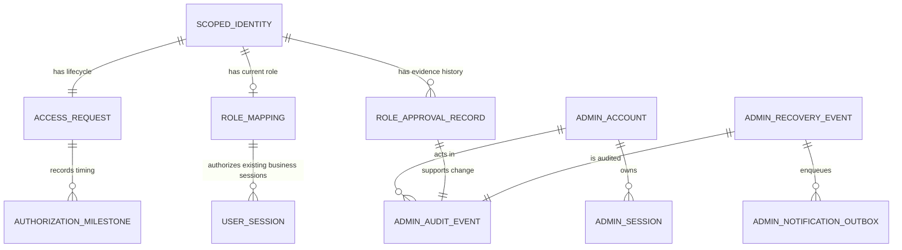
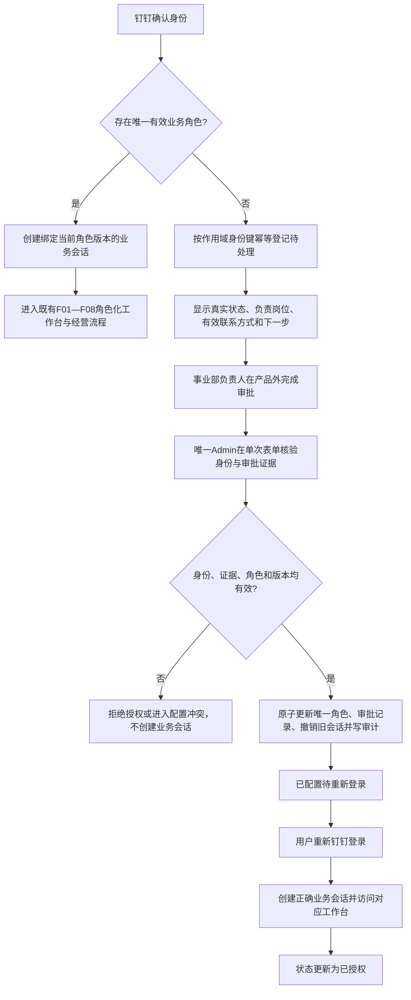
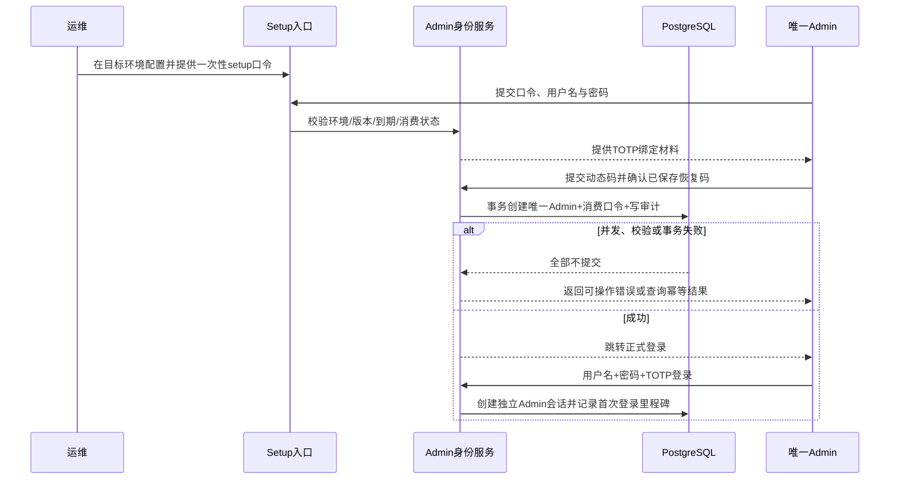
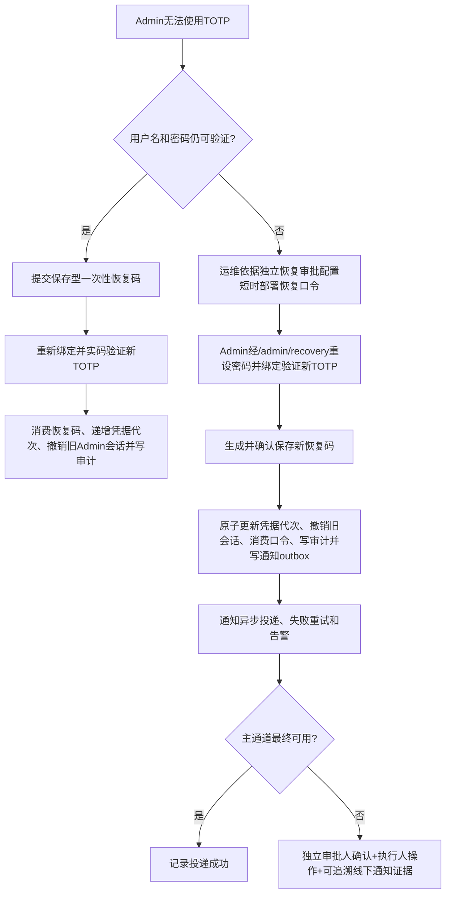
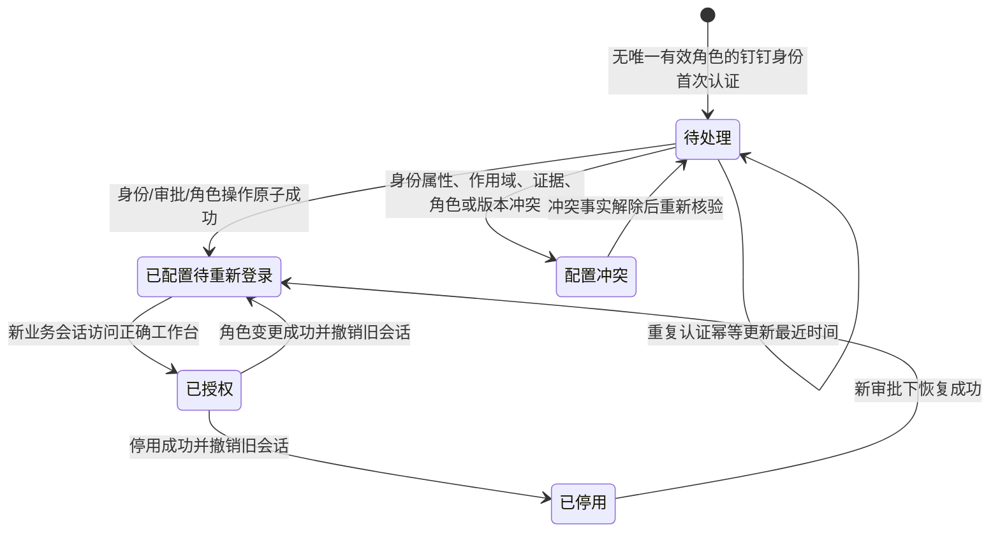
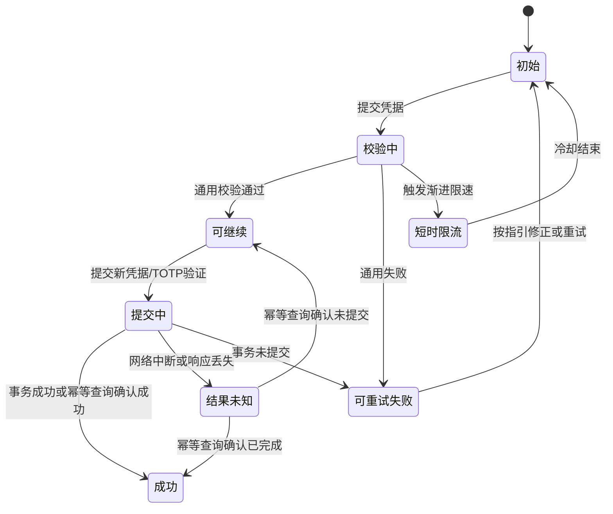
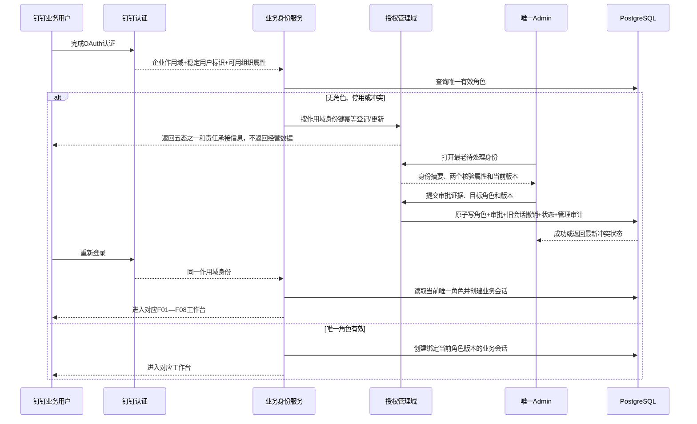

# r1-architect.md · 架构师主笔章节

> 合并基线：`output/PRD详细版.md` 当前 §3、§4、§6、§9 与 F01—F08 稳定 ID、算法、数据和流程语义全部保留。本稿只给出 F09 的增量合并内容；不得用本稿删改或重新编号 F01—F08。权威范围来自已确认 `proposal-v1.md`、`scene-anchor.md` 与 `drafts/id-registry.md` v7。

## §3 核心算法 / 目标函数

### 3.1 F01—F08 算法基线保持不变

F09 不新增经营预测、商品分类、动作排序、库存计算或优化求解算法，也不改变 F01—F08 的以下既有语义：

- 每个 SPU 仍按版本化固定规则独立计算，分类、唯一主动作与补货/禁补冲突约束保持不变。
- 规则计算仍为 `O(n)`，不引入 CP-SAT、SCIP、Gurobi 或机器学习求解器。
- LiteLLM 仍只生成解释，不参与身份授权、业务角色判定或经营动作裁决。
- 批次指纹、业务截止日、跨周任务续接、审核与分轨执行状态均不因 F09 改写。

F09 是 F07 权限隔离的上游启用能力：它只决定一个已由钉钉确认的身份是否具备唯一有效业务角色；成功创建业务会话后，用户进入既有 F01—F08 流程。

### 3.2 授权约束模型

对身份提供方 `p`、钉钉企业作用域 `t`、稳定用户标识 `u` 组成的作用域身份键 `K=(p,t,u)`，定义：

| 符号 | 含义 | 约束 |
|---|---|---|
| `M(K)` | 当前有效业务角色集合 | 只能包含 `operations` 或 `supervisor` |
| `A(K)` | 可与审批材料交叉核验的权威组织属性集合 | 除稳定身份键外，至少两个可靠属性；候选为姓名、部门、员工编号 |
| `E(K,r)` | 本次授予目标角色 `r` 的审批证据 | 必须包含审批人、审批时间、目标角色、证据类型、证据引用和身份核验结果 |
| `S(K)` | 待处理身份的当前持久状态 | 待处理、已配置待重新登录、已授权、已停用、配置冲突之一 |
| `V(K)` | 当前角色映射版本 | 每次新增、变更、停用或恢复单调递增 |

授权提交的必要条件为：

```text
grantable(K, r) :=
    r ∈ {operations, supervisor}
    AND count(reliable(A(K))) >= 2
    AND scope(A(K)) = t
    AND approval_valid(E(K, r))
    AND request_version = V(K)
    AND |M(K)| <= 1
```

提交成功后的系统不变量为：

```text
|M(K)| ∈ {0, 1}
M(K) = {r} 仅当本次审批证据明确批准 r
角色新增/变更/停用/恢复
  = 当前映射变化 + 审批记录 + 受影响业务会话撤销 + 管理审计
  四者同一事务成功或全部失败
```

零错误授权不是通过概率评分实现，而是通过硬约束实现：身份属性不足、企业作用域不一致、同名无法排除、审批证据缺失、目标角色不一致、版本冲突或双有效角色风险出现时，一律不授予角色。系统不得根据姓名、首个登录者、历史相似用户或 AI 推断角色。

选择约束校验而非身份匹配评分的权衡：固定双角色场景不需要复杂匹配模型；硬拒绝会降低身份资料不完整时的通过率，但能保护“错误授权为 0”。若真实钉钉权限无法提供两个可靠属性，应阻塞生产上线并由用户决定增加最小权限或调整组织认可的审批证据，而不是降低安全约束。

### 3.3 求解、性能与退化边界

- F09 的角色授权为单身份、单目标角色的事务校验，不存在全局求解；按作用域身份唯一索引和当前映射读取，逻辑复杂度为常数级或索引查询复杂度。
- 待处理列表、审计列表和通知任务可以分页读取；列表规模不进入经营规则 `O(n)` 计算路径。
- 通知投递、只读筛选索引和统计投影允许最终一致，但不得延迟角色映射生效、业务会话撤销或管理审计写入。
- 外部通知失败时不得回滚已经原子完成的安全恢复；应重试持久通知任务并触发告警，必要时走公司认可的非静默补偿路径。
- F09 不承诺尚未确认的数值 API 延迟、列表容量或 SLA。首次授权不超过 10 分钟是已确认的端到端产品目标，计时前提和事件口径由 §6、§8 定义，不反推单接口性能数值。

### 3.4 参数与规则治理

F09 没有可自动校准参数。会话绝对/空闲时长、渐进限速阈值、短时冷却、TOTP 漂移窗口、口令有效期和密码摘要参数属于后续安全设计参数，技术负责人确认前只能标为架构建议，不能在 PRD 中虚构数值。

以下不是可调参数，而是已确认硬边界：唯一 Admin、两个固定且互斥的业务角色、强制 TOTP、部署恢复非静默、两个可靠身份属性、Admin 与业务身份隔离、角色变化撤销旧业务会话、管理审计不可由 Admin 修改或删除。

---

## §4 数据需求 + 数据模型

### 4.1 F09 增量数据清单

现有 §4.1 的经营数据清单保持不变，追加：

| 优先级 | 数据 | 粒度 | 来源 | 频率/生命周期 | 缺失时行为 | 对应需求 |
|---|---|---|---|---|---|---|
| 授权必需 | 身份提供方、钉钉企业作用域、稳定用户标识 | 作用域身份 | 钉钉 OAuth/当前用户链路 | 每次认证核验 | 不创建业务会话；无法建立稳定键时拒绝登记和授权 | REQ-F09-04～REQ-F09-05；AC-F09-07～AC-F09-12 |
| 授权必需 | 至少两个可靠组织属性及来源/核验时间 | 作用域身份 | 钉钉最小用户详情权限，或含稳定钉钉标识的组织认可审批证据 | 登录或授权前刷新 | 属性不足、冲突、来源不明或作用域不一致时禁止授权 | REQ-F09-05；AC-F09-09～AC-F09-12；NFR-009 |
| 审批必需 | 审批人、审批时间、目标角色、证据类型、证据引用、身份核验结果 | 每次角色操作 | 事业部负责人完成的外部审批，由 Admin 核验录入 | 新增/变更/停用/恢复各一条 | 任一缺失或不在认可证据目录时拒绝操作 | REQ-F09-05；AC-F09-09～AC-F09-12 |
| 管理认证必需 | 唯一 Admin 账号、密码摘要、加密 TOTP 材料及保护密钥版本、恢复码摘要、凭据代次 | 系统唯一 Admin | setup/恢复流程 | 初始化及每次凭据重置 | 不得创建或恢复管理身份 | REQ-F09-01～REQ-F09-03；AC-F09-01～AC-F09-06；NFR-006～NFR-007 |
| 会话必需 | Admin 会话令牌摘要、凭据代次、创建/最近活动/绝对到期/撤销时间 | Admin 会话 | 产品系统 | 每次登录与访问 | 校验失败或代次过旧即拒绝管理访问 | REQ-F09-02～REQ-F09-03；AC-F09-03～AC-F09-06；NFR-006、NFR-009 |
| 状态必需 | 首次申请、最近认证、当前五态、状态版本、最近变化时间 | 作用域身份生命周期 | 产品系统 | 无角色认证与角色操作时 | 不重复建单；事实冲突时进入配置冲突且不创建业务会话 | REQ-F09-04～REQ-F09-05；AC-F09-07～AC-F09-12 |
| 安全必需 | setup/recovery 校验材料的环境、版本/指纹、签发、到期、消费状态 | 每次部署控制口令 | 原始值由运维部署配置；产品只保存不可逆校验材料和状态 | 单环境、短期、单次 | 无效时拒绝；不得回显“不存在/过期/已消费”的精确原因 | REQ-F09-01、REQ-F09-03；AC-F09-01～AC-F09-06；NFR-007、NFR-010 |
| 审计必需 | 事件类型、结果、目标、前后值摘要、操作者、发生时间、关联审批/会话/请求 | 每次管理安全或授权动作 | 产品系统 | 只追加 | 审计写入失败时对应高权限动作回滚 | REQ-F09-06；AC-F09-13～AC-F09-14；NFR-008 |
| 通知必需 | 恢复安全通知任务、接收岗位、投递状态、重试与补偿证据引用 | 每次部署恢复 | 产品 outbox + 外部通知/线下工单 | 至投递或认可补偿闭环 | 不得静默；任务失败可重试和告警，不伪装投递成功 | REQ-F09-03、REQ-F09-06；AC-F09-05～AC-F09-06、AC-F09-14 |
| 度量必需 | 初始化开始、Admin 创建、首次正式登录、角色配置、首次正确业务会话访问工作台等服务端事件时间 | 授权生命周期 | 产品系统 | 随事件追加 | 缺失则该次不能证明 10 分钟目标 | REQ-F09-07；AC-F09-15 |
| 上线配置 | 负责岗位、有效联系方式、审批证据目录、通知主通道与补偿路径 | 环境级 | 对应公司责任人/运维 | 上线前及人员变化时 | 生产启用检查失败，显示“尚未完成启用配置”，不生成无人承接申请 | REQ-F09-04、REQ-F09-06；AC-F09-07～AC-F09-08、AC-F09-14 |

### 4.2 增量核心实体关系

现有经营域实体关系保持不变；追加独立管理身份域和授权域：



关系边界：

- `ADMIN_ACCOUNT/ADMIN_SESSION` 与现有钉钉 `ROLE_MAPPING/USER_SESSION` 分离；Admin 不是 `business_role` 的第三个枚举值。
- `SCOPED_IDENTITY` 是“身份提供方 + 企业作用域 + 稳定用户标识”的逻辑身份；不得用姓名作主键。
- `ACCESS_REQUEST` 只承载五个当前持久状态，是授权生命周期投影，不是第二个权限来源；业务 API 只依据当前有效 `ROLE_MAPPING` 和业务会话鉴权。
- 不建立“已审批待配置”持久态。审批材料只在角色操作提交时核验，并与角色变化、会话撤销和审计同事务写入。
- `ROLE_APPROVAL_RECORD` 保存每次新增、变更、停用、恢复的证据，不覆盖历史；当前映射可以引用本次生效记录。
- `ADMIN_NOTIFICATION_OUTBOX` 只承担恢复安全通知的可靠投递，不扩展为通用消息编排平台。
- 管理审计与既有经营域事件分表，避免 Admin 登录/恢复伪装成业务任务事件。

### 4.3 F09 Schema 草案

#### AdminAccount 与 AdminSession

| 实体/字段 | 含义与大致类型 | 约束 |
|---|---|---|
| `AdminAccount.admin_id` | 唯一管理账号标识 | 数据库单例约束；系统最多一条有效 Admin |
| `username/password_digest` | 登录名/内存困难密码摘要 | 不保存或回显原密码 |
| `totp_ciphertext/totp_key_version` | 加密 TOTP 材料/保护密钥版本 | 原始 TOTP 密钥不得进入日志、审计或前端包 |
| `recovery_code_digest` | 保存型恢复码摘要 | 单次使用；旧码在重绑后失效 |
| `credential_generation` | 凭据代次 | 密码、TOTP 或持有人变化时递增；旧会话代次失效 |
| `holder_ref/holder_changed_at` | 当前持有人责任引用/交接时间 | 不代表第二 Admin；交接保留历史审计 |
| `AdminSession.token_digest` | 随机会话令牌摘要 | 数据库不保存原令牌；与业务会话秘密不同 |
| `credential_generation` | 会话签发时凭据代次 | 与当前 Admin 不一致时拒绝 |
| `created_at/last_seen_at/absolute_expires_at/revoked_at` | 会话生命周期时间 | 恢复或凭据重置后全部旧会话撤销 |

#### DeploymentControlCredential

| 字段 | 含义与大致类型 | 约束 |
|---|---|---|
| `purpose` | `setup` 或 `admin_recovery` | 两者权限语义不可混用 |
| `environment_ref/version/fingerprint` | 目标环境、配置版本和非秘密指纹 | 防止跨环境/旧版本复用 |
| `verifier_digest` | 原始口令的不可逆校验材料 | 原始值只在目标环境部署秘密和当次输入中出现 |
| `issued_at/expires_at/consumed_at` | 签发、到期、消费时间 | 单次消费；精确失败原因只进入受限审计 |
| `request_id/result_ref` | 幂等请求与结果引用 | 网络中断后查询真实结果，避免重复创建或恢复 |

该实体是逻辑状态要求，不预先锁定原始部署秘密的具体载体或环境变量名。开发与线上必须使用物理独立配置源、秘密和值守命令。

#### ScopedIdentity、AccessRequest 与 RoleMapping

| 实体/字段 | 含义与大致类型 | 约束 |
|---|---|---|
| `ScopedIdentity.provider/tenant_ref/actor_ref` | 身份提供方、钉钉企业作用域、稳定用户标识 | 复合唯一；`actor_ref` 不直接进入普通日志或列表导出 |
| `display_attributes` | 姓名、部门、员工编号等结构化属性 | 每项带来源、取得时间和可靠性；授权时至少两个可靠属性 |
| `AccessRequest.first_seen_at/last_seen_at` | 首次申请/最近无角色认证时间 | 重复 OAuth 回调 upsert，不重复建单 |
| `status` | 待处理、已配置待重新登录、已授权、已停用、配置冲突 | 不含“已审批待配置” |
| `status_version/changed_at` | 并发版本/最近变化时间 | 冲突提交不覆盖最新事实 |
| `RoleMapping.business_role` | `operations` 或 `supervisor` | 同一作用域身份最多一个有效角色 |
| `active/version/effective_at/disabled_at` | 当前授权状态、版本和时间 | 变更、停用、恢复时单调递增版本 |
| `current_approval_record_id` | 当前角色生效依据 | 指向本次原子提交的审批记录 |

#### RoleApprovalRecord、AdminAuditEvent 与 AuthorizationMilestone

| 实体/字段 | 含义与大致类型 | 约束 |
|---|---|---|
| `RoleApprovalRecord.operation` | 新增、变更、停用、恢复 | 不同操作独立追加，不覆盖旧记录 |
| `approver_ref/approved_at/target_role` | 审批人、审批时间、目标角色 | 与组织认可证据一致；Admin 不是审批人 |
| `evidence_type/evidence_ref` | 证据类型与引用 | 首版不存附件、不调用 OA API；禁止记录原始秘密 |
| `identity_verification_snapshot` | 授权时身份属性、来源和核验结果摘要 | 能证明对象与作用域，不只保存姓名 |
| `AdminAuditEvent.event_id/event_type/result` | 唯一事件、受控类型、成功/拒绝/失败 | 只追加；Admin 无更新、删除或 DDL 权限 |
| `actor_ref/target_ref/before_after_summary/occurred_at` | 操作者、目标、前后值摘要、绝对时间 | 敏感值遮罩；高权限动作审计失败则整体回滚 |
| `correlation_id` | 关联 setup、恢复、审批、会话撤销或通知任务 | 支持跨表追溯，不暴露令牌 |
| `AuthorizationMilestone.event_type/occurred_at` | 初始化开始、Admin 创建、首次登录、角色配置、首次进入工作台等 | 服务端追加，供 10 分钟和周期分段统计 |

#### AdminNotificationOutbox

| 字段 | 含义与大致类型 | 约束 |
|---|---|---|
| `notification_id/recovery_event_id` | 通知任务及对应恢复事件 | 每次部署恢复至少一条任务 |
| `recipient_role/channel_ref` | 预配置接收岗位/通道引用 | 不把具体通知通道虚构为已具备 |
| `payload_class/payload_ref` | 安全通知类型/最小内容引用 | 不包含密码、口令、TOTP、恢复码或完整令牌 |
| `status/attempt_count/next_attempt_at` | 待投递、投递中、成功、失败及重试信息 | 可最终一致；失败须告警，不伪装成功 |
| `compensation_evidence_ref` | 公司认可的非静默补偿证据，可空 | 仅通知主通道不可用时使用，需独立审批与执行责任 |

### 4.4 一致性、幂等与并发增量

在现有经营域强一致边界后追加三组管理事务：

1. **初始化事务**：唯一 Admin 创建、setup 口令消费和初始化审计同时成功；TOTP 实码验证与恢复码保存确认在事务提交前完成。正式登录是提交后的验收事件，不是创建前置。
2. **部署恢复事务**：密码/TOTP/恢复码更新、凭据代次递增、全部旧 Admin 会话撤销、恢复口令消费、管理审计和通知 outbox 入队同时成功。外部通知投递不伪装为数据库事务。
3. **角色操作事务**：身份与审批校验、当前角色映射变化、审批记录、该身份全部旧业务会话撤销、待处理状态投影和管理审计同时成功。

并发与幂等约束：

- setup 使用数据库单例约束和事务，不只依赖“先查 Admin 数量”。
- 无角色 OAuth 回调按作用域身份复合键 upsert；重复认证只更新 `last_seen_at`。
- setup、恢复和角色写操作携带幂等请求标识；结果未知时查询既有结果，不重复消费口令或产生第二条成功事件。
- 角色写操作使用 `RoleMapping.version` 或等价前置状态控制；钉钉回调与角色变化并发时，旧会话既不可继续使用，也必须被标记撤销。
- Admin 与业务路由各自只读取自己的 Cookie；同时存在双 Cookie 时禁止 fallback、Principal 转换或共享令牌秘密。

可最终一致部分仅包括：恢复通知外部投递、列表检索索引、只读统计投影。任何授权、撤权、凭据代次和审计事实不得最终一致。

### 4.5 时区、编码、PII 与保留增量

- F09 事件统一保存绝对时间点；业务页面按既有 `Asia/Shanghai` 实现假设展示并显式标注。审批时间同时保留原始时区/偏移或规范化来源，避免跨日歧义。
- 文本和标识继续使用 UTF-8。外部身份标识按字符串处理，不做大小写或数字化猜测。
- `actor_ref`、姓名、部门、员工编号、审批人、Admin 持有人和联系方式属于内部身份数据；按最小权限读取，普通日志、错误响应和列表导出应遮罩稳定标识，不发送 LiteLLM。
- 密码、恢复码和部署控制口令只保存摘要；TOTP 材料加密保存并携带保护密钥版本；会话只保存令牌摘要。
- 审计必须避免秘密值，但保留足以证明谁在何时对哪个作用域身份执行何种操作的结构化事实。
- 管理审计在线留存、归档与清理期限尚未由公司治理责任人确认，不得用三年价值周期倒推，也不得由开发默认自动删除。期限确认前保持追加式保存并监控容量。

---

## §6 流程图 + 状态机

### 6.1 F09 与既有业务流程的关系

现有 §6.1 F01—F08 核心决策流程原样保留；其入口前追加 F09 授权门：



产品在角色提交前不知道外部审批是否完成，不持久化“已审批待配置”，也不建设审批引擎。

### 6.2 唯一 Admin 初始化与正式登录



首次正式登录成功只用于验收初始化结果，不能成为数据库创建 Admin 之前的前置条件。

### 6.3 两级恢复流程



保存型恢复码只替代一次 TOTP，不能重设密码；部署恢复口令才能在正常凭据全部不可用时重设密码与 TOTP。两种流程均不能保留旧 TOTP、旧恢复码或旧 Admin 会话。

### 6.4 待处理身份五态状态机



- `已配置待重新登录` 不能在用户尚未重新认证时提前标为 `已授权`。
- `已停用` 用户重复认证仍保持停用，进入明确状态页，不因“当前无有效角色”自动退回待处理，也不落入通用 403、空白页或登录循环。
- `配置冲突` 不授予临时角色；解决后重新读取最新版本和身份属性。
- 五态是当前事实投影，审批、角色和审计历史继续追加保存。

### 6.5 Admin 登录与恢复交互状态

setup、保存型恢复码和部署恢复共用逻辑状态族，但保持各自权限边界：



合法用户收到可执行下一步，但页面不区分口令“不存在、已消费或已过期”的精确安全原因；精确原因仅进入受限管理审计。TOTP 时钟异常、密码不合规、通知待投递/失败和网络结果未知均必须有明确落点。

### 6.6 跨身份域授权时序



---

## §9 风险、依赖与架构建议（架构部分）

### 9.A F09 架构选择与权衡

现有 §9.A 的 F01—F08 架构选择全部保留，追加：

| 架构选择 | 选择理由与取舍 | 具体失败模式 | 缓解 | 对应需求 |
|---|---|---|---|---|
| 独立 Admin 身份域 | 保持管理权与经营数据权限正交；代价是多一套账号、会话和恢复链路 | 把 Admin 加入业务角色后读取经营数据，或双 Cookie 串权 | 独立账号、Cookie、令牌秘密和中间件；两类 API 只读各自会话，禁止转换/fallback | REQ-F09-01～REQ-F09-03、REQ-F09-06；NFR-006 |
| 单 Admin + 受控交接 | 符合用户确认的最小范围；代价是单点失效和无在线备用管理员 | 唯一持有人离岗或凭据全失导致管理中断 | 两级恢复、岗位链、非静默通知；交接通过凭据重置和代次递增，不共享旧凭据 | REQ-F09-01～REQ-F09-03；NFR-007、NFR-009 |
| 固定双角色硬约束 | 当前只需运营/运营主管，避免小型 IAM | 多角色叠加使权限结果不可判断 | 数据库唯一映射、固定枚举、身份属性和审批证据不足即拒绝 | REQ-F09-05；NFR-009 |
| 当前映射与追加历史分层 | 鉴权读取明确当前事实，审批与审计历史不可覆盖；代价是多实体一致性要求 | 只覆盖角色映射后无法证明谁批准、何时变更 | 角色、审批、会话撤销、状态和审计同事务 | REQ-F09-05～REQ-F09-06；NFR-008～NFR-009 |
| 数据库事务 + 通知 outbox | 数据库内可原子，外部通知只能可靠最终一致；代价是需重试和监控任务 | 假称跨系统原子导致恢复完成但通知丢失，或通知故障永久锁死 | 事务内持久 outbox；异步重试/告警；认可的独立审批+执行+证据补偿 | REQ-F09-03、REQ-F09-06；NFR-008 |
| 待处理五态投影 | 用户与 Admin 可见真实当前状态，不伪造外部审批进度 | 把“已审批待配置”做成不可达状态，或状态与角色不一致 | 审批仅在角色提交时核验；状态投影与角色事务同步；业务鉴权不读取投影代替映射 | REQ-F09-04～REQ-F09-05 |
| 复用现有 Go/React/PostgreSQL 模块化单体 | 技术预检已确认现有架构能增量承载，避免新服务带来的运维与分布式一致性成本 | 新建独立 IAM 服务使首次上线复杂化、事务跨服务失效 | 在现有应用内隔离管理身份模块和路由；保持 PostgreSQL 事务边界与版本化 OpenAPI | F09；NFR-006～NFR-010 |

### 9.B F09 外部能力与配置责任

下表逐项保留已确认的方案前置能力与责任；未确认资源不得写成已经具备：

| 外部能力 | 用途 | 凭据归属 | 配置角色 | 配置入口 | 作用域 | 生命周期 | 所属阶段 | 失败/降级 | 对应 REQ/AC |
|---|---|---|---|---|---|---|---|---|---|
| 钉钉统一身份认证 | 提供企业作用域、稳定身份和组织属性 | 钉钉 Client 配置由运维维护 | 运维/系统管理员 | 既有部署秘密与钉钉应用配置 | 单应用、目标钉钉企业 | 按既有凭据轮换规则 | MVP 代码+上线门禁 | 稳定键不可得则不登记；两个核验属性不可得则禁止生产授权，不自动提权 | REQ-F09-04～REQ-F09-05；AC-F09-07～AC-F09-12 |
| Admin setup 口令 | 首次创建唯一 Admin | 原始值归目标环境运维 | 运维生成和配置，Admin 当次使用 | 目标环境部署秘密；产品 `/admin/setup` | 单环境、单版本 | 短时、单次，成功后消费并移除/轮换 | MVP 上线门禁 | 无效时拒绝；系统已有 Admin 时入口关闭；不得使用默认账号 | REQ-F09-01；AC-F09-01～AC-F09-02 |
| Admin 部署恢复口令 | 正常凭据全部不可用时重设密码/TOTP | 原始值归目标环境运维 | 独立恢复审批岗位批准，恢复执行岗位配置 | 目标环境部署秘密；产品 `/admin/recovery` | 单环境、单版本、单次恢复 | 高熵、短时、单次；快照恢复后换新 | MVP 上线门禁 | 无效时拒绝；成功后撤销旧凭据/会话；不宣称 NIST AAL2 | REQ-F09-03；AC-F09-05～AC-F09-06 |
| TOTP 身份验证器 | Admin 初始化、登录和恢复后的第二因素 | TOTP 设备由 Admin 持有人保管；服务端保护材料归目标环境 | Admin 绑定，运维保障时钟与保护密钥 | `/admin/setup`、`/admin/login`、`/admin/recovery` | 唯一 Admin | 初始化/恢复时重绑；密钥带版本并可轮换 | MVP | 工具或可靠时钟不可用时不完成初始化/恢复；不得跳过第二因素 | REQ-F09-01～REQ-F09-03；AC-F09-01～AC-F09-06 |
| 事业部外部审批材料 | 证明对象与目标角色已经获批 | 不属于产品凭据 | 事业部负责人审批，Admin 核验录入 | 组织现有审批渠道；产品只存结构化引用 | 每次角色新增/变更/停用/恢复 | 每次操作形成新记录，历史不覆盖 | MVP 上线门禁 | 证据类型未获认可或信息不足则拒绝授权；首版不上传附件、不调 OA API | REQ-F09-05；AC-F09-09～AC-F09-12 |
| 恢复安全通知主通道 | 向预配置岗位告知部署恢复 | 通道凭据由运维/系统管理员维护 | 安全通知责任岗位、运维 | 待确认的公司通知通道；产品使用最小 outbox 适配 | 单应用安全事件 | 投递至成功或认可补偿闭环 | MVP 上线门禁 | 失败重试/告警；走独立审批人+执行人+可追溯线下证据，不静默、不永久锁死 | REQ-F09-03、REQ-F09-06；AC-F09-05～AC-F09-06、AC-F09-14 |
| 岗位与联系配置 | 让待处理用户知道谁承接 | 非秘密组织配置 | 对应公司责任人提供，运维部署 | 环境级非秘密配置，不建设配置中心 | 单生产环境 | 人员变化时维护 | 上线门禁 | 缺失则显示“尚未完成启用配置”，不进入无人承接申请流 | REQ-F09-04；AC-F09-07～AC-F09-08 |
| 审计治理规则 | 确定在线留存、归档和清理 | 不涉及产品登录凭据 | 公司治理责任岗位 | 公司制度与部署运维流程 | 管理安全事件 | 期限待拍板 | 上线治理门禁 | 未定时开发不得自动删除；监控容量，不用三年价值周期倒推 | REQ-F09-06；AC-F09-13～AC-F09-14；NFR-008 |

### 9.C F09 方案前置能力

| 前置能力 | 当前状态 | 负责人 | 证据或截止条件 | 不可用时替代方案 | 所属阶段 | 对应 REQ/AC |
|---|---|---|---|---|---|---|
| 钉钉稳定身份键 | 已有代码取得 `unionId/actor_ref`，企业作用域组合仍需真实链路确认 | 运维/系统管理员、开发 | 真实钉钉回调和数据库记录证明作用域稳定 | 不可用则停止 F09 上线，不用姓名替代 | 开发前+上线门禁 | REQ-F09-04～REQ-F09-05；AC-F09-07～AC-F09-12 |
| 两个可靠组织属性 | 未验证；旧代码只确认稳定标识 | 运维/系统管理员、开发、事业部负责人 | 最小权限真实返回，或组织认可证据含稳定钉钉标识并可交叉核验 | 不可得则阻塞生产授权，由用户决定增加最小权限或调整证据流程 | 开发前+上线门禁 | REQ-F09-05；AC-F09-09～AC-F09-12；NFR-009 |
| 唯一 Admin 持有人与交接责任 | 未登记具体人 | 公司责任人 | 生产上线清单中登记岗位、持有人与交接依据 | 缺失则不完成生产启用 | 上线门禁 | REQ-F09-01～REQ-F09-03 |
| 恢复审批、执行、通知岗位链 | 未登记具体人或 SLA | 公司责任人、运维 | 岗位、联系方式、主通知通道和补偿路径就绪 | 不虚构人员/SLA；缺失则不开放部署恢复 | 上线门禁 | REQ-F09-03、REQ-F09-06；AC-F09-05～AC-F09-06、AC-F09-14 |
| 组织认可的审批证据目录 | 未确认 | 事业部负责人/治理责任人 | 明确允许与禁止的证据类型 | 未确认则拒绝角色提交，不用自由备注绕过 | 上线门禁 | REQ-F09-05；AC-F09-09～AC-F09-12 |
| 开发与线上物理隔离 | 用户已确认必须物理独立；实现待核验 | 运维/开发 | 独立配置源、秘密、infra、启动和运维入口 | 不允许从线上部署栈选择性启动充当开发环境 | 开发+上线门禁 | NFR-010 |
| 可靠时钟、HTTPS 与同源保护 | 目标要求已确认，实现待核验 | 运维/开发 | TOTP 时钟、HTTPS、安全 Cookie、CSRF/Origin 演练 | 不可用则不开放生产 Admin 写操作 | 上线门禁 | REQ-F09-02～REQ-F09-03；AC-F09-03～AC-F09-06；NFR-006～NFR-007 |
| 审计留存与归档责任 | 期限未确认 | 公司治理责任人 | 留存、归档、清理责任拍板 | 期限未定时只追加并监控，不自动清理 | 治理门禁 | REQ-F09-06；AC-F09-13～AC-F09-14；NFR-008 |

### 9.D F09 主要失败模式与降级

| 风险 | 失败表现 | 架构缓解 |
|---|---|---|
| 身份属性不可得 | 硬约束使所有真实用户无法授权 | 开发前实测钉钉最小权限；不可得即停止上线并拍板权限或证据流程，不以同名猜测降级 |
| 待处理无人承接 | 用户只得到新状态页，审批人与 Admin 都不知道 | 联系配置为生产门禁；用户见具体岗位/有效联系方式；Admin 首页按等待时长显示新申请和最老待处理 |
| 双 Cookie 串权 | Admin Cookie 被业务 API 接受，或业务 Cookie 被管理 API 接受 | 独立秘密、中间件和路由；只读各自 Cookie；禁止 fallback/转换并纳入端到端验收 |
| 并发角色变更残留旧权限 | 新角色已写入但旧会话仍能访问，或审批/审计缺失 | 按身份锁或版本控制；角色、审批、撤销、状态和审计同事务；会话校验当前映射版本 |
| setup 并发或响应丢失 | 产生第二 Admin，或成功后用户重试误判失败 | 数据库单例约束、事务消费、幂等请求和结果查询；正式登录只作提交后验收 |
| 恢复通知故障 | 静默接管，或因外部通道宕机永久锁死唯一 Admin | 持久 outbox、重试与告警；认可的独立审批+执行+线下证据补偿；完整审计 |
| 数据库快照恢复复活旧凭据 | 已消费 setup/recovery 口令或旧会话重新有效 | 服务开放前轮换部署口令/TOTP 保护材料、递增凭据代次并撤销旧会话，完成演练后再开放 |
| 单 Admin 离岗 | 无人能安全交接管理责任 | 受控凭据重置记录原/新持有人和依据；撤销旧密码关联会话、TOTP 与恢复码；不共享旧凭据 |
| 审计成为可删日志 | Admin 删除授权或恢复证据，无法追责 | 独立追加表；Admin 只读；应用运行身份无审计更新、删除或 DDL 权限；审计失败回滚动作 |
| 安全参数误配永久锁死 | 登录失败策略使唯一 Admin 无法再尝试 | 账号/来源渐进限速和短时冷却，不永久锁死；部署恢复使用独立限流与审计 |

### 9.E 可扩展性边界

- F09 首版的容量边界是单应用、单钉钉企业作用域、唯一 Admin、两个固定业务角色和单人角色操作；不为多 Admin、多角色、跨应用或跨企业预建 UI/工作流。
- 待处理身份、管理审计和通知任务增长时，主要瓶颈是按状态/等待时间检索、身份详情历史聚合和审计分页；架构建议为作用域身份唯一键、状态+时间、目标身份+时间、通知状态+重试时间建立索引，具体物理索引由技术设计确认。
- 审计留存期限未定会造成容量不确定，应监控事件增长并由治理责任人拍板归档；不能以自动删除缓解容量。
- 第二生产环境、第三业务角色、跨事业部/多级审批、身份源增加、唯一 Admin 恢复失败或 30 天数据证明单人无法承接时，触发重新拍板；首版只保证身份、审批、角色历史和审计记录可迁移，不暗中实现多 Admin 或通用 IAM。

### 9.F 接口与模块边界建议

以下属于基于现有 Go/React/PostgreSQL 基线的架构建议，不替代后续技术设计中的具体 DTO 与安全参数：

- `/api/admin/*` 只承载 setup、Admin 登录/退出、两类恢复、待处理身份、单人角色生命周期和管理审计；不得混入经营数据查询。
- 业务 OAuth 回调在无法建立唯一有效角色时调用授权域幂等登记，但仍不创建业务会话；已有唯一有效角色时沿用既有业务会话路径。
- OpenAPI 分开声明 Admin 会话与业务会话安全方案，生成的前端类型不得提供 Principal 转换接口。
- 管理身份、授权生命周期、审批证据、审计和通知 outbox 可位于同一模块化单体中的独立领域模块，共享 PostgreSQL 事务但不共享认证语义。
- 现有 `business_role` 枚举、F01—F08 API、经营事件和业务数据表语义保持不变；F09 只追加迁移和契约。

## ⚠️ 待 R2 跟其他主笔对齐的章节边界

- 与 PM §1/§8 对齐：架构只提供授权里程碑事件；72 万元/年和 216 万元三年口径仍是待验证风险暴露/价值上限，不由数据模型自动认领为 F09 收益。
- 与 PM §2 对齐：Admin、事业部负责人、运维和业务用户的业务责任由 PM 定义；本稿只约束它们在身份、审批与配置上的系统边界。
- 与工程师 §5/§7 对齐：工程师应把 setup、登录、两级恢复、五态、角色操作和审计转成 REQ-F09-01—07 的可观察功能与异常结果，不另造状态或稳定 ID。
- 与 PM §10 对齐：AC-F09-01—15 的业务验收由 PM 主笔；本稿不给测试方法、夹具或覆盖率，只提供必须可观察的事务、状态和里程碑事实。
- 与工程师 §12 对齐：F01—F08、NFR-001—005 不重排；F09 只使用已注册 `F09`、`US-F09-01`、`US-F09-02`、`US-F09-03`、`REQ-F09-01`—`REQ-F09-07`、`AC-F09-01`—`AC-F09-15`、`NFR-006`—`NFR-010`。
