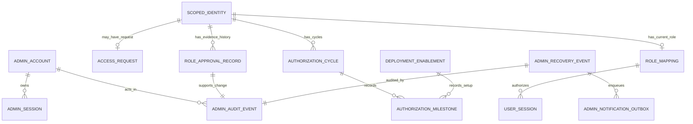
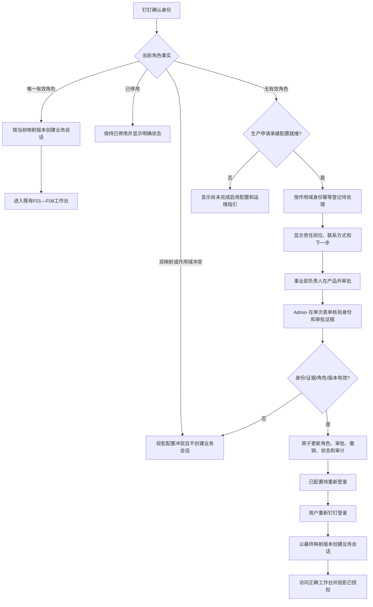
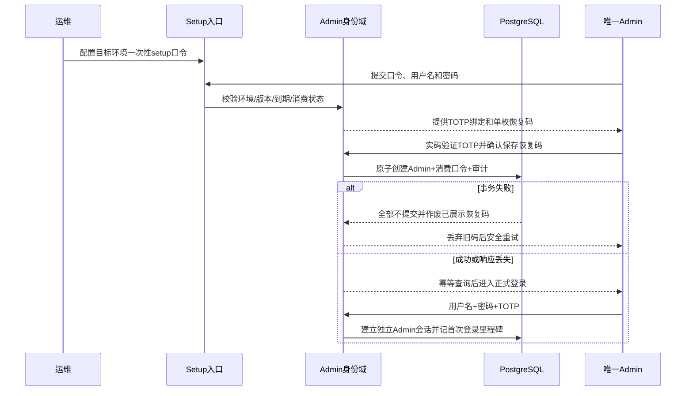
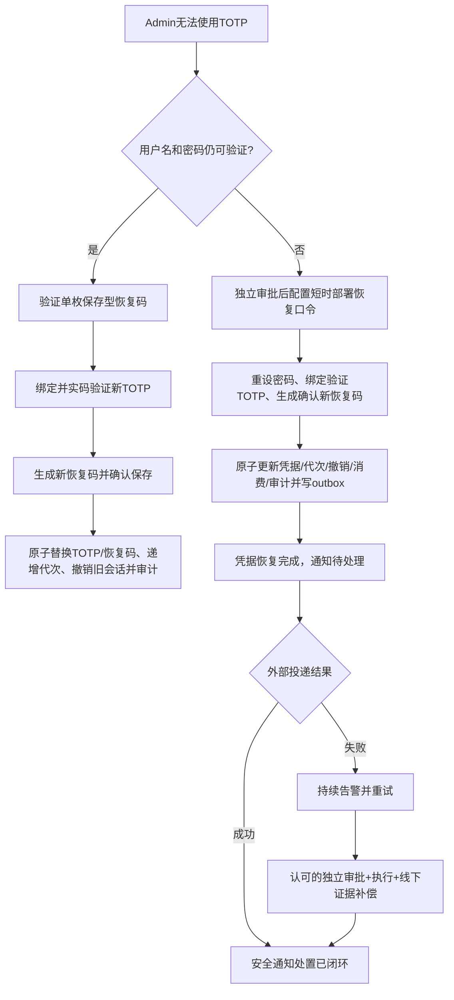
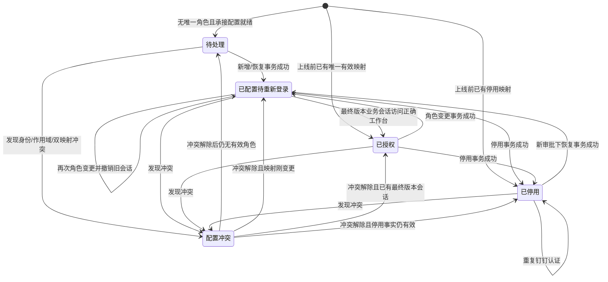
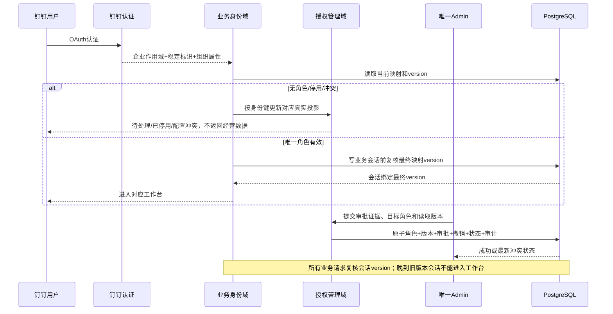

# r3-architect.md · 架构师主笔修订版

> 合并基线：`output/PRD详细版.md` 当前 §3、§4、§6、§9 与 F01—F08 的稳定 ID、算法、数据和流程语义全部保留。本稿是 F09 的完整架构增量修订；唯一 ID 来源为 `drafts/id-registry.md` v7，权威范围来自用户已确认的 `proposal-v1.md`。

## §3 核心算法 / 目标函数

### 3.1 F01—F08 算法和入口兼容

F09 不新增经营预测、商品分类、动作排序、库存计算或优化求解算法，也不改变 F01—F08：

- SPU 仍按版本化固定规则独立计算，分类、唯一主动作与补货/禁补冲突约束不变。
- 规则复杂度仍为 `O(n)`，不引入优化器或机器学习求解器。
- LiteLLM 仍只生成解释，不参与身份授权、业务角色判断或经营动作裁决。
- 批次指纹、业务截止日、跨周任务、审核、执行与经营审计不被 F09 覆盖。

已有唯一有效 `operations/supervisor` 映射的钉钉用户继续按 F07 既有路径创建业务会话并进入工作台，不经过待处理或重新审批。F09 只把既有 AC-F07-06 中“认证成功但没有唯一有效角色”的结果细化为 AC-F09-07/08 的待处理闭环；钉钉认证失败、登录态失效及 F07 其他权限行为保持不变。

### 3.2 授权约束模型

对身份提供方 `p`、钉钉企业作用域 `t`、稳定用户标识 `u` 组成的作用域身份键 `K=(p,t,u)`，定义：

| 符号 | 含义 | 约束 |
|---|---|---|
| `M(K)` | 当前有效业务角色集合 | 只能包含 `operations` 或 `supervisor` |
| `A(K)` | 可与审批材料交叉核验的权威组织属性集合 | 除稳定身份键外至少两个可靠属性 |
| `E(K,r,op)` | 操作 `op` 对目标角色 `r` 的审批证据 | 审批人、审批时间、证据类型/引用、目标人员/角色和核验结果完整 |
| `V(K)` | 当前角色映射版本 | 新增、变更、停用、恢复时单调递增 |
| `op` | 角色操作 | `grant/change/disable/restore` |

授权提交前置条件：

```text
grantable(K, r, op) :=
    r ∈ {operations, supervisor}
    AND count(reliable(A(K))) >= 2
    AND scope(A(K)) = t
    AND approval_valid(E(K, r, op))
    AND request_version = V(K)
    AND |M(K)| <= 1
```

操作后置条件：

```text
grant:   M(K) = {r}
change:  旧角色被替换，M(K) = {r_new}
disable: M(K) = ∅，但停用事实与历史保留
restore: M(K) = {r}

提交前若 |M(K)| > 1：进入配置冲突，不执行任何角色操作
```

每次成功操作满足：

```text
当前映射变化
+ 审批记录
+ 受影响业务会话撤销
+ 五态投影更新
+ 管理审计
= 同一事务全部成功或全部失败
```

零错授依靠硬约束而非评分：身份属性不足、企业作用域不一致、同名无法排除、审批证据缺失、目标角色不一致、版本冲突或双映射风险出现时一律拒绝。系统不得根据姓名、首个登录者、历史相似用户或 AI 推断角色。

选择硬约束而不是身份匹配模型的权衡：固定双角色场景不需要复杂评分；硬拒绝会降低身份资料不完整时的通过率，但保护“错误授权为 0”。两个属性真实不可得时阻塞生产授权，由用户决定增加最小权限或调整组织认可证据，不能降低为同名猜测。

### 3.3 求解、性能和退化边界

- F09 是单身份、单目标角色的事务校验，不存在全局求解；作用域身份与当前映射通过唯一键读取。
- 待处理、既有身份、审计和通知任务均分页；其规模不进入经营规则 `O(n)` 路径。
- 通知外部投递、只读索引和统计投影允许最终一致；角色、凭据代次、会话撤销和审计事实不得最终一致。
- 外部通知失败不回滚已原子完成的部署恢复；通知保持待处理/失败并告警，直到投递成功或认可补偿闭环。
- 未确认的接口延迟、容量和 SLA 不写成承诺。10 分钟是端到端首用目标，不反推单接口数值。

### 3.4 参数治理

会话绝对/空闲时长、渐进限速、冷却时间、TOTP 漂移窗口、口令有效期和密码摘要参数属于安全设计参数，技术负责人确认前只能称“架构建议”。

以下是已确认硬边界而非可调参数：唯一 Admin、两个固定互斥业务角色、强制 TOTP、部署恢复非静默、两个可靠身份属性、管理/业务身份隔离、角色变化撤销旧业务会话、管理审计不可由 Admin 修改或删除。

---

## §4 数据需求 + 数据模型

### 4.1 F09 增量数据清单

现有经营数据清单保持不变，追加：

| 优先级 | 数据 | 粒度 | 来源 | 缺失时行为 | 对应需求 |
|---|---|---|---|---|---|
| 授权必需 | 身份提供方、企业作用域、稳定用户标识 | 作用域身份 | 钉钉认证链路 | 稳定键不可得时不登记、不授权 | REQ-F09-04～05；AC-F09-07～12 |
| 授权必需 | 至少两个可靠组织属性及来源、取得时间 | 作用域身份 | 钉钉最小用户详情权限，或含稳定钉钉标识的组织认可证据 | 不足、冲突、来源不明或跨作用域时拒绝授权 | REQ-F09-05；AC-F09-09～12；NFR-009 |
| 审批必需 | 审批人、外部证据所载审批时间、目标人员/角色、证据类型/引用、核验结果 | 每次角色操作 | 外部审批，由 Admin 核验录入 | 任一缺失或证据不认可时拒绝 | REQ-F09-05；AC-F09-09～12 |
| 管理认证必需 | 唯一 Admin、密码摘要、加密 TOTP 材料/密钥版本、单枚恢复码摘要、凭据代次 | 唯一 Admin | setup/恢复 | 不创建或恢复管理身份 | REQ-F09-01～03；AC-F09-01～06；NFR-006～07 |
| 会话必需 | Admin 会话令牌摘要、凭据代次、创建/活动/到期/撤销时间 | Admin 会话 | 产品系统 | 代次过旧或失效即拒绝 | REQ-F09-02～03；NFR-006、009 |
| 生命周期必需 | 当前五态、首次/最近认证、状态变化、映射版本 | 作用域身份 | 产品系统 | 不重复建单；冲突不创建业务会话 | REQ-F09-04～05；AC-F09-07～12 |
| 安全必需 | setup/recovery 控制材料的环境、版本/指纹、签发、到期、消费 | 每次部署控制口令 | 原始值由目标环境运维配置；产品保存校验材料/状态 | 无效时拒绝且不泄露精确原因 | REQ-F09-01、03；NFR-007、010 |
| 审计必需 | 事件类型、结果、目标、前后摘要、操作者、绝对时间、关联 ID | 每次管理安全或授权动作 | 产品系统 | 审计失败时对应高权限事务失败 | REQ-F09-06；AC-F09-13～14；NFR-008 |
| 通知必需 | 部署恢复通知任务、接收岗位、状态、重试和补偿证据引用 | 每次部署恢复 | outbox + 外部通道/线下工单 | 不静默；投递失败不伪装成功 | REQ-F09-03、06；AC-F09-05～06、14 |
| 度量必需 | 首次启用过程、授权周期、固定里程碑和关联 ID | 启用过程/授权周期 | 服务端事件 | 缺节点则该段周期“无法形成”，不填 0 | REQ-F09-07；AC-F09-15 |
| 上线配置 | 责任岗位、有效联系方式、证据目录、通知主通道和补偿路径 | 环境级 | 公司责任人/运维 | 必要项缺失时阻止对应启用层级 | REQ-F09-04、06；NFR-010 |

审批时间是 Admin 从外部证据录入的事实，不表示产品自动感知外部审批进度；产品不持久化“已审批待配置”。为避免把提交时间冒充材料可用时间，指标使用两类明确事件：`approval_evidence_approved_at`（外部证据所载）与 `configuration_started_at`（Admin 确认材料已具备并开始本次配置的服务端事件）。

### 4.2 增量实体关系



关系边界：

- `SCOPED_IDENTITY` 可由无角色认证建立，也可从既有角色映射只读投影建立；已有授权身份不需要补造待处理申请。
- `ACCESS_REQUEST` 是可选触发记录，不是每个身份必有实体；无角色 OAuth 才建立/更新它。
- 上线前已有有效映射直接投影为已授权，已有停用映射投影为已停用；迁移不重建身份、不补造审批历史、不撤销有效会话。
- `ROLE_MAPPING` 是业务鉴权事实源；五态只是当前事实投影，不能代替映射或会话版本鉴权。
- `AUTHORIZATION_CYCLE` 支持同一身份的首次授权、变更、停用和恢复多次周期；永久 `first_seen_at` 不替代周期事件。
- `DEPLOYMENT_ENABLEMENT` 承载初始化开始、Admin 创建和首次正式登录，可在待处理申请产生前存在。
- 不建立“已审批待配置”持久态；审批记录只在角色事务中写入。
- 管理审计与既有经营事件分域，不把 Admin 安全事件伪装成经营任务事件。

### 4.3 Schema 草案

#### AdminAccount、AdminSession 与 DeploymentControlCredential

| 实体/字段 | 含义 | 约束 |
|---|---|---|
| `AdminAccount.admin_id` | 唯一管理账号 | 数据库单例约束 |
| `username/password_digest` | 登录名/密码摘要 | 不保存原密码 |
| `totp_ciphertext/totp_key_version` | 加密 TOTP 材料/保护密钥版本 | 不进入日志、审计、前端包 |
| `recovery_code_digest` | 单枚保存型恢复码摘要 | 单次使用；重绑后生成一枚新码 |
| `credential_generation` | 凭据代次 | 密码/TOTP/持有人变化时递增 |
| `holder_ref/holder_changed_at` | 当前持有人责任引用/交接时间 | 不代表第二 Admin |
| `AdminSession.token_digest` | 随机会话令牌摘要 | 与业务令牌秘密不同 |
| `credential_generation` | 会话签发代次 | 与当前代次不一致即拒绝 |
| `created_at/last_seen_at/absolute_expires_at/revoked_at` | 会话生命周期 | 恢复/交接后旧会话撤销 |
| `DeploymentControlCredential.purpose` | setup 或 admin_recovery | 两者不可混用 |
| `environment_ref/version/fingerprint` | 环境、配置版本、非秘密指纹 | 防跨环境/旧版本复用 |
| `verifier_digest` | 原始口令校验材料 | 原值只在目标部署配置和当次输入出现 |
| `issued_at/expires_at/consumed_at` | 签发、到期、消费 | 单次消费 |
| `request_id/result_ref` | 幂等请求和结果引用 | 结果未知时查询，不重复执行 |

具体秘密载体和变量名由技术设计确定；开发与线上必须使用物理独立配置源、秘密和运维入口。

#### ScopedIdentity、AccessRequest 与 RoleMapping

| 实体/字段 | 含义 | 约束 |
|---|---|---|
| `provider/tenant_ref/actor_ref` | 作用域身份复合键 | 唯一；普通日志和导出遮罩 |
| `display_attributes` | 姓名、部门、员工编号等 | 每项带来源、取得时间、可靠性 |
| `AccessRequest.first_seen_at/last_seen_at` | 首次/最近无角色认证 | 重复 OAuth upsert，不重复建单 |
| `status/status_version/status_changed_at` | 五态、版本、状态变化时间 | `last_seen_at` 不覆盖状态变化时间 |
| `RoleMapping.business_role` | operations 或 supervisor | 最多一个有效角色 |
| `active/version/effective_at/disabled_at` | 当前授权状态、版本和时间 | 每次角色操作递增版本 |
| `current_approval_record_id` | 当前角色依据 | 指向本次事务审批记录 |

已有授权/停用身份的发现入口应查询 `SCOPED_IDENTITY + ROLE_MAPPING` 的当前投影，不依赖待处理列表；它只支持定位单个身份进入统一详情，不扩展为组织目录、批量授权或权限中心。

#### RoleApprovalRecord、AuthorizationCycle 与里程碑

| 实体/字段 | 含义 | 约束 |
|---|---|---|
| `RoleApprovalRecord.operation` | 新增、变更、停用、恢复 | 每次追加，不覆盖历史 |
| `approver_ref/approved_at/target_role` | 审批人、外部证据时间、目标角色 | Admin 不是审批人 |
| `evidence_type/evidence_ref` | 证据类型/引用 | 首版不存附件、不调 OA API |
| `identity_verification_snapshot` | 授权时属性、来源和核验摘要 | 不只保存姓名 |
| `AuthorizationCycle.cycle_id/type` | 授权周期及类型 | 首次授权、变更、停用、恢复各自关联 |
| `scoped_identity_ref/correlation_id` | 周期目标/跨实体关联 | 关联审批、映射、会话、状态和审计 |
| `started_at/completed_at/outcome` | 周期起止与结果 | 缺里程碑时不伪造完成周期 |
| `DeploymentEnablement.enablement_id` | 环境级首次启用过程 | 关联目标环境和目标首位身份，可早于申请 |
| `AuthorizationMilestone.event_type/occurred_at` | 固定事件类型/服务端绝对时间 | 只追加；客户端时间不覆盖 |

固定七个最小里程碑：

1. 初始化开始；
2. Admin 创建成功；
3. Admin 首次正式登录；
4. 待处理身份首次产生；
5. 有效审批材料可用——采用 `configuration_started_at` 作为系统可知事件，同时保留外部证据 `approved_at`；
6. 角色配置成功；
7. 首次以正确角色业务会话访问对应工作台。

重复认证另记 `last_seen_at`，不覆盖首次申请或周期起点。进入工作台只认服务端已验证的正确角色业务会话，不认跳转、缓存、预加载或错误页。

#### AdminAuditEvent、AdminRecoveryEvent 与 NotificationOutbox

| 实体/字段 | 含义 | 约束 |
|---|---|---|
| `AdminAuditEvent.event_id/event_type/result` | 管理事件、类型、结果 | 只追加；Admin 不可修改/删除 |
| `actor_ref/target_ref/before_after_summary/occurred_at` | 操作者、目标、前后摘要、时间 | 秘密遮罩 |
| `correlation_id` | 关联 setup、恢复、周期、会话撤销 | 每次成功领域变化可勾稽唯一审计 |
| `AdminRecoveryEvent.credential_committed_at` | 凭据恢复事务完成 | 与外部通知闭环分离 |
| `notification_disposition` | 待投递、失败待补偿、已闭环 | 不能反向改变已提交凭据 |
| `NotificationOutbox.notification_id/recovery_event_id` | 通知任务/恢复事件 | 每次部署恢复至少一条 |
| `recipient_role/channel_ref` | 接收岗位/通道引用 | 通道尚待公司配置，不虚构已具备 |
| `status/attempt_count/next_attempt_at` | 投递状态与重试 | 最终一致；失败告警 |
| `compensation_evidence_ref` | 认可补偿证据 | 仅主通道失败时使用 |

### 4.4 一致性、幂等与并发

强一致事务：

1. **初始化事务**：唯一 Admin、setup 口令消费、初始化审计同时成功。正式登录是提交后的验收，不是创建前置。若事务前展示的恢复码最终未提交，必须作废；事务成功但响应丢失时按幂等结果进入登录，不重新展示旧码。
2. **保存型恢复事务**：用户名/密码/恢复码先校验；新 TOTP 实码通过且新恢复码已生成并确认保存后，旧恢复码消费、TOTP/恢复码替换、凭据代次递增、全部旧 Admin 会话撤销和审计同时成功或全部失败。
3. **部署恢复事务**：新密码/TOTP/恢复码、凭据代次、旧 Admin 会话撤销、恢复口令消费、审计和通知 outbox 入队同时成功；外部投递失败不回滚。
4. **角色操作事务**：身份/审批校验、映射变化、审批记录、角色版本递增、旧业务会话撤销、五态投影和审计同时成功。

并发与幂等：

- setup 依靠数据库单例约束和事务，不只做应用层计数。
- 无角色回调按作用域身份键 upsert；已有授权/停用/冲突事实不得被普通 upsert 覆盖为待处理。
- setup、恢复和角色写操作携带幂等请求标识；结果未知先查既有结果。
- 两个角色写操作基于同一旧版本时最多一个成功。
- 业务会话创建前再次读取当前 `RoleMapping.version`，并把该版本绑定到会话；所有业务 API 校验会话版本与当前映射一致。角色操作递增映射版本，因此 OAuth 回调即使先读到旧角色，晚到会话也不能进入工作台。
- Admin 与业务路由只读各自 Cookie；同时存在时禁止 fallback、Principal 转换或共享秘密。

可最终一致部分只有：通知外部投递、列表检索索引和只读统计投影。任何权限、凭据代次、会话撤销和审计事实不得最终一致。

### 4.5 指标取数与可信分母

| 指标 | 可取事实 | 可信口径 |
|---|---|---|
| 首次初始化授权闭环 | 同一 `DeploymentEnablement` 的里程碑 1→7 | §0 全部门禁满足后才有效；缺节点为“无法形成周期” |
| 日常产品内配置时间 | `configuration_started_at → role_configured_at` | 表示 Admin 确认材料具备后的产品内处理，不冒充外部审批完成时间 |
| 完整授权周期 | `AuthorizationCycle.started_at → first_correct_workbench_at` | 包含外部等待；按周期而非永久身份统计 |
| 无角色闭环完成率 | 固定观察窗内首次授权周期 | 分母为窗口内新周期，分子为截止前已授权；待处理/冲突/停用作为未完成原因 |
| 重复待处理记录 | 作用域身份复合键和当前请求唯一约束 | 同一身份当前生命周期最多一条 |
| 角色/恢复后旧会话可用数 | 会话撤销时间、角色/凭据代次和请求结果 | 旧版本会话必须为 0 |
| 高权限审计覆盖 | 领域事实的 `correlation_id` 与审计事件勾稽 | 成功变更按 1:1 勾稽；登录拒绝等无领域变更事件按事件类型契约核对，不能只查审计表自证 100% |
| 错误业务授权 | 系统约束拒绝 + 经治理确认的错授事件 | 双角色/作用域等可系统判定；错人/错角色需外部安全/价值台账关联原周期与纠正事件，不能用“数据库无异常”自动证明 |

可归因利润影响由价值台账岗位在产品外人工勾稽授权周期与既有经营/财务证据；F09 只提供稳定周期、审批、配置和工作台访问引用，不新增价值分析后台。

### 4.6 时区、编码、PII 与保留

- 事件保存绝对时间点，按既有 `Asia/Shanghai` 实现假设展示；外部审批时间保留来源偏移或规范化说明。
- 文本/标识使用 UTF-8；外部身份标识按字符串处理，不猜测大小写或数字化。
- `actor_ref`、姓名、部门、员工编号、审批人、Admin 持有人和联系方式是内部身份数据；最小权限读取，日志/导出遮罩，不发送 LiteLLM。
- 密码、恢复码和部署口令只存摘要；TOTP 加密且带密钥版本；会话只存令牌摘要。
- 审计不记录秘密，但保留谁在何时对哪个作用域身份执行何种操作的事实。
- 审计留存/归档/清理期限待治理责任人确认；未定前只追加并监控，不自动删除，也不以三年价值周期倒推。

---

## §6 流程图 + 状态机

### 6.1 F09 授权门与既有业务流程



承接配置缺失时不创建无人处理的申请；配置就绪后用户重新认证进入正常闭环。产品在角色提交前不知道外部审批是否完成，不持久化“已审批待配置”。

Admin 除待处理列表外，还可通过已授权/已停用身份的最小列表或检索进入统一身份详情，执行变更、停用或恢复；该入口不是组织目录且不支持批量操作。

### 6.2 唯一 Admin 初始化



### 6.3 两级恢复与通知双结果



凭据恢复完成与通知处置闭环是两个状态：前者允许新凭据登录，后者不能在投递/补偿未完成时显示成功。外部投递失败不恢复旧凭据。

### 6.4 五态是受约束投影

五态由当前映射、停用、冲突和正确工作台首次访问事实计算；不是业务鉴权源。



### 6.5 交互状态族不共用认证权限

setup、保存型恢复码和部署恢复仅复用“初始、校验中、可继续、提交中、成功、短时限流、可重试失败、结果未知”等状态词与幂等恢复模式；它们不共用凭据校验、权限范围、限速计数或结果：

- setup 只能在无 Admin 时创建唯一 Admin；
- 保存型恢复码要求正确用户名和密码，不能重设密码；
- 部署恢复可重设密码/TOTP，但须独立审批、outbox 和非静默处置；
- 普通登录冷却不能封死部署恢复。

精确口令失败原因只进受限审计；合法用户得到可执行下一步。

### 6.6 OAuth 与角色变更并发时序



---

## §9 风险、依赖与架构建议

### 9.A 架构选择与权衡

| 选择 | 理由与代价 | 失败模式 | 缓解 | 对应需求 |
|---|---|---|---|---|
| 独立 Admin 身份域 | 管理权与经营权限正交；代价是独立认证/恢复链 | Admin 被当第三业务角色或双 Cookie 串权 | 独立账号、秘密、中间件；路由只读各自 Cookie | REQ-F09-01～03、06；NFR-006 |
| 单 Admin + 受控交接 | 符合最小范围；接受单点风险 | 持有人离岗/凭据全失 | 两级恢复、岗位链、凭据代次；不共享旧凭据 | REQ-F09-01～03；NFR-007、009 |
| 固定双角色硬约束 | 避免小型 IAM | 多角色叠加或猜测授权 | 唯一映射、双属性、证据不足即拒绝 | REQ-F09-05；NFR-009 |
| 当前映射与追加历史分层 | 鉴权事实明确、历史不覆盖；代价是事务复杂 | 映射有变但审批/审计缺失 | 角色、审批、撤销、投影、审计同事务 | REQ-F09-05～06；NFR-008～09 |
| 五态作为投影 | 向用户展示真实状态，不成为第二权限源 | 投影延迟误放行 | API 只认映射和会话版本；投影事务同步 | REQ-F09-04～05 |
| 数据库事务 + 通知 outbox | 承认外部系统不能原子；代价是重试/告警 | 静默恢复或通知故障锁死 | outbox、双状态、认可补偿 | REQ-F09-03、06；NFR-008 |
| 复用现有 Go/React/PostgreSQL 模块化单体 | 已通过技术预检，避免分布式事务 | 新 IAM 服务扩大运维面 | 同应用内独立领域模块，共享数据库事务但不共享认证语义 | F09；NFR-006～010 |

### 9.B 外部能力与配置责任

| 外部能力 | 用途 | 凭据归属 | 配置责任 | 入口/作用域 | 生命周期 | 阻断层级与失败行为 | 对应需求 |
|---|---|---|---|---|---|---|---|
| 钉钉认证 | 稳定身份、企业作用域、组织属性 | Client 配置归运维 | 运维/系统管理员 | 既有部署秘密；目标企业/单应用 | 按既有规则轮换 | 稳定键缺失阻止登记；双属性缺失阻止生产授权 | REQ-F09-04～05 |
| setup 口令 | 首次创建唯一 Admin | 目标环境运维 | 运维生成配置，Admin 当次使用 | 部署秘密；单环境/版本 | 短时、单次 | 无效拒绝；已有 Admin 时关闭 | REQ-F09-01 |
| 部署恢复口令 | 全部正常凭据不可用时恢复 | 目标环境运维 | 独立审批岗位批准、执行岗位配置 | 部署秘密；单环境/版本 | 高熵、短时、单次；快照后换新 | 阻止部署恢复操作，不宣称 AAL2 | REQ-F09-03 |
| TOTP 工具/可靠时钟 | Admin 第二因素 | Admin 保管设备；保护材料归环境 | Admin 绑定，运维保障时钟/密钥 | setup/login/recovery | 初始化/恢复重绑 | 不可用时阻止对应认证操作，不跳过 MFA | REQ-F09-01～03 |
| 外部审批材料 | 证明对象与目标角色 | 非产品凭据 | 事业部负责人审批，Admin 核验 | 组织现有渠道 | 每次操作新记录 | 证据不认可时拒绝操作；不接 OA API | REQ-F09-05 |
| 恢复通知通道 | 高权限恢复告知 | 通道凭据归运维 | 通知责任岗位/运维 | 待确认公司通道 | 至投递或补偿闭环 | 通道/补偿路径未配置时阻止宣称部署恢复可用；投递失败不回滚凭据 | REQ-F09-03、06 |
| 岗位和联系配置 | 承接待处理用户 | 非秘密组织配置 | 公司责任人提供、运维部署 | 环境级，不建配置中心 | 人员变化时维护 | 缺失阻止生产申请流程，不必关闭已有用户正常登录 | REQ-F09-04 |
| 审计治理规则 | 留存/归档/清理 | 非登录凭据 | 治理责任岗位 | 公司制度/运维流程 | 期限待定 | 未定时只追加监控，不自动删除，不作为全站关闭条件 | REQ-F09-06 |

### 9.C 前置能力与阻断层级

| 前置能力 | 当前状态 | 责任人 | 证据/截止 | 不可用时 | 阻断层级 |
|---|---|---|---|---|---|
| 稳定身份键与企业作用域 | 稳定标识已有，组合待真实确认 | 运维/开发 | 真实回调和数据库证据 | 不登记、不创建业务会话 | 生产 F09 授权启用 |
| 两个可靠组织属性 | 未验证 | 运维/开发/事业部负责人 | 最小权限真实返回或认可证据 | 禁止授权，不降级猜测 | 生产 F09 授权启用 |
| Admin 持有人、审批岗位、联系人和证据目录 | 未登记完整 | 公司责任人 | 上线清单 | 不生成无人承接申请/不允许角色提交 | 对应申请或角色操作 |
| setup/TOTP/HTTPS/CSRF/Origin | 目标已确认，实现待核验 | 运维/开发 | 安全演练 | 不开放生产 Admin 初始化/写操作 | 生产管理面启用 |
| 恢复审批、执行、通知岗位链 | 未登记完整 | 公司责任人/运维 | 恢复演练 | 不宣称部署恢复可用 | 部署恢复能力 |
| 开发与线上物理隔离 | 要求已确认，实现待核验 | 运维/开发 | 独立配置源、秘密、infra、命令 | 不允许生产上线 | 整体上线门禁 |
| 审计留存责任 | 期限未定 | 治理责任人 | 留存/归档/清理拍板 | 只追加监控，不自动清理 | 治理门禁，不关闭已有业务 |

F09 第一版完成仍以 PM §0 的完整门禁清单为唯一总口径；AC-F09-15 的 10 分钟结果只有在该清单全部满足时才有效。此表只定义各缺失项实际阻断哪一层，不把所有缺失实现成同一个全站开关。

### 9.D 主要失败模式与降级

| 风险 | 失败表现 | 缓解 |
|---|---|---|
| 已有授权身份不可发现 | Admin 只能处理新申请，无法变更/停用既有用户 | 从现有映射投影作用域身份；最小已授权/停用检索进入统一详情 |
| 身份属性不可得 | 所有授权被硬约束阻断 | 开发前实测；不可得即停止生产授权并重新拍板权限/证据 |
| 承接配置缺失 | 新申请再次无人处理 | 登记前检查；缺失只显示未启用指引，不建申请 |
| 双 Cookie 串权 | Admin 读取经营数据或业务用户操作管理面 | 独立秘密/中间件/路由；禁止转换/fallback |
| OAuth 晚到旧角色会话 | 角色已变更但回调插入旧权限会话 | 会话绑定映射版本；写入前复核；每个业务请求再校验 |
| setup 响应丢失 | 第二 Admin 或用户持有无效恢复码 | 单例、幂等结果查询；未提交码作废，已提交不重显 |
| 保存型恢复部分成功 | 码已消费但新 TOTP 未生效 | 独立恢复事务，全部切换后才消费旧码 |
| 通知故障 | 静默接管或永久锁死 | 恢复/通知双状态、outbox、重试/告警和认可补偿 |
| 快照复活旧秘密 | 已消费口令或旧会话重新可用 | 开放前轮换材料、递增代次、撤销旧会话并演练 |
| 状态投影成为权限源 | 状态显示已授权便绕过真实映射 | 业务 API 只认映射+会话版本 |
| 审计自证覆盖 | 仅查审计表得到虚假 100% | 领域事实 correlation 勾稽；无领域事件按类型契约核对 |

### 9.E 可扩展性和停止线

- 首版边界是单应用、单钉钉企业作用域、唯一 Admin、两个固定角色和单人操作；不预建多 Admin、多角色、跨应用或跨企业工作流。
- 待处理、已有身份、审计和 outbox 的增长瓶颈是状态/等待时间检索、身份历史聚合和分页；物理索引由技术设计确认。
- 审计期限未定造成容量不确定，只监控增长，不以自动删除缓解。
- 第二生产环境、第三角色、跨事业部审批、身份源增加、唯一 Admin 恢复失败或 30 天数据证明单人无法承接时只触发重新拍板；首版仅保证身份、审批、角色和审计记录可迁移。

### 9.F 接口与模块边界建议

- `/api/admin/*` 只承载 setup、Admin 登录/退出、两级恢复、身份检索、单人角色生命周期和管理审计，不返回经营数据。
- 业务 OAuth 在无唯一角色时调用授权域幂等登记；已有唯一有效角色沿用既有业务会话路径。
- OpenAPI 分开声明 Admin 与业务会话安全方案，不提供 Principal 转换。
- 管理身份、授权周期、审批、审计和 outbox 可位于模块化单体的独立领域模块，共享 PostgreSQL 事务但不共享认证语义。
- 现有 `business_role`、F01—F08 API、经营事件和业务数据表语义不变；F09 只追加迁移和契约。

---

## R3 处理记录

### PM 对架构稿意见

| R2 意见 | 处理 | R3 落点 |
|---|---|---|
| 既有授权/停用身份无法发现和管理 | 接受 | §4.2/4.3 将申请改为可选，既有映射投影身份；§6.1 增加最小身份检索入口 |
| `SCOPED_IDENTITY` 强制一对一申请 | 接受 | ER 改为 `o|`，不补造待处理历史 |
| 待处理登记前缺生产启用检查 | 接受 | §6.1 增加承接配置检查；缺失不建申请 |
| 恢复和通知闭环未分状态 | 接受 | §4.3、§6.3 明确凭据恢复完成/通知处置闭环双状态 |
| 保存型恢复未生成新恢复码 | 接受 | §4.4、§6.3 补单枚新码生成、确认和原子替换 |
| 既有映射缺状态机入口 | 接受 | §6.4 增加既有有效→已授权、既有停用→已停用投影 |
| 缺 AC-F07-06 兼容关系 | 接受 | §3.1 明确仅替换认证成功无角色分支 |
| 审批材料时间可能伪装外部进度 | 接受 | §4.1/4.3/4.5 区分外部 `approved_at` 与系统 `configuration_started_at` |

### 工程师对架构稿意见

| R2 意见 | 处理 | R3 落点 |
|---|---|---|
| 五态遗漏合法/异常路径 | 接受 | §6.4 改为受约束投影，补齐再变更、停用、冲突和恢复路径 |
| 里程碑不能只挂 AccessRequest | 接受 | §4.2/4.3 新增环境级启用过程与授权周期，里程碑可分别关联 |
| 保存型恢复缺事务边界 | 接受 | §4.4 单列保存型恢复事务 |
| `|M(K)|<=1` 未定义操作后置 | 接受 | §3.2 分别定义新增/变更/停用/恢复后置结果 |
| 共用状态族可能被实现为共用权限 | 接受 | §6.5 明确四项隔离约束 |
| 上线门禁阻断层级混淆 | 接受 | §9.C 按整体上线、管理面、申请、角色操作、恢复能力、治理分层 |

### Controller 指定重点与跨稿一致性

| 重点 | 处理 | R3 落点 |
|---|---|---|
| 恢复事务/outbox 边界 | 已收敛 | §4.4、§6.3、§9.A |
| 五态真实投影 | 已收敛 | §4.2、§6.4 |
| OAuth 与角色变更并发 | 已补版本闭环 | §4.4、§6.6、§9.D |
| 七个指标时间点 | 已固定 | §4.3/4.5 |
| 审计覆盖可信分母 | 已定义领域事实勾稽 | §4.5 |
| 零错授可观察边界 | 已区分系统约束与人工确认事件 | §4.5 |
| 稳定 ID 与 F01—F08 | 保持不变 | 全文只引用既有 F09、REQ-F09-01—07、AC-F09-01—15、NFR-006—010；§3.1 明确保留 F01—F08 |
