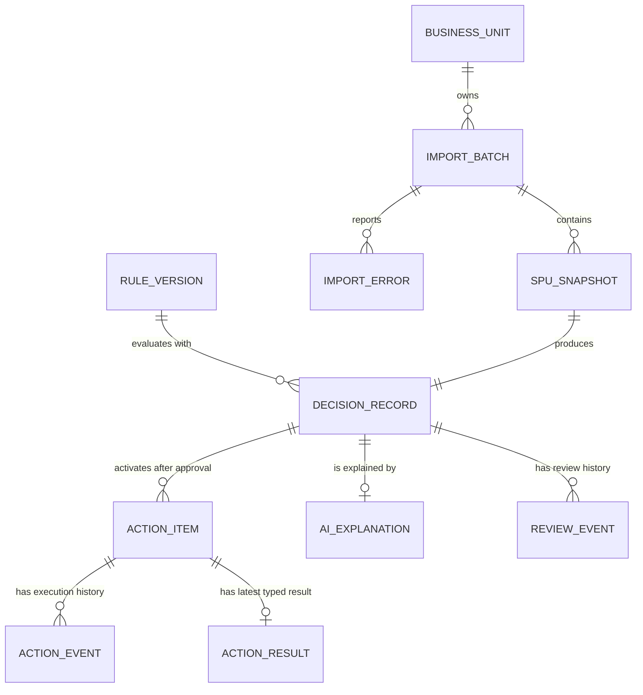
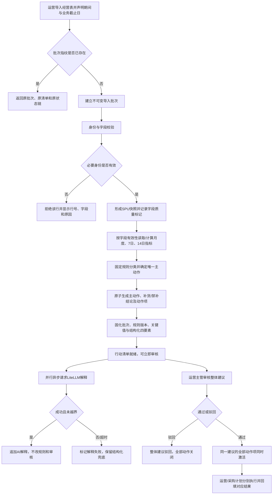
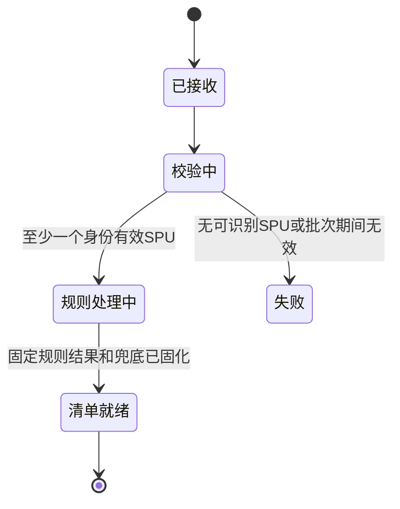
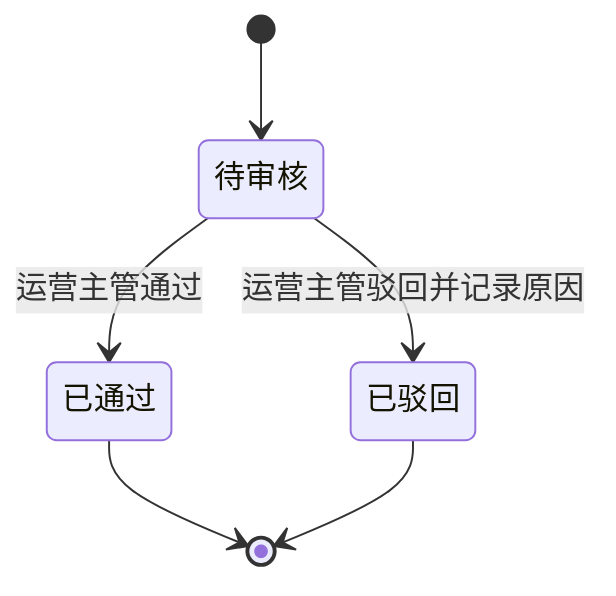
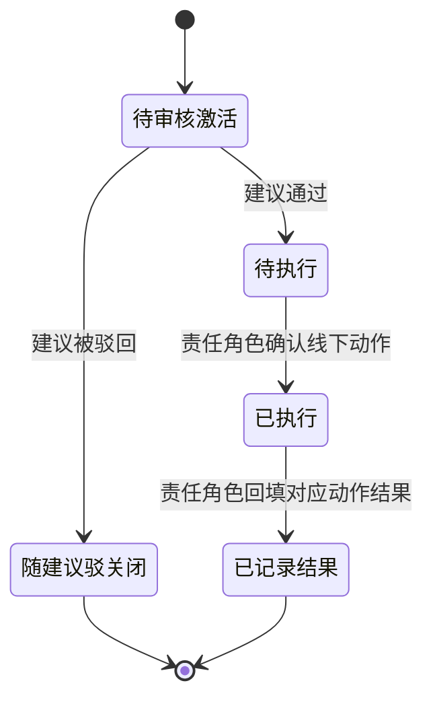
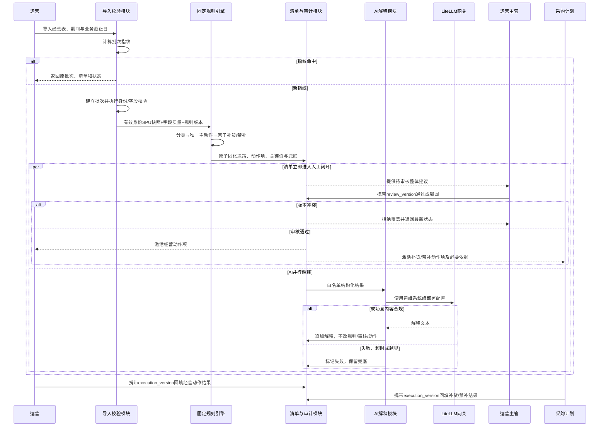

# r3-architect.md · 架构师主笔修订版

> 写作基线：已确认的 `output/PRD-V0.md`、`drafts/source-baseline.md` 与唯一 ID 源 `drafts/id-registry.md`。本稿已处理 PM、工程师 R2 对架构章节的意见，并应用 Controller 的统一裁决。阶段 2—4 仍为跳过状态；物理数据库、框架、队列、云服务和具体模型均未选型。

## §3 核心算法 / 目标函数

### 3.1 决策问题定位

V0 不是预测或组合优化系统，不使用 CP-SAT、SCIP、Gurobi 等优化求解器。系统对每个 SPU 独立执行确定性规则：同一导入批次、同一规则版本、同一业务截止日必须得到相同的商品分类、主动作和补货结论（F02、F03、F08；REQ-F02-01～REQ-F02-03、REQ-F03-01～REQ-F03-03；NFR-001、NFR-005）。

选择规则表而非优化器的权衡：

- 商品分类、阈值、动作优先级和补货冲突已由业务确认，不存在待求解的跨 SPU 预算目标。
- 每个 SPU 独立判定，规则计算复杂度为 `O(n)`；优化器会增加参数校准和解释成本，却不会提高规则符合度。
- AI 只解释、给出同层排序说明和非覆盖式优化提示，不参与分类或动作裁决（F04；REQ-F04-01～REQ-F04-03）。

代价是 V0 不自动求出跨 SPU 的最优投放预算、采购数量或广告明细动作；这些能力不属于 F01—F08。

### 3.2 变量、业务截止日与数据有效性

对导入批次 `b` 中的 SPU `i`，定义：

| 符号 | 含义 | 有效性约束 |
|---|---|---|
| `D_b` | 数据批次业务截止日 | 建立批次时冻结；用于新品年龄和统计窗口解释，不使用页面访问日或任务完成日 |
| `L_i` | 上架日期 | 可解析才参与新品判断；无效时保留行但分类降级 |
| `S_i` | 上一个完整自然月扣除退款后的净销售额 | 与批次期间绑定；缺失时只阻断依赖它的分类/动作 |
| `P_i` | 上一个完整自然月表内“经营准利润率” | 采用数据支持表口径；缺失时只阻断依赖利润率的动作 |
| `R_i` | 最近 7 天品退件数 ÷ 最近 7 天已销售件数 | 周期、分子和分母有效才参与规则 |
| `W_i/T_i/Q14_i` | 仓内库存/在途库存/最近 14 天销量 | 三者齐全才计算库存可售天数 |
| `A_i` | 唯一主动作 | `清仓/止损/观察/加投/维持/不判定` |
| `B_i` | 补货结论 | `禁止补货/补货/不补货/不生成` |

**时区实现假设**：V0 建议所有业务日期按 `Asia/Shanghai` 解释，以便自然月、7 日/14 日窗口和新品边界一致。该时区尚非用户单独确认的业务事实；在技术设计未确认替代时，作为当前统一实现假设使用并显式标注。事件时间另存绝对时间点，展示时按该业务时区转换。

新品按两个自然月位移判定：

```text
is_new(i, b) := D_b < add_months(L_i, 2)
```

即在数据批次业务截止日，上架尚未满 2 个自然月时为新品；达到边界当日即转入非新品规则。历史批次重放继续使用原 `D_b`，不随实际重试日期改变。

#### 行拒绝与字段级降级

仅当无法建立唯一、可分派的 SPU 对象时拒绝整行。V0 的必要身份字段为：SPU ID、链接名称、店铺、平台、责任运营；其中 SPU ID 还必须在批次内唯一。必要身份缺失或 SPU ID 重复时：

1. 该行不进入指标和规则计算；
2. 校验结果显示源工作表、行号、字段名和错误原因；
3. 批次有效/拒绝行计数可见；
4. 其他有效行继续处理。

上架日期、销售额、利润率、品退和库存等指标字段缺失或异常时，不整行排除：保留 `SPU_SNAPSHOT`、原始值和质量标记，仅停止依赖该字段的判断。不得使用默认值、推广费用或 AI 推测补齐（F01、F02、F03；REQ-F01-02、REQ-F02-01～REQ-F02-03、REQ-F03-01～REQ-F03-03）。

10—20 个 SPU 是玩具事业部首轮试点验收规模，不是导入或规则引擎的硬性行数限制；合法批次不会仅因有效 SPU 少于 10 或多于 20 而被规则层拒绝。

### 3.3 商品分类函数

商品分类 `C_i` 先判断新品，再对非新品按净销售额分层：

```text
若 L_i 无效：                         C_i = 数据异常
若 is_new(i, b)：                     C_i = 新品
若非新品且 S_i 缺失/无效：            C_i = 数据异常
若非新品且 S_i >= 100000：            C_i = 大爆款
若非新品且 20000 <= S_i < 100000：    C_i = 小爆款
若非新品且 S_i < 20000：              C_i = 淘汰商品
```

阈值比较使用未格式化数值；显示层四舍五入后的值不得反向参与规则（F02、F03；REQ-F02-01、REQ-F03-01）。

### 3.4 主动作候选与唯一化

固定优先级：

```text
清仓 > 止损 > 观察 > 加投 > 维持
```

规则引擎先生成候选，再保留优先级最高的唯一主动作（REQ-F03-02）。

#### 新品

```text
P_i >= -0.20  -> 加投
P_i <  -0.20  -> 观察
P_i 缺失      -> 不判定（待补数）
```

#### 大爆款

```text
P_i < 0                                      -> 清仓候选
P_i < 0.05                                   -> 止损候选
R_i 有效且 R_i > 0.015                       -> 观察候选
P_i >= 0.10 且 R_i 有效且 R_i <= 0.015       -> 加投候选
候选为空                                     -> 维持
```

#### 小爆款

```text
P_i < 0.05                                   -> 清仓候选
P_i < 0.10                                   -> 止损候选
R_i 有效且 R_i > 0.015                       -> 观察候选
P_i >= 0.15 且 R_i 有效且 R_i <= 0.015       -> 加投候选
候选为空                                     -> 维持
```

#### 淘汰商品

```text
A_i = 清仓
```

降级约束：

- 大/小爆款的 `P_i` 缺失时，无法排除更高优先级的清仓或止损，故不输出较低优先级动作，标记“不判定（待补数）”。
- 淘汰商品清仓来自销售额分类，不依赖利润率。
- `R_i` 缺失、周期非最近 7 天或分母无效时，不触发观察，也不能证明 `R_i<=1.5%`，因此不能触发依赖低品退率的加投；有效利润率仍可独立触发清仓/止损。
- 为补齐已确认动作但未指定责任人的“观察”闭环，当前采用架构建议：观察作为运营经营动作项，最小完成语义为运营确认已查看并记录观察备注；这不是新增业务事实，也不表示系统自动修改外部业务系统。

### 3.5 补货函数与原子冲突约束

补货结论在主动作之后计算（REQ-F03-03）：

```text
若 A_i ∈ {清仓, 止损}：
    B_i = 禁止补货

否则若 C_i = 新品：
    B_i = 不生成（新品首版不判断补货）

否则若 C_i 或 A_i 为“不判定”：
    B_i = 不生成（前置决策数据不足）

否则若 W_i、T_i、Q14_i 任一缺失：
    B_i = 不生成（库存数据不足）

否则令 avg14_i = Q14_i / 14：
    若 avg14_i = 0：B_i = 不生成（无近期销售）
    否则 days_i = (W_i + T_i) / avg14_i
         days_i < 30：B_i = 补货
         days_i >= 30：B_i = 不补货
```

不变量：

1. `A_i∈{清仓,止损}` 时，`B_i` 必须同一规则决策内原子写成“禁止补货”。不得先生成止损/清仓、再由异步任务补写禁补。
2. 原子结果同时生成一个 `DECISION_RECORD` 和对应的经营动作、禁补动作定义；任一写入失败时整条决策不发布。
3. 加投与补货可以并存；清仓/止损与补货不可并存。
4. “禁止补货”即使库存字段缺失也必须生成；采购计划可确认“已知悉/已停补”并记录结果。
5. “不补货”表示数据完整且可售天数不少于 30 天；“不生成”表示不能或不应判断，二者不得合并。
6. “维持”“不补货”“不生成”保留在决策记录中，但不单独创建可执行动作项；维持且无补货动作的 SPU 默认不进行动清单。

### 3.6 清单、AI 与排序边界

固定规则结果固化后，结构化四要素兜底与行动清单立即可用并可进入审核。LiteLLM 解释并行、异步追加；等待、超时、限流、密钥失效或越界输出均不得阻塞清单、审核或执行（F04、F05；REQ-F04-01～REQ-F04-03、REQ-F05-01～REQ-F05-03；NFR-004）。

两层结果：

1. **确定性层**：分类、主动作、补货结论、规则版本、关键值、阈值、数据质量标记和结构化四要素兜底。
2. **解释层**：LiteLLM 只消费白名单字段，生成可读解释、同动作层排序说明和不覆盖主动作的优化提示。

AI 失败时显示结构化兜底和“AI 解释生成失败”。同动作层若规则版本已明确一个可解释且数据已校验的影响代理指标，则按该指标降序并记录代理字段；没有明确代理或指标缺失时采用稳定 SPU 标识作为兜底顺序，不用 AI 猜测影响金额或改变结果。

### 3.7 规则版本、批次指纹与性能边界

- 每条决策绑定不可变 `rule_version`；规则变更只作用于新业务输入，不覆盖历史决策。
- 批次指纹由事业部、数据期间、业务截止日和源文件内容摘要构成。指纹命中时返回原 `batch_id`、原清单和原状态链，不创建新业务批次或新清单。
- 同期间但源内容或业务截止日不同的输入可形成独立批次；若属于修正，可通过可选前序批次关联追溯，但不得覆盖原批次。
- 规则、AI 或页面重试必须绑定既有 `batch_id/decision_id`；AI 重试只能更新解释状态，不能生成第二份动作结论。
- 规则计算复杂度为 `O(n)`，且不得依赖 LiteLLM 完成。具体语言、数据库、队列和数值 SLA 未确认，不写成既定选型。

---

## §4 数据需求 + 数据模型

### 4.1 数据优先级

| 优先级 | 数据 | 粒度 | 来源 | 频率 | 缺失时行为 | 对应需求 |
|---|---|---|---|---|---|---|
| 身份必需 | SPU ID、名称、店铺、平台、责任运营 | SPU | 数据支持部门经营表 | 每周 | 行拒绝；显示行号、字段和原因；其他行继续 | F01；REQ-F01-01～REQ-F01-02 |
| 分类字段 | 上架日期、上一完整自然月净销售额 | SPU × 自然月 | 数据支持部门经营表 | 每周导入、月度口径 | 保留行；停止依赖字段的分类/动作 | F02、F03；REQ-F02-01、REQ-F03-01 |
| 利润推广 | 表内经营准利润率、经营准利润值、推广费用 | SPU × 自然月 | 数据支持部门经营表 | 每周导入、月度口径 | 保留行；停止依赖利润率的动作 | F02、F03；REQ-F02-01、REQ-F03-02 |
| 条件必需 | 最近 7 天品退分子/分母或可验证品退率，并带周期 | SPU × 7 日窗口 | 数据支持部门经营表 | 每周 | 不触发观察及依赖低品退率的加投 | F02、F03；REQ-F02-02、REQ-F03-02 |
| 条件必需 | 仓内库存、在途库存、最近 14 天销量，并带截止日 | SPU × 14 日窗口 | 数据支持部门经营表 | 每周 | 不生成补货；止损/清仓仍生成禁补 | F02、F03；REQ-F02-03、REQ-F03-03 |
| 审计必需 | 批次、期间、业务截止日、规则版本、关键值、时间、操作者、版本与状态事件 | 批次/SPU/建议/动作事件 | 产品系统 | 随导入与状态变化 | 不发布不可追溯状态变更 | F06、F08；REQ-F06-01～REQ-F06-03、REQ-F08-01～REQ-F08-02 |
| 首版排除 | SKU、评价文本、退款/退货原因、广告计划/单元/关键词/素材 | 非 SPU 汇总粒度 | 当前无可靠来源 | 不适用 | 不接入、不推断、不输出明细动作 | 已确认非目标 |

首批样本的销售、利润和费用期间固定为 `2026-06-01` 至 `2026-06-30`；源表“上一周”是错误标注。业务截止日与数据期间均需随批次固化，不能从自然语言表头或实际处理时间猜测。

### 4.2 核心实体关系



职责边界：

- `DECISION_RECORD` 表示一条 SPU 整体建议，保存固定规则结论和唯一建议级审核状态。
- `ACTION_ITEM` 表示分角色执行的动作。最多包含一个经营主动作项和一个补货/禁补动作项；两者不能独立审核。
- 清仓/止损及其禁补动作项在同一规则决策事务中原子生成，共享 `decision_id/rule_version/key_input_snapshot`；建议批准时两者同时激活，驳回时两者均不进入执行。
- `AI_EXPLANATION` 与规则和审核分离；其失败不改变 `DECISION_RECORD/ACTION_ITEM`。
- `REVIEW_EVENT`、`ACTION_EVENT` 追加保存；当前状态由受版本保护的建议/动作状态承载。
- `ACTION_RESULT` 与原始指标分离，按动作类型和角色保存人工回填结果。

### 4.3 Schema 草案

#### ImportBatch

| 字段 | 含义与大致类型 | 约束 |
|---|---|---|
| `batch_id` | 全局唯一字符串 | 不可复用 |
| `batch_fingerprint` | 事业部、期间、业务截止日、源内容摘要形成的稳定指纹 | 唯一；命中只返回原批次 |
| `business_unit_id` | 事业部标识 | V0 试点为玩具事业部 |
| `business_date` | 数据批次业务截止日 | 建立后冻结；当前按 Asia/Shanghai 的实现假设解释 |
| `period_start/period_end` | 自然日期 | 月度指标期间；首批为 2026-06-01～2026-06-30 |
| `source_file_digest/source_name` | 内容摘要/显示名 | 摘要用于指纹；显示名不含本地绝对路径 |
| `supersedes_batch_id/correction_reason` | 可选前序批次/修正原因 | 仅不同指纹的修正输入使用；不得覆盖前序批次 |
| `batch_status` | 接收、校验、规则处理、清单就绪、失败 | AI 状态不控制清单是否可审核 |
| `valid_row_count/rejected_row_count` | 非负整数 | 与行级错误勾稽；不以 10—20 作硬校验 |
| `created_at/created_by` | 时间点/内部账号标识 | 审计字段 |

#### SpuSnapshot 与 ImportError

| 字段 | 含义与大致类型 | 约束 |
|---|---|---|
| `batch_id + spu_id` | 批次内复合唯一键 | SPU ID 重复的源行均拒绝 |
| `spu_name/store/platform/operator_ref` | 文本/内部责任标识 | 身份必需；缺失时记录 ImportError 并拒绝行 |
| `launch_date` | 自然日期，可空 | 无效时保留原值与字段质量标记，不整行删除 |
| `net_sales_prev_month` | 金额，可空 | 扣除退款后，绑定期间 |
| `sales_units_prev_month/order_count_prev_month` | 非负数值，可空 | 展示依据，不替代净销售额分类 |
| `operating_profit_rate/value` | 比率/金额，可空 | 采用表内经营准利润率/值，保留源值 |
| `promotion_expense` | 金额，可空 | 仅 SPU 汇总粒度 |
| `quality_return_count_7d/sold_units_7d/rate_7d` | 非负整数/比率，可空 | 周期和分母有效才可用 |
| `quality_period_start/end/verified` | 日期/布尔 | 防止未知周期值进入规则 |
| `warehouse_qty/in_transit_qty/sales_units_14d` | 非负数值，可空 | 齐全且 14 日均销大于 0 才计算可售天数 |
| `inventory_as_of_date/sales14_end_date` | 自然日期，可空 | 说明库存截点与销量窗口 |
| `raw_row_ref/raw_value_snapshot` | 源表位置/原始值快照 | 支持可观察错误和追溯 |
| `data_quality_flags` | 受控标记列表 | 缺字段、日期错位、周期未校验等 |
| `ImportError.field/error_code/message` | 字段、受控错误码、可读原因 | 页面可显示且能定位修正，不含敏感源数据 |

#### RuleVersion 与 DecisionRecord

| 字段 | 含义与大致类型 | 约束 |
|---|---|---|
| `rule_version/effective_from` | 不可变版本/生效业务日 | 历史决策不使用当前版本覆盖 |
| `decision_id` | 全局唯一字符串 | 关联批次和 SPU |
| `batch_id + spu_id` | 决策业务唯一键 | 同一批次的同一 SPU 只允许一条 DecisionRecord；重试返回既有决策 |
| `category/main_action/replenishment_action` | 商品类型、唯一主动作、补货结论 | 固定规则只读结果 |
| `inventory_days` | 非负数值，可空 | 仅输入完整且均销大于 0 时存在 |
| `triggered_rule_refs/key_input_snapshot` | 规则引用/结构化关键值 | 保存实际值、周期、阈值和有效性 |
| `review_state` | 待审核、已通过、已驳回 | 建议级唯一审核状态 |
| `review_version` | 单调递增版本或等价前置状态标识 | 审核提交必须匹配当前值 |
| `reviewed_by/reviewed_at/review_note` | 内部账号、时间、备注 | 驳回也完整保留 |
| `decision_created_at` | 时间点 | 与批次和规则版本共同重放 |

#### ActionItem、ActionResult、事件与 AIExplanation

| 实体/字段 | 含义与大致类型 | 约束 |
|---|---|---|
| `ActionItem.action_type/value` | 经营主动作或补货动作/具体动作值 | 来自 DecisionRecord，不允许 AI 或执行人改写 |
| `ActionItem.decision_id + action_slot` | 动作业务唯一键；action_slot 为经营动作或库存动作 | 同一建议的每个动作槽位最多一个 ActionItem；重试不得重复创建 |
| `ActionItem.owner_role` | 运营/采购计划 | 加投、止损、清仓、观察归运营；补货/禁补归采购计划 |
| `ActionItem.execution_state` | 待审核激活、待执行、已执行、已记录结果、随建议驳关闭 | 不含独立通过/驳回 |
| `ActionItem.execution_version` | 单调版本或等价前置状态标识 | 每次执行/结果提交校验；冲突不落状态 |
| `ActionResult.result_status` | 结果受控状态 | 与动作类型匹配 |
| `ActionResult.recorded_by/at/note` | 记录人、时间、备注 | 运营回填经营动作结果；采购回填补货/禁补结果 |
| `ActionResult.observation_period` | 结果观察起止日，可空 | 有经营结果时说明观察窗口 |
| `ActionResult.sales/profit/inventory_result` | 可选结构化结果或明确“未提供” | 仅运营权限可写/读完整经营结果；不强迫缺数时伪造 |
| `ActionResult.procurement_result` | 补货完成或禁补已知悉/已停补状态及备注 | 采购可写；不得包含完整利润、推广、售后字段 |
| `ReviewEvent/ActionEvent.event_type` | 审核、驳回、激活、执行、结果、冲突等 | 成功变更追加；失败冲突可记录技术审计但不改业务状态 |
| `event.actor_ref/occurred_at/from_version/to_version/note` | 操作者、时间、版本、备注 | 支持并发和审计 |
| `AIExplanation.status` | 待生成、生成中、已生成、生成失败 | 不控制批次或审核状态 |
| `AIExplanation.problem/evidence/action_text` | 文本 | 仅解释已固化结论，不得新增事实 |
| `AIExplanation.model_request_ref` | 非敏感调用追踪标识 | 不保存系统级部署密钥 |

### 4.4 一致性、幂等与并发

#### 强一致边界

1. 同一批次的规范化指标、质量标记、业务截止日和规则版本。
2. 同一 `DECISION_RECORD` 的分类、主动作、补货结论、规则引用和关键值。
3. 清仓/止损与对应禁补动作项的原子生成和同时激活。
4. 建议级审核状态与全部动作项是否激活。
5. 每次成功状态迁移与对应操作者、时间、版本和事件。

批次指纹命中时不得创建第二批次/清单。不同指纹的新数据或修正数据创建独立批次，历史不覆盖。行动清单是 `batch_id` 下 `DECISION_RECORD/ACTION_ITEM` 的唯一投影；若物理实现使用 list_id，必须对 batch_id 保持一对一约束（F05、F08；REQ-F05-01、REQ-F08-01～REQ-F08-02；NFR-005）。

#### 可最终一致边界

- LiteLLM 解释、清单只读筛选索引和统计视图可最终一致。
- AI 等待或失败不改变清单就绪、审核和执行状态。
- AI 重试绑定既有 decision_id，仅更新解释状态，不产生新决策或动作。

#### 并发约束

审核、执行和结果提交必须携带用户读取时的 `review_version/execution_version` 或等价前置状态。若与当前版本不一致：

1. 该提交不改变任何业务状态；
2. 用户收到“状态已变化”的可观察冲突结果；
3. 返回最新状态、最新操作者和刷新入口；
4. 不新增重复的成功审核/执行/结果事件。

该约束不规定数据库锁实现；version 字段或等价乐观并发控制均可。

### 4.5 时区、编码、PII 与 AI 数据边界

- 业务日期当前按 **Asia/Shanghai 实现假设**解释；业务截止日、自然月、7 日/14 日窗口和两自然月边界保持同一时区。
- 事件保存绝对时间点，展示和导出时转换到业务时区并显式标注。
- 文本和标识使用 UTF-8；SPU ID 作为字符串，避免前导零丢失。
- 已确认 V0 数据不含消费者个人信息；不得引入姓名、手机号、地址或评价者身份等消费者 PII。
- 系统账号和责任运营标识按内部身份最小可见保存，不是 LiteLLM 解释所需字段。
- LiteLLM 只接收 SPU 展示身份、校验后的指标/周期、固定动作、阈值和必要质量标记；不发送部署密钥、账号凭据、内部人员标识、操作日志或原始整表。
- 日志、导出和错误响应不得记录系统级部署密钥；普通用户没有密钥管理入口。
- 保留年限未确认，不虚构期限；至少保证试点期间的批次、决策、动作和事件不被新批次覆盖。

### 4.6 表头合计与原始值策略

现有文件第 1 行合计与 10 条明细不一致。F01 忽略源表合计，只基于有效 SPU 明细重新汇总；错误合计不得分摊或参与决策。表内经营准利润率虽为静态值但已复算一致，系统保留其源值、期间和质量状态；错误表头“上一周”不得进入业务口径（REQ-F01-02、REQ-F02-01、REQ-F08-01）。

---

## §6 流程图 + 状态机

### 6.1 核心决策流程



F01—F08 映射：导入/错误为 F01；指标为 F02；原子规则为 F03；AI 并行解释为 F04；批次唯一清单为 F05；审核/分角色执行为 F06；字段投影与角色操作为 F07；批次、规则、版本和事件为 F08。

### 6.2 批次与 AI 状态



AI 解释使用独立状态 `待生成→生成中→已生成/生成失败`。清单进入“清单就绪”即允许审核，不等待 AI 终态；AI 超时或失败不把批次改为失败（REQ-F04-03；NFR-004）。

### 6.3 建议级审核状态机



- 一个 `DECISION_RECORD` 只有一个审核状态；主管不能分别批准主动作和补货/禁补动作。
- 审核通过时，同一建议下所有可执行 `ACTION_ITEM` 同时从“待审核激活”进入“待执行”；驳回时全部进入“随建议驳关闭”。
- 清仓/止损与禁补共享审核结果，禁止出现“止损通过但禁补驳回”。
- 提交版本不匹配时，审核状态不变，并返回最新状态和操作者。

### 6.4 动作项执行与结果状态机



执行责任：

| 动作项 | 执行与结果角色 | 最小结果语义 |
|---|---|---|
| 加投、SPU 整体推广止损、清仓 | 运营 | 执行时间、备注；可回填结果周期及销售/利润/库存结果或明确未提供 |
| 观察 | 运营 | 已查看并记录观察备注；不表示自动外部操作 |
| 补货 | 采购计划 | 补货执行状态、时间与备注 |
| 禁止补货 | 采购计划 | 已知悉/已停补状态、时间与备注 |

主动作与补货/禁补可处于不同执行进度，但审核结果始终一致。部分动作已执行不能把整条建议标成全部完成；清单总状态只能是基于动作项状态的只读聚合，不覆盖动作项事实。所有成功迁移追加事件；version 冲突不改变状态。

状态标签统一如下：

| 层级 | 内部状态 | 统一产品标签 | 聚合/展示规则 |
|---|---|---|---|
| 建议审核 | 待审核、已通过、已驳回 | 待审核、已通过、已驳回 | 与动作执行状态分开筛选；驳回备注必填，通过备注可选 |
| 经营动作 | 待审核激活、待执行、已执行、已记录结果、随建议驳关闭 | 待审核、待执行、已执行、已记录结果、已关闭 | 观察记录非空观察备注后可进入已执行；有结果时再进入已记录结果 |
| 补货动作 | 待审核激活、待执行、已执行、已记录结果、随建议驳关闭 | 待审核、待执行、已执行、已记录结果、已关闭 | 采购回填补货执行事实和结果 |
| 禁补动作 | 待审核激活、待执行、已执行、已记录结果、随建议驳关闭 | 待审核、待执行、已确认禁补、已记录结果、已关闭 | “已知悉/已停补”属于结果内容；列表统一显示“已确认禁补” |
| 建议总览 | 只读聚合 | 待审核、已驳回、待执行、执行中、已执行、已记录结果 | 任一动作未完成时不得显示全部完成；双动作进度不一致时显示“执行中” |

业务时间线展示成功的审核、执行、结果状态迁移及业务备注。越权拒绝、version 冲突等失败请求保留为审计事件，只在有权限的追溯详情中展示；采购计划仍只看到本任务必要信息和经裁剪的事件，不看到完整经营字段。

### 6.5 跨模块时序



时序不包含自动写入广告、采购或库存系统；所有执行和结果均为人工轻闭环记录。

---

## §9 风险与依赖（架构部分）

### 9.A 架构选择与权衡

| 架构建议 | 选择理由 | 失败模式 | 缓解 | 对应需求 |
|---|---|---|---|---|
| 固定规则与 AI 解释分层 | 动作可复算，模型只增强可读性 | AI 冲突或长时间无响应阻塞业务 | 规则字段只读；结构化兜底先发布；AI 并行异步，失败/超时不阻塞 | F03、F04；REQ-F03-01～REQ-F04-03；NFR-001、NFR-004 |
| 建议级审核、动作项级执行 | 主管只审核一次，同时支持运营与采购分别执行 | 止损通过但禁补未同步，或一个动作覆盖另一个状态 | 清仓/止损+禁补原子生成；审核同时激活；各动作独立 version 和结果 | F03、F06、F08；REQ-F03-03、REQ-F06-01～REQ-F06-03；NFR-005 |
| 不可变批次与唯一指纹 | 同一输入只有一份清单，历史可追溯 | 重复上传产生两套审核/执行链 | 指纹命中只返回原批次；不同指纹才创建新批次；历史不覆盖 | F05、F08；REQ-F05-01、REQ-F08-01～REQ-F08-02；NFR-005 |
| 字段级降级 | 尽量保留仍可确定的高优先级动作 | 任一缺数整行删除，漏掉淘汰清仓或利润止损 | 仅身份不可识别时拒绝行；其他字段按依赖降级并显示质量标记 | F01～F03；REQ-F01-02、REQ-F02-01～REQ-F03-03 |
| 业务日期与事件时间分离 | 历史分类可重放且事件顺序明确 | 重试日期改变新品分类或跨日错位 | 冻结数据批次业务截止日；Asia/Shanghai 标注为实现假设；事件保存绝对时间 | F02、F08；REQ-F02-01、REQ-F08-01；NFR-001、NFR-005 |
| 逻辑模型先行、物理技术待定 | 锁定事务和权限边界，不虚构技术栈 | 过早绑定实现导致返工 | 仅定义实体、状态、版本和一致性；技术方案阶段选择物理实现 | F01～F08 |

### 9.B 外部能力与配置责任

| 外部能力 | 用途 | 凭据归属 | 配置角色 | 配置入口 | 作用域 | 生命周期 | 失败/降级 | 对应 REQ/AC |
|---|---|---|---|---|---|---|---|---|
| 数据支持部门周度经营表 | 提供 SPU 销售、利润、推广、品退及可用库存事实 | 不涉及模型凭据 | 数据支持部门提供，运营导入 | 产品导入入口 | 玩具事业部批次 | 每周新数据；指纹命中返回原批次 | 无新表不生成新清单；字段缺失按行拒绝或字段级降级，历史保留 | REQ-F01-01～REQ-F02-03；AC-F01-01～AC-F02-06 |
| 现有 LiteLLM 网关 | 生成规则解释与非覆盖式优化提示 | 系统级部署密钥由运维管理，普通用户不可见 | 运维负责配置、更新、轮换、失效处理 | 本产品环境系统级部署配置；无用户后台 | 仅本产品环境 | 运维维护 | 失败/超时/越界时保留清单和兜底，AI 状态失败，可绑定原 decision_id 重试 | REQ-F04-01～REQ-F04-03；AC-F04-01～AC-F04-04；NFR-003、NFR-004 |

LiteLLM 的密钥载体、网关地址、模型、超时数值和重试策略均未确认，不能写成既定环境变量、模型或管理页面。

### 9.C 方案前置能力

| 前置能力 | 状态 | 负责人 | 证据或确认点 | 不可用时替代方案 | 对应 REQ/AC |
|---|---|---|---|---|---|
| 10—20 个 SPU 的首轮周度经营数据 | 已具备 10 个 SPU 样本，字段有缺口 | 数据支持部门 | `商品链接.xlsx` 字段核验 | 作为验收规模，不作导入硬限制；缺数按字段级降级 | REQ-F01-01～REQ-F02-03；AC-F01-01～AC-F02-06 |
| SPU 仓内、在途、最近 14 天销量 | 当前样本未具备 | 数据支持部门 | 后续表按 SPU 提供并带截止日 | 不生成补货；止损/清仓仍原子生成禁补 | REQ-F02-03、REQ-F03-03；AC-F02-05～AC-F03-06 |
| 可证明为最近 7 天的品退数据 | 当前样本口径未验证 | 数据支持部门 | 提供 7 日起止日及分子/分母 | 不触发观察或依赖低品退率的加投，显示未校验 | REQ-F02-02、REQ-F03-02；AC-F02-03～AC-F03-04 |
| LiteLLM 网关与系统级部署密钥 | 网关已存在，运行可用性待验证 | 运维 | 部署连通性与普通用户不可见 | 不阻断规则清单、审核执行；解释显示失败 | REQ-F04-01～REQ-F04-03；AC-F04-01～AC-F04-04；NFR-003、NFR-004 |
| 可识别三类操作角色的身份能力 | 权限需求已确认，身份接入方案未确认 | 技术负责人/运维 | 能按运营、运营主管、采购计划授权并记录 actor_ref | 不可用时不得以共享账号或前端隐藏开放真实数据 | REQ-F06-01～REQ-F07-02；AC-F06-01～AC-F07-04；NFR-002、NFR-005 |

### 9.D 主要失败模式与降级

| 风险 | 失败表现 | 架构缓解 |
|---|---|---|
| 数据期间或业务截止日错标 | 历史样本分类随导入日期变化 | 两者显式固化；首批期间固定 2026-06-01～2026-06-30；不从“上一周”推断 |
| 日期脏值 | 新品/非新品误分 | 保留行但分类降级，显示原位置和错误，不猜默认日期 |
| 指标缺失被整行排除 | 可确定的清仓/止损被漏掉 | 仅必要身份问题拒绝行，其他指标按依赖降级 |
| 品退周期不可信 | 未知周期触发观察/加投 | 保存周期和 verified；未验证按缺失处理 |
| 库存缺失 | 凭趋势猜补货并放大滞销 | 不生成补货；清仓/止损仍原子生成禁补 |
| 止损与禁补割裂 | 运营止损但采购继续补货 | 同一决策原子生成、一次审核、同时激活，采购可确认禁补结果 |
| 并发覆盖 | 两名用户后写覆盖审核或执行 | version/等价乐观锁；冲突可观察且不落状态 |
| 重复导入 | 一份输入产生多清单、多状态链 | 指纹唯一；命中返回原批次与原状态 |
| LiteLLM 等待或失败 | 规则清单长时间不可审核 | 兜底先发布，AI 并行异步，失败不阻塞 |
| LiteLLM 泄露 | 密钥出现在前端、日志或错误中 | 运维系统级配置、白名单输入、日志禁密钥、普通用户无配置入口 |
| 权限只在前端隐藏 | 采购旁路读取利润、推广、售后 | 服务端/数据访问边界裁剪，采购仅得补货/禁补及必要库存销量 |

### 9.E 可扩展性边界

V0 试点为一个事业部、10—20 个 SPU，但该数字不是产品容量硬上限。规则计算为 `O(n)`；规模扩大时更可能受字段质量、LiteLLM 调用量和历史事件读取影响。架构建议保持批次分区、规则批量计算、AI 异步和按批次读取；具体队列、数据库、缓存、并发数、分页与 SLA 属于技术方案，不在本 PRD 中提前选型。评价、退款原因、广告明细和 SKU 不因扩展性设计而进入 V0 必需范围。

---

## R3 处理记录

| 来源 | R2 意见 | 处理结果 | R3 落点 |
|---|---|---|---|
| PM P0 | 动作项独立审核可能拆散止损/清仓与禁补 | 采纳；审核归 DECISION_RECORD，ACTION_ITEM 只负责执行；两动作原子生成并同时激活 | §3.5、§4.2～§4.4、§6.3～§6.4 |
| PM P1 | 重复导入/更正批次语义不统一 | 按 Controller 裁决收敛；指纹命中只返回原批次/清单，不允许新建；不同指纹才是独立批次 | §3.7、§4.3～§4.4、§6.1、§6.5 |
| PM OPEN | 新品基准日与两个月边界不明确 | 已裁决：使用数据批次业务截止日，未满 2 个自然月；历史重放固定原截止日 | §3.2、§4.3、§6.1 |
| PM OPEN | 观察动作无人负责或没有终点 | 采用最小闭环：观察归运营，结果为已查看并记录观察备注，不声明自动外部动作 | §3.4、§4.3、§6.4 |
| Engineer ARCH-P1-01 | 相同指纹仍可确认新建批次 | 采纳并修正；指纹命中绝不创建新业务批次/清单 | §3.7、§4.3～§4.4、§6.1/§6.5 |
| Engineer ARCH-P1-02 | AI 流程仍可能阻塞审核 | 采纳；清单和兜底先就绪，审核与 AI 并行，超时/失败不阻塞 | §3.6、§4.4、§6.1～§6.2、§6.5 |
| Engineer ARCH-P1-03 | 建议审核和动作执行状态归属不清 | 采纳；建议级审核、动作项级执行、按动作结果回填 | §4.2～§4.3、§6.3～§6.4 |
| Engineer ARCH-P1-04 | 缺少并发版本约束 | 采纳；增加 review_version/execution_version 或等价乐观锁及可观察冲突结果 | §4.3～§4.4、§6.3～§6.5 |
| Engineer ARCH-P1-05 | 结果只有 note，不能承载经营结果 | 采纳；增加 ActionResult、观察期间、可选销售/利润/库存结果及采购结果 | §4.2～§4.3、§6.4 |
| Engineer ARCH-OPEN-01 | Asia/Shanghai 未被用户确认 | 采纳边界意见；保留为显式“实现假设”，不写成已确认产品事实 | §3.2、§4.3、§4.5、§9.A |
| Engineer ARCH-S-01 | 维持/不补货是否生成动作项 | 采纳；只为可执行主动作、补货和禁补创建 ACTION_ITEM；其余仅保留决策记录 | §3.5、§4.2 |
| Engineer ARCH-S-02 | 修正批次缺少前序关联 | 部分采纳；不同指纹修正可有 supersedes_batch_id/correction_reason；命中指纹仍只返回原批次 | §3.7、§4.3～§4.4 |
| Controller 裁决 | 10—20 SPU 不得成为导入硬限制 | 已落实为验收规模，删除架构硬门槛 | §3.2、§4.3、§9.C/§9.E |
| Controller 裁决 | 销售/利润等缺失按字段级降级，仅必要身份失败拒绝行 | 已定义身份字段、行级可观察错误和字段依赖降级 | §3.2、§4.1～§4.3、§6.1、§9.D |
| Controller 裁决 | 运营与采购分别回填结果，采购可确认禁补 | 已落实分角色 ActionResult 和禁补“已知悉/已停补”语义 | §3.5、§4.3、§6.4～§6.5 |
| Controller 裁决 | id-registry 为唯一稳定 ID，不新增事实/ID | 已遵守；本稿仅引用现有 F01—F08、REQ、AC、NFR，未创建新 ID | 全文 |

R3 后针对架构章节的 P0、P1 与 OPEN_QUESTION 均已处理；未保留需用户新增拍板的架构阻塞项。
