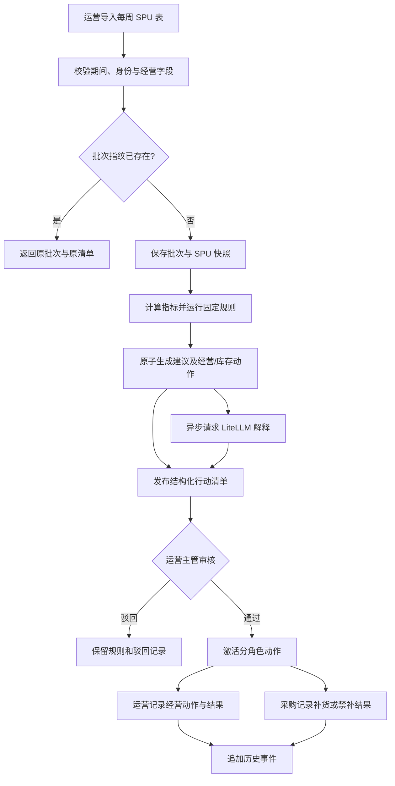

# 趣然 AI 商品经营与利润决策助手 · 开发版

**版本**：V0 / 阶段 5 正式版  
**完整 PRD**：`output/PRD详细版.md`  
**机器需求契约**：`output/requirements.md`  
**正确性分析**：`output/requirements-analysis.md`

## 1. 项目一句话

把每周 SPU 经营表转换为固定规则行动清单，并支持建议级审核、分角色动作执行、结果记录和全链路追溯。

## 2. 实现权威顺序

1. `output/requirements.md` 中的稳定 F/US/REQ/AC/NFR 行为契约。
2. `output/PRD详细版.md` 的产品语义、规则、数据模型和边界。
3. 本开发版的实现摘要。

三者冲突时停止实现，回到阶段 5 修订；不得自行选择一个版本继续。

## 3. P0 用户故事

| 故事 | 角色 | 目标 | 实现功能 |
| :--- | :--- | :--- | :--- |
| US-1 / US-F01-01 | 运营 | 导入周度 SPU 表并看到批次校验结果 | FR-1 / F01 |
| US-2 / US-F02-01 | 运营 | 查看统一销售、利润、品退与库存指标 | FR-2 / F02 |
| US-3 / US-F03-01 | 运营主管 | 获得唯一经营动作和一致库存动作 | FR-3 / F03 |
| US-4 / US-F04-01 | 运营 | 获得不覆盖规则的四要素解释 | FR-4 / F04 |
| US-5 / US-F05-01 | 运营 | 查看每批次一份可筛选行动清单 | FR-5 / F05 |
| US-6 / US-F06-01 | 运营主管 | 对完整建议批准或驳回，必要时在未执行前人工改判生效动作 | FR-6 / F06 |
| US-7 / US-F06-02 | 运营、采购计划 | 分别更新负责动作和结果 | FR-6 / F06 |
| US-8 / US-F07-01 | 采购计划 | 只查看和处理补货/禁补必要信息 | FR-7 / F07 |
| US-9 / US-F08-01 | 运营主管 | 追溯批次、规则、关键值和状态历史 | FR-8 / F08 |

## 4. 功能清单与关键边界

| FR | 功能 | 必做行为 | 关键边界 |
| :--- | :--- | :--- | :--- |
| FR-1 / F01 | 数据导入与校验 | XLSX、批次指纹、行拒绝与字段降级 | 十至二十 SPU 仅验收规模；重复指纹返回原批次 |
| FR-2 / F02 | 经营指标 | 上月净销售额、源表经营准利润率、七日品退、库存可售天数 | 缺失按字段依赖降级，不猜默认值 |
| FR-3 / F03 | 固定规则 | 类型、唯一主动作、补货/不补货/禁补 | AI 不得改写；止损/清仓与禁补原子生成 |
| FR-4 / F04 | AI 解释 | 四要素、关键依据、越界过滤、故障降级 | LiteLLM 不在审核执行关键路径 |
| FR-5 / F05 | 行动清单 | 每批一份、固定排序、筛选、历史保留 | 纯维持且无库存动作默认不进入清单 |
| FR-6 / F06 | 审核执行 | 建议整体审核、主管人工改判生效动作、动作分别执行、版本冲突保护 | 原规则结论不覆盖；清仓改加投必须重新确认库存动作；已执行先终止 |
| FR-7 / F07 | 权限隔离 | 钉钉统一认证、事业部负责人审批角色、运维/系统管理员配置映射、角色视图与操作权限 | 无认证/无映射默认拒绝；采购不见完整利润、推广、品退和售后 |
| FR-8 / F08 | 溯源审计 | 决策快照、状态事件、异常操作事件 | 新批次不覆盖旧记录 |

## 5. 固定规则

### 5.1 数据口径

- 决策对象：SPU，即商品链接；不处理 SKU。
- 销售与利润：批次对应的上一个完整自然月；净销售额已扣退款；利润率使用表内“经营准利润率”。
- 品退率：最近七天品退件数除以已销售件数；周期未经核验则不可参与观察或低品退加投条件。
- 库存可售天数：`(仓内库存 + 在途库存) / 最近十四天平均日销量`；输入不足则不生成补货建议。
- 新品基准：批次业务截止日；上架未满两个自然月为新品，达到边界为非新品。

### 5.2 分类与动作伪代码

```text
IF launch_age < 2 calendar months:
  type = 新品
ELSE IF previous_full_month_net_sales >= 100000:
  type = 大爆款
ELSE IF previous_full_month_net_sales >= 20000:
  type = 小爆款
ELSE:
  type = 淘汰商品

priority = 清仓 > 止损 > 观察 > 加投 > 维持

新品: profit >= -20% => 加投; profit < -20% => 观察; no replenishment advice
大爆款: profit < 0% => 清仓; 0% <= profit < 5% => 止损;
        return_rate > 1.5% => 观察;
        profit >= 10% and return_rate <= 1.5% => 加投; else 维持
小爆款: profit < 5% => 清仓; 5% <= profit < 10% => 止损;
        return_rate > 1.5% => 观察;
        profit >= 15% and return_rate <= 1.5% => 加投; else 维持
淘汰商品: 清仓

IF main_action in [止损, 清仓]: inventory_action = 禁止补货
ELSE IF type == 新品 or stock_days unavailable: no inventory action
ELSE IF stock_days < 30: inventory_action = 补货
ELSE: inventory_action = 不补货
```

同一批次快照和同一规则版本必须得到完全相同的类型与动作。

## 6. 核心数据模型

| 实体 | 关键字段含义 | 关键关系/约束 |
| :--- | :--- | :--- |
| BusinessUnit | 事业部身份 | V0 仅玩具事业部 |
| ImportBatch | 文件指纹、期间、业务截止日、状态、提交人 | 指纹唯一；命中返回原批次 |
| SpuSnapshot | SPU 身份、源值、采用值、周期、数据状态 | 属于批次；不可变快照 |
| ImportError | 行号、字段、原值、错误级别、原因 | 行拒绝与字段降级可观察 |
| RuleVersion | 阈值、优先级、版本、有效状态 | 历史决策绑定原版本 |
| DecisionRecord | 商品类型、经营主动作、库存动作、关键依据、审核状态 | 建议级审核对象 |
| ActionItem | 动作类型、责任角色、执行状态、version | 一个建议可有经营与库存两个动作 |
| ActionResult | 结果周期、可用指标、备注、记录人 | 归属于动作，按角色裁剪 |
| AIExplanation | 四要素、生成状态、降级原因 | 不得反向修改 DecisionRecord |
| ActionEvent | 前后状态、操作者、时间、版本、拒绝原因 | 只追加，不覆盖 |

关键一致性：批次与固定规则决策强一致；AI 解释最终一致；动作更新使用 version 或等价乐观锁；事件时间保存绝对时间，业务日期按当前 `Asia/Shanghai` 实现假设解释。

## 7. 核心流程



## 8. 权限矩阵

| 能力 | 运营 | 运营主管 | 采购计划 |
| :--- | :---: | :---: | :---: |
| 导入 SPU 表 | 是 | 否 | 否 |
| 查看完整经营信息 | 是 | 是 | 否 |
| 审核建议 | 否 | 是 | 否 |
| 执行经营动作 | 是 | 否 | 否 |
| 执行补货/禁补 | 否 | 否 | 是 |
| 查看补货必要库存销量依据 | 是 | 是 | 是 |
| 查看完整利润、推广、品退和售后 | 是 | 是 | 否 |
| 查看按权限裁剪的历史 | 是 | 是 | 是 |

LiteLLM 部署密钥仅由运维以系统级部署密钥配置；普通用户页面、接口响应、日志和错误详情不得返回密钥。

三类直接用户只通过钉钉独立登录；运营、运营主管、采购计划角色变更由事业部负责人审批，运维/系统管理员按审批结果配置并维护。产品不提供账号密码、注册、找回密码或业务侧角色管理后台；认证失败、登录态失效或无映射时默认拒绝且不返回经营数据。

## 9. 产品验收入口

完整场景见 `output/requirements.md` 的 AC-F01-01 至 AC-F08-04，以及认证场景 AC-F07-05 至 AC-F07-06。开发必须至少先走通：

- 导入成功、批次重试幂等、期间错误、身份拒绝与字段降级。
- 四类商品边界、利润等号边界、品退等号边界、库存三十天边界。
- 止损/清仓与禁补同一决策原子生成。
- AI 成功、越界和不可用三种状态均不改变固定规则。
- 建议通过/驳回、双动作独立执行、周内结果记录、过期 version 冲突。
- 采购页面、接口响应、错误和历史均不泄露受限经营字段；采购深链接仅在有关联采购任务时返回裁剪详情。
- 钉钉认证成功且存在经事业部负责人审批、由运维/系统管理员配置的角色映射时建立对应权限登录态；认证失败、登录态失效或无映射时默认拒绝。
- 新批次不覆盖旧快照、规则、审核、动作与结果历史。

测试数据和自动化方法由后续 TDD Master 依据稳定 AC 生成，不在开发实现中自行削弱验收条件。

## 10. 技术栈建议（未确认）

- 后端：Python + FastAPI，适合 XLSX、结构化校验和固定规则纯函数。
- 前端：React + TypeScript，适合内部工具的表格、筛选和角色视图。
- 数据库：PostgreSQL，承载批次快照、关系约束、动作 version 和追加事件。
- 核心算法：版本化固定规则模块，不使用机器学习求解器；AI 只经 LiteLLM 解释。
- 基础设施：容器化部署并复用现有 LiteLLM 网关；具体 Docker、CI/CD、调度与监控由设计阶段确认。

以上是可替换建议，不是已拍板的关键技术决策；替换技术栈不得改变稳定产品行为。

## 11. 实施顺序

| 顺序 | 模块 | 前置依赖 | 完成信号 |
| :--- | :--- | :--- | :--- |
| 1 | F01 批次导入与校验 | 真实字段样表 | 指纹幂等、错误可观察、快照不可变 |
| 2 | F02—F03 指标与规则 | 已确认数据口径和规则版本 | 所有边界可复算，止损/清仓同步禁补 |
| 3 | F05 清单与 F08 溯源 | 决策记录 | 每批一份清单，历史不覆盖 |
| 4 | F07 权限 | 钉钉接入与经审批的角色映射 | 事业部负责人审批、运维/系统管理员配置；三角色读取与操作均由服务端限制；无认证/无映射默认拒绝 |
| 5 | F06 审核执行 | 权限、建议和动作模型 | 建议审核与双动作状态完整 |
| 6 | F04 AI 解释 | LiteLLM 连通与系统级密钥 | 成功、越界、失败均不阻塞规则链路 |

## 12. 开工提示

1. 先把固定规则实现为无副作用、版本化、可重放的纯函数；不要先接 AI。
2. 数据 Schema 先落实不可变批次、SPU 快照、建议、分动作、结果和追加事件。
3. 所有状态更新携带 version；过期写入返回当前状态且不追加成功事件。
4. 权限必须在服务端、接口响应、错误和历史路径一致裁剪，不能只隐藏前端字段。
5. 产品行为只以 `output/requirements.md` 为准；具体测试实现等 TDD 验收契约生成。

## 13. 关键决策

| 决策 | 未选方案 | 原因 | 代价 |
| :--- | :--- | :--- | :--- |
| V0 只处理 SPU/商品链接 | SKU 级分摊与动作 | 费用事实源在链接层，且用户已收缩范围 | 无法输出 SKU 动作 |
| 固定规则生成唯一原始建议，主管仅能追加人工生效版本 | AI 自主决策或直接覆盖规则 | 同时保证统一利润标准、可复算和例外拍板可追责 | 需额外维护生效动作版本与审计 |
| 每周新批次、一周内更新状态 | 每日重算清单 | 数据支持每周一供数 | 周内没有新数据判断 |
| 建议整体审核、动作分别执行 | 每个动作单独审核或单一建议状态 | 防止止损与禁补被拆散，又允许运营采购各自执行 | 状态模型更复杂 |
| 字段级降级 | 任一缺失整行删除 | 保留仍可确定的高优先级风险 | 页面必须解释数据限制 |
| LiteLLM 系统级部署密钥 | 普通用户配置模型凭据 | 用户已确认由运维管理 | 业务用户无法自行切换模型 |
| 钉钉统一身份 + 经审批的角色映射 | 共享账号、产品账号密码或业务侧权限后台 | 统一身份可追溯到个人，且以事业部负责人审批约束授权边界 | 依赖钉钉接入以及运维/系统管理员配置映射的可用性 |

`Asia/Shanghai` 是实现假设而非用户拍板；身份入口与角色维护责任已确认，具体钉钉接入协议和技术栈仍需设计阶段确认。
