# 趣然 AI 商品经营与利润决策助手 PRD

## 0. 阶段路线图与 MVP 定义

> F01—F08 原始 V0 当时由用户直接授权进入阶段 5，未执行阶段 2—4；F09 增量已完整完成阶段 2 价值确认、阶段 3 调研、阶段 4 V1 辩论及 MVP 拍板。两段流程事实分别保留，F09 结论不反向改写 F01—F08 的经营规则。

### 0.1 产品阶段

| 阶段 | 验证目标 | 功能模块 | 交付物（做完用户拿到什么） | 状态与来源 |
| :--- | :--- | :--- | :--- | :--- |
| V0 MVP | 验证玩具事业部能否用统一规则从真实 SPU 经营数据中识别问题，并由运营和运营主管完成轻闭环 | F01—F08 全部 | 一份可审核、可执行、可追溯的周度 SPU 行动清单；首轮覆盖 10—20 个真实 SPU，识别至少 3 个真实经营问题，每条建议包含对象、问题、依据和动作 | 已确认；来源：PRD V0 §0、§11、§14及用户最新角色收敛决策 |
| 后续候选，不属于 V0 承诺 | 仅在数据和业务责任人具备后评估评价、退款原因、广告明细、外部系统自动写入及 SKU 级能力 | 无 V0 功能 ID | 无承诺交付物；是否立项另行确认 | 候选范围；来源：PRD V0 §17 |

> **MVP 完成定义**：完成 F01、F02、F03、F04、F05、F06、F07、F08，并同时满足以下四项结果，即视为 V0 MVP 完成：①玩具事业部导入 10—20 个真实 SPU；②至少识别 3 个由真实数据触发的经营问题；③每条建议完整呈现具体对象、发现问题、关键依据和推荐动作，且可追溯到固定规则与原始关键值；④运营完成经营与相关人员协同闭环，运营主管完成建议及清仓完成时间确认。所有数字来源：用户已确认的 PRD V0 §0、§14及最新角色闭环决策。

**首轮验收责任**：运营负责首轮验收，按上述四项结果确认建议能否用于首轮业务评审；事业部负责人只负责试点范围与资源投入，不替代运营验收。

**试点规模与运行边界**：10—20 个 SPU 是首轮验收数据集规模，不是导入有效性的永久硬门槛。SPU 数量不在该区间时，系统可显示“超出首轮验收规模”的提示，但不得仅因数量原因把字段和期间均合法的批次判为无效。

### 0.2 MVP 方案前置能力

| 前置能力 | 当前状态 | 负责人 | 已有证据 | 替代方案及对 MVP 的影响 |
| :--- | :--- | :--- | :--- | :--- |
| 真实 SPU 经营数据 | 部分具备 | 数据支持部门 | 仓库根目录用户提供的唯一当前验收源 `商品链接.xlsx` 已核验 10 条唯一 SPU 明细，销售、成本、推广和经营准利润字段可用，品退周期未校验；生产 API→Worker→PostgreSQL 实际解析为单期 10 个 SPU，不含历史案例 SPU 515；来源：字段核验报告与本轮真实导入证据 | 库存、在途与最近 14 天销量缺失时，不生成补货建议；其他可判定动作继续生成并标明缺数。上架日期不可解析的 SPU 不分类、不生成动作 |
| 最近 7 天品退口径 | 待数据支持部门证明 | 数据支持部门 | 表内有品退率，但统计期间尚未证明为最近 7 天；来源：PRD V0 §15、字段核验报告 | 不把未经证明的品退率作为观察或加投条件；利润清仓/止损仍可继续判定，并标记“品退数据未校验” |
| 批次业务截止日 | 每批必须明确并冻结 | 数据支持部门提供业务期间，运营导入时核对 | 首批销售、利润和费用期间已确认为 2026-06-01 至 2026-06-30；来源：PRD V0 §5.3 | 新品年龄和上一个完整自然月均以批次业务截止日计算，不采用上传日、清单生成日或页面访问日 |
| 固定经营规则 | 已确认 | 事业部负责人负责业务拍板；产品按确认口径落地 | 商品分类、利润阈值、品退阈值、主动作优先级和补货冲突规则已写入 PRD V0 §6—§7 | 无替代算法；数据不足时按字段依赖降级，不允许 AI 猜测 |
| LiteLLM 网关 | 已具备，生产连通性与合规重试已验证 | 运维人员 | 用户确认已有 LiteLLM 网关和系统级部署密钥；2026-08-05 以真实 `商品链接.xlsx` 经生产 API、Worker 与 PostgreSQL 验证 7 条行动建议最新解释全部生成，首轮越界/超时版本保留且固定规则与任务摘要不变 | 网关等待、失败或返回越界内容均不阻塞固定规则清单、审核和执行；解释显示失败或结构化兜底 |
| 角色与执行责任 | 已确认并写入稳定需求契约 | 运营主管、运营 | 运营统一负责加投、观察、SPU 推广止损、清仓、补货/禁补协同、OA 通知及结果闭环；运营主管负责建议审核、改判和清仓完成时间确认 | 不自动改广告、采购或库存系统；相关人员不直接登录本产品，反馈由运营核验后录入 |
| 钉钉统一身份认证与角色映射 | 凭据与授权前半程已验证，真实回调待补 | 事业部负责人审批；唯一 Admin 配置；运维维护身份接入与恢复部署 | 当前 Client 凭据取 Access Token HTTP 200、OAuth 授权跳转 HTTP 302；尚需真实链路证明稳定身份、企业作用域和两个可靠组织属性可得 | 认证失败或登录态失效时拒绝；认证成功但无唯一有效角色时进入 F09 待处理闭环；不得降级为共享账号、业务账号密码或仅前端隐藏 |
| 钉钉企业内部机器人单聊 | 真实投递已验证 | 运维/系统管理员配置；运营使用 | 2026-08-05 以当前 Client 凭据、已发布机器人和唯一真实公司 User ID，完成一次人工协同与一次 Worker 每日催办；官方 `readStatus` 均返回 `SUCCESS`、收件人数 1，当时为未读；同日重复 Worker 无重复记录 | 调用失败时保留“待通知/通知失败”状态并由运营人工补发；接口受理或未读不得伪造为业务确认 |
| 业务时区 | 实现假设 | 产品与技术在设计阶段核对 | 当前中国内部业务的推荐默认值为 `Asia/Shanghai` | 该值不是用户业务拍板；如企业统一时区不同，必须在上线前替换且整批保持一致 |

**验收数据与历史案例边界**：SPU 515 只是 §1 和价值指标中的已确认历史损失案例，不是当前导入文件的必备行或固定测试数据。当前候选 E2E 必须使用用户真实 `商品链接.xlsx` 中的实际 SPU、单期和字段缺失状态；跨周续接、动作变化与多期历史仍是 MVP 行为，但以真实 PostgreSQL 持久化集成测试验证，不伪造另一份“真实 XLSX”。

### 0.3 V0 状态分层

1. **建议级审核状态**：一条 SPU 建议作为整体由运营主管审核，只能是待审核、已通过或已驳回；不能分别通过经营与库存动作。主管如不采纳规则建议，可在动作未执行时先完成人工改判，再对改判后的整条建议生效。
2. **跨周任务状态**：每周决策快照独立保留，但同一 SPU/商品链接的执行任务使用稳定任务 ID 跨批次续接。新批次动作相同时不重建任务、不重置状态或重复审核；动作变化时追加待主管确认的新版本，通过后替换当前生效动作。当前周视图区分任务首次产生时间、本周关联时间、当前经营状态和经营动作执行时间；最近一条前序待办作为独立历史建议快照，展示其原批次当时的主动作、关键依据、库存语境、经营状态及生命周期时间，不使用当前周数据反填。
3. **动作级执行状态**：建议通过后，经营动作与补货/禁补协同动作均归该 SPU 责任运营；两类动作分别记录状态和结果，采购、仓库等相关人员只通过 OA 被协调，不直接改写产品状态。
4. **页面汇总状态**：只能由建议审核状态与各动作状态只读汇总展示，不得替代或覆盖动作级状态；一项已执行、另一项待执行时必须分别可见。

### 0.4 产品阶段增量

现有 F01—F08 的 V0 MVP 行及其完成定义保持不变，在阶段表中追加 F09：

| 阶段 | 验证目标 | 功能模块 | 交付物（做完用户拿到什么） | 状态与来源 |
| :--- | :--- | :--- | :--- | :--- |
| 既有业务 MVP | 验证玩具事业部能否从真实 SPU 经营数据形成可审核、可执行、可追溯的轻闭环 | F01—F08 | 周度 SPU 行动清单及既有业务闭环 | 已确认既有基线；现有正文不改 |
| F09 增量 MVP | 解除“钉钉已确认身份但没有唯一有效角色”的启用阻塞，同时验证零错授、可恢复和全程审计 | F09；含 F09-SCOPE-01—06 | 唯一 Admin 可安全初始化和登录；无角色用户进入有人承接的待处理状态；Admin 可按外部审批配置唯一业务角色；用户重新登录正确工作台；恢复与高权限操作可追溯 | 用户已确认；来源：`proposal-v1.md`「MVP 划分（已与企业家确认）」 |
| 后续候选 | 仅在真实使用数据触发重评后决定是否增加治理能力 | 无新增 active 功能 ID | 不承诺多 Admin、批量授权、OA/HR/IDaaS 集成、目录同步、周期复核、审计高级导出、SIEM、多应用权限包或价值分析后台 | 明确后置；来源：`proposal-v1.md` §6 与 MVP 划分 |

> **F09 MVP 完成定义**：F09-SCOPE-01—06 全部交付；核心闭环从无有效唯一角色的钉钉用户登录开始，经过待处理申请、Admin 核验身份和审批依据、配置唯一正确角色并撤销旧业务会话，最终由用户重新登录进入正确工作台。同时，观察期内经确认的错误业务授权事件为 0，应审计的高权限状态变更审计覆盖率为 100%，每次恢复后仍可用的旧 Admin 会话为 0。首次启用的 10 分钟结果只有在 §0.5 全部门禁满足后才有效。来源：用户确认的 `proposal-v1.md` MVP 完成定义，依据等级 B。

### 0.5 F09 第一版完整上线门禁

以下是 F09 第一版完成的唯一完整门禁清单；追加到既有 F01—F08 前置能力，不删除原表。功能代码存在但任一适用门禁未满足时，不得宣称 F09 第一版完成。

| 门禁 | 当前状态 | 责任岗位 | 完成证据/判定 | 缺失时的结果 |
| :--- | :--- | :--- | :--- | :--- |
| 钉钉稳定身份、企业作用域与两个可靠组织属性 | 稳定标识已有；作用域与两个属性待真实权限实测 | 运维维护钉钉配置；产品负责人确认最小权限边界 | 真实钉钉链路能稳定取得并交叉核验，不以姓名猜测、自由备注或 opaque ID 替代 | 阻止生产启用和生产授权 |
| 唯一 Admin 持有人、交接责任及有效联系方式 | 上线前必填 | 公司指定的唯一 Admin 持有人及系统责任岗位 | 持有人、交接责任和联系路径已登记并可用 | 不开放生产申请闭环；不因此建设多 Admin |
| 事业部审批岗位与审批证据目录 | 审批边界已确认，认可的证据类型待登记 | 事业部负责人审批；Admin 只核验执行 | 责任岗位、认可/禁止证据类型及引用规则已确认 | 证据不能唯一对应人员和角色时拒绝授权 |
| 初始化与部署恢复材料 | 待各环境配置 | 运维 | 一次性材料按目标环境配置，消费后移除并轮换 | 相应入口不可用；不得提供默认账号或默认口令 |
| TOTP 工具与保存型恢复码 | 待唯一 Admin 初始化时绑定 | 唯一 Admin 本人保管 | TOTP 实码验证、恢复码保存确认与换新路径均可用 | 初始化或保存型恢复不完成 |
| 恢复审批、恢复执行与非静默通知 | 岗位和通道待登记 | 独立恢复审批岗位、恢复执行岗位、安全通知接收岗位 | 主通知通道可用；失败时有公司认可的独立审批人、执行人和可追溯补偿证据路径 | 不得宣称部署恢复可安全运营 |
| 管理/业务身份隔离与管理写操作保护 | 待生产演练 | 系统责任岗位、运维 | 独立入口、凭据、Cookie、会话和权限不转换；管理写操作的同源保护在生产入口有效 | 阻止生产启用 |
| 开发与线上环境物理隔离 | 已确认要求，待上线验收 | 运维 | 两环境使用独立配置源、秘密、基础设施及启动/运维入口 | 阻止生产上线；不得用线上部署栈选择性启动开发依赖 |
| 审计治理与价值台账岗位 | 待上线前登记 | 公司指定治理岗位和价值台账岗位 | 审计责任和人工价值勾稽责任已登记；留存期限未确认时不虚构期限、不自动删除 | 不得宣称运营与价值复盘闭环成立 |
| 关键安全与闭环演练 | 待执行 | 唯一 Admin、运维、业务责任岗位 | 真实浏览器、PostgreSQL 与钉钉链路完成初始化、两级恢复、通知失败补偿、旧会话撤销、角色变更与登录并发、双登录态隔离及快照恢复后换新 | 任一必要场景未通过则第一版不完成 |

### 0.6 F09 产品能力与生产门禁分层

- **产品能力**：唯一 Admin 初始化与独立登录、待处理状态与责任指引、身份和审批核验、唯一角色生命周期、两级恢复、非静默通知、不可变管理审计、授权时效与价值观察。
- **生产门禁**：§0.5 的十项检查；不同门禁只阻断其明确层级，不实现成一个通用全站关闭开关。
- 门禁不得扩张成通用配置中心、审批引擎或身份治理后台。

## 1. 项目背景与收益

### 1.1 一句话需求

为玩具事业部建立一个以 SPU/商品链接为唯一决策粒度的商品经营与利润决策助手：每周导入经营表后，由固定规则生成加投、观察、止损、清仓、维持及补货/禁补结论，AI 只负责解释和排序，再由运营执行并协调相关人员、运营主管审核确认，完成轻闭环。

### 1.2 背景问题

趣然电商的销售、推广、库存、退款、品退和利润数据分散在不同系统与部门。运营和管理人员需要人工拉数、制表并依赖个人经验决策，导致问题发现滞后；即使运营已经止损，采购计划也可能因信息不同步继续补货。依据等级：B（用户确认的业务事实）；来源：PRD V0 §1。

真实案例中，布乐迪“忙碌屋”玩具 515 的亏损约延迟 2 个月才被发现；运营减少推广后未同步采购计划，仍按旧销量补货，最终约 3000 件滞销、占用库存金额约 10 万元、产生利润损失约 6 万元。依据等级：A（用户确认的真实案例与量化结果）；来源：PRD V0 §1.1。

### 1.3 可验证收益

| 收益对象 | V0 可验证结果 | 依据等级 | 来源与边界 |
| :--- | :--- | :--- | :--- |
| 运营 | 每周新数据导入后，可从统一清单看到需加投、观察、止损或清仓的具体 SPU，并获得对象、问题、关键依据和推荐动作四要素 | B | PRD V0 §2.1、§8；未量化节省工时 |
| 运营主管 | 对同一批数据、同一套固定规则生成的完整建议执行一次通过或驳回，并保留备注与原始依据 | B | PRD V0 §3、§10及 requirements.md REQ-F06-01 |
| 责任运营 | 对本人管理 SPU 的经营动作和补货/禁补协同统一负责，通过 OA 通知相关人员并确认最终状态，避免跨部门动作相互抵消 | A | 直接对应 515 案例中的跨部门断点；用户最新角色闭环决策 |
| 事业部 | 首轮用 10—20 个真实 SPU 识别至少 3 个真实经营问题，并判断建议是否可用于业务评审 | B | PRD V0 §0、§14 |

### 1.4 业务价值边界

F01—F08 原始 V0 当时未执行阶段 2，因此其旧价值段不推算公司级年度收益或投资回报率。F09 已完成阶段 2 价值确认，其 72 万元/年和三年 216 万元仅按 §1.11 的待验证口径成立。现有已量化损失证据仍是 515 案例中的约 3000 件滞销、约 10 万元库存占用、约 6 万元利润损失和约 2 个月发现延迟；这些数字不能直接外推为已实现收益。依据等级：A/B/D；来源：用户确认的 PRD V0 与 F09 阶段 2 结论。

### 1.5 不做的风险

| 风险 | 可观察后果 | 依据等级 | 来源 |
| :--- | :--- | :--- | :--- |
| 亏损发现仍依赖月度人工汇总 | 经营问题可能延迟暴露，无法在每周数据到达后形成统一动作清单 | A | 515 案例约延迟 2 个月；PRD V0 §1.1 |
| 运营止损未同步采购计划 | 已经减少推广的 SPU 仍可能继续补货并形成滞销 | A | 515 案例约 3000 件滞销、约 10 万元库存占用；PRD V0 §1.1 |
| 各岗位继续使用不同判断标准 | 同一 SPU 可能出现互相冲突的经营动作，且事后难以还原依据 | B | PRD V0 §1—§2 |
| 直接依赖 AI 作结论 | 模型输出可能覆盖业务阈值，导致相同数据无法稳定复算 | B | PRD V0 §13 |

### 1.6 依据等级说明

| 等级 | 本文含义 |
| :--- | :--- |
| A | 用户确认的真实案例、量化结果或经源表逐行复算验证的数据事实 |
| B | 用户确认的业务规则、角色、流程、权限、目标或范围 |
| C | 从当前样本表核验得到、但仍受统计期间或字段质量限制的事实 |
| D | 尚未由用户确认的内部假设 |
| E | 外部竞品、行业基线或公开资料 |

F01—F08 原始 V0 未使用 D、E 级材料形成业务结论；F09 中 D/E 级材料只用于显式标注的待验证价值模型与方向性风险佐证，不形成已确认事实、收益承诺或合规结论。`Asia/Shanghai` 只作为显式实现假设，不属于用户业务拍板。

### 1.8 一句话需求增量

在现有周度 SPU 经营决策轻闭环上，新增一条独立、安全、有人承接且可审计的产品内授权闭环：钉钉已确认身份但没有唯一有效业务角色的员工，经事业部负责人外部审批和唯一 Admin 核验配置后，能够重新登录进入正确工作台；Admin 权限本身不开放经营数据。

### 1.9 F09 背景问题

现有产品已经能够通过钉钉确认员工身份，但业务会话要求该身份已有唯一有效的运营或运营主管角色。在空角色环境中，所有业务用户都会停在“身份已确认但没有找到唯一有效角色”，而系统内又没有能够创建首个角色映射的管理入口。当前只能联系运维直接修改数据库或配置，无法形成稳定首用流程，也难以证明谁审批、谁配置、何时生效。依据等级 B；来源：用户确认的 `scene-anchor.md`。

认证成功不等于获得业务授权。F09 解决的是认证后的角色配置断点，不改变 F01—F08 的经营规则、数据范围、审核执行流程或业务角色数量。依据等级 B；来源：用户确认的 `proposal-v1.md` §1—§2。

### 1.10 F09 可验证收益

| 收益对象 | 可验证结果 | 依据等级 | 来源与边界 |
| :--- | :--- | :--- | :--- |
| 待授权业务用户 | 无有效唯一角色时不再进入无后续动作的错误页，而是看到真实待处理状态、责任岗位、有效联系方式和下一步；授权后重新登录正确工作台 | B | `proposal-v1.md` §3.4；不承诺外部审批 SLA |
| 唯一 Admin | 不直接改数据库即可核验身份和审批依据，配置、变更、停用或恢复唯一业务角色，并查询对应管理审计 | B | `scene-anchor.md` 第一版范围；Admin 不获得审批权或默认经营数据权限 |
| 事业部负责人 | 审批权与配置执行权分离，审批结果能与目标身份、角色和后续变更记录对应 | B | 用户确认的职责边界；不建设 OA 审批 API |
| 运维与系统责任岗位 | 可通过一次性 setup 和受控恢复处理首次启用与唯一 Admin 凭据丢失，不保留默认账号或常驻后门 | B | `proposal-v1.md` §3.1、§3.3；具体人员和 SLA 待上线前登记 |
| 事业部/公司 | 解除业务用户无法进入整套经营决策助手的启用阻塞，使 F01—F08 已有能力具备被实际使用的前提 | B | 阶段 2 用户已认可；F09 不独占整套经营产品价值 |

### 1.11 价值论证（阶段 2 已确认）

> **最锋利的一句话**：没有 Admin，整套经营决策助手的价值不是打折，而是归零。

- 受益方为事业部/公司；F09 的价值不是节省一次运维配置，而是解除访问阻塞，让已完成钉钉认证的业务用户可以使用 F01—F08。依据等级 B；来源：用户阶段 2 确认。
- 515 历史案例记录了约 6 万元直接利润损失和约 10 万元库存占用。约 10 万元只作同一事件的风险佐证，不与利润损失重复相加。依据等级 A；来源：用户确认的历史案例。
- 以约 6 万元/次、12 次/年的待验证假设计算，约 72 万元/年是潜在风险暴露；若两个假设连续三年成立，约 216 万元是可支撑价值上限。它们不是已节省金额、承诺 ROI，也不是 F09 独占创造的价值。`12 次/年` 与三年持续性依据等级 D；来源：用户同意作为当前论证输入的 `A-F09-001`、`A-F09-002`。
- 只有同时满足“存在正当访问需要、直接因角色缺失/错误/失效被阻塞、F09 实际解除阻塞、有经营动作延误证据、利润影响可核验”的事件才可计入 F09 归因。数据、规则、尚未审批、主管审核、业务执行、采购、外部系统、网络或非角色登录故障均排除。依据等级 B；来源：用户确认的 `proposal-v1.md` §5。
- 价值归因由价值台账岗位在产品外人工勾稽 F09 提供的稳定授权周期、审批、配置和首次进入工作台引用，与既有经营事件及财务证据；F09 首发不新增经营问题、延误天数、利润影响的数据模型或价值分析后台。依据等级 B；来源：V1 的价值归因边界。
- 上线 30 天先输出真实申请、处理时间、错误授权、恢复演练和可归因事件结论；此后按真实事件年度重算。若 12 次/年或三年持续性不成立，必须下调，不得为维持 200 万口径倒推事件。依据等级 B/D；来源：V1 与假设清单。

### 1.12 不建设 F09 的风险

| 风险 | 可观察后果 | 依据等级 | 来源 |
| :--- | :--- | :--- | :--- |
| 空角色环境无人能进入系统 | 已完成钉钉认证的运营和运营主管仍无法使用 F01—F08 | B | 用户当前真实问题与 `scene-anchor.md` |
| 继续由运维直接改库 | 审批人、配置人、目标身份、前后角色和生效结果无法形成统一产品记录 | B | `scene-anchor.md` 当前替代方案 |
| 把 Admin 并入业务角色 | 高权限本地账号会天然获得经营数据，破坏最小权限和审批/执行分离 | B/E | 用户确认边界；飞书招聘、Shopify 邻近范式支持管理权与业务资源权限分离 |
| 自动给首位用户或无角色用户授权 | 身份确认被错误等同于业务审批，无法满足错误授权为 0 | B | 用户确认不自动提权 |
| 没有受控恢复 | 单 Admin 丢失密码、TOTP 和恢复码后，角色配置能力完全停摆 | B/E | 用户确认单 Admin；NIST 恢复要求仅作安全方向参考，不作 AAL2 声明 |

### 1.13 F09 范围停止线

F09 首发不是通用 IAM。多 Admin、备用 Admin、批量授权、可配置角色、OA/HR/IDaaS 集成、目录同步、周期复核、审计高级导出、SIEM、多应用权限包、审批编排和价值分析后台均不进入第一版。若出现第二生产环境、第三业务角色、跨事业部/多级审批、30 天数据证明单人无法承接、唯一 Admin 交接、首次恢复失败、身份源增加或公司决定接入 OA/IDaaS，只触发重新拍板，不自动扩功能。依据等级 B；来源：用户确认的 `proposal-v1.md` §6。

### 1.14 依据等级补充

保留既有 A—E 定义。F09 使用规则：用户明确拍板的角色、范围、指标与责任边界记 B；用户确认作为论证输入但尚无年度台账的数据假设计 D；竞品、NIST、OWASP、Google Cloud 等公开材料记 E，不能覆盖用户已确认边界或直接推导本项目收益。

## 2. 用户、角色与用户故事

### 2.1 用户角色矩阵

| 角色（稳定名称） | 直接/间接 | 目标 | 关键操作 | 数据/权限边界 | 所属阶段 |
| :--- | :--- | :--- | :--- | :--- | :--- |
| 运营 | 直接 | 及时发现 SPU 经营问题并执行经营动作 | 导入/查看清单；执行加投、持续观察、SPU 整体推广止损和清仓；证据支持时优化价格、内容或详情页；更新本人动作结果及后续销售、利润、库存结果 | 可见销售、利润、推广、品退、库存和全部建议；不能审核建议 | V0 MVP |
| 运营主管 | 直接 | 用统一依据审核完整经营建议 | 查看建议与依据；对整条建议一次通过或驳回；在未执行时填写理由并人工改判经营/库存生效动作 | 可见销售、利润、推广、品退、库存和全部建议；不得删除或覆盖原规则结论 | V0 MVP |
| 采购、仓库等相关人员 | 间接 | 配合完成补货、禁补、清仓等线下动作 | 接收责任运营发出的 OA 协同通知并在线下反馈；不直接登录本产品 | OA 仅包含最小必要对象和动作信息；最终状态由责任运营核验录入 | V0 MVP |
| 事业部负责人 | 间接 | 决定试点范围、资源投入与角色授权边界 | 对项目范围和资源投入拍板；审批运营、运营主管角色变更 | 不作为 V0 日常操作角色，不直接配置账号或角色 | V0 MVP |
| 数据支持部门 | 间接 | 按确认口径提供可导入的经营表 | 每周一提供经营表并协助澄清字段、统计期间与业务截止日 | 不承担建议审核与经营动作执行 | V0 MVP |
| 运维人员 | 间接 | 保障模型网关、OA 通道、凭据和身份映射可用 | 配置、更新、轮换系统级部署密钥和 OA 接口凭据；按事业部负责人审批结果配置双角色映射 | 密钥仅作用于本产品环境；不得自行审批业务角色 | V0 MVP |

### 2.2 多角色协作结论

本产品只有运营和运营主管两个直接业务角色。建议由运营主管一次审核；若主管不采纳固定规则动作，可在任一动作开始执行前建立人工改判版本。改判只改变“生效动作”，原规则结论与冻结证据永久保留；清仓改为加投时必须同步重新确认库存动作，不得沿用禁补。每周新批次仍产生独立规则快照，但同一 SPU 同动作直接关联已有任务并保留其审核/执行状态；动作变化才追加新版本等待主管确认。当前待办必须关联最近一条前序经营待办，并从该前序原批次快照独立显示当时的主动作、关键依据、库存语境、经营状态、来源批次、产生时间和执行时间，不得只显示关系元数据或用当前周数据回填。建议通过后，该 SPU 责任运营统一执行经营动作、通过公司 OA 协调采购/仓库等相关人员并核验录入协同状态，外部相关人员不直接登录或修改本产品。

“观察”不是无人负责的标签：由运营启动持续观察；当现有证据支持时，可执行价格、内容或详情页优化，并记录动作和结果。没有评价、退款原因或广告明细时，不生成超出 SPU 汇总证据的具体优化项。

运营与运营主管统一通过钉钉完成身份认证，每人使用自己的钉钉身份登录；两个角色的变更由事业部负责人审批，唯一 Admin 按审批结果配置并维护，运维只负责身份接入与恢复部署。采购、仓库等相关人员只接收 OA 协同消息，不建立产品角色。产品不提供业务账号密码、注册或找回密码；认证失败或登录态失效时拒绝进入业务页，认证成功但无唯一有效角色时进入 F09 待处理闭环。

### 2.3 明确不是谁

- 不是消费者或外部商家使用的产品；V0 服务趣然电商内部经营协作。
- 不是 SKU 级经营工具；唯一决策对象是 SPU/商品链接。
- 不是广告自动投放、采购自动下单或库存自动调整系统；所有外部动作由人工执行。
- 不是由 AI 自主决定经营阈值或主动作的系统；固定规则拥有原始建议判定权，只有运营主管可以审计化人工改判建立新的生效动作。
- 事业部负责人不是日常审核人或执行人；运营主管负责审核和完成事实确认，责任运营负责所有产品内执行与外部协同闭环。

### 2.4 用户故事

### US-1（US-F01-01）

作为运营，我希望选择玩具事业部并导入数据支持部门提供的 SPU 经营表，同时看到明确的数据校验与批次结果，以便只让可识别、可按字段依赖判定的事实进入本周决策。（由 FR-1 实现）

### US-2（US-F02-01）

作为运营，我希望系统按批次业务截止日和已确认周期读取或计算净销售额、经营准利润率、最近 7 天品退率和库存可售天数，并在数据不足时明确降级，以便理解每个判断使用了什么口径。（由 FR-2 实现）

### US-3（US-F03-01）

作为运营主管，我希望固定规则为每个可判定 SPU 生成唯一主动作，并同步处理补货或禁止补货结论，以便审核时不出现相互冲突的动作。（由 FR-3 实现）

### US-4（US-F04-01）

作为运营，我希望 AI 把固定规则结论解释为具体对象、发现问题、关键依据和推荐动作，并且不能修改或阻塞主动作，以便直接理解和执行建议。（由 FR-4 实现）

### US-5（US-F05-01）

作为运营，我希望每个导入批次形成一份可筛选、可排序且保留历史的行动清单，以便聚焦本周优先处理的 SPU。（由 FR-5 实现）

### US-6（US-F06-01）

作为运营主管，我希望对完整建议一次通过或驳回；若业务复核不采纳规则动作，我能在未执行前填写理由、同步重新确认库存动作并建立可追溯的生效动作，以便兼顾规则统一性和业务拍板责任。（由 FR-6 实现）

### US-7（US-F06-02）

作为管理该 SPU 的运营，我希望统一更新经营动作和补货/禁补协同状态，并能通过 OA 通知相关人员、核验反馈；清仓完成后提交实际完成时间给运营主管确认，以便多项动作可分别追踪且由唯一责任人闭环。（由 FR-6 实现）

### US-8（US-F07-01）

作为运营，我希望只有本人和运营主管能进入产品，系统向采购、仓库等相关人员发送的 OA 消息只包含最小必要协同信息，以便既推进跨部门动作又不扩散完整经营数据。（由 FR-7 实现）

### US-9（US-F08-01）

作为运营主管，我希望每条建议及其状态变化都能追溯到导入批次、业务截止日、数据期间、规则版本、固定规则、原始关键值、时间和操作者，以便复核当时为什么产生并如何处理该建议。（由 FR-8 实现）

### 2.5 F09 角色增量

现有运营、运营主管、事业部负责人和运维人员稳定名称保留；向角色矩阵追加或扩展以下 F09 责任：

| 角色（稳定名称） | 身份/别名 | 直接/间接 | 目标 | 关键操作 | 数据/权限边界 | 所属阶段 |
| :--- | :--- | :--- | :--- | :--- | :--- | :--- |
| 唯一 Admin | 系统管理员 | 直接 | 安全完成唯一管理账号的初始化、登录和恢复，并按已审批结果维护业务角色 | 查看待处理身份；核验身份与审批依据；新增、变更、停用、恢复唯一业务角色；查询管理审计；管理自身凭据 | Admin 管理权不等于业务角色；默认不能读取经营数据；不能审批业务角色、创建第二 Admin、委派管理权、停用或删除自己 | F09 MVP |
| 待授权业务用户 | 运营或运营主管候选 | 直接 | 在钉钉身份已确认但无唯一角色时获得可追踪的后续路径，并在授权后进入正确工作台 | 查看自己的待处理、已配置待重新登录、已授权、已停用或配置冲突状态；按指引联系责任岗位并重新登录 | 不能自选角色、查看他人申请或任何经营数据；获得角色后回到既有运营或运营主管权限 | F09 MVP |
| 事业部负责人 | 业务角色审批人 | 间接 | 决定人员应获得运营或运营主管角色 | 在产品外完成审批并提供组织认可的证据 | 不直接配置角色，不使用 Admin 凭据；审批权不转给 Admin | F09 MVP |
| 运维人员 | 恢复执行与部署配置岗位 | 间接 | 维护 Admin 初始化、恢复、通知和环境秘密，保障唯一 Admin 可受控恢复 | 配置并轮换一次性 setup/recovery 材料；按独立审批执行恢复；维护通知与环境隔离 | 不决定业务角色，不借恢复能力取得经营数据；具体审批人、执行人和接收人上线前分别登记 | F09 MVP |

恢复审批岗位、安全通知接收岗位、审计治理岗位和价值台账岗位属于生产运行责任，不因 F09 获得产品业务角色；具体人员与未确认 SLA 不在 PRD 中虚构。

### 2.6 F09 多角色协作结论

- “人”可以同时承担组织中的 Admin 持有人与业务岗位，但两个身份入口、凭据、会话和权限必须完全独立；Admin 会话不能转换为业务会话。
- 事业部负责人先在产品外审批；Admin 在一次授权提交中核验审批依据并执行配置。产品在提交前不知道外部审批进度，因此不持久化“已审批待配置”状态。
- 角色配置成功后，受影响的旧业务会话失效；用户需要重新通过钉钉登录，进入其唯一运营或运营主管工作台。
- 单 Admin 是当前已确认边界。离岗交接通过受控凭据重置完成，不共享旧密码、旧 TOTP 或旧恢复码，也不创建临时第二 Admin。

### 2.7 F09 明确不是谁

- Admin 不是第三种业务角色，不是天然的经营数据超级用户。
- Admin 不是事业部负责人，不代替业务审批。
- 待授权用户不是已授权用户；钉钉认证成功不代表可读取业务数据。
- 运维不是业务角色审批人，也不能通过恢复流程静默取得经营数据。
- F09 不是公司通用身份目录、组织通讯录、OA 审批系统或多应用权限治理平台。

### 2.8 F09 用户故事

### US-F09-01

作为唯一 Admin，我希望使用一次性 setup 口令创建唯一管理账号，采用独立用户名、密码和 TOTP 登录，并在正常凭据丢失时通过保存型恢复码或受控部署恢复重新取得管理能力，以便系统首次启用和单点故障恢复都不依赖默认账号或直接改数据库。（由 FR-9.1、FR-9.2、FR-9.3、FR-9.6、FR-9.7 实现）

### US-F09-02

作为唯一 Admin，我希望查看待处理身份，依据事业部负责人已经完成的审批核验人员和目标角色，并对运营或运营主管角色执行新增、变更、停用和恢复，以便每次授权都唯一、正确、立即生效且可追溯。（由 FR-9.5、FR-9.6、FR-9.7 实现）

### US-F09-03

作为待授权业务用户，我希望在钉钉认证后看到真实的待处理状态、责任岗位、有效联系方式和下一步，并在角色配置完成后获得重新登录指引，以便不再停在无人承接的通用错误页。（由 FR-9.4、FR-9.7 实现）

## 3. 核心算法 / 目标函数

### 3.1 决策问题定位

V0 不是预测或组合优化系统，不使用 CP-SAT、SCIP、Gurobi 等优化求解器。系统对每个 SPU 独立执行确定性规则：同一导入批次、同一规则版本、同一业务截止日必须得到相同的商品分类、主动作和补货结论（F02、F03、F08；REQ-F02-01～REQ-F02-03、REQ-F03-01～REQ-F03-03；NFR-001、NFR-005）。

选择规则表而非优化器的权衡：

- 商品分类、阈值、动作优先级和补货冲突已由业务确认，不存在待求解的跨 SPU 预算目标。
- 每个 SPU 独立判定，规则计算复杂度为 `O(n)`；优化器会增加参数校准和解释成本，却不会提高规则符合度。
- AI 只解释、给出同层排序说明和非覆盖式优化提示，不参与分类或动作裁决（F04；REQ-F04-01～REQ-F04-03）。

代价是 V0 不自动求出跨 SPU 的最优投放预算、采购数量或广告明细动作；这些能力不属于 F01—F08。

### 3.2 变量、业务截止日与数据有效性

对导入批次 `b` 中的 SPU `i`，定义：

| 符号 | 含义 | 有效性约束 |
|---|---|---|
| `D_b` | 数据批次业务截止日 | 建立批次时冻结；用于新品年龄和统计窗口解释，不使用页面访问日或任务完成日 |
| `L_i` | 上架日期 | 可解析才参与新品判断；无效时保留行但分类降级 |
| `S_i` | 上一个完整自然月扣除退款后的净销售额 | 与批次期间绑定；缺失时只阻断依赖它的分类/动作 |
| `P_i` | 上一个完整自然月表内“经营准利润率” | 采用数据支持表口径；缺失时只阻断依赖利润率的动作 |
| `R_i` | 最近 7 天品退件数 ÷ 最近 7 天已销售件数 | 周期、分子和分母有效才参与规则 |
| `W_i/T_i/Q14_i` | 仓内库存/在途库存/最近 14 天销量 | 三者齐全才计算库存可售天数 |
| `A_i` | 唯一主动作 | `清仓/止损/观察/加投/维持/不判定` |
| `B_i` | 补货结论 | `禁止补货/补货/不补货/不生成` |

**时区实现假设**：V0 建议所有业务日期按 `Asia/Shanghai` 解释，以便自然月、7 日/14 日窗口和新品边界一致。该时区尚非用户单独确认的业务事实；在技术设计未确认替代时，作为当前统一实现假设使用并显式标注。事件时间另存绝对时间点，展示时按该业务时区转换。

新品按两个自然月位移判定：

```text
is_new(i, b) := D_b < add_months(L_i, 2)
```

即在数据批次业务截止日，上架尚未满 2 个自然月时为新品；达到边界当日即转入非新品规则。历史批次重放继续使用原 `D_b`，不随实际重试日期改变。

#### 行拒绝与字段级降级

仅当无法建立唯一、可分派的 SPU 对象时拒绝整行。V0 的必要身份字段为：SPU ID、链接名称、店铺、平台、责任运营；其中 SPU ID 还必须在批次内唯一。必要身份缺失或 SPU ID 重复时：

1. 该行不进入指标和规则计算；
2. 校验结果显示源工作表、行号、字段名和错误原因；
3. 批次有效/拒绝行计数可见；
4. 其他有效行继续处理。

上架日期、销售额、利润率、品退和库存等指标字段缺失或异常时，不整行排除：保留 `SPU_SNAPSHOT`、原始值和质量标记，仅停止依赖该字段的判断。不得使用默认值、推广费用或 AI 推测补齐（F01、F02、F03；REQ-F01-02、REQ-F02-01～REQ-F02-03、REQ-F03-01～REQ-F03-03）。

10—20 个 SPU 是玩具事业部首轮试点验收规模，不是导入或规则引擎的硬性行数限制；合法批次不会仅因有效 SPU 少于 10 或多于 20 而被规则层拒绝。

### 3.3 商品分类函数

商品分类 `C_i` 先判断新品，再对非新品按净销售额分层：

```text
若 L_i 无效：                         C_i = 数据异常
若 is_new(i, b)：                     C_i = 新品
若非新品且 S_i 缺失/无效：            C_i = 数据异常
若非新品且 S_i >= 100000：            C_i = 大爆款
若非新品且 20000 <= S_i < 100000：    C_i = 小爆款
若非新品且 S_i < 20000：              C_i = 淘汰商品
```

阈值比较使用未格式化数值；显示层四舍五入后的值不得反向参与规则（F02、F03；REQ-F02-01、REQ-F03-01）。

### 3.4 主动作候选与唯一化

固定优先级：

```text
清仓 > 止损 > 观察 > 加投 > 维持
```

规则引擎先生成候选，再保留优先级最高的唯一主动作（REQ-F03-02）。

#### 新品

```text
P_i >= -0.20  -> 加投
P_i <  -0.20  -> 观察
P_i 缺失      -> 不判定（待补数）
```

#### 大爆款

```text
P_i < 0                                      -> 清仓候选
P_i < 0.05                                   -> 止损候选
R_i 有效且 R_i > 0.015                       -> 观察候选
P_i >= 0.10 且 R_i 有效且 R_i <= 0.015       -> 加投候选
候选为空                                     -> 维持
```

#### 小爆款

```text
P_i < 0.05                                   -> 清仓候选
P_i < 0.10                                   -> 止损候选
R_i 有效且 R_i > 0.015                       -> 观察候选
P_i >= 0.15 且 R_i 有效且 R_i <= 0.015       -> 加投候选
候选为空                                     -> 维持
```

#### 淘汰商品

```text
A_i = 清仓
```

降级约束：

- 大/小爆款的 `P_i` 缺失时，无法排除更高优先级的清仓或止损，故不输出较低优先级动作，标记“不判定（待补数）”。
- 淘汰商品清仓来自销售额分类，不依赖利润率。
- `R_i` 缺失、周期非最近 7 天或分母无效时，不触发观察，也不能证明 `R_i<=1.5%`，因此不能触发依赖低品退率的加投；有效利润率仍可独立触发清仓/止损。
- 为补齐已确认动作但未指定责任人的“观察”闭环，当前采用架构建议：观察作为运营经营动作项，最小完成语义为运营确认已查看并记录观察备注；这不是新增业务事实，也不表示系统自动修改外部业务系统。

### 3.5 补货函数与原子冲突约束

补货结论在主动作之后计算（REQ-F03-03）：

```text
若 A_i ∈ {清仓, 止损}：
    B_i = 禁止补货

否则若 C_i = 新品：
    B_i = 不生成（新品首版不判断补货）

否则若 C_i 或 A_i 为“不判定”：
    B_i = 不生成（前置决策数据不足）

否则若 W_i、T_i、Q14_i 任一缺失：
    B_i = 不生成（库存数据不足）

否则令 avg14_i = Q14_i / 14：
    若 avg14_i = 0：B_i = 不生成（无近期销售）
    否则 days_i = (W_i + T_i) / avg14_i
         days_i < 30：B_i = 补货
         days_i >= 30：B_i = 不补货
```

不变量：

1. `A_i∈{清仓,止损}` 时，`B_i` 必须同一规则决策内原子写成“禁止补货”。不得先生成止损/清仓、再由异步任务补写禁补。
2. 原子结果同时生成一个 `DECISION_RECORD` 和对应的经营动作、禁补动作定义；任一写入失败时整条决策不发布。
3. 加投与补货可以并存；清仓/止损与补货不可并存。
4. “禁止补货”即使库存字段缺失也必须生成；责任运营通过 OA 协调相关人员并核验“已知悉/已停补”结果。
5. “不补货”表示数据完整且可售天数不少于 30 天；“不生成”表示不能或不应判断，二者不得合并。
6. “维持”“不补货”“不生成”保留在决策记录中，但不单独创建可执行动作项；维持且无补货动作的 SPU 默认不进行动清单。

### 3.6 清单、AI 与排序边界

固定规则结果固化后，结构化四要素兜底与行动清单立即可用并可进入审核。LiteLLM 解释并行、异步追加；等待、超时、限流、密钥失效或越界输出均不得阻塞清单、跨周任务续接、审核或执行（F04、F05；REQ-F04-01～REQ-F04-03、REQ-F05-01～REQ-F05-05；NFR-004）。

两层结果：

1. **确定性层**：分类、主动作、补货结论、规则版本、关键值、阈值、数据质量标记和结构化四要素兜底。
2. **解释层**：LiteLLM 只消费白名单字段，生成可读解释、同动作层排序说明和不覆盖主动作的优化提示。

AI 失败时显示结构化兜底和“AI 解释生成失败”。同动作层若规则版本已明确一个可解释且数据已校验的影响代理指标，则按该指标降序并记录代理字段；没有明确代理或指标缺失时采用稳定 SPU 标识作为兜底顺序，不用 AI 猜测影响金额或改变结果。

### 3.7 规则版本、批次指纹与性能边界

- 每条决策绑定不可变 `rule_version`；规则变更只作用于新业务输入，不覆盖历史决策。
- 批次指纹由事业部、数据期间、业务截止日和源文件内容摘要构成。指纹命中时返回原 `batch_id`、原清单和原状态链，不创建新业务批次或新清单。
- 同期间但源内容或业务截止日不同的输入可形成独立批次；若属于修正，可通过可选前序批次关联追溯，但不得覆盖原批次。
- 规则、AI 或页面重试必须绑定既有 `batch_id/decision_id`；AI 重试只能更新解释状态，不能生成第二份动作结论。
- 规则计算复杂度为 `O(n)`，且不得依赖 LiteLLM 完成。具体语言、数据库、队列和数值 SLA 未确认，不写成既定选型。

---

### 3.8 F01—F08 算法和入口兼容

F09 不新增经营预测、商品分类、动作排序、库存计算或优化求解算法，也不改变 F01—F08：

- SPU 仍按版本化固定规则独立计算，分类、唯一主动作与补货/禁补冲突约束不变。
- 规则复杂度仍为 `O(n)`，不引入优化器或机器学习求解器。
- LiteLLM 仍只生成解释，不参与身份授权、业务角色判断或经营动作裁决。
- 批次指纹、业务截止日、跨周任务、审核、执行与经营审计不被 F09 覆盖。

已有唯一有效 `operations/supervisor` 映射的钉钉用户继续按 F07 既有路径创建业务会话并进入工作台，不经过待处理或重新审批。F09 只把既有 AC-F07-06 中“认证成功但没有唯一有效角色”的结果细化为 AC-F09-07/08 的待处理闭环；钉钉认证失败、登录态失效及 F07 其他权限行为保持不变。

### 3.9 授权约束模型

对身份提供方 `p`、钉钉企业作用域 `t`、稳定用户标识 `u` 组成的作用域身份键 `K=(p,t,u)`，定义：

| 符号 | 含义 | 约束 |
|---|---|---|
| `M(K)` | 当前有效业务角色集合 | 只能包含 `operations` 或 `supervisor` |
| `A(K)` | 可与审批材料交叉核验的权威组织属性集合 | 除稳定身份键外至少两个可靠属性 |
| `E(K,r,op)` | 操作 `op` 对目标角色 `r` 的审批证据 | 审批人、审批时间、证据类型/引用、目标人员/角色和核验结果完整 |
| `V(K)` | 当前角色映射版本 | 新增、变更、停用、恢复时单调递增 |
| `op` | 角色操作 | `grant/change/disable/restore` |

授权提交前置条件：

```text
grantable(K, r, op) :=
    r ∈ {operations, supervisor}
    AND count(reliable(A(K))) >= 2
    AND scope(A(K)) = t
    AND approval_valid(E(K, r, op))
    AND request_version = V(K)
    AND |M(K)| <= 1
```

操作后置条件：

```text
grant:   M(K) = {r}
change:  旧角色被替换，M(K) = {r_new}
disable: M(K) = ∅，但停用事实与历史保留
restore: M(K) = {r}

提交前若 |M(K)| > 1：进入配置冲突，不执行任何角色操作
```

每次成功操作满足：

```text
当前映射变化
+ 审批记录
+ 受影响业务会话撤销
+ 五态投影更新
+ 管理审计
= 同一事务全部成功或全部失败
```

零错授依靠硬约束而非评分：身份属性不足、企业作用域不一致、同名无法排除、审批证据缺失、目标角色不一致、版本冲突或双映射风险出现时一律拒绝。系统不得根据姓名、首个登录者、历史相似用户或 AI 推断角色。

选择硬约束而不是身份匹配模型的权衡：固定双角色场景不需要复杂评分；硬拒绝会降低身份资料不完整时的通过率，但保护“错误授权为 0”。两个属性真实不可得时阻塞生产授权，由用户决定增加最小权限或调整组织认可证据，不能降低为同名猜测。

### 3.10 求解、性能和退化边界

- F09 是单身份、单目标角色的事务校验，不存在全局求解；作用域身份与当前映射通过唯一键读取。
- 待处理、既有身份、审计和通知任务均分页；其规模不进入经营规则 `O(n)` 路径。
- 通知外部投递、只读索引和统计投影允许最终一致；角色、凭据代次、会话撤销和审计事实不得最终一致。
- 外部通知失败不回滚已原子完成的部署恢复；通知保持待处理/失败并告警，直到投递成功或认可补偿闭环。
- 未确认的接口延迟、容量和 SLA 不写成承诺。10 分钟是端到端首用目标，不反推单接口数值。

### 3.11 参数治理

会话绝对/空闲时长、渐进限速、冷却时间、TOTP 漂移窗口、口令有效期和密码摘要参数属于安全设计参数，技术负责人确认前只能称“架构建议”。

以下是已确认硬边界而非可调参数：唯一 Admin、两个固定互斥业务角色、强制 TOTP、部署恢复非静默、两个可靠身份属性、管理/业务身份隔离、角色变化撤销旧业务会话、管理审计不可由 Admin 修改或删除。

---

## 4. 数据需求 + 数据模型

### 4.1 数据优先级

| 优先级 | 数据 | 粒度 | 来源 | 频率 | 缺失时行为 | 对应需求 |
|---|---|---|---|---|---|---|
| 身份必需 | SPU ID、名称、店铺、平台、责任运营 | SPU | 数据支持部门经营表 | 每周 | 行拒绝；显示行号、字段和原因；其他行继续 | F01；REQ-F01-01～REQ-F01-02 |
| 分类字段 | 上架日期、上一完整自然月净销售额 | SPU × 自然月 | 数据支持部门经营表 | 每周导入、月度口径 | 保留行；停止依赖字段的分类/动作 | F02、F03；REQ-F02-01、REQ-F03-01 |
| 利润推广 | 表内经营准利润率、经营准利润值、推广费用 | SPU × 自然月 | 数据支持部门经营表 | 每周导入、月度口径 | 保留行；停止依赖利润率的动作 | F02、F03；REQ-F02-01、REQ-F03-02 |
| 条件必需 | 最近 7 天品退分子/分母或可验证品退率，并带周期 | SPU × 7 日窗口 | 数据支持部门经营表 | 每周 | 不触发观察及依赖低品退率的加投 | F02、F03；REQ-F02-02、REQ-F03-02 |
| 条件必需 | 仓内库存、在途库存、最近 14 天销量，并带截止日 | SPU × 14 日窗口 | 数据支持部门经营表 | 每周 | 不生成补货；止损/清仓仍生成禁补 | F02、F03；REQ-F02-03、REQ-F03-03 |
| 审计必需 | 批次、期间、业务截止日、规则版本、关键值、时间、操作者、版本与状态事件 | 批次/SPU/建议/动作事件 | 产品系统 | 随导入与状态变化 | 不发布不可追溯状态变更 | F06、F08；REQ-F06-01～REQ-F06-03、REQ-F08-01～REQ-F08-02 |
| 首版排除 | SKU、评价文本、退款/退货原因、广告计划/单元/关键词/素材 | 非 SPU 汇总粒度 | 当前无可靠来源 | 不适用 | 不接入、不推断、不输出明细动作 | 已确认非目标 |

首批样本的销售、利润和费用期间固定为 `2026-06-01` 至 `2026-06-30`；源表“上一周”是错误标注。业务截止日与数据期间均需随批次固化，不能从自然语言表头或实际处理时间猜测。

### 4.2 核心实体关系

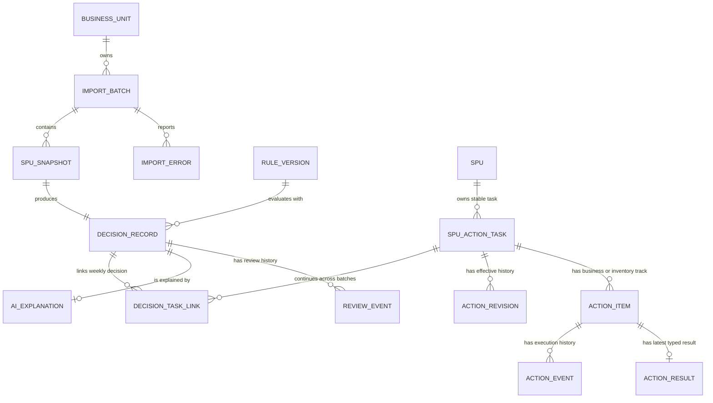

职责边界：

- `DECISION_RECORD` 表示一条 SPU 在一个批次内的不可变固定规则建议，不直接作为跨周执行任务身份。
- `SPU_ACTION_TASK` 是同一事业部与 SPU 下跨批次续接的稳定任务；`DECISION_TASK_LINK` 把每周决策关联到当时任务和动作版本，并保存本周关联时间及最近前序关联指针。
- `ACTION_REVISION` 追加保存经营/库存动作的变化、来源批次与确认结果；任务只有一个当前生效版本。
- `ACTION_ITEM` 表示稳定任务下分别跟踪的动作轨。最多包含一个经营主动作项和一个补货/禁补协同动作项；两者都归责任运营且不能独立审核。
- 清仓/止损及其禁补动作项在同一规则决策事务中原子生成，共享 `decision_id/rule_version/key_input_snapshot`；建议批准时两者同时激活，驳回时两者均不进入执行。
- `AI_EXPLANATION` 与规则和审核分离；其失败不改变 `DECISION_RECORD/ACTION_ITEM`。
- `REVIEW_EVENT`、`ACTION_EVENT` 追加保存；当前状态由受版本保护的建议/动作状态承载。
- `ACTION_RESULT` 与原始指标分离，按动作类型和角色保存人工回填结果。

### 4.3 Schema 草案

#### ImportBatch

| 字段 | 含义与大致类型 | 约束 |
|---|---|---|
| `batch_id` | 全局唯一字符串 | 不可复用 |
| `batch_fingerprint` | 事业部、期间、业务截止日、源内容摘要形成的稳定指纹 | 唯一；命中只返回原批次 |
| `business_unit_id` | 事业部标识 | V0 试点为玩具事业部 |
| `business_date` | 数据批次业务截止日 | 建立后冻结；当前按 Asia/Shanghai 的实现假设解释 |
| `period_start/period_end` | 自然日期 | 月度指标期间；首批为 2026-06-01～2026-06-30 |
| `source_file_digest/source_name` | 内容摘要/显示名 | 摘要用于指纹；显示名不含本地绝对路径 |
| `supersedes_batch_id/correction_reason` | 可选前序批次/修正原因 | 仅不同指纹的修正输入使用；不得覆盖前序批次 |
| `batch_status` | 接收、校验、规则处理、清单就绪、失败 | AI 状态不控制清单是否可审核 |
| `valid_row_count/rejected_row_count` | 非负整数 | 与行级错误勾稽；不以 10—20 作硬校验 |
| `created_at/created_by` | 时间点/内部账号标识 | 审计字段 |

#### SpuSnapshot 与 ImportError

| 字段 | 含义与大致类型 | 约束 |
|---|---|---|
| `batch_id + spu_id` | 批次内复合唯一键 | SPU ID 重复的源行均拒绝 |
| `spu_name/store/platform/operator_ref` | 文本/内部责任标识 | 身份必需；缺失时记录 ImportError 并拒绝行 |
| `launch_date` | 自然日期，可空 | 无效时保留原值与字段质量标记，不整行删除 |
| `net_sales_prev_month` | 金额，可空 | 扣除退款后，绑定期间 |
| `sales_units_prev_month/order_count_prev_month` | 非负数值，可空 | 展示依据，不替代净销售额分类 |
| `operating_profit_rate/value` | 比率/金额，可空 | 采用表内经营准利润率/值，保留源值 |
| `promotion_expense` | 金额，可空 | 仅 SPU 汇总粒度 |
| `quality_return_count_7d/sold_units_7d/rate_7d` | 非负整数/比率，可空 | 周期和分母有效才可用 |
| `quality_period_start/end/verified` | 日期/布尔 | 防止未知周期值进入规则 |
| `warehouse_qty/in_transit_qty/sales_units_14d` | 非负数值，可空 | 齐全且 14 日均销大于 0 才计算可售天数 |
| `inventory_as_of_date/sales14_end_date` | 自然日期，可空 | 说明库存截点与销量窗口 |
| `raw_row_ref/raw_value_snapshot` | 源表位置/原始值快照 | 支持可观察错误和追溯 |
| `data_quality_flags` | 受控标记列表 | 缺字段、日期错位、周期未校验等 |
| `ImportError.field/error_code/message` | 字段、受控错误码、可读原因 | 页面可显示且能定位修正，不含敏感源数据 |

#### RuleVersion 与 DecisionRecord

| 字段 | 含义与大致类型 | 约束 |
|---|---|---|
| `rule_version/effective_from` | 不可变版本/生效业务日 | 历史决策不使用当前版本覆盖 |
| `decision_id` | 全局唯一字符串 | 关联批次和 SPU |
| `batch_id + spu_id` | 决策业务唯一键 | 同一批次的同一 SPU 只允许一条 DecisionRecord；重试返回既有决策 |
| `category/main_action/replenishment_action` | 商品类型、唯一主动作、补货结论 | 固定规则只读结果 |
| `inventory_days` | 非负数值，可空 | 仅输入完整且均销大于 0 时存在 |
| `triggered_rule_refs/key_input_snapshot` | 规则引用/结构化关键值 | 保存实际值、周期、阈值和有效性 |
| `review_state` | 待审核、已通过、已驳回 | 建议级唯一审核状态 |
| `review_version` | 单调递增版本或等价前置状态标识 | 审核提交必须匹配当前值 |
| `reviewed_by/reviewed_at/review_note` | 内部账号、时间、备注 | 驳回也完整保留 |
| `decision_created_at` | 时间点 | 与批次和规则版本共同重放 |

#### SpuActionTask、DecisionTaskLink 与 ActionRevision

| 字段 | 含义与大致类型 | 约束 |
|---|---|---|
| `task_id` | 稳定经营待办 ID | 同一事业部与 SPU/商品链接下跨周续接，不因相同动作的新批次重建 |
| `business_unit_id + spu_id` | 待办锚点 | 业务范围内稳定定位同一 SPU；不得用商品名称模糊匹配 |
| `task_created_at` | 待办首次产生时间 | 只在首次建任时写入；后续周度关联不得覆盖 |
| `current_business_state` | 当前经营状态 | 待审核、变更待确认、待执行、已执行、待记录结果、已记录结果、已关闭等受控状态 |
| `business_executed_at` | 经营动作执行时间，可空 | 仅经营动作成功进入已执行时写入；未执行明确为空，不得用更新时间替代 |
| `DecisionTaskLink.linked_at` | 本周决策关联时间 | 每个批次关联稳定任务时追加，区别于任务首次产生时间 |
| `DecisionTaskLink.previous_link_id` | 最近前序待办记录指针，可空 | 只指向同一事业部、同一 SPU 且业务时间早于当前记录的最近一条关联；通过该关联读取前序 `DecisionRecord`、`SpuSnapshot` 与当时动作/状态事件的不可变投影；首次建任为空 |
| `ActionRevision.created_at/effective_at` | 动作版本产生/生效时间 | 动作变化只追加版本；确认前后时间分别保留 |

#### ActionItem、ActionResult、事件与 AIExplanation

| 实体/字段 | 含义与大致类型 | 约束 |
|---|---|---|
| `ActionItem.action_type/value` | 经营主动作或补货动作/具体动作值 | 来自 DecisionRecord，不允许 AI 或执行人改写 |
| `ActionItem.decision_id + action_slot` | 动作业务唯一键；action_slot 为经营动作或库存动作 | 同一建议的每个动作槽位最多一个 ActionItem；重试不得重复创建 |
| `ActionItem.owner_role` | 运营 | 经营动作和补货/禁补协同动作均归该 SPU 责任运营；外部相关人员不是产品角色 |
| `ActionItem.execution_state` | 待审核激活、待执行、已执行、已记录结果、随建议驳关闭 | 不含独立通过/驳回 |
| `ActionItem.execution_version` | 单调版本或等价前置状态标识 | 每次执行/结果提交校验；冲突不落状态 |
| `ActionResult.result_status` | 结果受控状态 | 与动作类型匹配 |
| `ActionResult.recorded_by/at/note` | 记录人、时间、备注 | 责任运营回填经营动作及经核验的外部协同结果 |
| `ActionResult.observation_period` | 结果观察起止日，可空 | 有经营结果时说明观察窗口 |
| `ActionResult.sales/profit/inventory_result` | 可选结构化结果或明确“未提供” | 仅运营权限可写/读完整经营结果；不强迫缺数时伪造 |
| `ActionResult.coordination_result` | 补货完成或禁补已知悉/已停补状态及备注 | 责任运营核验后写入；OA 发送成功不得自动转成业务完成 |
| `ClearanceCompletion.submitted_at/completed_at` | 运营提交时间、实际清仓完成时间 | 实际完成时间由责任运营填报；跨周续接不得重置 |
| `ClearanceCompletion.confirmed_by/at` | 主管确认人、确认时间，可空 | 为空时不闭环；主管确认后停止每日 OA 催办 |
| `OANotification.business_date/status` | 催办业务日期、发送状态 | 同一任务、同一自然日、同一接收人最多一条；发送失败保留人工补发入口 |
| `ReviewEvent/ActionEvent.event_type` | 审核、驳回、激活、执行、结果、冲突等 | 成功变更追加；失败冲突可记录技术审计但不改业务状态 |
| `event.actor_ref/occurred_at/from_version/to_version/note` | 操作者、时间、版本、备注 | 支持并发和审计 |
| `AIExplanation.status` | 待生成、生成中、已生成、生成失败 | 不控制批次或审核状态 |
| `AIExplanation.problem/evidence/action_text` | 文本 | 仅解释已固化结论，不得新增事实 |
| `AIExplanation.model_request_ref` | 非敏感调用追踪标识 | 不保存系统级部署密钥 |

### 4.4 一致性、幂等与并发

#### 强一致边界

1. 同一批次的规范化指标、质量标记、业务截止日和规则版本。
2. 同一 `DECISION_RECORD` 的分类、主动作、补货结论、规则引用和关键值。
3. 同一 SPU 新批次决策与稳定任务的续接、动作比较、版本追加和批次关联。
4. 清仓/止损与对应禁补动作轨的原子生成、续接或变更。
5. 建议级审核状态与全部动作项是否激活。
6. 每次成功状态迁移与对应操作者、时间、版本和事件。

批次指纹命中时不得创建第二批次/清单。不同指纹的新数据或修正数据创建独立批次，历史不覆盖。行动清单是 `batch_id` 下 `DECISION_RECORD` 与当时 `SPU_ACTION_TASK/ACTION_REVISION` 关联的唯一投影；若物理实现使用 list_id，必须对 batch_id 保持一对一约束。同一 SPU 同动作只续接稳定任务，不因新 batch_id 重建待办；当前周关联需指向最近前序经营待办记录并保留任务产生、关联、状态与执行时间（F05、F08；REQ-F05-01、REQ-F05-04～REQ-F05-05、REQ-F08-01～REQ-F08-02；NFR-005）。

#### 可最终一致边界

- LiteLLM 解释、清单只读筛选索引和统计视图可最终一致。
- AI 等待或失败不改变清单就绪、审核和执行状态。
- AI 重试绑定既有 decision_id，仅更新解释状态，不产生新决策或动作。

#### 并发约束

审核、执行和结果提交必须携带用户读取时的 `review_version/execution_version` 或等价前置状态。若与当前版本不一致：

1. 该提交不改变任何业务状态；
2. 用户收到“状态已变化”的可观察冲突结果；
3. 返回最新状态、最新操作者和刷新入口；
4. 不新增重复的成功审核/执行/结果事件。

该约束不规定数据库锁实现；version 字段或等价乐观并发控制均可。

### 4.5 时区、编码、PII 与 AI 数据边界

- 业务日期当前按 **Asia/Shanghai 实现假设**解释；业务截止日、自然月、7 日/14 日窗口和两自然月边界保持同一时区。
- 事件保存绝对时间点，展示和导出时转换到业务时区并显式标注。
- 文本和标识使用 UTF-8；SPU ID 作为字符串，避免前导零丢失。
- 已确认 V0 数据不含消费者个人信息；不得引入姓名、手机号、地址或评价者身份等消费者 PII。
- 系统账号和责任运营标识按内部身份最小可见保存，不是 LiteLLM 解释所需字段。
- LiteLLM 只接收 SPU 展示身份、校验后的指标/周期、固定动作、阈值和必要质量标记；不发送部署密钥、账号凭据、内部人员标识、操作日志或原始整表。
- 日志、导出和错误响应不得记录系统级部署密钥；普通用户没有密钥管理入口。
- 保留年限未确认，不虚构期限；至少保证试点期间的批次、决策、动作和事件不被新批次覆盖。

### 4.6 表头合计与原始值策略

现有文件第 1 行合计与 10 条明细不一致。F01 忽略源表合计，只基于有效 SPU 明细重新汇总；错误合计不得分摊或参与决策。表内经营准利润率虽为静态值但已复算一致，系统保留其源值、期间和质量状态；错误表头“上一周”不得进入业务口径（REQ-F01-02、REQ-F02-01、REQ-F08-01）。

---

### 4.7 F09 增量数据清单

现有经营数据清单保持不变，追加：

| 优先级 | 数据 | 粒度 | 来源 | 缺失时行为 | 对应需求 |
|---|---|---|---|---|---|
| 授权必需 | 身份提供方、企业作用域、稳定用户标识 | 作用域身份 | 钉钉认证链路 | 稳定键不可得时不登记、不授权 | REQ-F09-04～05；AC-F09-07～12 |
| 授权必需 | 至少两个可靠组织属性及来源、取得时间 | 作用域身份 | 钉钉最小用户详情权限，或含稳定钉钉标识的组织认可证据 | 不足、冲突、来源不明或跨作用域时拒绝授权 | REQ-F09-05；AC-F09-09～12；NFR-009 |
| 审批必需 | 审批人、外部证据所载审批时间、目标人员/角色、证据类型/引用、核验结果 | 每次角色操作 | 外部审批，由 Admin 核验录入 | 任一缺失或证据不认可时拒绝 | REQ-F09-05；AC-F09-09～12 |
| 管理认证必需 | 唯一 Admin、密码摘要、加密 TOTP 材料/密钥版本、单枚恢复码摘要、凭据代次 | 唯一 Admin | setup/恢复 | 不创建或恢复管理身份 | REQ-F09-01～03；AC-F09-01～06；NFR-006～07 |
| 会话必需 | Admin 会话令牌摘要、凭据代次、创建/活动/到期/撤销时间 | Admin 会话 | 产品系统 | 代次过旧或失效即拒绝 | REQ-F09-02～03；NFR-006、009 |
| 生命周期必需 | 当前五态、首次/最近认证、状态变化、映射版本 | 作用域身份 | 产品系统 | 不重复建单；冲突不创建业务会话 | REQ-F09-04～05；AC-F09-07～12 |
| 安全必需 | setup/recovery 控制材料的环境、版本/指纹、签发、到期、消费 | 每次部署控制口令 | 原始值由目标环境运维配置；产品保存校验材料/状态 | 无效时拒绝且不泄露精确原因 | REQ-F09-01、03；NFR-007、010 |
| 审计必需 | 事件类型、结果、目标、前后摘要、操作者、绝对时间、关联 ID | 每次管理安全或授权动作 | 产品系统 | 审计失败时对应高权限事务失败 | REQ-F09-06；AC-F09-13～14；NFR-008 |
| 通知必需 | 部署恢复通知任务、接收岗位、状态、重试和补偿证据引用 | 每次部署恢复 | outbox + 外部通道/线下工单 | 不静默；投递失败不伪装成功 | REQ-F09-03、06；AC-F09-05～06、14 |
| 度量必需 | 首次启用过程、授权周期、固定里程碑和关联 ID | 启用过程/授权周期 | 服务端事件 | 缺节点则该段周期“无法形成”，不填 0 | REQ-F09-07；AC-F09-15 |
| 上线配置 | 责任岗位、有效联系方式、证据目录、通知主通道和补偿路径 | 环境级 | 公司责任人/运维 | 必要项缺失时阻止对应启用层级 | REQ-F09-04、06；NFR-010 |

审批时间是 Admin 从外部证据录入的事实，不表示产品自动感知外部审批进度；产品不持久化“已审批待配置”。为避免把提交时间冒充材料可用时间，指标使用两类明确事件：`approval_evidence_approved_at`（外部证据所载）与 `configuration_started_at`（Admin 确认材料已具备并开始本次配置的服务端事件）。

### 4.8 增量实体关系

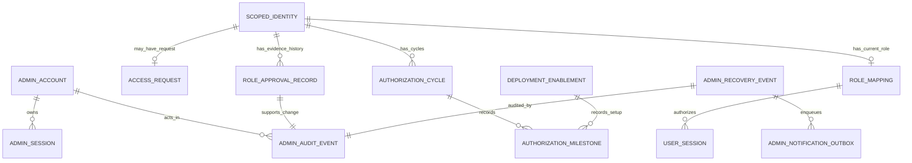

关系边界：

- `SCOPED_IDENTITY` 可由无角色认证建立，也可从既有角色映射只读投影建立；已有授权身份不需要补造待处理申请。
- `ACCESS_REQUEST` 是可选触发记录，不是每个身份必有实体；无角色 OAuth 才建立/更新它。
- 上线前已有有效映射直接投影为已授权，已有停用映射投影为已停用；迁移不重建身份、不补造审批历史、不撤销有效会话。
- `ROLE_MAPPING` 是业务鉴权事实源；五态只是当前事实投影，不能代替映射或会话版本鉴权。
- `AUTHORIZATION_CYCLE` 支持同一身份的首次授权、变更、停用和恢复多次周期；永久 `first_seen_at` 不替代周期事件。
- `DEPLOYMENT_ENABLEMENT` 承载初始化开始、Admin 创建和首次正式登录，可在待处理申请产生前存在。
- 不建立“已审批待配置”持久态；审批记录只在角色事务中写入。
- 管理审计与既有经营事件分域，不把 Admin 安全事件伪装成经营任务事件。

### 4.9 Schema 草案

#### AdminAccount、AdminSession 与 DeploymentControlCredential

| 实体/字段 | 含义 | 约束 |
|---|---|---|
| `AdminAccount.admin_id` | 唯一管理账号 | 数据库单例约束 |
| `username/password_digest` | 登录名/密码摘要 | 不保存原密码 |
| `totp_ciphertext/totp_key_version` | 加密 TOTP 材料/保护密钥版本 | 不进入日志、审计、前端包 |
| `recovery_code_digest` | 单枚保存型恢复码摘要 | 单次使用；重绑后生成一枚新码 |
| `credential_generation` | 凭据代次 | 密码/TOTP/持有人变化时递增 |
| `holder_ref/holder_changed_at` | 当前持有人责任引用/交接时间 | 不代表第二 Admin |
| `AdminSession.token_digest` | 随机会话令牌摘要 | 与业务令牌秘密不同 |
| `credential_generation` | 会话签发代次 | 与当前代次不一致即拒绝 |
| `created_at/last_seen_at/absolute_expires_at/revoked_at` | 会话生命周期 | 恢复/交接后旧会话撤销 |
| `DeploymentControlCredential.purpose` | setup 或 admin_recovery | 两者不可混用 |
| `environment_ref/version/fingerprint` | 环境、配置版本、非秘密指纹 | 防跨环境/旧版本复用 |
| `verifier_digest` | 原始口令校验材料 | 原值只在目标部署配置和当次输入出现 |
| `issued_at/expires_at/consumed_at` | 签发、到期、消费 | 单次消费 |
| `request_id/result_ref` | 幂等请求和结果引用 | 结果未知时查询，不重复执行 |

具体秘密载体和变量名由技术设计确定；开发与线上必须使用物理独立配置源、秘密和运维入口。

#### ScopedIdentity、AccessRequest 与 RoleMapping

| 实体/字段 | 含义 | 约束 |
|---|---|---|
| `provider/tenant_ref/actor_ref` | 作用域身份复合键 | 唯一；普通日志和导出遮罩 |
| `display_attributes` | 姓名、部门、员工编号等 | 每项带来源、取得时间、可靠性 |
| `AccessRequest.first_seen_at/last_seen_at` | 首次/最近无角色认证 | 重复 OAuth upsert，不重复建单 |
| `status/status_version/status_changed_at` | 五态、版本、状态变化时间 | `last_seen_at` 不覆盖状态变化时间 |
| `RoleMapping.business_role` | operations 或 supervisor | 最多一个有效角色 |
| `active/version/effective_at/disabled_at` | 当前授权状态、版本和时间 | 每次角色操作递增版本 |
| `current_approval_record_id` | 当前角色依据 | 指向本次事务审批记录 |

已有授权/停用身份的发现入口应查询 `SCOPED_IDENTITY + ROLE_MAPPING` 的当前投影，不依赖待处理列表；它只支持定位单个身份进入统一详情，不扩展为组织目录、批量授权或权限中心。

#### RoleApprovalRecord、AuthorizationCycle 与里程碑

| 实体/字段 | 含义 | 约束 |
|---|---|---|
| `RoleApprovalRecord.operation` | 新增、变更、停用、恢复 | 每次追加，不覆盖历史 |
| `approver_ref/approved_at/target_role` | 审批人、外部证据时间、目标角色 | Admin 不是审批人 |
| `evidence_type/evidence_ref` | 证据类型/引用 | 首版不存附件、不调 OA API |
| `identity_verification_snapshot` | 授权时属性、来源和核验摘要 | 不只保存姓名 |
| `AuthorizationCycle.cycle_id/type` | 授权操作周期及类型 | 首次授权、变更、停用、恢复各自关联；只有首次授权、变更、恢复进入“完整授权周期”指标 |
| `scoped_identity_ref/correlation_id` | 周期目标/跨实体关联 | 关联审批、映射、会话、状态和审计 |
| `started_at/completed_at/outcome` | 周期起止与结果 | 缺里程碑时不伪造完成周期 |
| `DeploymentEnablement.enablement_id` | 环境级首次启用过程 | 关联目标环境和目标首位身份，可早于申请 |
| `AuthorizationMilestone.event_type/occurred_at` | 固定事件类型/服务端绝对时间 | 只追加；客户端时间不覆盖 |

固定七个最小里程碑：

1. 初始化开始；
2. Admin 创建成功；
3. Admin 首次正式登录；
4. 待处理身份首次产生；
5. 有效审批材料可用——采用 `configuration_started_at` 作为系统可知事件，同时保留外部证据 `approved_at`；
6. 角色配置成功；
7. 首次以正确角色业务会话访问对应工作台。

重复认证另记 `last_seen_at`，不覆盖首次申请或周期起点。进入工作台只认服务端已验证的正确角色业务会话，不认跳转、缓存、预加载或错误页。

#### AdminAuditEvent、AdminRecoveryEvent 与 NotificationOutbox

| 实体/字段 | 含义 | 约束 |
|---|---|---|
| `AdminAuditEvent.event_id/event_type/result` | 管理事件、类型、结果 | 只追加；Admin 不可修改/删除 |
| `actor_ref/target_ref/before_after_summary/occurred_at` | 操作者、目标、前后摘要、时间 | 秘密遮罩 |
| `correlation_id` | 关联 setup、恢复、周期、会话撤销 | 每次成功领域变化可勾稽唯一审计 |
| `AdminRecoveryEvent.credential_committed_at` | 凭据恢复事务完成 | 与外部通知闭环分离 |
| `notification_disposition` | `pending_delivery` 待投递、`delivered` 已投递、`failed_pending_compensation` 失败待补偿、`compensated_closed` 补偿已闭环 | 不能反向改变已提交凭据；投递闭环与补偿闭环保留不同原始状态 |
| `NotificationOutbox.notification_id/recovery_event_id` | 通知任务/恢复事件 | 每次部署恢复至少一条 |
| `recipient_role/channel_ref` | 接收岗位/通道引用 | 通道尚待公司配置，不虚构已具备 |
| `status/attempt_count/next_attempt_at` | 投递状态与重试 | 最终一致；失败告警 |
| `compensation_evidence_ref` | 认可补偿证据 | 仅主通道失败时使用 |

### 4.10 一致性、幂等与并发

强一致事务：

1. **初始化事务**：唯一 Admin、setup 口令消费、初始化审计同时成功。正式登录是提交后的验收，不是创建前置。若事务前展示的恢复码最终未提交，必须作废；事务成功但响应丢失时按幂等结果进入登录，不重新展示旧码。
2. **保存型恢复事务**：用户名/密码/恢复码先校验；新 TOTP 实码通过且新恢复码已生成并确认保存后，旧恢复码消费、TOTP/恢复码替换、凭据代次递增、全部旧 Admin 会话撤销和审计同时成功或全部失败。
3. **部署恢复事务**：新密码/TOTP/恢复码、凭据代次、旧 Admin 会话撤销、恢复口令消费、审计和通知 outbox 入队同时成功；外部投递失败不回滚。
4. **角色操作事务**：身份/审批校验、映射变化、审批记录、角色版本递增、旧业务会话撤销、五态投影和审计同时成功。

并发与幂等：

- setup 依靠数据库单例约束和事务，不只做应用层计数。
- 无角色回调按作用域身份键 upsert；已有授权/停用/冲突事实不得被普通 upsert 覆盖为待处理。
- setup、恢复和角色写操作携带幂等请求标识；结果未知先查既有结果。
- 两个角色写操作基于同一旧版本时最多一个成功。
- 业务会话创建前再次读取当前 `RoleMapping.version`，并把该版本绑定到会话；所有业务 API 校验会话版本与当前映射一致。角色操作递增映射版本，因此 OAuth 回调即使先读到旧角色，晚到会话也不能进入工作台。
- Admin 与业务路由只读各自 Cookie；同时存在时禁止 fallback、Principal 转换或共享秘密。

可最终一致部分只有：通知外部投递、列表检索索引和只读统计投影。任何权限、凭据代次、会话撤销和审计事实不得最终一致。

### 4.11 指标取数与可信分母

| 指标 | 可取事实 | 可信口径 |
|---|---|---|
| 首次初始化授权闭环 | 同一 `DeploymentEnablement` 的里程碑 1→7 | §0 全部门禁满足后才有效；缺节点为“无法形成周期” |
| 日常产品内配置时间 | `configuration_started_at → role_configured_at` | 表示 Admin 确认材料具备后的产品内处理，不冒充外部审批完成时间 |
| 完整授权周期 | 首次授权：`request_created_at → first_correct_workbench_at`；变更/恢复：`configuration_started_at → first_correct_workbench_at` | 包含对应周期等待；停用不纳入该指标，停用周期止于停用事务成功 |
| 无角色闭环完成率 | 固定观察窗内首次授权周期 | 分母为窗口内新周期，分子为截止前已授权；待处理/冲突/停用作为未完成原因 |
| 重复待处理记录 | 作用域身份复合键和当前请求唯一约束 | 同一身份当前生命周期最多一条 |
| 角色/恢复后旧会话可用数 | 会话撤销时间、角色/凭据代次和请求结果 | 旧版本会话必须为 0 |
| 高权限审计覆盖 | 领域事实的 `correlation_id` 与审计事件勾稽 | 成功变更按 1:1 勾稽；登录拒绝等无领域变更事件按事件类型契约核对，不能只查审计表自证 100% |
| 错误业务授权 | 系统约束拒绝 + 经治理确认的错授事件 | 双角色/作用域等可系统判定；错人/错角色需外部安全/价值台账关联原周期与纠正事件，不能用“数据库无异常”自动证明 |

可归因利润影响由价值台账岗位在产品外人工勾稽授权周期与既有经营/财务证据；F09 只提供稳定周期、审批、配置和工作台访问引用，不新增价值分析后台。

### 4.12 时区、编码、PII 与保留

- 事件保存绝对时间点，按既有 `Asia/Shanghai` 实现假设展示；外部审批时间保留来源偏移或规范化说明。
- 文本/标识使用 UTF-8；外部身份标识按字符串处理，不猜测大小写或数字化。
- `actor_ref`、姓名、部门、员工编号、审批人、Admin 持有人和联系方式是内部身份数据；最小权限读取，日志/导出遮罩，不发送 LiteLLM。
- 密码、恢复码和部署口令只存摘要；TOTP 加密且带密钥版本；会话只存令牌摘要。
- 审计不记录秘密，但保留谁在何时对哪个作用域身份执行何种操作的事实。
- 审计留存/归档/清理期限待治理责任人确认；未定前只追加并监控，不自动删除，也不以三年价值周期倒推。

---

## 5. 详细功能说明

### 5.1 通用约定

- 唯一决策粒度为 SPU/商品链接；首版不读取、拆分或生成 SKU 级结论。
- 数据支持部门每周一提供经营表；每个导入批次对应一份行动清单，周内只更新审核、分动作执行和结果记录。
- 商品分类销售额与经营准利润率使用批次声明的上一个完整自然月；首批样本期间为 `2026-06-01—2026-06-30`。
- 新品年龄以不可变的“数据批次业务截止日”为基准；业务截止日早于上架日期加 2 个自然月时为新品，达到边界即转入非新品规则。
- `Asia/Shanghai` 仅作为业务日期与展示日期的实现假设，不作为已由用户确认的产品事实；设计与实施阶段必须保留假设标识并核对。
- 固定规则决定商品类型、主动作和补货/禁补结论；AI 只解释、提供排序说明和非覆盖性优化提示。
- 错误按依赖字段降级：只有必要身份字段缺失或 SPU ID 重复时拒绝该行；日期、销售、利润、品退或库存错误只停止依赖该字段的判断。
- 建议整体由运营主管审核；审核通过后，经营动作与补货/禁补动作分别进入对应角色的执行记录。
- 状态更新携带当前 `version`；版本过期的提交不覆盖现状，返回冲突和最新状态。

### FR-1（F01）

**功能名称**：数据导入与校验  
**实现用户故事**：US-F01-01  
**对应需求**：REQ-F01-01、REQ-F01-02

**位置**：内部工具“数据导入”页及同一批次的“校验结果”区。

**界面元素与展示规则**：

| 元素 | 类型 | 默认态 | 操作后 | 禁用条件 |
|---|---|---|---|---|
| 事业部 | 单选字段 | 玩具事业部 | 固化到批次摘要 | 导入开始后不可修改 |
| 数据期间 | 起止日期 | 未选择 | 显示实际起止日与“上一个完整自然月”口径 | 起止日期非法、结束日早于开始日或未明确期间 |
| 业务截止日 | 日期字段 | 未选择 | 固化为新品年龄基准日 | 非法日期或早于数据期间结束日 |
| XLSX 文件 | 文件选择 | 未选择 | 显示文件名与校验状态 | 文件不可读取、不是 XLSX 或其他必填项缺失 |
| 导入按钮 | 主按钮 | 禁用 | 进入校验；校验完成后自动处理可判定 SPU | 正在导入或当前角色无导入权限 |
| 批次摘要 | 信息卡 | 不显示 | 显示批次 ID、事业部、期间、业务截止日、文件名、提交人和时间 | 无 |
| 校验结果 | 汇总卡+明细表 | 不显示 | 显示有效行、拒绝行、字段级降级、警告及每项问题的行号/字段/原因 | 校验未完成 |
| 试点规模提示 | 信息提示 | 不显示 | 10—20 个 SPU 时显示“符合首轮验收规模”，其他数量仅提示“不属于首轮验收规模” | 无 |

**交互逻辑**：

1. 运营选择玩具事业部、数据期间、业务截止日和 XLSX 文件后提交。
2. 系统识别 SPU 明细，忽略源表合计行；汇总只使用通过身份校验的明细，不把第 1 行合计作为经营结果。
3. 必要身份字段为 SPU ID、链接名称、店铺、平台和责任运营。任一缺失，或 SPU ID 重复时，拒绝该行并显示行号、字段和原因。
4. 上架日期、净销售额、经营准利润率、品退或库存字段缺失/非法时保留该 SPU 身份快照，记录字段级异常，并只停止依赖该字段的计算。
5. 品退周期不能证明为最近 7 天时标记“品退数据未校验”；库存、在途或最近 14 天销量缺失时标记“库存数据不足”。
6. 校验完成后自动对可判定 SPU 进入指标与固定规则处理；无需用户再触发第二次“生成清单”。
7. 批次指纹由事业部、数据期间、业务截止日和文件内容共同确定。指纹命中时直接返回原批次和原清单，不创建新业务批次、不新增建议。
8. 指纹不同的数据可形成新批次；新批次不得覆盖任何历史批次、建议或状态记录。

**异常场景**：

- 文件损坏、加密、不可读取或无法识别明细结构：批次显示导入失败，不生成清单，并显示文件级原因。
- 必需列缺失或表头无法唯一映射：显示字段级错误；受影响字段不可用，其他可识别字段不被默认值覆盖。
- SPU ID 缺失或重复：拒绝对应行；所有冲突行均显示原始位置。
- 链接名称、店铺、平台或责任运营缺失：拒绝对应行，避免建议对象或执行责任不完整。
- 上架日期错误：该行保留，但不分类、不生成经营动作；不得猜测默认日期。
- 销售或利润字段错误：该字段相关判断停止；其他不依赖该字段的判断继续。
- 源表合计与明细不一致：显示警告并忽略合计。
- 相同指纹被重复点击、多窗口或网络重试提交：所有请求返回同一批次，不产生第二份清单。
- 网络中断：未完成处理不显示为成功；重试按批次指纹返回原处理状态。
- 无权限用户直接访问：不显示文件内容和批次数据，返回权限不足。

**明确边界**：

- 10—20 个 SPU 是试点验收规模，不是上传或运行硬限制；其他数量不因规模本身被判为文件错误。
- 首版导入载体为数据支持部门提供的 XLSX；不增加 CSV、在线表格、错误文件下载、导出或外部系统同步承诺。
- 同一批次只有一份行动清单；相同指纹只返回原批次和原清单。
- 首批样本按 `2026-06-01—2026-06-30` 展示，不继承源表“上一周”错误表头。

### FR-2（F02）

**功能名称**：SPU 经营指标计算  
**实现用户故事**：US-F02-01  
**对应需求**：REQ-F02-01、REQ-F02-02、REQ-F02-03

**位置**：批次“指标结果”步骤及建议详情的关键依据区。

**界面元素与展示规则**：

| 元素 | 类型 | 默认态 | 操作后 | 禁用条件 |
|---|---|---|---|---|
| SPU 身份 | 只读信息 | 来自有效身份行 | 显示 ID、名称、店铺、平台、责任运营 | 身份行已被拒绝时不生成详情 |
| 业务截止日 | 只读日期 | 来自批次 | 显示新品判断基准日及实现时区假设 | 无 |
| 上架日期/新品状态 | 只读信息+状态 | 待计算 | 显示日期、新品/非新品或日期异常 | 日期异常时不输出新品状态 |
| 上月净销售额 | 金额+期间 | 待计算 | 显示源值、采用值和上一个完整自然月期间 | 缺失/非法时显示待补数 |
| 经营准利润率 | 百分比+来源 | 待计算 | 显示表内经营准利润率 | 缺失/非法时显示待补数 |
| 品退率 | 百分比+口径状态 | 未校验 | 数据充分时显示最近 7 天值；否则显示未校验原因 | 分母为 0、周期或分子分母无效时不计算 |
| 库存可售天数 | 数值+状态 | 未计算 | 数据充分时显示值；否则显示库存不足/无近期销售 | 库存字段不全或近 14 天日均销量为 0 |
| 字段级降级 | 警告列表 | 无 | 显示每个未参与判断的字段及原因 | 无 |

**交互逻辑**：

1. 系统读取批次声明的上一个完整自然月净销售额和源表经营准利润率，不按早先自定义利润公式重算。
2. 以批次业务截止日比较上架日期：截止日早于“上架日期+2 个自然月”为新品，达到该边界即为非新品。
3. 非新品使用上一个完整自然月净销售额分为大爆款、小爆款或淘汰商品；新品分类不依赖净销售额。
4. 仅在数据能证明为最近 7 天时，按“品退件数÷已销售件数”计算品退率。
5. 仓内库存、在途库存和最近 14 天销量均有效时，计算 `(仓内库存+在途库存)÷(最近14天销量/14)`。
6. 每个指标保留原始值、采用值、周期、数据状态和降级原因，供规则、清单和追溯一致使用。

**异常场景**：

- 上架日期晚于业务截止日或不可解析：日期字段异常；不分类，不影响身份行保留。
- 新品净销售额缺失：仍可凭上架日期确定新品；利润率有效时继续新品动作规则。
- 非新品净销售额缺失/非法：无法按销售额分类，不生成依赖分类的动作。
- 经营准利润率缺失/单位不清：不生成依赖利润的动作；不得把 `15` 猜成 `15%` 或 `1500%`。
- 最近 7 天已销售件数为 0：不除以 0，显示“无可计算销量”，不触发品退观察。
- 品退件数、周期或分母非法：标记品退未校验，不阻断利润清仓/止损。
- 库存、在途或近 14 天销量为负/缺失：不计算可售天数，不影响禁补结论。
- 近 14 天平均日销量为 0：显示“无近期销售”，不生成补货建议。
- 处理重试：使用同一批次业务截止日、期间和原始字段，不因实际重试时间改变结果。

**明确边界**：

- 新品为上架未满 2 个自然月；达到 2 个自然月边界即为非新品。
- 大爆款：非新品且净销售额 `≥100,000 元`；小爆款：`≥20,000 且<100,000 元`；淘汰商品：`<20,000 元`。
- 品退率比较阈值为 `1.5%`，只有最近 7 天口径可信时参与规则。
- 库存可售天数 `<30` 与 `≥30` 分别进入补货和不补货分支。
- 当前样本缺少仓内库存、在途和最近 14 天销量，因此样本试跑不产生自动补货建议。

### FR-3（F03）

**功能名称**：固定规则决策  
**实现用户故事**：US-F03-01  
**对应需求**：REQ-F03-01、REQ-F03-02、REQ-F03-03

**位置**：批次“规则判定”步骤及建议详情“规则结论”区。

**界面元素与展示规则**：

| 元素 | 类型 | 默认态 | 操作后 | 禁用条件 |
|---|---|---|---|---|
| 商品类型 | 状态标 | 待判定 | 新品/大爆款/小爆款/淘汰商品/数据异常 | 分类依赖缺失时不显示推测类型 |
| 主动作 | 强状态标 | 待判定 | 清仓/止损/观察/加投/维持/无法判定 | 动作依赖不完整时只显示降级原因 |
| 补货结论 | 次状态标 | 待判定 | 补货/不补货/禁止补货/不生成 | 新品或库存数据不足时不生成补货判断 |
| 动作组合 | 只读信息 | 未生成 | 显示主动作及可并存的补货/禁补动作 | 无规则结论时不显示 |
| 触发规则 | 规则卡 | 未生成 | 显示规则版本、关键值、阈值、比较关系 | 无 |
| 数据限制 | 警告标 | 无 | 显示未参与规则的字段及原因 | 无 |

**交互逻辑**：

1. 同一批次输入、业务截止日、数据期间和规则版本必须得到相同分类、主动作和补货结论。
2. 系统先判新品，再对非新品按销售额分类；仅使用某分支实际依赖的字段。
3. 主动作按 `清仓>止损>观察>加投>维持` 唯一化。
4. 大爆款：利润率 `<0%` 清仓；`0%≤利润率<5%` 止损；品退率 `>1.5%` 观察；利润率 `≥10%` 且品退率 `≤1.5%` 加投；其他维持。
5. 小爆款：利润率 `<5%` 清仓；`5%≤利润率<10%` 止损；品退率 `>1.5%` 观察；利润率 `≥15%` 且品退率 `≤1.5%` 加投；其他维持。
6. 新品：利润率 `≥-20%` 加投，利润率 `<-20%` 观察；首版不生成补货建议。
7. 淘汰商品固定输出清仓。
8. 主动作一旦为止损或清仓，系统在同一次规则提交中原子生成“禁止补货”动作；不得出现主动作已保存而禁补未生成的中间结果。
9. 对其他非新品，库存可售天数 `<30` 生成补货，`≥30` 生成不补货；加投可与补货同时存在。

**异常场景**：

- 分类字段缺失：不分类、不进入依赖该分类的动作分支。
- 利润率缺失：不生成利润动作；淘汰商品仍可按有效销售额清仓并原子禁补。
- 品退率缺失/未校验：不触发观察，也不能证明加投所需的 `≤1.5%`；利润清仓/止损继续。
- 库存数据缺失：不生成补货/不补货；止损/清仓仍必须原子生成禁补。
- 同时命中低利润和高品退：只输出清仓或止损，不并列观察。
- 加投和补货同时命中：生成一个建议，包含两个分别执行的动作。
- 规则版本不可用：批次不显示为规则完成，不调用 AI 猜测动作。
- 相同指纹重复提交：返回原批次规则结果和原清单，不按当前规则重算历史。

**明确边界**：

- 大爆款利润率等于 `0%` 为止损，等于 `5%` 不因低利润止损；等于 `10%` 且品退率 `≤1.5%` 时加投。
- 小爆款利润率等于 `5%` 为止损，等于 `10%` 不因低利润止损；等于 `15%` 且品退率 `≤1.5%` 时加投。
- 品退率等于 `1.5%` 不观察；大于 `1.5%` 才观察。
- 新品利润率等于 `-20%` 加投；低于 `-20%` 观察。
- 库存可售天数等于 `30` 天时不补货；低于 `30` 天时补货。
- AI、审核和执行均不能改写固定规则结论；主管人工改判只能追加新的生效动作版本。

### FR-4（F04）

**功能名称**：AI 建议解释  
**实现用户故事**：US-F04-01  
**对应需求**：REQ-F04-01、REQ-F04-02、REQ-F04-03

**位置**：规则结论生成后的解释状态区，以及行动清单摘要和建议详情。

**界面元素与展示规则**：

| 元素 | 类型 | 默认态 | 操作后 | 禁用条件 |
|---|---|---|---|---|
| 规则清单状态 | 状态标 | 处理中 | 规则完成后立即显示可审核 | 规则未完成时不可审核 |
| AI 状态 | 独立状态标 | 待生成 | 生成中/成功/生成失败/结构校验失败 | 固定规则未完成时不调用 AI |
| 具体对象 | 结构化字段 | 来自身份快照 | 显示 SPU ID、名称、店铺、责任运营 | 无完整身份时该行已拒绝 |
| 发现的问题 | AI 文本+规则兜底 | 规则兜底可用 | AI 成功后可增强表述；失败仍保留兜底 | 无规则结论时不生成 |
| 关键依据 | 结构化字段+解释 | 来自规则 | 显示关键值、期间、阈值、比较关系和数据限制 | AI 不得增加不存在的值 |
| 推荐动作 | 规则只读字段 | 来自规则 | 显示主动作、补货动作及执行角色 | AI 不可编辑 |
| 优化提示 | 可选文本 | 不显示 | 仅在不改变动作且有依据时显示 | AI 失败、无依据或输出越界 |

**交互逻辑**：

1. 固定规则完成后，系统立即用结构化字段形成对象、问题、依据和动作四要素，行动清单可进入审核和执行流程。
2. LiteLLM 调用与审核、执行解耦；AI 成功后只补充可读解释和排序说明，不改变已经可用的规则清单。
3. AI 输入只包含白名单后的 SPU 展示身份、规则结论、关键值、期间、阈值和数据质量标记。
4. AI 返回动作冲突、虚构数值、广告明细、退款原因、评价结论或 SKU 动作时，舍弃越界内容并保留规则兜底。
5. 系统内部可对失败调用重试，但首版不提供普通用户“重新生成解释”按钮或解释版本浏览功能。

**异常场景**：

- LiteLLM 不可用、超时、限流或返回错误：AI 状态显示失败；规则清单、审核、执行和追溯继续可用。
- 返回为空或结构无效：显示结构化兜底，不把整批标成规则失败。
- 返回与固定规则冲突：规则字段保持不变，冲突文本不作为建议展示。
- 返回缺失数据的推测：不展示推测，继续显示数据不足。
- deployment secret 未配置/失效：普通用户只看到 AI 服务不可用，不看到密钥、网关凭据或配置入口。
- AI 与人工审核并发：AI 只能更新解释状态，不改变审核和分动作执行状态。

**明确边界**：

- AI 不决定、修改、合并或覆盖商品类型、主动作、补货动作和阈值。
- AI 等待或失败不得阻塞结构化清单、审核、执行或结果记录。
- deployment secret 只由运维在产品部署环境维护；首版无密钥管理后台或普通用户配置页。
- 优化提示仅到 SPU 价格、内容或详情页方向，不做评价、退款原因或广告明细归因。

### FR-5（F05）

**功能名称**：行动清单  
**实现用户故事**：US-F05-01  
**对应需求**：REQ-F05-01、REQ-F05-02、REQ-F05-03、REQ-F05-04、REQ-F05-05

**位置**：“本周行动清单”页、历史批次入口和建议详情。

**界面元素与展示规则**：

| 元素 | 类型 | 默认态 | 操作后 | 禁用条件 |
|---|---|---|---|---|
| 批次选择 | 历史入口 | 最新成功批次 | 切换后显示对应批次清单 | 无权限或批次不存在 |
| 批次信息 | 摘要卡 | 最新批次 | 显示事业部、期间、业务截止日、规则版本和数据限制 | 无 |
| 筛选器 | 多条件筛选 | 全部 | 按动作、店铺、责任运营、建议审核状态、经营状态和任务总进度收窄列表 | 当前角色无权查看的字段不出现 |
| 建议列表 | 表格/卡片 | 固定动作层级排序 | 显示对象、问题、依据、动作、责任角色、当前经营状态、待办产生时间和经营执行时间 | 无数据时显示空状态 |
| 跨周任务标识 | 标签+任务 ID | 首次命中显示“本周新任务” | 同动作显示“延续上周·未重建”；变更显示“动作变更待确认” | 历史只读时仅显示当时关联 |
| 最近前序待办 | 可折叠的历史建议快照 | 首次建任显示“无前序待办” | 展示该前序批次当时的主动作、关键依据、库存语境、经营状态、来源批次、产生时间与执行时间，并可进入关联详情 | 按同一事业部与 SPU/商品链接精确匹配；不得跨 SPU 关联或用当前周数据回填 |
| 主动作优先级 | 序号+标签 | 清仓、止损、观察、加投、补货 | 同动作内按规则版本明确且已校验的影响代理指标降序；无代理时按稳定 SPU ID | 无 |
| AI 状态/数据限制 | 标签 | 按实际状态 | 显示 AI 降级、品退未校验、库存不足等 | 无 |
| 建议详情 | 详情区 | 关闭 | 显示完整四要素、规则路径、审核与分动作状态 | 按角色裁剪受限字段 |

**交互逻辑**：

1. 行动清单是批次下有效决策和动作的唯一投影；同一批次不得重复创建第二份业务清单。
2. 仅有“维持”且无补货动作的 SPU 默认不进入行动清单；其决策追溯仍保留。
3. 第一层按清仓、止损、观察、加投、补货排序；同一动作内若规则版本明确一个可解释且数据已校验的影响代理指标，则按该指标降序并展示代理字段；未明确代理或指标缺失时按稳定 SPU ID 排序，不让 AI 改变动作层级或代理结果。
4. AI 失败时结构化四要素仍进入清单；AI 成功不是进入清单或计为真实问题的前置条件。
5. 加投与补货并存时列表仍是一条 SPU 建议，详情分别显示经营动作与补货动作执行状态。
6. 只有运营和运营主管可进入清单；采购、仓库等相关人员只接收 OA 最小必要协同消息，不直接查看清单或详情。
7. 新批次的每条 SPU 决策先与该 SPU 当前生效的经营轨、库存轨分别比较；动作相同只关联原任务并沿用审核/执行状态，不重复建任或重新打回待处理。
8. 任一轨动作变化时，新批次清单显示新规则动作及“待主管确认”；确认后替换该轨当前生效动作，驳回则保持原生效动作。
9. 经营待办以事业部与 SPU/商品链接精确锚定；存在历史经营待办时，当前行必须关联按业务时间倒序得到的最近一条前序待办记录，而不是任意一条历史记录；展开内容必须由该前序关联对应的不可变 `DecisionRecord + SpuSnapshot + 动作/状态事件` 投影，独立显示当时的主动作、关键依据、库存语境和经营状态。
10. 当前行分别展示稳定任务首次产生时间、本周关联时间、当前经营状态和经营动作执行时间；未执行显示“—”，不得以最后更新时间冒充执行时间。
11. “经营状态”筛选只匹配经营动作轨状态，独立于建议审核状态、库存动作状态和建议总览状态；筛选写入 URL 并在刷新或详情返回后恢复。

**异常场景**：

- 规则未完成：批次不显示为可审核清单。
- AI 仍在生成或已失败：清单照常显示结构化兜底并可审核。
- 筛选无结果：显示当前条件无建议，不把加载失败当无问题。
- 历史 SPU 在新批次不存在：历史建议仍可查看。
- 跨周比较时无可用前序任务：按首次命中创建新任务，不猜测或引用其他 SPU 的状态。
- 同一 SPU 有多条历史待办记录：仅关联业务时间最近且早于当前记录的一条；更早记录继续在追溯页保留。
- 前序待办尚未执行：执行时间显示“—”，不得显示前序更新时间、审核时间或本周关联时间。
- 前序决策快照或库存字段缺失：按该前序批次真实缺失状态显示“数据不足/未校验”，不得拿当前批次指标补齐。
- 网络加载失败：显示失败及明确批次，不展示误导性空清单。
- 旧批次操作：提交时校验批次 ID 和状态版本，防止写入新批次。
- 外部相关人员通过 OA 消息或直接地址访问完整详情：始终拒绝产品访问且不返回建议身份或状态。

**明确边界**：

- 每条建议包含对象、问题、关键依据和推荐动作；AI 失败时使用结构化兜底。
- 同一 SPU 只有一个主动作；加投可与补货并存，止损/清仓必须与禁补原子并存。
- 推广止损只到 SPU 整体，不出现广告计划、关键词、素材或 SKU 级对象。
- 同动作内只使用规则版本明确且数据已校验的可解释代理指标；没有代理时不猜测影响金额，回退稳定 SPU ID。
- 待办产生时间指稳定经营任务首次建立时间，本周关联时间指当前批次与任务建立关系的时间；二者不得合并。
- 经营状态筛选的候选值来自受控经营状态枚举，不得用库存协同动作或建议总览状态代替。

### FR-6（F06）

**功能名称**：审核与执行跟踪  
**实现用户故事**：US-F06-01、US-F06-02  
**对应需求**：REQ-F06-01、REQ-F06-02、REQ-F06-03、REQ-F06-04、REQ-F06-05

**位置**：建议详情“审核与执行”、角色待办及状态时间线。

**界面元素与展示规则**：

| 元素 | 类型 | 默认态 | 操作后 | 禁用条件 |
|---|---|---|---|---|
| 建议审核状态 | 状态标 | 待审核 | 已通过或已驳回 | 无 |
| 审核操作 | 通过/驳回+备注 | 运营主管可用 | 一次审核整条建议；通过后激活全部分动作 | 非主管、非待审核、驳回备注为空或 version 过期；通过备注可空 |
| 经营动作状态 | 独立状态 | 待审核 | 通过后待执行→已执行→已记录经营结果 | 建议未通过、非运营或无经营动作 |
| 补货/禁补协同状态 | 独立状态 | 待审核 | 通过后待通知→协同中→相关方已确认→已记录结果 | 建议未通过、非该 SPU 责任运营或无该动作 |
| 执行备注 | 文本 | 空 | 与动作、角色、时间和版本一并追加记录 | 非责任角色或状态不允许 |
| 经营结果记录 | 状态+内容 | 未记录 | 运营记录销售额、利润、库存结果或结果状态 | 非运营、经营动作未执行或 version 过期 |
| OA 协同通知 | 操作+状态 | 待通知 | 发送中→已发送/发送失败；反馈由运营核验后录入 | 非责任运营、动作未激活或 OA 配置不可用 |
| 清仓完成时间 | 日期时间+备注 | 未提交 | 运营提交→待主管确认→已确认完成/待修正 | 非清仓、非责任运营、时间非法、version 过期 |
| 清仓完成确认 | 主管操作 | 待运营提交 | 主管确认后闭环；退回需填写原因 | 非主管、无待确认提交或 version 过期 |
| version 冲突提示 | 状态提示 | 不显示 | 显示最新状态、操作者和刷新入口 | 无 |
| 人工改判 | 主管操作 | 显示原规则动作与当前生效动作 | 选择新经营动作、库存动作并填写理由，确认后生成新版本 | 非主管、任一动作已执行、理由为空、库存动作未重新确认或 version 过期 |

**交互逻辑**：

1. 建议初始为待审核；运营主管一次通过或驳回整条建议，不能分别审核主动作与补货/禁补动作；驳回备注必填，通过备注可选。
2. 建议通过后，经营动作和补货/禁补协同动作统一分配给该 SPU 责任运营；两者分别跟踪和留痕，外部相关人员不是产品责任角色。
3. 止损/清仓与禁补来自同一次原子规则结果，审核通过后同时激活；责任运营通过 OA 协调相关人员，但不能把禁补改成补货。
4. 运营确认加投、SPU 推广止损、清仓等经营动作并记录其执行时间和备注；运营负责后续销售额、利润、库存等经营结果记录。
5. 责任运营对补货/禁补发起 OA 协同并核验外部反馈后回填状态、时间和备注；OA 发送成功只表示消息已提交，不等于相关人员已确认或动作已完成。
6. 一条建议可显示“经营动作已执行、补货动作待执行”等不同进度；建议总览统一显示“执行中”，并由分动作状态只读聚合，不覆盖分动作事实。
7. 每次审核、执行或结果提交必须携带当前 version；服务端 version 已变化时拒绝本次更新，并返回最新状态、操作者和刷新入口。
8. 成功变化追加事件；失败或冲突提交不改变当前状态，不生成伪成功记录。
9. 只有运营主管可在所有动作尚未执行时人工改判；改判必须填写理由并显式选择新的经营与库存动作。
10. 原规则结论与冻结证据保持只读；系统以新版本保存生效动作，并追加改判人、时间、前后动作与理由。
11. 清仓改为加投时不得继续使用“禁止补货”；主管必须基于冻结库存与销量依据重新选择补货、不补货或不生成库存协同任务。
12. 跨周规则动作与当前生效动作不同时，系统自动建立动作变更版本，但仍由运营主管整体通过或驳回；变更确认前不覆盖原生效任务状态。
13. 清仓动作跨周保持不变时沿用原任务和原催办链；责任运营确认清仓完成后填写实际完成时间并提交主管确认，主管确认后才置为“已确认完成”。
14. 最终清仓完成时间未获主管确认时，系统按 `Asia/Shanghai` 每个自然日向该 SPU 责任运营最多发送一次 OA 催办；改判、终止或确认完成后停止。

**异常场景**：

- 两名主管同时审核：第一个合法提交成功；第二个收到 version 冲突，不后写覆盖。
- 建议未通过即执行：拒绝并显示尚未通过。
- 已驳回建议执行：拒绝；原规则、数据和驳回原因保留。
- 非责任运营执行：拒绝且不改变状态。
- 双动作只有一个完成：只更新对应动作，建议不得显示全部完成。
- OA 发送成功但未收到反馈：保持“协同中”，不伪装成外部采购或仓库系统回执。
- 清仓完成时间被主管退回：保留原提交，进入“完成时间待修正”，继续每日催办责任运营。
- 每日调度重复或网络重试：同一任务、同一自然日、同一接收人只保留一条通知记录。
- 网络重试重复提交：相同已成功操作返回当前结果，不新增重复事件。
- 过期页面提交：version 冲突，显示最新状态。
- 经营结果缺失：保持经营动作已执行，不误标为已记录经营结果。
- 已开始执行后尝试改判：拒绝直接覆盖，显示已执行责任人、时间和状态，引导先终止原任务。

**明确边界**：

- 审核属于整条建议；执行和结果属于各自动作。主动作与补货/禁补不得产生相互矛盾的审核结果。
- 已驳回为本批次建议终止分支；不删除历史。
- 首版不自动修改广告、采购或库存系统；OA 只承担通知，所有业务执行与结果均由责任运营核验回填。
- 观察归运营负责；最小完成语义为运营已查看并记录观察备注，有证据时可记录价格、内容或详情页优化动作及结果。
- 人工改判是主管责任下的例外拍板，不会把固定规则改成可编辑文本；列表和详情必须分别标识“规则建议”与“人工改判后生效动作”。

### FR-7（F07）

**功能名称**：权限隔离  
**实现用户故事**：US-F07-01  
**对应需求**：REQ-F07-01、REQ-F07-02

**位置**：钉钉认证入口与登录回跳、批次、行动清单、建议详情、审核、分动作执行和追溯入口；不提供账号密码或普通用户权限配置页。

**界面元素与展示规则**：

| 元素 | 类型 | 默认态 | 操作后 | 禁用条件 |
|---|---|---|---|---|
| 钉钉认证入口 | 外部统一身份入口 | 未登录时显示 | 成功后返回产品并建立登录态 | 钉钉认证不可用时显示失败与联系运维/系统管理员指引 |
| 当前角色 | 只读标识 | 登录角色 | 始终显示当前业务角色 | 无有效角色时不进入业务页 |
| 完整经营信息 | 数据区 | 运营/主管可见 | 显示销售、利润、推广、品退、库存和完整建议 | 外部相关人员及其他未授权身份不可见 |
| OA 协同摘要 | 限定信息 | 运营/主管可见 | 显示收件对象类型、消息状态、反馈要求和最近通知时间 | 外部消息正文不含完整经营信息 |
| 审核按钮 | 操作 | 主管可见 | 通过/驳回整条建议 | 其他角色或非待审核 |
| 运营动作按钮 | 操作 | 运营可见 | 确认经营动作和记录经营结果 | 其他角色或状态不允许 |
| 补货/禁补协同按钮 | 操作 | 责任运营可见 | 发起 OA 通知、记录相关方反馈并更新协同结果 | 非责任运营或状态不允许 |
| LiteLLM 密钥入口 | 不存在 | 不展示 | 无 | 所有普通用户均无此入口 |

**交互逻辑**：

1. 未登录用户只可发起钉钉统一身份认证；认证成功且已有由唯一 Admin 按事业部负责人审批结果配置的唯一有效业务角色时建立业务登录态；认证成功但无唯一角色时进入 F09 待处理闭环。
2. 所有数据读取和状态提交均按服务端当前角色裁剪；页面隐藏不能替代权限控制。
3. 运营和运营主管可查看完整经营信息；只有主管审核和确认清仓完成时间，责任运营执行经营动作、外部协同并记录结果。
4. 采购、仓库等相关人员不建立本产品角色；系统仅通过 OA 向其发送 SPU 标识/链接、协同动作、责任运营和反馈要求，最终状态由责任运营核验录入。
5. 事业部负责人不作为首版日常操作角色；不为其新增业务操作入口。
6. 角色变更由事业部负责人审批，唯一 Admin 在 F09 管理后台核验并配置；运维只维护钉钉身份接入和恢复部署，不形成第二条角色配置路径。
7. deployment secret 只由运维在部署环境维护；页面、响应、错误和审计均不返回密钥值。

**异常场景**：

- 外部相关人员直接访问建议地址：拒绝进入业务页，不返回建议身份、状态或经营字段；提示联系责任运营。
- 钉钉认证失败或登录态失效：不进入业务页，提供重新认证入口，不返回经营数据。
- 钉钉认证成功但没有唯一有效角色：进入 F09 待处理状态，显示具体负责岗位、有效联系方式和下一步，不创建业务会话或自动赋权。
- 用户角色变化：后续请求重新校验；失权提交被拒绝。
- 无唯一角色但身份有效：进入 F09 待处理；双角色、作用域或身份冲突：进入配置冲突且不创建业务会话。
- 运营尝试审核、主管代替责任运营执行：按职责拒绝写操作。
- 错误信息携带上游凭据片段：普通用户只看到服务状态，不显示敏感配置。
- 多角色切换：提交按当前服务端角色和 version 校验，不沿用切换前权限。

**明确边界**：

- OA 最小消息限定为 SPU 标识/商品链接、协同动作、责任运营、要求反馈内容和产品内任务引用。
- 外部相关人员不可见完整利润、推广、品退、售后、规则阈值和审核详情，也不能通过直接地址或审计旁路获取。
- 首版只提供 F09 固定双角色的单人生命周期管理，不提供通用角色、权限或 LiteLLM 密钥配置后台。
- 首版不提供业务账号密码、注册或找回密码；钉钉是唯一业务身份入口，角色变更由事业部负责人审批、唯一 Admin 配置。
- 首版数据不包含消费者个人信息；数据范围变化前必须先修订需求。

### FR-8（F08）

**功能名称**：规则与数据溯源  
**实现用户故事**：US-F08-01  
**对应需求**：REQ-F08-01、REQ-F08-02

**位置**：建议详情“依据与溯源”、批次历史及状态时间线。

**界面元素与展示规则**：

| 元素 | 类型 | 默认态 | 操作后 | 禁用条件 |
|---|---|---|---|---|
| 批次信息 | 只读卡 | 来自建议 | 显示批次、事业部、期间、业务截止日、文件标识和生成时间 | 无 |
| 规则信息 | 只读卡 | 来自规则 | 显示规则版本、分类、触发规则、优先级和动作组合 | 无规则结果时显示原因 |
| 原始关键值 | 只读表 | 来自快照 | 显示字段、原始值、采用值、周期、阈值和比较关系 | 按角色裁剪 |
| 数据质量记录 | 只读列表 | 无异常 | 显示拒绝行、字段级降级、品退/库存限制及源表合计警告 | 无 |
| AI 状态 | 只读状态 | 待生成 | 显示成功/失败/结构化兜底 | 外部相关人员不进入产品或接收完整 AI 文本 |
| 审核与动作时间线 | 事件列表 | 建议生成 | 追加建议审核、经营动作、补货/禁补、结果和冲突外的成功事件 | 无 |
| version | 只读版本 | 当前值 | 每次成功状态变化后更新 | 无 |

**交互逻辑**：

1. 建议生成时固化批次、期间、业务截止日、规则版本、SPU、原始关键值、阈值、动作组合和生成时间。
2. 止损/清仓和禁补以同一次原子规则结果保存，并在溯源页显示共同触发来源。
3. 用户按“数据→指标→规则→结构化建议→整体审核→分动作执行→结果”查看完整链路。
4. 审核、经营动作、补货/禁补及结果变化均追加操作者、时间、前后状态、备注和 version。
5. 新批次不覆盖历史；相同指纹返回原批次及原时间线。
6. 外部相关人员没有追溯入口；OA 消息不包含完整利润、推广、品退、售后、规则阈值或审核详情。

**异常场景**：

- 原始文件移动/删除：已固化的批次、关键值和校验记录仍可查看。
- 规则版本缺失：标记追溯不完整，不用当前规则冒充历史规则。
- version 冲突：失败提交不改变状态；用户看到最新状态和操作者。
- AI 失败：保留失败状态和结构化兜底，不伪造成功解释。
- 历史值与当前文件不同：显示历史固化值，不用当前值覆盖。
- 权限不足：返回裁剪结果或拒绝，不泄露受限字段。
- 审计事件写入失败：对应状态变化不显示为成功。

**明确边界**：

- 每条建议至少可追溯到批次、事业部、期间、业务截止日、SPU、规则版本、触发规则、原始关键值、阈值、生成时间和状态事件。
- 同批次只有一份清单；相同指纹不形成第二套追溯链。
- 审计记录的是本产品内人工审核、执行和结果回填，不代表外部系统真实回执。
- 采购追溯继续遵守最小可见原则。

### 5.10 F09 通用约定

- **身份域**：Admin 是独立管理身份，不是第三种业务角色；业务身份仍只接受 `operations`（运营）与 `supervisor`（运营主管）。
- **唯一性**：产品在任何时刻只允许一名 Admin；不提供第二 Admin、备用 Admin、委派、共享管理身份或管理员角色树。
- **职责分离**：事业部负责人完成产品外审批，Admin 仅核验审批依据并执行；Admin 身份默认不能读取 F01—F08 经营数据。
- **身份核验**：授权主键为“身份提供方 + 钉钉企业作用域 + 稳定用户标识”；姓名仅展示。提交授权前还必须展示至少两个可与审批材料交叉核验的权威组织属性。
- **业务状态**：待处理身份只使用“待处理、已配置待重新登录、已授权、已停用、配置冲突”五个持久状态；外部审批进度未知，不创造“已审批待配置”持久状态。
- **时间**：安全事件使用不可歧义的绝对时间记录，并按既有产品展示时区显示；首次闭环时间由服务端事件起止计算。安全材料有效期、会话时长、冷却窗口与 TOTP 漂移窗口不得由页面猜测，须在安全设计定版后统一生效。
- **敏感信息**：密码、setup/recovery 原始口令、TOTP 密钥、恢复码、完整会话令牌不出现在页面回显、业务接口、URL、前端包、日志或审计详情中；恢复码只在生成当次显示。
- **提交语义**：初始化、恢复、角色变更等高权限写操作在提交中显示处理中，禁止重复点击；网络中断或结果未知时，页面先查询真实结果，不诱导再次执行同一变更。
- **首发边界**：不建设通用配置中心、OA 审批引擎、目录同步、批量授权、可配置权限集、统计大屏、价值分析后台、高级审计导出或 SIEM。

### FR-9.1（F09 / REQ-F09-01）

**功能名称**：唯一 Admin 一次性初始化
**实现用户故事**：US-F09-01
**对应需求**：REQ-F09-01；AC-F09-01、AC-F09-02

**位置**：系统尚无 Admin 时的 `/admin/setup`；初始化成功后进入 `/admin/login`。

**界面元素与展示规则**：

| 元素 | 类型 | 默认态 | 操作后 | 禁用条件 |
|---|---|---|---|---|
| setup 口令 | 密码输入 | 空、不可回显 | 仅显示“可继续”或通用无效提示，不区分不存在/过期/已消费 | 正在校验、短时限流 |
| Admin 用户名 | 文本输入 | 空 | 校验格式后保留本次输入 | 口令未通过或已存在 Admin |
| 密码/确认密码 | 密码输入 | 空 | 仅显示规则是否满足，两次值不回显 | 口令未通过、两次不一致或规则不满足 |
| TOTP 绑定 | 二维码/手工密钥 + 动态码输入 | 未生成 | 动态码实码通过后显示“已验证” | TOTP 未生成、时钟校验失败或已提交 |
| 恢复码 | 单次敏感展示 | 未显示 | TOTP 通过后仅当次展示；确认保存后不再回显 | 未完成 TOTP 验证 |
| “我已安全保存” | 确认框 | 未勾选 | 勾选后允许提交 | 恢复码未展示 |
| 创建 Admin | 主按钮 | 禁用 | 提交中；成功后关闭 setup 并跳转正式登录 | 任一必填/验证未完成、正在提交、已存在 Admin |

**交互逻辑**：

1. 系统仅在当前环境没有 Admin 且 setup 口令具备有效环境、版本、签发、到期与未消费状态时允许继续。
2. 用户设置用户名和密码，绑定身份验证器并输入真实动态码；未实码验证不得进入恢复码确认。
3. 系统只在本次流程展示恢复码；用户明确确认已保存后才能提交。若最终创建事务未成功，已展示恢复码全部无效，页面必须要求丢弃；重新开始时生成全新恢复码。
4. 成功提交必须同时产生唯一 Admin、消费 setup 口令并追加初始化审计；任一失败都不得显示创建成功。
5. 成功后 setup 入口关闭并跳转 `/admin/login`；首次正式登录是初始化完成后的产品验收结果，不是创建 Admin 的前置条件。
6. 返回、刷新、重复提交或提交结果未知时，页面读取真实状态：已成功则进入登录页且不重新展示/生成恢复码，未成功则明确旧展示码无效并恢复到可安全重新开始的步骤，不生成第二 Admin。

**异常场景**：

- 网络异常：校验失败保留非敏感输入；提交中断显示“结果确认中”，不得自动二次创建。
- 数据异常：用户名格式、密码规则、两次密码或动态码不合法时定位到字段；不创建半成品账号。
- 权限不足：系统已有 Admin 时，任何 setup 请求都只显示入口已关闭，不暴露 Admin 身份信息。
- 并发冲突：两个合法 setup 请求并发时最多一个成功；失败方看到“初始化已完成，请登录”。
- 外部/设备失败：身份验证器不可用或设备时钟明显异常时，停止绑定并提供校时/更换验证器指引；不跳过 TOTP。
- 用户操作冲突：离开恢复码页前未确认保存时提示后果；确认离开后原恢复码不可再次展示，需在未完成事务规则下重新开始安全步骤。
- 秘密状态异常：口令无效、过期、已消费或环境不匹配时统一显示不可继续，精确原因只进入受限审计。

**明确边界**：setup 口令单环境、单版本、单次使用；系统 Admin 数量上限为 1；不得提供默认 Admin 凭据或把首个钉钉用户提升为 Admin。

### FR-9.2（F09 / REQ-F09-02）

**功能名称**：本地密码与强制动态码认证
**实现用户故事**：US-F09-01
**对应需求**：REQ-F09-02；AC-F09-03、AC-F09-04

**位置**：`/admin/login`、Admin 安全设置和管理会话退出入口。

**界面元素与展示规则**：

| 元素 | 类型 | 默认态 | 操作后 | 禁用条件 |
|---|---|---|---|---|
| 用户名 | 文本输入 | 空 | 保留本次非敏感输入 | 正在提交 |
| 密码 | 密码输入 | 空、不可回显 | 提交后清空 | 正在提交或短时冷却 |
| TOTP 动态码 | 数字输入 | 空 | 提交后清空 | 正在提交或短时冷却 |
| 登录 | 主按钮 | 必填完整后可用 | 成功进入 Admin 首页；失败显示通用错误 | 字段缺失、冷却中、正在提交 |
| 冷却提示 | 状态提示 | 不显示 | 显示剩余等待与可执行下一步，不泄露账号是否存在 | 未触发冷却 |
| 当前管理会话 | 安全状态 | 登录后显示 | 显示最近登录时间和退出入口，不显示令牌 | 未登录 |
| 退出登录 | 次按钮 | 可用 | 管理会话失效并回到登录页 | 未登录或请求处理中 |

**交互逻辑**：

1. Admin 必须同时提供正确用户名、密码和当前有效 TOTP；任一缺失或错误均不建立管理会话。
2. 登录失败按账号和来源两个维度渐进限速并短时冷却；冷却结束后可重试，不得形成永久锁死。
3. 管理页面和 `/api/admin/*` 只接受 Admin 会话；业务页面/API 只接受钉钉业务会话。浏览器同时存在两类 Cookie 时也不得互相回退或转换。
4. 管理写操作在会话有效之外还需满足当前页面来源与提交防护；不满足时不执行并显示重新加载/重新登录指引。
5. 退出、会话超时、凭据代次变化或管理会话被撤销后，下一次访问管理页面跳转登录且不显示受保护内容。

**异常场景**：

- 网络异常：登录结果未知时不显示已登录；恢复网络后重新确认会话状态。
- 数据异常：动态码长度/格式不合法时前端提示；服务端仍统一判定，不暴露用户名或密码哪项错误。
- 权限不足：业务 Cookie 不能进入 Admin；Admin Cookie 不能因此进入业务区。
- 并发冲突：凭据变更或恢复与登录并发时，旧凭据代次建立的会话不可继续使用。
- 第三方失败：可靠时钟异常时拒绝 TOTP 登录并显示系统暂不可验证；不得扩大漂移窗口静默放行。
- 设备差异：不要求移动端业务操作；身份验证器可位于另一设备，复制/粘贴与键盘输入应得到相同校验结果。
- 用户操作冲突：连续重复点击只提交一次；浏览器前进/后退不得恢复已退出页面中的受保护数据。

**明确边界**：登录失败不永久停用唯一 Admin；具体密码参数、会话空闲/绝对时长、冷却阈值和 TOTP 漂移窗口在安全设计中固定，PRD 不虚构数值。

### FR-9.3（F09 / REQ-F09-03）

**功能名称**：两级恢复、受控交接与唯一 Admin 自保护
**实现用户故事**：US-F09-01
**对应需求**：REQ-F09-03；AC-F09-05、AC-F09-06

**位置**：登录页的恢复码入口、`/admin/recovery`、Admin 安全设置中的受控凭据更新入口。

**界面元素与展示规则**：

| 元素 | 类型 | 默认态 | 操作后 | 禁用条件 |
|---|---|---|---|---|
| 恢复方式说明 | 只读说明 | 优先提示“密码 + 恢复码” | 明确两种恢复权限和后果 | 无 |
| 用户名/密码/恢复码 | 敏感输入 | 空 | 成功后全部清空，恢复码标记已消费 | 字段缺失、冷却或提交中 |
| 部署恢复口令 | 敏感输入 | 空 | 只显示通用校验结果 | 未进入 `/admin/recovery`、冷却或提交中 |
| 新密码/确认密码 | 密码输入 | 空 | 部署恢复成功后生效 | 仅恢复码流程、规则不满足或不一致 |
| 新 TOTP 与实码 | 绑定控件 | 未生成 | 实码通过后可提交 | 恢复凭据未校验 |
| 新恢复码 | 单次敏感展示 | 未显示 | 成功流程中仅当次展示并确认保存 | 新 TOTP 未通过 |
| 恢复影响摘要 | 高风险确认 | 未确认 | 显示旧 TOTP、恢复码、Admin 会话的失效范围 | 信息未完整展示 |
| 提交凭据恢复 | 主按钮 | 禁用 | 数据库恢复成功后进入正式登录，并独立显示通知处置状态 | 凭据/TOTP/恢复码确认未完成、通知任务无法持久化、部署恢复责任链及通知/认可补偿条件不成立、提交中 |
| 凭据恢复状态 | 状态提示 | 未开始 | 显示未提交/已安全完成/失败/结果未知 | 无 |
| 通知处置状态 | 状态提示 | 未开始 | 显示 `pending_delivery` 待投递 / `delivered` 已投递 / `failed_pending_compensation` 失败待补偿 / `compensated_closed` 补偿已闭环 | 非部署恢复流程 |
| Admin 自停用/删除 | 不提供 | 始终不存在 | 无 | 始终禁用 |

**交互逻辑**：

1. 保存型恢复码必须与正确用户名、密码一起使用，只替代一次 TOTP；它不能重设密码。
2. 系统先校验一枚保存型恢复码，再要求绑定并实码验证新 TOTP、生成一枚新恢复码并确认保存；只有上述步骤全部完成后，才在同一个成功结果中消费旧恢复码、切换 TOTP 与凭据代次、撤销全部旧 Admin 会话、使新恢复码生效并写审计。任一步失败时旧材料不发生部分切换，新展示但未生效的恢复码必须提示丢弃。
3. 部署恢复口令仅在正常凭据全部不可用时使用，可重设密码和 TOTP；成功时凭据更新、全部旧 Admin 会话撤销、口令消费、审计和持久通知任务必须形成一个不可部分成功的结果。
4. 部署恢复成功分为凭据恢复结果和通知处置结果；通知枚举统一为 `pending_delivery` 待投递、`delivered` 已投递、`failed_pending_compensation` 失败待补偿、`compensated_closed` 补偿已闭环。outbox 已持久化后的外部投递失败不回滚新凭据。
5. 通知通道不可用时，只有组织认可的独立审批人确认、恢复执行人执行、可追溯工单/线下通知证据三者齐备，才允许非静默补偿路径。
6. 唯一 Admin 交接使用受控凭据重置，撤销旧密码相关会话、旧 TOTP 和旧恢复码；禁止共享或直接传递旧凭据。
7. 唯一 Admin 不存在后台停用、删除或创建第二 Admin 的入口。

**异常场景**：

- 网络异常：提交结果未知时查询恢复状态；不得再次消费同一恢复材料或产生两套新凭据。
- 数据异常：恢复码、部署口令无效/过期/已消费、密码不合规或动态码错误时统一失败；数据库恢复事务未成功时旧凭据保持原状，事务成功后的外部通知失败不得恢复旧凭据。
- 权限不足：业务用户和未持有效恢复材料的人不能进入受保护恢复步骤或看到 Admin 信息。
- 并发冲突：同一恢复材料被并发使用时最多一次成功；成功后的所有旧 Admin 会话均不可继续请求。
- 第三方失败：通知投递失败保留任务状态、告警和补偿入口，不伪造已通知；无认可补偿时不得静默结束处置。
- 设备差异：身份验证器丢失时走恢复码或部署恢复；设备不支持二维码时允许手工录入密钥，但仍须实码验证。
- 用户操作冲突：恢复过程中返回、刷新、重复提交或同时在另一窗口登录，均以最新凭据代次为准；旧窗口不得恢复权限。
- 快照恢复：生产服务重新开放前若未完成部署恢复材料换新与旧管理会话撤销，管理入口显示不可用而非继续使用旧秘密。

**明确边界**：本恢复流程不宣称符合 NIST AAL2；恢复通知不是审批引擎；自保护不等于不可交接，交接只能通过受控凭据重置完成。

### FR-9.4（F09 / REQ-F09-04）

**功能名称**：无角色钉钉身份的幂等待处理申请
**实现用户故事**：US-F09-03
**对应需求**：REQ-F09-04；AC-F09-07、AC-F09-08

**位置**：钉钉 OAuth 回调后的用户状态页、Admin 首页待处理区和待处理列表。

**界面元素与展示规则**：

| 元素 | 类型 | 默认态 | 操作后 | 禁用条件 |
|---|---|---|---|---|
| 用户状态 | 状态标 | 待处理 | 已配置待重新登录/已授权/已停用/配置冲突 | 无 |
| 申请时间 | 只读时间 | 首次无角色认证时间 | 重复登录保留首次时间并更新最近时间 | 无 |
| 最近认证时间 | 只读时间 | 与首次认证时间相同 | 每次同身份认证后更新 | 无 |
| 状态变更时间 | 只读时间 | 首次进入当前状态时产生 | 仅当前持久状态变化时更新 | 无 |
| 责任岗位与联系方式 | 只读指引 | 生产启用前必须存在 | 用户可复制并联系 | 配置缺失时不启用申请流程 |
| 下一步 | 操作指引 | 联系负责人取得外部审批 | 配置后提示退出并重新钉钉登录 | 无 |
| 重新登录 | 主按钮 | 待处理时不作为绕过入口 | 已配置待重新登录时发起新钉钉认证 | 未配置角色或状态冲突 |
| Admin 待处理摘要 | 数量 + 最老等待时间 | 无申请为 0 | 新身份可见，按等待时间优先 | 非 Admin |
| 待处理列表 | 表格/分页 | 最老待处理优先 | 打开统一身份详情/授权表单 | 非 Admin、状态不允许配置 |

**交互逻辑**：

1. 钉钉已确认身份但找不到唯一有效角色时，以“身份提供方 + 企业作用域 + 稳定用户标识”建立或更新唯一当前身份记录。
2. 同一身份重复登录只更新最近认证时间和可用展示信息，不重复创建申请、不创建业务会话、不返回经营数据。
3. 用户页面明确系统并不知道外部审批是否完成，只展示责任岗位、有效联系方式和下一步；不得显示虚假的审批进度。
4. Admin 首页可发现新申请和积压，列表按本次待处理周期首次进入时间展示最老待处理；重复认证只更新最近认证时间，不刷新等待起点。打开后进入统一身份详情。
5. 配置成功后状态为“已配置待重新登录”；仍打开的待处理页刷新或重新查询即可看到新状态，但不能热升级为业务会话。用户必须重新完成钉钉认证并进入正确工作台后，状态才显示“已授权”。
6. 停用用户重复认证仍保持“已停用”，只有新审批下恢复成功后才进入“已配置待重新登录”；冲突用户进入配置冲突页，均不得陷入通用 403 或登录循环。
7. F09 生效后，既有 AC-F07-06 的“钉钉认证失败/登录态失效”结果保持不变；仅“认证成功但无唯一有效角色”分支由 AC-F09-07/08 细化为本待处理闭环。
8. 五态只用于用户/Admin 当前事实展示；业务 API 始终依据当前有效角色映射及绑定其版本的业务会话鉴权，不能用“已授权”展示状态代替真实权限判断。

**异常场景**：

- 网络异常：OAuth 回调后登记结果未知时显示可重试状态；重试仍命中同一身份记录。
- 数据异常：企业作用域或稳定标识缺失时不创建可授权申请，显示认证信息不足并记录受限安全事件。
- 权限不足：待处理用户只能查看自己的状态，不能查看他人申请、Admin 列表或经营数据。
- 并发冲突：重复回调、多个浏览器窗口或角色配置并发时保留一条当前生命周期；以最新持久状态决定页面落点。
- 第三方失败：钉钉回调失败不伪装为待处理成功；提供重新发起认证入口且不产生空身份。
- 设备差异：PC 页面最低按既有 1280px 业务基线完整显示责任人和下一步；窄屏可折行但不得隐藏状态语义。
- 用户操作冲突：用户在 Admin 配置前反复点重新登录仍保持待处理；不得因重复尝试自动授权。
- 配置缺失：责任岗位或联系方式未配置时，生产环境显示“尚未完成启用配置”，不让用户进入无人承接流程。

**明确边界**：不提供用户自选角色、产品内审批、申请撤回、批量申请或自动授权；待处理列表不是组织目录。

### FR-9.5（F09 / REQ-F09-05）

**功能名称**：基于审批依据的唯一业务角色生命周期管理
**实现用户故事**：US-F09-02
**对应需求**：REQ-F09-05；AC-F09-09、AC-F09-10、AC-F09-11、AC-F09-12

**位置**：Admin 待处理列表、已授权/已停用身份列表与单人检索、统一身份详情，以及新增/变更/停用/恢复的独立高风险确认表单。

**界面元素与展示规则**：

| 元素 | 类型 | 默认态 | 操作后 | 禁用条件 |
|---|---|---|---|---|
| 稳定身份摘要 | 只读信息 | 提供方、企业作用域、掩码稳定标识 | 始终固定展示 | 主键缺失或作用域冲突时禁止提交 |
| 权威组织属性 | 两项以上只读信息 | 显示值与来源 | 核验后标记一致/冲突/不足 | 少于两项可靠属性或来源不明 |
| 当前角色/状态 | 只读状态 | 无角色/运营/运营主管/已停用/冲突 | 成功后显示新角色和状态 | 无 |
| 身份状态筛选/检索 | 单人列表筛选 | 待处理、已授权、已停用、配置冲突 | 打开匹配身份的统一详情 | 非 Admin；不提供批量选择 |
| 审批人 | 必填输入 | 空 | 保存为本次审批依据 | 缺失或不符合组织认可规则 |
| 审批时间 | 必填时间 | 空 | 保存外部证据声明的审批时间与时区/偏移 | 缺失或不可解析；未来异常按组织证据规则人工核验，不使用“明显”容差 |
| 确认材料已具备并开始配置 | 必填确认动作 | 未确认 | 系统写入不可回填的服务端 `configuration_started_at`；外部实际取得时间可作为证据事实展示但不进入产品内配置时间公式 | 未确认或材料来源缺失 |
| 证据类型/引用 | 必填选择+文本 | 空 | 保存为可核验引用 | 类型不被认可、引用为空或被列为禁止证据 |
| 目标角色 | 单选 | 未选择 | 运营或运营主管二选一 | 身份核验未通过、目标与动作不合法 |
| 身份核验结果 | 必填确认 | 未确认 | 记录核验属性与一致性 | 属性不足/冲突 |
| 变更影响摘要 | 高风险确认 | 未确认 | 显示人员、前后角色、证据及旧会话将撤销 | 任一摘要信息缺失 |
| 提交 | 主按钮 | 禁用 | 成功后进入统一身份详情 | 任一必填缺失、版本冲突、提交中 |

**交互逻辑**：

1. Admin 可从待处理列表，或不具备批量/目录能力的已授权、已停用身份列表/单人检索进入统一详情；F09 上线前已经存在唯一有效或停用映射的身份直接投影为已授权/已停用，不虚构待处理申请、不改变当前角色、不撤销既有会话。
2. Admin 先核对稳定身份摘要和至少两个权威组织属性；只有 opaque 标识、只有姓名、同名风险、属性冲突、来源不明或企业作用域不一致时均禁止授权。
3. Admin 录入审批人、审批时间、目标角色、证据类型、证据引用和核验结果，并执行“确认材料已具备并开始配置”；系统在此刻写入不可回填的服务端 `configuration_started_at`。自由备注不能替代必填证据，外部审批时间不创建“已审批待配置”持久状态。
4. 新增、变更、停用、恢复分别显示不同确认标题和后果；首版每次只操作一个身份。
5. 提交成功时，当前角色/状态、审批历史、目标身份的旧业务会话撤销和管理审计必须共同成为一个可观察结果；任一部分失败均显示整体失败，旧状态保持不变。
6. 角色变化递增当前映射版本；新业务会话写入时再次校验并绑定最新映射版本，所有业务 API 持续核对该版本。角色配置与 OAuth 回调并发时，晚到的旧角色会话因版本不一致被拒绝并标记撤销，不能只撤销事务开始时已经存在的会话。
7. 新增/恢复成功进入“已配置待重新登录”；角色变更后旧会话立即不可用，用户必须重新钉钉登录；停用后用户进入明确停用页。
8. 同一身份最多一个有效业务角色；不能同时选运营和运营主管，也不能把 Admin 当作业务角色分配。
9. 统一身份详情聚合当前身份、当前角色、审批依据、角色历史和最近管理审计，但不扩展成组织目录或通用权限中心。

**异常场景**：

- 网络异常：提交结果未知时先查询当前角色、审批和审计结果；不得凭页面缓存重复变更。
- 数据异常：双属性不足、证据字段缺失、审批时间或材料可用时间不可解析、角色状态不一致时禁止提交并逐项说明；未来时间等异常事实按已确认的组织证据规则核验，不由产品使用未确认容差自动放行或拒绝。
- 权限不足：非 Admin、业务 Cookie 或失效 Admin 会话不能读取详情或提交角色操作。
- 并发冲突：两次角色操作或角色配置与钉钉回调并发时，仅基于最新状态的合法操作成功；失败方看到最新角色/状态且不产生重复审计。
- 第三方失败：钉钉属性暂不可得时禁止授权，不以姓名猜测或自由备注绕过；已有历史和待处理记录保留。
- 设备差异：窄屏确认页必须完整展示人员、前后角色、审批依据和会话影响；若无法完整呈现则提交按钮不可用。
- 用户操作冲突：离开未提交表单需提示；浏览器返回不得重放成功请求；批量勾选与批量提交入口不存在。
- 状态冲突：已停用身份再次停用、无角色身份执行变更、活动身份执行恢复时，拒绝并显示允许的下一动作。

**明确边界**：首版只支持运营/运营主管、单身份单角色；不上传审批附件、不调用 OA API、不让 Admin 代审、不批量授权。

### FR-9.6（F09 / REQ-F09-06）

**功能名称**：管理/业务权限隔离与不可变管理审计
**实现用户故事**：US-F09-01、US-F09-02
**对应需求**：REQ-F09-06；AC-F09-13、AC-F09-14

**位置**：全部 Admin/业务页面与 API 的访问边界；Admin“管理审计”列表和事件详情。

**界面元素与展示规则**：

| 元素 | 类型 | 默认态 | 操作后 | 禁用条件 |
|---|---|---|---|---|
| 管理导航 | 导航区 | Admin 登录后显示 | 仅含待处理、身份（待处理/已授权/已停用单人检索）、审计、安全设置 | 无有效 Admin 会话 |
| 业务导航 | 既有导航 | 仅业务角色会话显示 | 保持 F01—F08 既有角色裁剪 | 仅有 Admin 会话 |
| 审计筛选 | 基础筛选 | 全部时间/事件 | 按时间、事件类型、结果、目标身份筛选 | 非 Admin |
| 审计列表 | 只读分页表 | 最新事件优先 | 打开受限事件详情 | 非 Admin |
| 事件详情 | 只读详情 | 关闭 | 显示操作者、时间、动作、结果、目标、前后摘要、关联依据 | 非 Admin；敏感字段永不展示 |
| 修改/删除审计 | 不提供 | 始终不存在 | 无 | 始终禁用 |
| 权限错误页 | 状态页 | 不显示 | 明确当前身份域无权访问，不返回受保护内容 | 无 |

**交互逻辑**：

1. Admin 页面、接口、Cookie 和错误响应只识别管理身份；F01—F08 页面与接口继续只识别既有业务身份。
2. 同一浏览器同时存在两类有效会话时，各自路由只读取对应会话；不得 fallback、合并权限、身份转换或共享令牌秘密。
3. Admin 若另行获得运营/运营主管角色，仍须通过独立钉钉业务登录进入业务区；管理身份本身不增加经营权限。
4. 初始化、登录安全、两类恢复、角色新增/变更/停用/恢复、授权拒绝、会话撤销和安全配置变化均追加管理审计。
5. 高权限业务结果只有在对应审计同时成功后才显示成功；审计失败时用户看到操作失败且原业务状态不变。
6. Admin 可分页、筛选和查看审计，但不能修改、删除或通过导出绕过首发范围。
7. 审计只显示必要摘要；任何秘密、完整令牌或可重放认证材料均不记录、不展示。

**异常场景**：

- 网络异常：列表加载失败可重试；高权限提交结果未知时从真实状态与审计关联结果恢复。
- 数据异常：审计详情关联对象已不存在或不可读时仍显示事件自身不可变摘要，不用当前对象覆盖历史。
- 权限不足：Admin Cookie 请求业务 API、业务 Cookie 请求 Admin API、无会话请求任一受保护 API 均拒绝且不返回数据。
- 并发冲突：并发高权限动作中失败或被拒绝的请求记录拒绝事实，但不产生成功状态或重复成功事件。
- 第三方失败：钉钉、通知通道不可用不改变身份域隔离；失败原因以非敏感摘要进入审计。
- 设备差异：PC 端分页表在既有 1280px 最低宽度保持关键列可读；移动端不新增管理操作承诺。
- 用户操作冲突：多标签页退出或会话撤销后，所有标签下一次请求均失效；浏览器缓存不得显示受保护旧页面。
- 存储/权限异常：审计无法追加时高权限动作失败；不得先成功再补写审计。

**明确边界**：审计留存期限由治理责任人决定；首版只有基本查询，无高级导出/SIEM；F01—F08 的业务审计语义不被管理审计替代。

### FR-9.7（F09 / REQ-F09-07）

**功能名称**：首用授权时效与零错误授权观察
**实现用户故事**：US-F09-01、US-F09-02、US-F09-03
**对应需求**：REQ-F09-07；AC-F09-15

**位置**：用户/Admin 的既有状态反馈、管理审计事件与上线后人工复盘所需的最小记录；不建设统计大屏。

**界面元素与展示规则**：

| 元素 | 类型 | 默认态 | 操作后 | 禁用条件 |
|---|---|---|---|---|
| 初始化开始时间 | 服务端里程碑 | 未发生 | 首次有效 setup 流程开始时记录 | 非首次启用流程 |
| Admin 创建/首次正式登录时间 | 服务端里程碑 | 未发生 | 对应事件成功时分别记录 | 对应事件未成功 |
| 待处理周期开始时间 | 服务端里程碑 | 首次进入本次待处理周期时产生 | 重复认证不覆盖 | 当前没有待处理周期 |
| 最近认证时间 | 只读时间 | 首次认证时间 | 每次同身份认证更新 | 无 |
| 配置开始时间 | 服务端里程碑 | 未发生 | Admin 确认材料已具备并开始配置时写入不可回填的 `configuration_started_at` | 审批依据未提交 |
| 角色配置成功时间 | 服务端里程碑 | 未发生 | 本次新增/变更/恢复成功时产生 | 操作失败 |
| 本周期正确工作台访问时间 | 服务端里程碑 | 未发生 | 本次角色版本对应业务会话首次进入正确工作台时产生 | 无匹配业务会话 |
| 状态与审计关联 | 只读引用 | 未完成 | 闭环后可从身份详情查看关键节点 | 非 Admin |

**交互逻辑**：

1. 首次初始化授权目标只在 §9.7.G 全部生产上线门禁均已就绪时计量；从服务端初始化开始事件到目标用户用正确角色版本业务会话访问工作台，目标不超过 10 分钟。页面打开、跳转、预加载、缓存页或错误角色访问均不构成终点。
2. 固定最小里程碑为：初始化开始、Admin 原子创建、Admin 首次正式登录、待处理周期开始、`configuration_started_at`、角色配置成功、本周期首次正确工作台访问；重复认证另记最近认证时间，不覆盖周期开始。
3. 日常产品内配置时间记录“服务端 `configuration_started_at` → 角色配置成功”；外部审批时间或材料实际取得时间只作为证据事实，不进入该公式。完整授权周期按操作类型使用 §8.4 指标表的起点与终点，两类指标不得混用。
4. 新增、变更和恢复分别使用独立授权周期并关联下一次正确角色工作台访问；停用使用独立操作关联标识且止于停用事务成功，不纳入完整授权周期指标。永久身份的首次时间不能代替后续周期。
5. 错误授权包括错人、错角色、双有效角色和企业作用域错误，目标均为 0；系统约束阻止的非法授权与治理岗位人工确认的错人/错角色事件分别记录，随后纠正不能抵消原错误事件。
6. 初始化、恢复、角色及会话撤销分别以已成功落库的领域事实及其操作关联标识作为分母，每一项必须唯一关联管理审计；登录拒绝等不产生领域状态变更的事件按受控事件类型单独观察，不混入状态变更覆盖率。高权限审计覆盖目标为 100%，恢复后旧 Admin 会话可用数量目标为 0；无法形成独立分母或唯一关联审计时显示“不可计算/未满足”，不能天然记为 100%。
7. 关键时间来自服务端事件或明确的人工确认事实，页面刷新、重试不得重置时间线；任一必要节点缺失时对应周期显示“无法形成完整周期”，不填 0、不推算。
8. 上线 30 天所需事实由现有身份详情、周期事件和审计提供，责任岗位在产品外人工复盘并与既有经营/财务证据勾稽；首发不实现统计大屏或价值分析后台。

**异常场景**：

- 网络异常：客户端未收到成功响应时，以服务端已发生的真实事件时间为准，不用重试时间覆盖。
- 数据异常：关键起点或终点缺失时显示“无法形成完整周期”及缺失节点，不填 0、不推算。
- 权限不足：待处理用户只能看到自己的状态时间；Admin 只能按管理权限查看，不因此获取经营明细。
- 并发冲突：重复回调或并发访问只形成一个本周期首次时间；最近认证可更新但不能覆盖周期开始或前序周期事实。
- 第三方失败：外部审批等待与钉钉异常分别保留在完整周期中，不计入“有效审批已具备后的产品内配置时间”。
- 设备差异：任何现有产品已支持的 PC 浏览器访问同一正确工作台，只形成本授权周期的一次首次成功事件；预加载或错误页不算成功访问。
- 用户操作冲突：打开多个正确工作台窗口时只记最早合法访问；错误角色页面、无权限页或缓存页面不算闭环完成。

**明确边界**：10 分钟是待实测产品目标而非行业均值；12 次/年和三年 216 万元仍为待验证假设，不由本功能计算或展示。

## 6. 流程图 + 状态机

### 6.1 核心决策流程

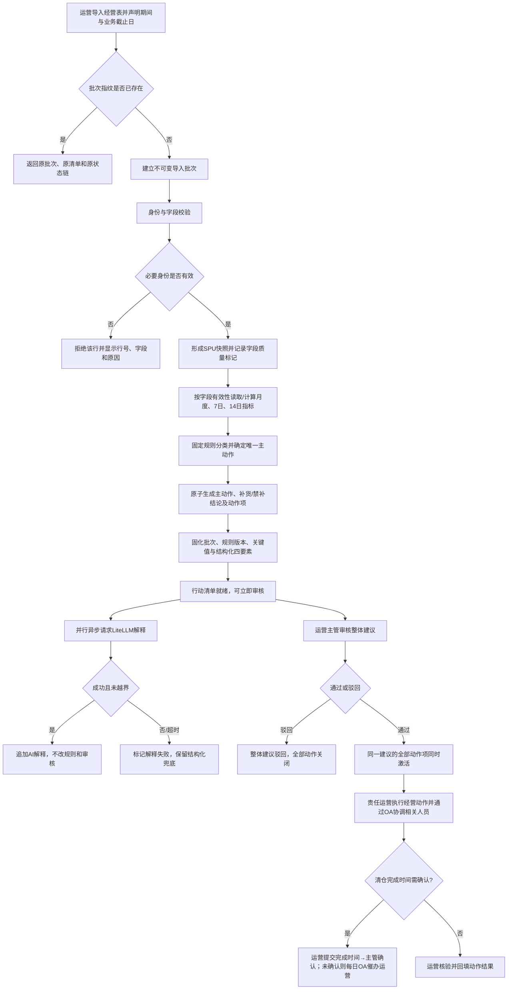

F01—F08 映射：导入/错误为 F01；指标为 F02；原子规则为 F03；AI 并行解释为 F04；批次唯一清单为 F05；审核、运营执行、OA 协同与清仓完成确认催办为 F06；双角色权限与 OA 最小消息为 F07；批次、规则、版本和事件为 F08。

### 6.2 批次与 AI 状态

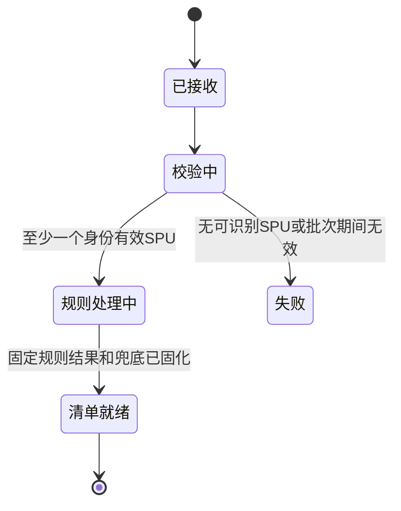

AI 解释使用独立状态 `待生成→生成中→已生成/生成失败`。清单进入“清单就绪”即允许审核，不等待 AI 终态；AI 超时或失败不把批次改为失败（REQ-F04-03；NFR-004）。

### 6.3 建议级审核状态机

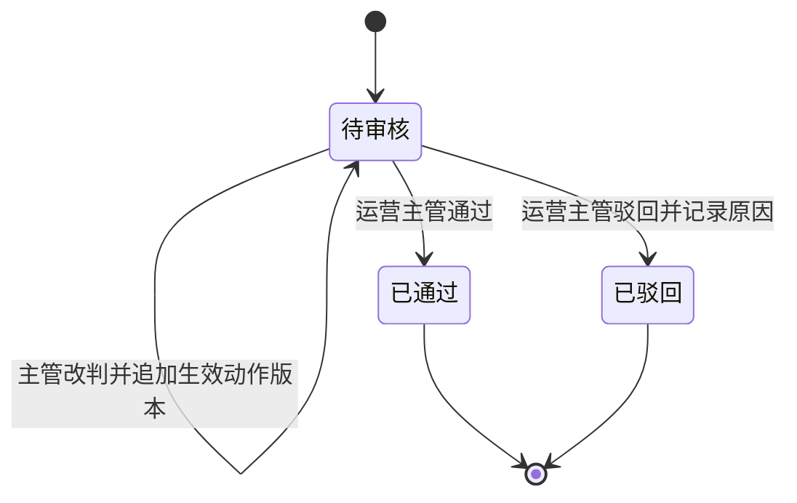

- 一个 `DECISION_RECORD` 只有一个审核状态；主管不能分别批准主动作和补货/禁补动作。
- 审核通过时，同一建议下所有可执行 `ACTION_ITEM` 同时从“待审核激活”进入“待执行”；驳回时全部进入“随建议驳关闭”。
- 清仓/止损与禁补共享审核结果，禁止出现“止损通过但禁补驳回”。
- 提交版本不匹配时，审核状态不变，并返回最新状态和操作者。
- 改判不改变建议审核状态，只追加生效动作版本；改判后仍必须对整条建议通过或驳回。任一动作已进入执行时，必须先终止原任务才能改判。

### 6.3.1 跨周任务续接与动作变更

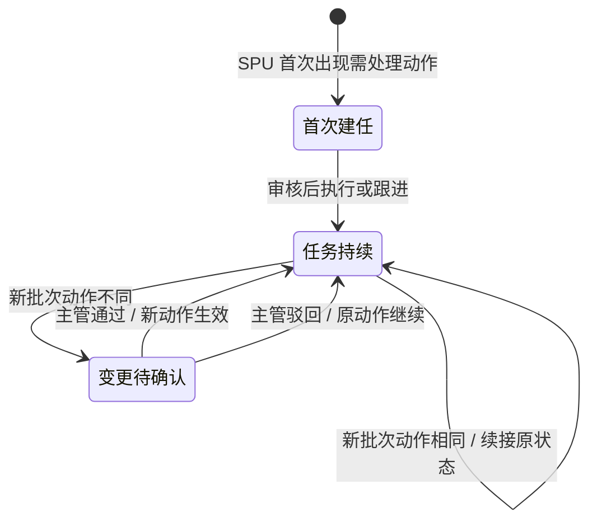

- 同动作续接不创建新任务、不重置已通过/已执行/已记录结果等状态，仅追加新 `decision_id/batch_id` 的续接关联与事件。
- 动作变化不直接覆盖原动作；新规则动作以“待主管确认”版本出现。例如上周清仓、本周观察，通过后当前生效动作才切换为观察。
- 经营轨与库存轨分别比较，但同一批次的变更由主管整体确认，避免清仓已变为观察而禁补仍被错误重建。
- 每次周度关联以同一事业部与 SPU/商品链接为锚点保存 `linked_at`，并指向业务时间最近的前序经营待办记录；页面同时展示稳定任务首次产生时间、当前经营状态和实际经营执行时间。
- “经营状态”是经营动作轨的受控状态，不等同于建议审核状态、库存协同状态或建议总览聚合状态，可独立筛选和恢复。

### 6.4 动作项执行与结果状态机

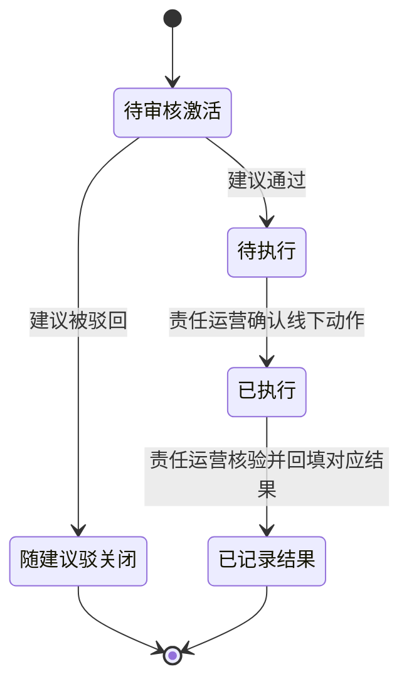

执行责任：

| 动作项 | 执行与结果角色 | 最小结果语义 |
|---|---|---|
| 加投、SPU 整体推广止损、清仓 | 运营 | 执行时间、备注；可回填结果周期及销售/利润/库存结果或明确未提供 |
| 观察 | 运营 | 已查看并记录观察备注；不表示自动外部操作 |
| 补货 | 责任运营 | OA 协同发送状态、相关方反馈、补货执行状态、时间与备注 |
| 禁止补货 | 责任运营 | OA 协同发送状态、相关方已知悉/已停补状态、时间与备注 |

主动作与补货/禁补可处于不同执行进度，但审核结果始终一致。部分动作已执行不能把整条建议标成全部完成；清单总状态只能是基于动作项状态的只读聚合，不覆盖动作项事实。所有成功迁移追加事件；version 冲突不改变状态。

状态标签统一如下：

| 层级 | 内部状态 | 统一产品标签 | 聚合/展示规则 |
|---|---|---|---|
| 建议审核 | 待审核、已通过、已驳回 | 待审核、已通过、已驳回 | 与动作执行状态分开筛选；驳回备注必填，通过备注可选 |
| 经营动作 | 待审核激活、待执行、已执行、已记录结果、随建议驳关闭 | 待审核、待执行、已执行、已记录结果、已关闭 | 观察记录非空观察备注后可进入已执行；有结果时再进入已记录结果 |
| 补货协同 | 待审核激活、待通知、协同中、相关方已确认、已记录结果、随建议驳关闭 | 待审核、待通知、协同中、已确认、已记录结果、已关闭 | 责任运营发起 OA 并核验相关方反馈后更新 |
| 禁补协同 | 待审核激活、待通知、协同中、相关方已确认、已记录结果、随建议驳关闭 | 待审核、待通知、协同中、已确认禁补、已记录结果、已关闭 | OA 已发送不等于已确认禁补；反馈由责任运营核验 |
| 清仓完成确认 | 未提交、待主管确认、完成时间待修正、已确认完成 | 待确认完成时间、待主管确认、待修正、已确认完成 | 主管确认是闭环条件；未确认期间每日 OA 催办责任运营 |
| 建议总览 | 只读聚合 | 待审核、已驳回、待执行、执行中、已执行、已记录结果 | 任一动作未完成时不得显示全部完成；双动作进度不一致时显示“执行中” |

业务时间线展示成功的审核、执行、OA 通知、清仓完成提交/确认、结果状态迁移及业务备注。越权拒绝、version 冲突和 OA 失败等请求保留为审计事件，只在运营和运营主管有权的追溯详情中展示；外部相关人员不拥有产品历史入口。

### 6.5 跨模块时序

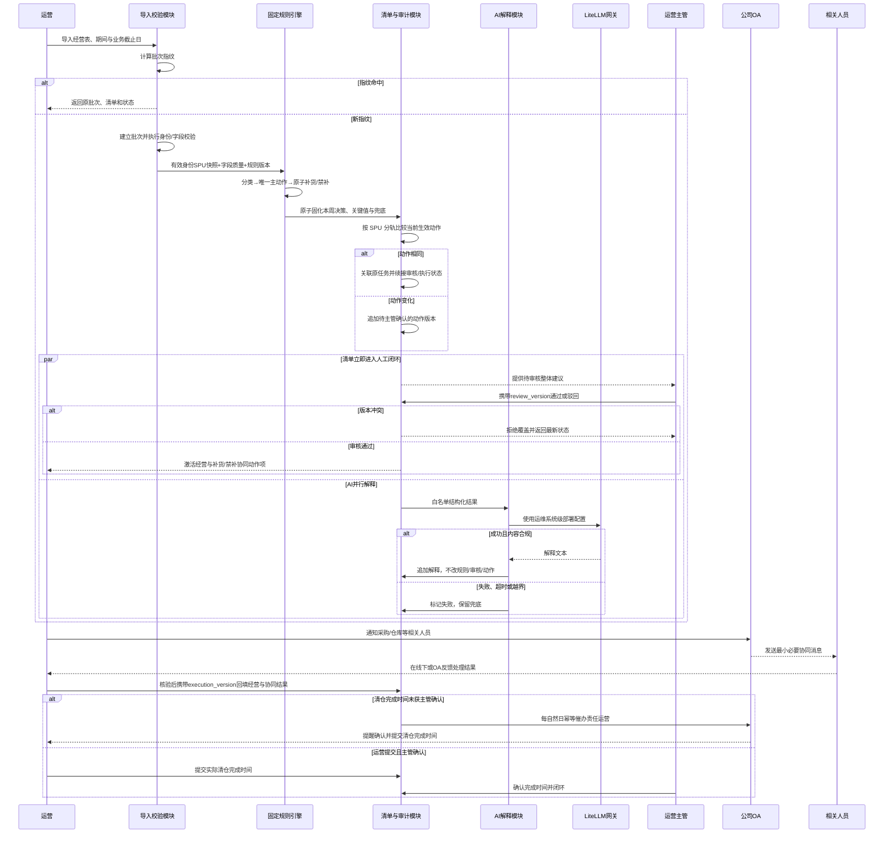

时序不包含自动写入广告、采购或库存系统；OA 只通知不自动确认业务结果，所有执行和结果均由责任运营核验并由主管按需确认。

---

### 6.6 F09 授权门与既有业务流程

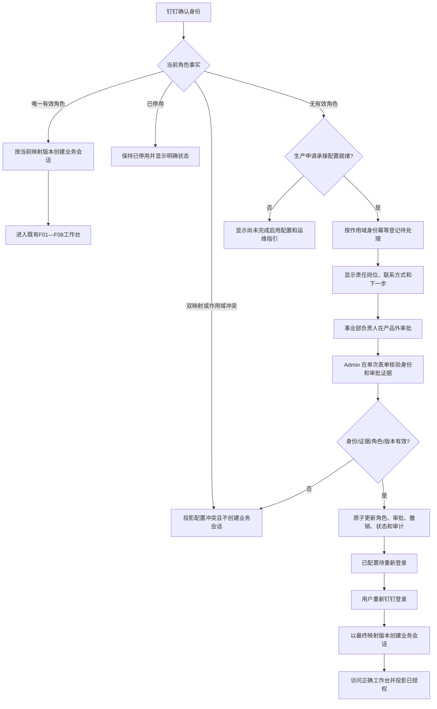

承接配置缺失时不创建无人处理的申请；配置就绪后用户重新认证进入正常闭环。产品在角色提交前不知道外部审批是否完成，不持久化“已审批待配置”。

Admin 除待处理列表外，还可通过已授权/已停用身份的最小列表或检索进入统一身份详情，执行变更、停用或恢复；该入口不是组织目录且不支持批量操作。

### 6.7 唯一 Admin 初始化

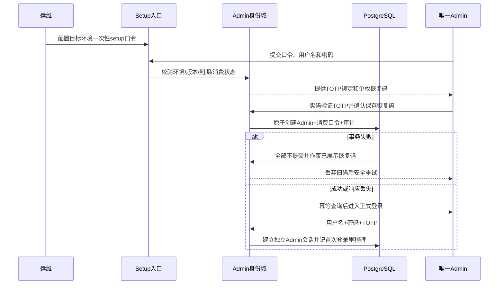

### 6.8 两级恢复与通知双结果

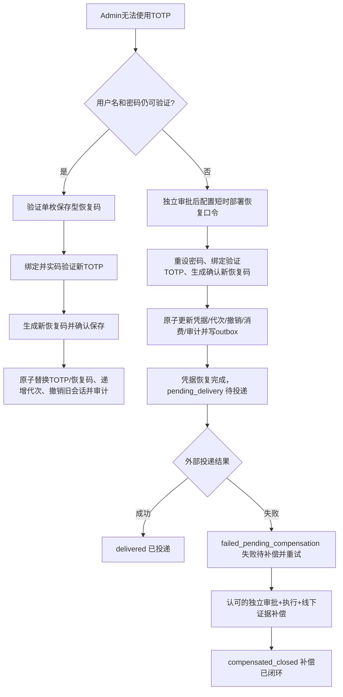

凭据恢复完成与通知处置闭环是两个状态：前者允许新凭据登录，后者不能在投递/补偿未完成时显示成功。外部投递失败不恢复旧凭据。

### 6.9 五态是受约束投影

五态由当前映射、停用、冲突和正确工作台首次访问事实计算；不是业务鉴权源。

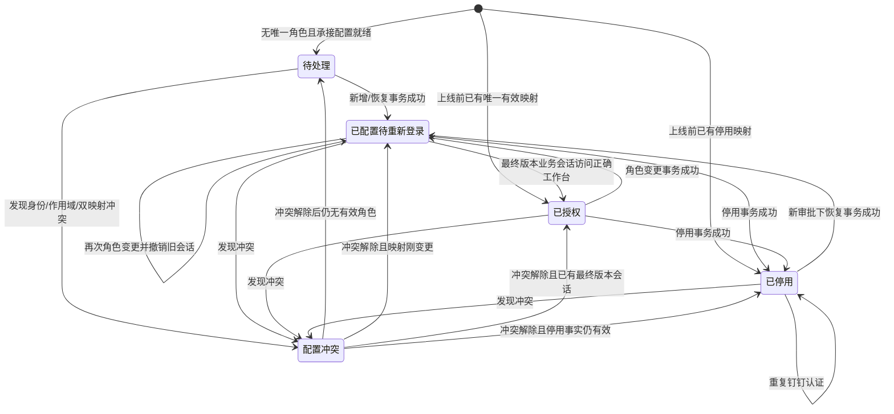

### 6.10 交互状态族不共用认证权限

setup、保存型恢复码和部署恢复仅复用“初始、校验中、可继续、提交中、成功、短时限流、可重试失败、结果未知”等状态词与幂等恢复模式；它们不共用凭据校验、权限范围、限速计数或结果：

- setup 只能在无 Admin 时创建唯一 Admin；
- 保存型恢复码要求正确用户名和密码，不能重设密码；
- 部署恢复可重设密码/TOTP，但须独立审批、outbox 和非静默处置；
- 普通登录冷却不能封死部署恢复。

精确口令失败原因只进受限审计；合法用户得到可执行下一步。

### 6.11 OAuth 与角色变更并发时序

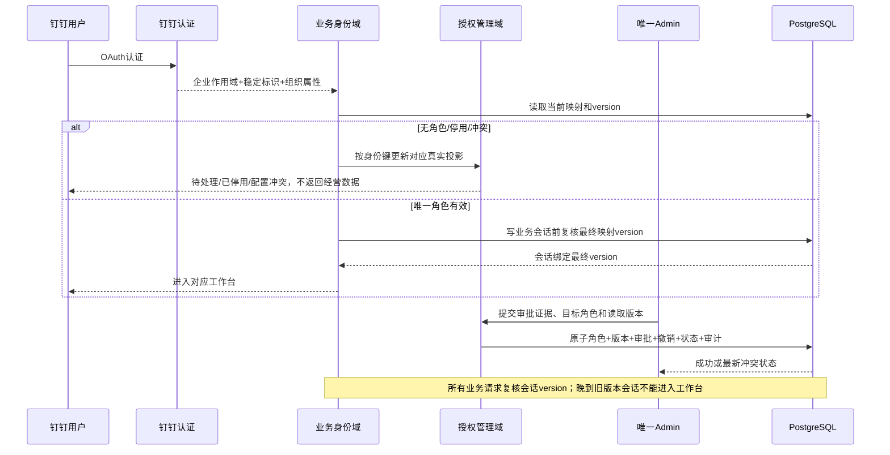

---

## 7. 边界与异常场景

### 7.1 数据边界

| 场景 | 产品可观察行为 | 不变行为 |
|---|---|---|
| 无可识别身份行 | 批次显示无可处理 SPU，不生成清单 | 不调用 AI，不伪造空成功 |
| 导入数量不在 10—20 | 显示不属于首轮验收规模 | 不因数量本身阻断合法数据 |
| 必要身份缺失/ID 重复 | 拒绝该行，显示行号、字段、原因 | 其他行继续 |
| 上架日期异常 | 保留身份行，停止分类与动作 | 不猜默认日期 |
| 销售/利润异常 | 只停止依赖字段的判断 | 可独立判定分支继续 |
| 品退周期不可信/分母为 0 | 显示未校验/无可计算销量 | 不触发观察，不阻断利润止损 |
| 库存或 14 日销量缺失/日均为 0 | 显示库存不足/无近期销售 | 不生成补货；止损/清仓仍禁补 |
| 表头合计不一致 | 忽略合计，以有效明细汇总 | 不向 SPU 分摊差额 |
| 相同批次指纹 | 返回原批次和原清单 | 不新增业务批次和建议 |

### 7.2 并发与操作冲突

- 重复提交相同文件指纹：返回同一批次状态。
- 同一批次重复处理：只保留一份清单。
- 两名主管同时审核：仅当前 version 的首个合法提交成功；后续返回冲突和最新状态。
- 审核与执行并发：建议未通过时执行请求被拒绝。
- 双动作并发：经营动作与补货/禁补分别校验自己的 version，不相互覆盖。
- 网络重试：已成功操作返回现状，不新增重复事件。
- AI 与人工状态并发：AI 仅更新解释状态，不改变审核或动作状态。
- 旧批次与新批次并行：操作绑定 batch_id，不跨批次写入。

### 7.3 LiteLLM 与外部能力失败

- LiteLLM 超时、限流、密钥失效或返回错误：规则兜底立即可用，清单/审核/执行继续。
- AI 越界或虚构：舍弃冲突内容，固定规则不变。
- deployment secret 异常：普通用户只看到服务不可用，无密钥入口或敏感错误。
- 首版没有广告、采购和库存自动写回；人工状态不得表述为外部系统确认。

### 7.4 权限边界

- 页面、数据请求、筛选、错误信息和审计详情均使用同一角色裁剪。
- 外部相关人员不进入产品；OA 消息只含 SPU、协同动作、责任运营和反馈要求，不含完整经营字段。
- 认证失败或登录态失效时拒绝；认证成功但无唯一有效角色时进入 F09 待处理闭环。事业部负责人不自动获得日常操作能力。
- 普通用户无 LiteLLM 凭据管理入口。
- 业务时间线只展示成功的业务状态迁移与备注；越权拒绝、version 冲突等失败事件进入有权限的追溯详情，且继续按角色裁剪。

### 7.5 平台与设备差异

- PRD V0 未确认浏览器、移动端或企业微信范围；V0 不新增兼容承诺。
- 设备不能选择 XLSX 时明确显示当前设备不支持导入，不提交空请求。
- 窄屏/缩放不应截断金额、百分比、阈值、动作和状态的语义；完整信息保留在详情。
- `DISPIMG` 图片不受支持时可显示占位，不影响经营数值。
- 中文 SPU 名称和备注原样显示；导出能力不属于 F01—F08。

### 7.6 极端与恢复

- 服务重启后使用同一批次输入、业务截止日和规则版本恢复，不生成第二份清单。
- AI 长时间无结果时继续展示结构化兜底，不阻塞业务状态。
- 状态与审计必须一起成功；审计失败则状态变化不显示成功。
- 规则更新只影响新批次；相同指纹仍返回原批次和原规则结果。
- 历史数据增长时保持按批次可检索；具体分页和存储方案留给技术设计。

### 7.7 身份、凭据与状态边界

| 场景 | 产品可观察行为 | 不变行为 |
|---|---|---|
| 系统无 Admin、setup 有效 | 允许进入初始化 | 仍只可创建一名 Admin |
| 已存在 Admin | setup 入口关闭 | 不显示持有人或凭据信息 |
| setup/recovery 无效、过期、已消费、环境不匹配 | 统一显示不可继续 | 精确原因只进受限审计 |
| 只有稳定标识、缺少两个权威属性 | 待处理保留，授权按钮禁用 | 不以姓名/备注猜测身份 |
| 同一身份无角色重复登录 | 返回同一待处理生命周期 | 不建业务会话、不重复建单 |
| 同一身份存在双角色或作用域冲突 | 进入配置冲突 | 不选择任一角色凑合登录 |
| 角色已配置但使用旧会话 | 提示重新登录，旧会话拒绝 | 不在旧会话中热切换权限 |
| 已停用用户登录 | 明确停用状态页 | 不返回经营数据或通用登录循环 |

五态投影遵循以下优先级和迁移边界；它只描述当前事实，不取代真实角色映射与业务会话鉴权：

| 当前事实/动作 | 唯一展示状态 | 后续合法结果 |
|---|---|---|
| 既有唯一有效角色映射首次被 F09 读取 | 已授权 | 保留原角色、原审批事实和有效会话，不虚构待处理周期 |
| 既有停用映射首次被 F09 读取，或已停用身份重复认证 | 已停用 | 只有带新审批依据的恢复事务成功后进入“已配置待重新登录” |
| 新身份认证成功且没有任何角色/停用事实 | 待处理 | 配置成功后进入“已配置待重新登录”；重复认证仍是同一待处理周期 |
| 已配置待重新登录期间再次合法改配 | 已配置待重新登录 | 递增角色映射版本并撤销旧会话，不产生“热切换” |
| 已配置待重新登录期间被停用 | 已停用 | 后续登录进入停用页 |
| 任一活动状态出现双角色、作用域或身份事实不一致 | 配置冲突 | 管理员消除冲突后按最终真实映射重新投影为五态之一，不默认回到待处理 |

### 7.8 并发与操作冲突

- 并发初始化最多一个成功，其余请求进入正式登录指引。
- 同一恢复材料并发消费最多一次成功；成功后旧 TOTP、恢复码和旧管理会话不可使用。
- 同一身份并发角色变更按最新状态/版本裁决；失败请求不覆盖成功请求，不新增重复成功审计。
- 角色配置与钉钉回调并发时，业务会话必须在写入时复核并绑定当前角色映射版本；角色变化递增版本，版本不一致的晚到会话与旧会话均拒绝并标记撤销。
- 管理会话撤销与多标签页操作并发时，所有旧标签下一次请求均被拒绝。
- 通知投递与恢复提交不是跨系统原子成功；恢复先形成持久通知状态，投递结果随后更新并可追踪。

### 7.9 网络、第三方与基础能力失败

- 钉钉身份认证失败：不创建空待处理身份；提供重新认证入口。
- 钉钉无法提供两个权威核验属性：阻塞生产授权，不以不可靠展示字段替代。
- TOTP 时钟不可验证：登录/绑定失败并提示校时，不扩大接受窗口。
- 恢复通知通道失败：保留失败状态、告警和认可补偿路径，不伪造已通知，也不因单一通道永久锁死。
- 数据库或审计不可写：高权限动作整体不显示成功。
- 网络中断导致结果未知：查询真实状态后恢复，不直接重放高权限提交。

### 7.10 权限和信息泄露边界

- Admin 与业务会话同时存在也不合并权限；两类页面/API/错误响应按各自身份域裁决。
- 未授权请求、待处理页、登录页和恢复页均不得返回经营数据、他人身份、审批材料或审计详情。
- 安全错误不区分账号不存在、密码错误、口令过期或口令已消费；精确原因只供受限审计。
- URL、页面源代码、浏览器存储、下载内容与复制按钮均不得暴露可重放秘密。
- Admin 审计为只读；删除、修改和高级导出不属于首发。

### 7.11 平台与设备差异

| 表面 | 第一版口径 | 必须保持的行为 | 未承诺范围 |
|---|---|---|---|
| 现有产品已支持的 PC 浏览器范围 | F09 继承既有产品兼容口径，不新增浏览器版本承诺 | setup、登录、两级恢复、授权、重新登录、审计及身份隔离语义不得因浏览器不同而降级 | 尚未由设计确认的浏览器版本与移动端管理操作 |
| PC 1280px—1440px | 继承既有 PC 设计基线 | 身份、角色、审批依据、会话影响不可被截断 | 更小屏幕业务操作 |
| 外置身份验证器设备 | 支持标准 TOTP 输入 | 无二维码时可手工绑定，但必须实码验证 | 短信/邮件动态码 |

### 7.12 极端与恢复

- 快照恢复后，在部署恢复材料、TOTP 保护材料和旧管理会话未完成安全处置前，不开放管理服务。
- 唯一 Admin 离岗不共享旧凭据；通过受控交接生成新凭据并撤销全部旧材料。
- 审计存储增长时基本分页仍可用；留存、归档和清理期限未获治理确认前不得自动删除。
- 联系人或审批证据规则缺失时，生产环境停在“尚未完成启用配置”，不进入无人承接的待处理流程。
- F09 故障不得改变 F01—F08 固定规则、经营数据、行动任务、业务审计或既有双角色权限语义；已有唯一有效角色的钉钉用户继续按既有路径建立业务会话并进入对应工作台，不经过待处理或重新审批，F09 管理面故障不得阻塞其正常登录。

## 8. 成功度量

### 8.1 北极星指标

**首轮形成轻闭环的真实 SPU 经营问题数**：在玩具事业部首轮导入 10—20 个真实 SPU 后，至少有 3 个由真实数据触发的问题形成四要素完整、规则可追溯的建议，并可由运营执行/协调、运营主管审核确认完成闭环。基线：现有系统内为 0 个，因为当前尚无统一行动清单与轻闭环；目标：至少 3 个；时间窗：首轮导入及其后一周状态更新周期；来源：PRD V0 §0、§14及用户最新角色闭环决策。依据等级：B。

**唯一计数口径**：按首轮批次内去重的 `(batch_id, spu_id)`/建议决策计数；同一 SPU 同时存在经营动作和补货动作仍计 1 个问题。仅“维持”且无补货任务的不计入；AI 失败但结构化规则兜底已包含四要素时仍计入，AI 成功不是计数前提。

> 北极星指标衡量 V0 是否形成可用闭环，不代表建议执行后的利润改善。阶段 2 价值论证未执行，V0 不设置年度收益或 ROI 目标。

### 8.2 关键指标矩阵

| 指标 | 基线 | V0 目标 | 时间窗 | 来源与依据等级 |
| :--- | :--- | :--- | :--- | :--- |
| 试点数据规模 | 当前核验样本为 10 个唯一 SPU | 首轮验收批次导入 10—20 个真实 SPU；不作为运行时硬阻断 | 首轮导入批次 | PRD V0 §0、字段核验报告；B/C |
| 真实经营问题识别数 | 当前系统内无统一清单，记为 0 | 按去重 SPU 决策计数 ≥3 个 | 首轮导入批次 | PRD V0 §14.2；B |
| 建议四要素完整率 | 当前系统内无统一建议结构，不适用 | 100% 的已生成建议包含具体对象、发现问题、关键依据和推荐动作；结构化规则兜底计为完整 | 每个导入批次 | PRD V0 §8、§14.2；B |
| 规则追溯完整率 | 当前系统内无统一追溯记录，不适用 | 100% 的已生成建议可追溯到批次、业务截止日、数据期间、规则版本、触发规则与原始关键数据 | 每个导入批次 | PRD V0 §14.2及 requirements.md REQ-F08-01；B |
| 主动作冲突数 | 当前人工判断无统一系统口径，未量化 | 0 个 SPU 同时出现清仓、止损、观察或加投中的多个主动作 | 每个导入批次 | PRD V0 §7.1、§14.2；B |
| 止损/清仓禁补同步率 | 515 案例曾发生止损后仍继续补货；未形成系统比例 | 100% 的止损或清仓建议同步形成禁止补货动作 | 每个导入批次 | PRD V0 §7.1、§14.2；A/B |
| 建议审核完整性 | 当前无统一系统审核 | 100% 的建议只产生一次建议级通过或驳回结果；通过后才激活动作 | 每个导入批次 | PRD V0 §10及 requirements.md REQ-F06-01；B |
| 动作结果责任完整性 | 当前无统一责任运营闭环 | 经营动作与库存协同分别显示状态和结果，均可追溯至同一 SPU 责任运营 | 首轮导入后的一周内 | requirements.md REQ-F06-02～03；B |
| 清仓完成确认及时性 | 当前无系统催办 | 未获主管确认的清仓任务每天至多催办责任运营一次；确认后停止 | 每个自然日 | requirements.md REQ-F06-05；B |
| 历史清单保留 | 当前无统一系统清单，不适用 | 新批次生成后，旧批次清单与已有状态记录仍可查看且不被覆盖 | 每次新数据导入后 | PRD V0 §4、§10；B |
| 跨周重复任务数 | 当前人工流程未去重 | 同一 SPU 连续批次命中同一动作时新建重复任务数为 0，审核与执行状态保留 | 每次新数据导入后 | requirements.md REQ-F05-04；B |
| 跨周待办关联与时间完整率 | 当前无统一关联展示 | 存在历史经营待办的当前记录 100% 显示最近前序记录、首次产生时间、当前经营状态与实际执行时间/未执行占位 | 每次新数据导入后 | requirements.md REQ-F05-05；B |

### 8.3 北极星指标边界

保留既有 F01—F08 的北极星指标“首轮形成轻闭环的真实 SPU 经营问题数”。F09 不替代经营结果北极星；它增加一组产品启用与授权安全门槛，用来证明业务用户能够实际进入并使用既有闭环。

### 8.4 F09 关键指标矩阵

| 指标 | 基线 | F09 目标/状态 | 时间窗 | 口径、来源与依据等级 |
| :--- | :--- | :--- | :--- | :--- |
| 首次初始化授权闭环时间 | 空角色环境无法通过产品完成，时间不可控 | ≤10 分钟，待真实首用验证 | 首次部署；仅在 §0.5 全部门禁满足后有效 | §8.5 固定七个服务端里程碑；用户确认的 REQ-F09-07；B |
| 系统阻止的非法授权 | 现有产品内无管理台账 | 双角色、作用域冲突、属性不足和版本冲突均不得形成成功授权 | 持续 | 拒绝结果、约束结果及关联管理审计；B |
| 经治理确认的错误授权事件 | 现有无统一事件台账 | 0；表示观察期内没有经治理确认的错人或错角色事件，不声称系统自动证明人工审批绝对正确 | 持续；上线 30 天首次复盘 | 最小事件台账关联原审批、原角色操作与纠正事件；B |
| 高权限状态变更审计覆盖率 | 无独立 Admin 审计 | 100%；无法计算时显示“证据不完整”，不得填 100% | 持续 | 分母为 Admin、恢复、审批/角色映射及会话撤销等领域事实中的应审计状态变更实例，分子为具有同一关联引用的唯一管理审计；登录拒绝等无领域变更事件按受控事件类别单列核对；B/E |
| 恢复后旧 Admin 会话 | 现有无 Admin 会话 | 0；旧会话不可使用且显示为已撤销 | 每次保存型恢复重绑、部署恢复或持有人交接后 | `proposal-v1.md`；B |
| 角色变化后旧业务会话 | 当前角色变化失效机制已有，F09 尚无管理闭环 | 0 个仍可用；受影响旧会话显示已撤销 | 每次新增、变更、停用或恢复后 | `proposal-v1.md`；B |
| 重复待处理记录 | 现有无待处理记录 | 0；同一身份提供方、企业作用域和稳定用户标识只有一条当前身份生命周期 | 每次重复钉钉认证 | `proposal-v1.md`；B |
| 无角色用户闭环完成率 | 当前无法形成产品内闭环 | 记录真实比例，不预设目标 | 上线日起 30 个自然日首次复盘 | 以窗口内首次进入待处理的授权周期为分母，以第 30 日截止前进入已授权的周期为分子；仍待处理、配置冲突和已停用分别列为未完成原因，不静默剔除；B |
| 日常产品内配置时间 | 未记录 | 记录真实分布，不虚构 SLA | 上线后 30 天首次复盘 | Admin 明确确认“有效审批材料已可用于配置”的服务端时间至角色配置成功；确认动作记录材料来源，但不代表产品已接入或验证外部审批进度；B |
| 完整授权周期 | 未记录 | 记录真实分布，不虚构 SLA | 上线后 30 天首次复盘 | 首次授权从待处理申请产生起算，变更/恢复从 `configuration_started_at` 起算，均止于下一次正确角色业务会话进入工作台；停用周期止于停用事务成功且不纳入本指标；缺节点时显示“无法形成完整周期”，不填 0；B |
| 可归因事件数量与影响 | 12 次/年、约 6 万元/次均未形成完整年度实测 | 按 F09 专属纳入条件记录，并在 30 天和年度输出真实结论 | 上线 30 天、每年度 | 产品外价值台账人工勾稽 F09 稳定授权周期引用、既有经营事件与财务证据；不新增价值分析后台；A-F09-001/002 为 D，约 6 万元单案事实为 A |

### 8.5 固定时间里程碑与 10 分钟口径

F09 首次启用固定记录以下七个服务端里程碑：

1. 唯一 Admin 初始化开始；
2. Admin 创建成功；
3. Admin 首次正式登录；
4. 目标待处理身份首次产生；
5. Admin 明确确认有效审批材料已可用于配置；
6. 角色配置成功；
7. 目标身份首次以正确业务会话访问对应工作台。

- 首次初始化授权闭环以里程碑 1 为起点、里程碑 7 为终点，只有 §0.5 全部门禁已满足时，`≤10 分钟` 结果才有效。
- 重复认证另记最近认证时间，不覆盖待处理身份首次产生时间；后续新增、变更、停用和恢复按独立授权周期关联相关里程碑。
- 事业部负责人尚未完成审批、身份权限尚未开通或责任配置尚未就绪的等待不伪装成产品处理时间；完整授权周期仍如实包含外部审批等待。
- 任一必需里程碑缺失时显示“无法形成完整周期”，不填 0、不用客户端打开、跳转或缓存时间替代。

## 9. 风险、依赖与架构建议

### 9.A 架构选择与权衡

| 架构建议 | 选择理由 | 失败模式 | 缓解 | 对应需求 |
|---|---|---|---|---|
| 固定规则与 AI 解释分层 | 动作可复算，模型只增强可读性 | AI 冲突或长时间无响应阻塞业务 | 规则字段只读；结构化兜底先发布；AI 并行异步，失败/超时不阻塞 | F03、F04；REQ-F03-01～REQ-F04-03；NFR-001、NFR-004 |
| 建议级审核、责任运营分轨执行 | 主管只审核一次，责任运营统一承担经营与外部协同闭环 | 止损通过但禁补未同步，或外部反馈无人核验 | 清仓/止损+禁补原子生成；审核同时激活；责任运营分轨更新，OA 只通知不自动确认 | F03、F06、F08；REQ-F03-03、REQ-F06-01～REQ-F06-05；NFR-005 |
| 不可变批次与唯一指纹 | 同一输入只有一份清单，历史可追溯 | 重复上传产生两套审核/执行链 | 指纹命中只返回原批次；不同指纹才创建新批次；历史不覆盖 | F05、F08；REQ-F05-01、REQ-F08-01～REQ-F08-02；NFR-005 |
| 决策快照与跨周任务分层 | 每周规则事实不可变，执行待办不重复且关系可见 | 连续清仓每周重建待办，或只显示“延续上周”却无法确认前序任务和时间 | 稳定 SPU 任务 ID+批次决策关联；同动作续接，变化动作追加待审版本；每周关联指向最近前序记录并展示生命周期时间 | F05、F06、F08；REQ-F05-04～REQ-F05-05、REQ-F06-01～REQ-F06-04；NFR-005 |
| 字段级降级 | 尽量保留仍可确定的高优先级动作 | 任一缺数整行删除，漏掉淘汰清仓或利润止损 | 仅身份不可识别时拒绝行；其他字段按依赖降级并显示质量标记 | F01～F03；REQ-F01-02、REQ-F02-01～REQ-F03-03 |
| 业务日期与事件时间分离 | 历史分类可重放且事件顺序明确 | 重试日期改变新品分类或跨日错位 | 冻结数据批次业务截止日；Asia/Shanghai 标注为实现假设；事件保存绝对时间 | F02、F08；REQ-F02-01、REQ-F08-01；NFR-001、NFR-005 |
| 逻辑模型先行、物理技术待定 | 锁定事务和权限边界，不虚构技术栈 | 过早绑定实现导致返工 | 仅定义实体、状态、版本和一致性；技术方案阶段选择物理实现 | F01～F08 |

### 9.B 外部能力与配置责任

| 外部能力 | 用途 | 凭据归属 | 配置角色 | 配置入口 | 作用域 | 生命周期 | 失败/降级 | 对应 REQ/AC |
|---|---|---|---|---|---|---|---|---|
| 数据支持部门周度经营表 | 提供 SPU 销售、利润、推广、品退及可用库存事实 | 不涉及模型凭据 | 数据支持部门提供，运营导入 | 产品导入入口 | 玩具事业部批次 | 每周新数据；指纹命中返回原批次 | 无新表不生成新清单；字段缺失按行拒绝或字段级降级，历史保留 | REQ-F01-01～REQ-F02-03；AC-F01-01～AC-F02-06 |
| 现有 LiteLLM 网关 | 生成规则解释与非覆盖式优化提示 | 系统级部署密钥由运维管理，普通用户不可见 | 运维负责配置、更新、轮换、失效处理 | 本产品环境系统级部署配置；无用户后台 | 仅本产品环境 | 运维维护 | 失败/超时/越界时保留清单和兜底，AI 状态失败，可绑定原 decision_id 重试 | REQ-F04-01～REQ-F04-03；AC-F04-01～AC-F04-04；NFR-003、NFR-004 |
| 钉钉统一身份认证 | 为运营和运营主管提供独立身份并承载双角色映射 | 公司钉钉身份由运维管理 | 事业部负责人审批；唯一 Admin 配置业务映射；运维维护身份接入 | 钉钉身份体系与 F09 管理后台 | 玩具事业部运营、运营主管 | MVP 只验收本机普通浏览器点击钉钉 OAuth 登录；扫码登录和钉钉客户端/工作台入口不在本次范围 | 认证失败或登录态失效时拒绝；认证成功无唯一角色进入待处理；冲突时不创建业务会话 | REQ-F07-01～REQ-F07-03、REQ-F09-04～05；AC-F07-01～AC-F07-06、AC-F09-07～12；NFR-002、NFR-009 |
| 钉钉企业内部机器人单聊 | 协调外部相关人员并每日催办未确认清仓完成时间的责任运营 | 钉钉应用 Client ID/Secret 与机器人编码由运维/系统管理员管理 | 运维/系统管理员配置钉钉应用、机器人和公司 User ID 映射，责任运营发起或人工补发 | 服务端钉钉通知适配层；普通用户无凭据入口 | 玩具事业部协同消息 | 实施阶段验证连通性；按自然日幂等 | 调用失败保留“通知失败”和人工补发入口；接口受理不伪造为送达、已读或业务确认 | REQ-F06-02、REQ-F06-05、REQ-F07-02；AC-F06-04、AC-F06-10～12、AC-F07-03～04 |

LiteLLM 的密钥载体、网关地址、模型、超时数值和重试策略均未确认，不能写成既定环境变量、模型或管理页面。

### 9.C 方案前置能力

| 前置能力 | 状态 | 负责人 | 证据或确认点 | 不可用时替代方案 | 对应 REQ/AC |
|---|---|---|---|---|---|
| 10—20 个 SPU 的首轮周度经营数据 | 已具备 10 个 SPU 样本，字段有缺口 | 数据支持部门 | `商品链接.xlsx` 字段核验 | 作为验收规模，不作导入硬限制；缺数按字段级降级 | REQ-F01-01～REQ-F02-03；AC-F01-01～AC-F02-06 |
| SPU 仓内、在途、最近 14 天销量 | 当前样本未具备 | 数据支持部门 | 后续表按 SPU 提供并带截止日 | 不生成补货；止损/清仓仍原子生成禁补 | REQ-F02-03、REQ-F03-03；AC-F02-05～AC-F03-06 |
| 可证明为最近 7 天的品退数据 | 当前样本口径未验证 | 数据支持部门 | 提供 7 日起止日及分子/分母 | 不触发观察或依赖低品退率的加投，显示未校验 | REQ-F02-02、REQ-F03-02；AC-F02-03～AC-F03-04 |
| LiteLLM 网关与系统级部署密钥 | 网关已存在，运行可用性待验证 | 运维 | 部署连通性与普通用户不可见 | 不阻断规则清单、审核执行；解释显示失败 | REQ-F04-01～REQ-F04-03；AC-F04-01～AC-F04-04；NFR-003、NFR-004 |
| 钉钉认证与双角色映射能力 | 已选定，双属性仍待生产实测 | 事业部负责人审批；唯一 Admin 配置；运维维护身份接入 | 验证稳定身份、企业作用域和两个可靠组织属性 | 认证失败或会话失效时拒绝；认证成功无唯一角色进入待处理；属性不足时禁止授权 | REQ-F06-01～REQ-F07-03、REQ-F09-04～05；AC-F06-01～AC-F07-06、AC-F09-07～12；NFR-002、NFR-009 |
| 钉钉企业内部机器人单聊 | 已确认，接入可用性待实施验证 | 运维/系统管理员 | 验证应用 Access Token、机器人编码、公司 User ID、接口受理结果与按自然日幂等键 | 失败显示待补发并由责任运营人工钉钉协同；不改变业务确认状态 | REQ-F06-02、REQ-F06-05、REQ-F07-02；AC-F06-04、AC-F06-10～12、AC-F07-03～04 |

### 9.D 主要失败模式与降级

| 风险 | 失败表现 | 架构缓解 |
|---|---|---|
| 数据期间或业务截止日错标 | 历史样本分类随导入日期变化 | 两者显式固化；首批期间固定 2026-06-01～2026-06-30；不从“上一周”推断 |
| 日期脏值 | 新品/非新品误分 | 保留行但分类降级，显示原位置和错误，不猜默认日期 |
| 指标缺失被整行排除 | 可确定的清仓/止损被漏掉 | 仅必要身份问题拒绝行，其他指标按依赖降级 |
| 品退周期不可信 | 未知周期触发观察/加投 | 保存周期和 verified；未验证按缺失处理 |
| 库存缺失 | 凭趋势猜补货并放大滞销 | 不生成补货；清仓/止损仍原子生成禁补 |
| 止损与禁补割裂 | 运营止损但相关人员继续补货 | 同一决策原子生成、一次审核、同时激活，责任运营通过 OA 协调并核验禁补结果 |
| 并发覆盖 | 两名用户后写覆盖审核或执行 | version/等价乐观锁；冲突可观察且不落状态 |
| 重复导入 | 一份输入产生多清单、多状态链 | 指纹唯一；命中返回原批次与原状态 |
| LiteLLM 等待或失败 | 规则清单长时间不可审核 | 兜底先发布，AI 并行异步，失败不阻塞 |
| LiteLLM 泄露 | 密钥出现在前端、日志或错误中 | 运维系统级配置、白名单输入、日志禁密钥、普通用户无配置入口 |
| 外部相关人员获得产品访问 | 经营敏感数据扩散或状态被非责任人改写 | 服务端只接受运营/主管角色；OA 消息白名单裁剪，反馈由责任运营核验录入 |

### 9.E 可扩展性边界

V0 试点为一个事业部、10—20 个 SPU，但该数字不是产品容量硬上限。规则计算为 `O(n)`；规模扩大时更可能受字段质量、LiteLLM 调用量和历史事件读取影响。架构建议保持批次分区、规则批量计算、AI 异步和按批次读取；具体队列、数据库、缓存、并发数、分页与 SLA 属于技术方案，不在本 PRD 中提前选型。评价、退款原因、广告明细和 SKU 不因扩展性设计而进入 V0 必需范围。

---

### 9.1 必须控制的实现风险

| 风险 | 失败模式 | 缓解 | 可观察信号 |
|---|---|---|---|
| XLSX 字段漂移 | 错读日期、利润或身份后产生错误动作 | 字段语义校验；身份行拒绝与字段级降级分离 | 拒绝行数、字段降级数、映射冲突数 |
| 批次重复 | 同一周产生两份清单和执行链 | 指纹命中直接返回原批次/原清单 | 指纹命中数、同 batch 清单异常数 |
| 规则非确定 | 重试改变分类/动作 | 固化业务截止日、期间、输入和规则版本 | 同批重算差异数 |
| 止损与禁补割裂 | 运营止损而相关人员仍补货 | 同一规则提交原子生成禁补；责任运营 OA 协同并确认 | 缺失禁补、OA 失败、协同超时数 |
| 状态并发覆盖 | 多人审核或执行丢失状态 | version 乐观锁；冲突拒绝并返回最新状态 | version 冲突数、非法迁移数 |
| 权限旁路 | 采购获取利润推广售后信息 | 所有读取路径服务端裁剪 | 未授权请求、受限字段返回异常 |
| AI 阻塞 | 模型等待使清单不可审核 | 结构化兜底先就绪，AI 独立状态 | 规则就绪到可审核延迟、AI 失败数 |
| 审计不一致 | 状态改变但无操作者/时间 | 状态和事件同时成功；失败不提交状态 | 无事件状态变化数 |

### 9.2 技术债边界

- 首版只处理数据支持部门 XLSX；自动连接、多模板、下载错误文件和导出不进入 MVP。
- 当前无广告明细、退款原因、评价文本或 SKU 数据，不用汇总值伪装明细能力。
- 当前样本无库存与近 14 天销量；补货功能按缺数降级。
- 源表经营准利润率为静态值；首版保留来源，不恢复另一套财务公式。
- 平台范围和数据保留期限尚未确认，不属于 V0 承诺；观察动作由运营记录观察或有证据支持的优化结果。

### 9.3 性能与容量风险

- 产品必须支持首轮 10—20 个真实 SPU 的导入和处理，但 10—20 不是运行硬上限；更大规模容量和 SLA 尚未确认。
- 单个异常字段不得阻塞其他不依赖该字段的判断；必要身份错误仅影响对应行。
- LiteLLM 延迟不可控，不能位于规则清单、审核或执行的关键路径。
- 历史批次、分动作事件和结果记录持续增长，需监控列表与追溯加载；不在本阶段指定数据库或缓存。

### 9.4 稳定性风险

| 风险 | 缓解 | 监控 |
|---|---|---|
| LiteLLM 波动 | 规则兜底、独立状态、内部重试 | AI 成功/失败、兜底使用、越界输出 |
| deployment secret 失效 | 运维轮换，产品降级且不暴露凭据 | 鉴权失败、连续失败批次 |
| 周一集中导入 | 指纹幂等、批次状态可见 | 并发导入、指纹命中、失败批次 |
| 数据表头/期间变化 | 显式期间、字段语义校验、错误不猜测 | 映射失败、期间冲突、降级字段 |
| 规则更新影响历史 | 规则版本固化，只作用新批次 | 缺规则版本、历史差异 |
| 跨部门协同断点 | 建议整体审核、责任运营统一闭环、OA 通知、原子禁补 | OA 失败、协同中超时、双动作部分完成 |
| 清仓完成时间长期未确认 | 运营提交、主管确认、每日幂等 OA 催办 | 待主管确认天数、每日通知成功/失败、重复通知拦截 |

### 9.5 外部依赖

- 数据支持部门每周一提供 SPU 表并说明数据期间、品退和库存口径。
- 运维维护 LiteLLM 网关及 deployment secret；产品无普通用户配置页。
- 运营主管审核整条建议并确认清仓完成时间；责任运营执行经营动作、通过 OA 协调补货/禁补相关人员并核验回填状态/结果。
- 运维/系统管理员维护公司 OA 通道；发送失败时产品保留失败状态和人工补发入口。
- 当前样本没有 SPU 仓内库存、在途和近 14 天销量，因此样本不产生自动补货建议。

### 9.F 已确认技术实现边界

以下实现边界已在设计与 TDD 之后由用户重新确认；它约束开发技术栈，但不得改变 `output/requirements.md` 的产品行为。

| 层次 | 建议 | 原因与边界 |
| :--- | :--- | :--- |
| 后端 | Go 模块化单体 API + 独立 Go Worker | Go 负责钉钉认证、业务接口、XLSX 处理、固定规则、OA 与 LiteLLM 异步任务；API 与 Worker 共享领域模型和事务边界。 |
| 前端 | React + TypeScript | 作为独立 PC Web 前端实现表格、筛选、详情和角色视图，通过同源 API 与 Go 后端通信。 |
| 数据库 | PostgreSQL | 适合批次快照、建议、动作和追加事件的关系及事务约束；物理字段类型由技术设计定义。 |
| 核心算法库/求解器 | 不使用机器学习求解器；建立版本化固定规则模块 | V0 是确定性阈值决策，不需要 sklearn、XGBoost 或优化求解器；AI 仅通过 LiteLLM 生成解释。 |
| 部署与基础设施 | 容器化部署并复用现有 LiteLLM 网关 | 普通用户不可见部署密钥；模型故障不得影响规则清单。具体 Docker、调度和监控方案待技术设计确认。 |

失败模式：Go 与 React 分仓式边界容易产生接口字段漂移。缓解方式是以版本化 OpenAPI 契约和跨端契约测试约束 DTO，同时继续把稳定需求契约作为唯一行为边界。

### 9.6 F09 架构风险与依赖

#### 9.6.A 架构选择与权衡

| 选择 | 理由与代价 | 失败模式 | 缓解 | 对应需求 |
|---|---|---|---|---|
| 独立 Admin 身份域 | 管理权与经营权限正交；代价是独立认证/恢复链 | Admin 被当第三业务角色或双 Cookie 串权 | 独立账号、秘密、中间件；路由只读各自 Cookie | REQ-F09-01～03、06；NFR-006 |
| 单 Admin + 受控交接 | 符合最小范围；接受单点风险 | 持有人离岗/凭据全失 | 两级恢复、岗位链、凭据代次；不共享旧凭据 | REQ-F09-01～03；NFR-007、009 |
| 固定双角色硬约束 | 避免小型 IAM | 多角色叠加或猜测授权 | 唯一映射、双属性、证据不足即拒绝 | REQ-F09-05；NFR-009 |
| 当前映射与追加历史分层 | 鉴权事实明确、历史不覆盖；代价是事务复杂 | 映射有变但审批/审计缺失 | 角色、审批、撤销、投影、审计同事务 | REQ-F09-05～06；NFR-008～09 |
| 五态作为投影 | 向用户展示真实状态，不成为第二权限源 | 投影延迟误放行 | API 只认映射和会话版本；投影事务同步 | REQ-F09-04～05 |
| 数据库事务 + 通知 outbox | 承认外部系统不能原子；代价是重试/告警 | 静默恢复或通知故障锁死 | outbox、双状态、认可补偿 | REQ-F09-03、06；NFR-008 |
| 复用现有 Go/React/PostgreSQL 模块化单体 | 已通过技术预检，避免分布式事务 | 新 IAM 服务扩大运维面 | 同应用内独立领域模块，共享数据库事务但不共享认证语义 | F09；NFR-006～010 |

#### 9.6.B 外部能力与配置责任

| 外部能力 | 用途 | 凭据归属 | 配置责任 | 入口/作用域 | 生命周期 | 阻断层级与失败行为 | 对应需求 |
|---|---|---|---|---|---|---|---|
| 钉钉认证 | 稳定身份、企业作用域、组织属性 | Client 配置归运维 | 运维/系统管理员 | 既有部署秘密；目标企业/单应用 | 按既有规则轮换 | 稳定键缺失阻止登记；双属性缺失阻止生产授权 | REQ-F09-04～05 |
| setup 口令 | 首次创建唯一 Admin | 目标环境运维 | 运维生成配置，Admin 当次使用 | 部署秘密；单环境/版本 | 短时、单次 | 无效拒绝；已有 Admin 时关闭 | REQ-F09-01 |
| 部署恢复口令 | 全部正常凭据不可用时恢复 | 目标环境运维 | 独立审批岗位批准、执行岗位配置 | 部署秘密；单环境/版本 | 高熵、短时、单次；快照后换新 | 阻止部署恢复操作，不宣称 AAL2 | REQ-F09-03 |
| TOTP 工具/可靠时钟 | Admin 第二因素 | Admin 保管设备；保护材料归环境 | Admin 绑定，运维保障时钟/密钥 | setup/login/recovery | 初始化/恢复重绑 | 不可用时阻止对应认证操作，不跳过 MFA | REQ-F09-01～03 |
| 外部审批材料 | 证明对象与目标角色 | 非产品凭据 | 事业部负责人审批，Admin 核验 | 组织现有渠道 | 每次操作新记录 | 证据不认可时拒绝操作；不接 OA API | REQ-F09-05 |
| 恢复通知通道 | 高权限恢复告知 | 通道凭据归运维 | 通知责任岗位/运维 | 待确认公司通道 | 至投递或补偿闭环 | 通道/补偿路径未配置时阻止宣称部署恢复可用；投递失败不回滚凭据 | REQ-F09-03、06 |
| 岗位和联系配置 | 承接待处理用户 | 非秘密组织配置 | 公司责任人提供、运维部署 | 环境级，不建配置中心 | 人员变化时维护 | 缺失阻止生产申请流程，不必关闭已有用户正常登录 | REQ-F09-04 |
| 审计治理规则 | 留存/归档/清理 | 非登录凭据 | 治理责任岗位 | 公司制度/运维流程 | 期限待定 | 未定时只追加监控，不自动删除，不作为全站关闭条件 | REQ-F09-06 |

#### 9.6.C 前置能力与阻断层级

| 前置能力 | 当前状态 | 责任人 | 证据/截止 | 不可用时 | 阻断层级 |
|---|---|---|---|---|---|
| 稳定身份键与企业作用域 | 稳定标识已有，组合待真实确认 | 运维/开发 | 真实回调和数据库证据 | 不登记、不创建业务会话 | 生产 F09 授权启用 |
| 两个可靠组织属性 | 未验证 | 运维/开发/事业部负责人 | 最小权限真实返回或认可证据 | 禁止授权，不降级猜测 | 生产 F09 授权启用 |
| Admin 持有人、审批岗位、联系人和证据目录 | 未登记完整 | 公司责任人 | 上线清单 | 不生成无人承接申请/不允许角色提交 | 对应申请或角色操作 |
| setup/TOTP/HTTPS/CSRF/Origin | 目标已确认，实现待核验 | 运维/开发 | 安全演练 | 不开放生产 Admin 初始化/写操作 | 生产管理面启用 |
| 恢复审批、执行、通知岗位链 | 未登记完整 | 公司责任人/运维 | 恢复演练 | 不宣称部署恢复可用 | 部署恢复能力 |
| 开发与线上物理隔离 | 要求已确认，实现待核验 | 运维/开发 | 独立配置源、秘密、infra、命令 | 不允许生产上线 | 整体上线门禁 |
| 审计留存责任 | 期限未定 | 治理责任人 | 留存/归档/清理拍板 | 只追加监控，不自动清理 | 治理门禁，不关闭已有业务 |

F09 第一版完成仍以 PM §0 的完整门禁清单为唯一总口径；AC-F09-15 的 10 分钟结果只有在该清单全部满足时才有效。此表只定义各缺失项实际阻断哪一层，不把所有缺失实现成同一个全站开关。

#### 9.6.D 主要失败模式与降级

| 风险 | 失败表现 | 缓解 |
|---|---|---|
| 已有授权身份不可发现 | Admin 只能处理新申请，无法变更/停用既有用户 | 从现有映射投影作用域身份；最小已授权/停用检索进入统一详情 |
| 身份属性不可得 | 所有授权被硬约束阻断 | 开发前实测；不可得即停止生产授权并重新拍板权限/证据 |
| 承接配置缺失 | 新申请再次无人处理 | 登记前检查；缺失只显示未启用指引，不建申请 |
| 双 Cookie 串权 | Admin 读取经营数据或业务用户操作管理面 | 独立秘密/中间件/路由；禁止转换/fallback |
| OAuth 晚到旧角色会话 | 角色已变更但回调插入旧权限会话 | 会话绑定映射版本；写入前复核；每个业务请求再校验 |
| setup 响应丢失 | 第二 Admin 或用户持有无效恢复码 | 单例、幂等结果查询；未提交码作废，已提交不重显 |
| 保存型恢复部分成功 | 码已消费但新 TOTP 未生效 | 独立恢复事务，全部切换后才消费旧码 |
| 通知故障 | 静默接管或永久锁死 | 恢复/通知双状态、outbox、重试/告警和认可补偿 |
| 快照复活旧秘密 | 已消费口令或旧会话重新可用 | 开放前轮换材料、递增代次、撤销旧会话并演练 |
| 状态投影成为权限源 | 状态显示已授权便绕过真实映射 | 业务 API 只认映射+会话版本 |
| 审计自证覆盖 | 仅查审计表得到虚假 100% | 领域事实 correlation 勾稽；无领域事件按类型契约核对 |

#### 9.6.E 可扩展性和停止线

- 首版边界是单应用、单钉钉企业作用域、唯一 Admin、两个固定角色和单人操作；不预建多 Admin、多角色、跨应用或跨企业工作流。
- 待处理、已有身份、审计和 outbox 的增长瓶颈是状态/等待时间检索、身份历史聚合和分页；物理索引由技术设计确认。
- 审计期限未定造成容量不确定，只监控增长，不以自动删除缓解。
- 第二生产环境、第三角色、跨事业部审批、身份源增加、唯一 Admin 恢复失败或 30 天数据证明单人无法承接时只触发重新拍板；首版仅保证身份、审批、角色和审计记录可迁移。

#### 9.6.F 接口与模块边界建议

- `/api/admin/*` 只承载 setup、Admin 登录/退出、两级恢复、身份检索、单人角色生命周期和管理审计，不返回经营数据。
- 业务 OAuth 在无唯一角色时调用授权域幂等登记；已有唯一有效角色沿用既有业务会话路径。
- OpenAPI 分开声明 Admin 与业务会话安全方案，不提供 Principal 转换。
- 管理身份、授权周期、审批、审计和 outbox 可位于模块化单体的独立领域模块，共享 PostgreSQL 事务但不共享认证语义。
- 现有 `business_role`、F01—F08 API、经营事件和业务数据表语义不变；F09 只追加迁移和契约。

---


### 9.7 F09 实现风险与上线门禁

#### 9.7.D 必须控制的实现风险与技术债

| 优先级 | 风险/技术债 | 失败表现 | 缓解边界 | 可观察信号 |
|---|---|---|---|---|
| P0 | 两个身份域串权 | Admin Cookie 读取经营数据，或业务 Cookie 操作管理后台 | 双会话不 fallback/转换；所有拒绝路径不返回受保护数据 | 跨域身份拒绝数、异常成功请求数 |
| P0 | 恢复材料随快照复活 | 旧 recovery 口令再次接管 Admin | 快照恢复后开放服务前强制换新并撤销旧会话 | 恢复后旧材料接受数、旧会话可用数 |
| P0 | 身份属性不可得 | Admin 只能凭姓名或 opaque ID 授权 | 真实钉钉链路确认两个权威属性；不足则阻塞上线 | 属性不足/冲突数、被拒授权数 |
| P0 | 角色、会话、审批、审计部分成功 | 用户仍持旧权限或历史无依据 | 高权限结果必须整体成功或整体失败 | 无审计状态变化数、撤销遗漏数 |
| P0 | 通知失败造成静默恢复 | 高权限接管无人知晓 | 持久通知状态、告警与认可的非静默补偿 | 待投递时长、失败数、补偿未闭环数 |
| P0 | 单 Admin 永久锁死 | 登录冷却或凭据丢失后无人可管理 | 短时冷却、两级恢复、交接与恢复演练 | 冷却持续时长、恢复失败数 |
| P1 | 审计查询增长 | 管理审计页加载变慢 | 保持基本分页与受限筛选；期限由治理决定 | 查询耗时、积压事件数 |
| P2 | 范围滑向 IAM | 增加目录、批量授权或审批引擎 | 继续投资须由重评触发器重新拍板 | 新角色/环境/身份源数量 |

#### 9.7.E 性能与容量边界

- 首发未确认待处理身份或审计事件的容量 SLA，不得虚构吞吐量；页面必须使用分页，单次操作仍只处理一个身份。
- 登录和恢复限速既要阻挡重复攻击，又不得永久锁死唯一 Admin；具体参数在安全设计中固定并形成可观察冷却状态。
- TOTP、密码校验和审计写入不得以“提升速度”为由降级安全语义。
- 通知投递不位于恢复数据库提交的同步成功条件内；页面显示持久状态，外部投递延迟不伪装成功。
- 触发性能优化的信号：待处理/审计页持续超过既定交互预算、通知积压持续增长、登录校验资源异常、角色操作冲突率异常；具体阈值由技术方案确定。

#### 9.7.F 上线后稳定性风险

| 风险 | 缓解 | 监控/产品信号 |
|---|---|---|
| 唯一 Admin 不响应或离岗 | 持有人、交接责任和恢复岗位上线前登记；受控凭据交接 | 最老待处理时长、交接/恢复事件 |
| 联系信息失效 | 环境级非秘密配置由责任岗位维护；缺失时禁止启用 | 配置缺失状态、用户无法承接事件 |
| 钉钉身份字段/权限变化 | 生产前与变更后重新确认稳定标识及双属性 | 属性缺失、作用域冲突、授权拒绝 |
| 可靠时钟漂移 | 运维保证时钟；异常时明确拒绝 TOTP | TOTP 时钟异常、连续失败 |
| 通知通道波动 | 重试、失败告警和非静默补偿 | 待投递、失败、补偿完成状态 |
| 审计期限未拍板 | 治理责任人确定在线留存/归档/清理；此前不自动删除 | 容量增长、留存配置缺失 |
| 开发与线上混用 | 配置源、秘密、基础设施和启动运维入口物理分离 | 环境指纹冲突、默认秘密命中 |

#### 9.7.G 外部依赖与上线门禁

**生产启用硬门禁（任一未满足则不得启用 F09 生产写能力）**：

- 真实钉钉链路能提供企业作用域内稳定身份及至少两个有明确来源的权威组织属性；不可得时不得生产授权。
- 唯一 Admin 持有人、交接责任、事业部审批岗位、恢复审批/执行岗位、通知接收岗位和审计治理岗位已登记；联系方式以及组织认可/禁止的审批证据类型已配置。这些是部署配置和组织事实，不建设通用后台。
- 开发与线上使用独立配置源、秘密、基础设施和启动/运维入口；线上具备 HTTPS、可信来源/CSRF 防护和可靠时钟；任何原始秘密不进入仓库、镜像、前端包或日志。
- setup、保存型恢复码、部署恢复口令、TOTP 与管理会话所需秘密均以线上安全方式生成、保存和轮换；会话时长、失败冷却、密码要求、TOTP 漂移及口令有效期等参数已由安全责任人形成唯一生效配置。
- 初始化、保存型恢复、部署恢复、通知失败补偿、旧会话撤销、角色变更与登录并发、双 Cookie 隔离及快照恢复后换新均完成上线演练。

**操作级门禁（只限制对应高权限操作，不扩大为全站停机）**：

- 部署恢复只有在恢复审批/执行责任链有效，且通知主通道可入队或组织认可的非静默补偿路径可执行时才可开始；条件不成立时恢复入口明确不可用，但不得因此阻断已有唯一有效角色用户的既有业务登录。
- 授权、变更、停用和恢复只有在身份双属性、证据目录、责任岗位及审计写入可用时才可提交；失败保持原角色与原会话状态。
- 通知 outbox 持久化是部署恢复内部成功条件，外部投递成功不是；状态统一为 `pending_delivery` 待投递、`delivered` 已投递、`failed_pending_compensation` 失败待补偿、`compensated_closed` 补偿已闭环，不回滚已经安全完成的凭据恢复。

**治理门禁**：审计留存、归档和清理期限须由治理责任人定版；未定版期间审计不得自动删除，但该未决项本身不应被误写为所有既有业务登录的停机条件。§8 指标缺少独立分母或关联事件时只能显示“不可计算/未满足”，不得视为天然达标。

## 10. 验收标准（业务场景）

> `id-registry.md` 中的现代 ID 是唯一稳定 ID。标题中的 `AC-N` 仅为展示兼容别名，不参与需求引用、排序或复用；其括号内现代 ID 与注册表映射一一对应。下列 AC 只定义产品可观察结果，不规定测试方法。

### 10.0 验收索引

| 展示别名 | 稳定 AC ID | 优先级 | 产品可观察结果 |
| :--- | :--- | :--- | :--- |
| AC-1 | AC-F01-01 | P0 | 详见本节同名验收条件 |
| AC-2 | AC-F01-02 | P0 | 详见本节同名验收条件 |
| AC-3 | AC-F01-03 | P0 | 详见本节同名验收条件 |
| AC-4 | AC-F01-04 | P1 | 详见本节同名验收条件 |
| AC-5 | AC-F02-01 | P0 | 详见本节同名验收条件 |
| AC-6 | AC-F02-02 | P0 | 详见本节同名验收条件 |
| AC-7 | AC-F02-03 | P0 | 详见本节同名验收条件 |
| AC-8 | AC-F02-04 | P0 | 详见本节同名验收条件 |
| AC-9 | AC-F02-05 | P0 | 详见本节同名验收条件 |
| AC-10 | AC-F02-06 | P0 | 详见本节同名验收条件 |
| AC-11 | AC-F03-01 | P0 | 详见本节同名验收条件 |
| AC-12 | AC-F03-02 | P0 | 详见本节同名验收条件 |
| AC-13 | AC-F03-03 | P0 | 详见本节同名验收条件 |
| AC-14 | AC-F03-04 | P0 | 详见本节同名验收条件 |
| AC-15 | AC-F03-05 | P0 | 详见本节同名验收条件 |
| AC-16 | AC-F03-06 | P0 | 详见本节同名验收条件 |
| AC-17 | AC-F04-01 | P0 | 详见本节同名验收条件 |
| AC-18 | AC-F04-02 | P0 | 详见本节同名验收条件 |
| AC-19 | AC-F04-03 | P0 | 详见本节同名验收条件 |
| AC-20 | AC-F04-04 | P0 | 详见本节同名验收条件 |
| AC-21 | AC-F05-01 | P0 | 详见本节同名验收条件 |
| AC-22 | AC-F05-02 | P0 | 详见本节同名验收条件 |
| AC-23 | AC-F05-03 | P0 | 详见本节同名验收条件 |
| AC-24 | AC-F05-04 | P0 | 详见本节同名验收条件 |
| AC-25 | AC-F05-05 | P0 | 详见本节同名验收条件 |
| AC-26 | AC-F06-01 | P0 | 详见本节同名验收条件 |
| AC-27 | AC-F06-02 | P0 | 详见本节同名验收条件 |
| AC-28 | AC-F06-03 | P0 | 详见本节同名验收条件 |
| AC-29 | AC-F06-04 | P0 | 详见本节同名验收条件 |
| AC-30 | AC-F06-05 | P0 | 详见本节同名验收条件 |
| AC-31 | AC-F06-06 | P0 | 详见本节同名验收条件 |
| AC-32 | AC-F07-01 | P0 | 详见本节同名验收条件 |
| AC-33 | AC-F07-02 | P0 | 详见本节同名验收条件 |
| AC-34 | AC-F07-03 | P0 | 详见本节同名验收条件 |
| AC-35 | AC-F07-04 | P0 | 详见本节同名验收条件 |
| AC-36 | AC-F08-01 | P0 | 详见本节同名验收条件 |
| AC-37 | AC-F08-02 | P0 | 详见本节同名验收条件 |
| AC-38 | AC-F08-03 | P0 | 详见本节同名验收条件 |
| AC-39 | AC-F08-04 | P1 | 详见本节同名验收条件 |
| AC-40 | AC-F07-05 | P0 | 详见本节同名验收条件 |
| AC-41 | AC-F07-06 | P0 | 详见本节同名验收条件 |
| AC-45 | AC-F05-06 | P0 | 详见本节同名验收条件 |
| AC-46 | AC-F05-07 | P0 | 详见本节同名验收条件 |
| AC-47 | AC-F05-08 | P0 | 详见本节同名验收条件 |
| AC-48 | AC-F05-09 | P0 | 详见本节同名验收条件 |
| AC-49 | AC-F05-10 | P0 | 详见本节同名验收条件 |
| AC-50 | AC-F06-10 | P0 | 详见本节同名验收条件 |
| AC-51 | AC-F06-11 | P0 | 详见本节同名验收条件 |
| AC-52 | AC-F06-12 | P0 | 详见本节同名验收条件 |
| - | AC-F09-01 | P0 | 唯一 Admin 初始化与首次正式登录 |
| - | AC-F09-02 | P0 | setup 重复、并发与结果未知不产生第二 Admin |
| - | AC-F09-03 | P0 | 独立 Admin 登录态只开放管理功能 |
| - | AC-F09-04 | P0 | 登录失败限速且不永久锁死唯一 Admin |
| - | AC-F09-05 | P0 | 保存型恢复码单次使用并完成 TOTP 换新 |
| - | AC-F09-06 | P0 | 部署恢复原子换新、撤销旧会话并产生非静默通知处置 |
| - | AC-F09-07 | P0 | 无唯一角色身份幂等进入待处理闭环 |
| - | AC-F09-08 | P0 | 角色配置后明确进入待重新登录状态 |
| - | AC-F09-09 | P0 | 身份与审批核验通过后原子配置唯一角色 |
| - | AC-F09-10 | P0 | 身份、属性、证据、角色或版本冲突时拒绝授权 |
| - | AC-F09-11 | P0 | 角色变更、停用和恢复保留历史并撤销旧会话 |
| - | AC-F09-12 | P0 | 并发角色操作产生唯一成功结果 |
| - | AC-F09-13 | P0 | Admin 与业务身份、会话和数据权限完全隔离 |
| - | AC-F09-14 | P0 | 高权限事件追加审计且 Admin 不可改删 |
| - | AC-F09-15 | P0 | 完整门禁下记录七个里程碑并验证 10 分钟闭环 |

测试数据、自动化策略和具体验证方法由后续 TDD Master 基于稳定 AC 另行定义，本 PRD 只定义产品可观察结果。

### 10.1 通用验收口径

- 10—20 个 SPU 仅为首轮验收规模，不是字段合法性或批次有效性的硬门槛。
- 新品判定基准日采用不可变的批次业务截止日，不采用导入日、处理日或页面访问日。
- 设新品截点为批次业务截止日向前推 2 个自然月：上架日晚于截点时为“上架未满 2 个月”的新品；上架日早于截点为非新品；上架日等于截点时因已满 2 个月，也按非新品处理。
- `Asia/Shanghai` 为当前实现默认时区假设，不是用户业务拍板；同一批次的日期与滚动周期必须使用同一时区。
- 建议级审核与动作级执行分离；页面汇总状态不得替代任一动作状态。
- AI 等待、失败或越界输出均不阻塞固定规则清单、审核和执行。

### 10.2 数据导入与指标主流程

### AC-1（AC-F01-01，关联 REQ-F01-01）

当运营选择玩具事业部、声明合法数据期间和批次业务截止日并导入可读经营表时，系统应显示本次批次及其事业部、业务截止日、期间和校验摘要；首批期间显示为 2026-06-01 至 2026-06-30，并标识为上一个完整自然月。（日期来源：PRD V0 §5.3、§14.1）

### AC-2（AC-F01-02，关联 REQ-F01-01）

当同一导入请求因重复点击、网络重试或并发提交而再次到达时，系统应返回第一次成功建立的批次及其既有清单状态，不新增批次、建议或状态事件。

### AC-5（AC-F02-01，关联 REQ-F02-01）

当 SPU 明细含有效净销售额时，系统应以扣除退款后的上一个完整自然月净销售额作为非新品销售分层指标，并显示实际期间。

### AC-6（AC-F02-02，关联 REQ-F02-01）

当 SPU 明细含表内“经营准利润率”时，系统应直接采用该值作为上一个完整自然月利润率口径，并标明采用源表值而非旧公式重算。

### AC-7（AC-F02-03，关联 REQ-F02-02）

当最近 7 天品退件数和已销售件数有效且已销售件数大于 0 时，系统应显示按“品退件数÷已销售件数”得到的最近 7 天品退率及周期。（周期与公式来源：PRD V0 §5.3）

### AC-9（AC-F02-05，关联 REQ-F02-03）

当仓内库存、在途库存和最近 14 天平均日销量均有效且日均销量大于 0 时，系统应显示按“（仓内库存+在途库存）÷最近 14 天平均日销量”得到的库存可售天数及周期。（周期与公式来源：PRD V0 §5.3）

### 10.3 数据异常与字段级降级

### AC-3（AC-F01-03，关联 REQ-F01-02）

当批次声明的数据期间缺失、起止顺序非法或无法解释为本批次使用的完整自然月时，系统应显示批次级期间错误，且不发布依赖该期间的行动清单。

### AC-4（AC-F01-04，关联 REQ-F01-02）

当 SPU 行存在字段错误时，系统应显示字段及原始行位置，并按影响范围降级：SPU ID、链接名称、店铺、平台或责任运营任一缺失，或 SPU ID 在批次内重复时，该行不进入计算；上架日期、销售、利润、品退或库存字段异常只停止依赖该字段的分类、动作或补货判断，不删除其他仍可判定的结果。

### AC-8（AC-F02-04，关联 REQ-F02-02）

当最近 7 天品退数据缺失、分母为 0 或统计期间未经校验时，系统不应因该品退字段触发观察或依赖低品退率的加投，并应显示“品退数据未校验”或“无可计算销量”；不依赖品退率的利润清仓/止损仍可判定。

### AC-10（AC-F02-06，关联 REQ-F02-03）

当仓内库存、在途库存或最近 14 天销量缺失、不可解析、为负，或最近 14 天平均日销量为 0 时，系统不应生成补货/不补货判断，并应显示对应的“库存数据不足”“库存数据异常”或“无近期销售”；止损/清仓派生的禁止补货不受影响。

### 10.4 固定规则与补货冲突

### AC-11（AC-F03-01，关联 REQ-F03-01）

当上架日期有效时，系统应先按批次业务截止日判定新品：未满 2 个自然月为新品；已满 2 个自然月后才使用上一个完整自然月净销售额分层，净销售额 ≥100,000 元为大爆款、≥20,000 且 <100,000 元为小爆款、<20,000 元为淘汰商品，并只显示一个商品类型。

### AC-12（AC-F03-02，关联 REQ-F03-01）

当上架日期不可解析，或非新品缺少有效上一个完整自然月净销售额时，该 SPU 应显示无法完成的分类及对应缺失原因，且不生成依赖该分类的主动作。

### AC-13（AC-F03-03，关联 REQ-F03-02）

当某主动作所依赖字段有效时，系统应按版本化固定规则显示唯一动作：新品利润率 ≥-20% 加投、<-20% 观察；大爆款利润率 <0% 清仓、0%≤利润率<5% 止损、其余条件下品退率>1.5% 观察、利润率≥10%且品退率≤1.5% 加投；小爆款利润率<5% 清仓、5%≤利润率<10% 止损、其余条件下品退率>1.5% 观察、利润率≥15%且品退率≤1.5% 加投；淘汰商品清仓；未命中时维持。

### AC-14（AC-F03-04，关联 REQ-F03-02）

当同一 SPU 同时满足多个主动作条件，或同一批次使用同一规则版本重算时，系统应按“清仓＞止损＞观察＞加投＞维持”稳定保留同一个唯一主动作，且 AI 状态不改变结果。

### AC-15（AC-F03-05，关联 REQ-F03-03）

当主动作是止损或清仓，或商品类型为新品时，系统应对止损/清仓同步形成不可被补货覆盖的“禁止补货”动作；对新品不生成补货动作。

### AC-16（AC-F03-06，关联 REQ-F03-03）

当非新品主动作不是止损或清仓且库存数据有效时，库存可售天数 <30 天应形成补货动作，≥30 天应显示不补货；加投与补货可同时存在并分别进入动作执行状态。

### 10.5 AI 解释与行动清单

### AC-17（AC-F04-01，关联 REQ-F04-01）

当固定规则生成建议时，无论 AI 解释成功、等待或失败，用户可见建议都应包含具体对象、发现问题、关键依据和推荐动作四部分。

### AC-18（AC-F04-02，关联 REQ-F04-01）

当建议展示关键依据时，系统应显示用于触发动作的指标值、统计周期、阈值、比较关系和数据限制。

### AC-19（AC-F04-03，关联 REQ-F04-02）

当 AI 返回与固定规则冲突、输入中不存在的数值、广告明细对象、评价/差评主题、退款/退货原因归因或 SKU 结论时，系统应舍弃越界内容并继续显示固定规则字段，不改变商品类型、主动作、补货结论和阈值。

### AC-20（AC-F04-04，关联 REQ-F04-03）

当 LiteLLM 等待、超时、不可用或返回失败时，系统应立即保留可审核、可执行的固定规则清单与结构化四要素，并将 AI 解释状态显示为等待或失败。

### AC-21（AC-F05-01，关联 REQ-F05-01）

当一个批次完成固定规则决策时，系统应显示且只显示一份归属于该批次的行动清单；清单是该批次建议和动作的投影，不建立可重复生成的第二套业务身份。

### AC-22（AC-F05-02，关联 REQ-F05-01）

当新数据建立新批次和新清单时，历史批次清单及其审核、动作与结果记录应继续可见且不被覆盖。

### AC-23（AC-F05-03，关联 REQ-F05-02）

当授权用户选择动作、店铺、责任运营、建议审核状态或动作执行状态中的任一筛选条件时，清单应只显示匹配建议，且筛选不改变原建议内容。

### AC-24（AC-F05-04，关联 REQ-F05-02）

当行动清单首次打开时，建议应先按清仓、止损、观察、加投、补货的固定层级排列；同一动作内若规则版本已明确一个可解释且数据已校验的影响代理指标，则按该代理指标降序排列并显示所用指标；未明确代理或指标缺失时，使用稳定 SPU ID 或批次内生成序号保持确定顺序，AI 只解释优先级而不改变固定层级或代理结果。

### AC-25（AC-F05-05，关联 REQ-F05-03）

当 SPU 的唯一主动作是维持且没有补货或禁补动作时，该 SPU 默认不应出现在行动清单；数据完整得出的“不补货”不单独生成库存协同任务。

### AC-45（AC-F05-06，关联 REQ-F05-04）

当同一 SPU 上一个有效批次的当前生效经营动作为清仓，新批次固定规则仍判定清仓时，系统应保留原经营任务 ID、审核结果、执行状态和责任人，不新建或重置清仓任务；新批次快照关联该任务并追加同动作续接事件。

### AC-46（AC-F05-07，关联 REQ-F05-04）

当同一 SPU 上一个有效批次的当前生效经营动作为清仓，新批次固定规则改为观察时，系统应保留上周清仓决策、任务和已执行事实，在原稳定任务上追加观察动作版本并置为待运营主管确认；通过后更新当前生效动作为观察，驳回时保持原生效动作。

### AC-47（AC-F05-08，关联 REQ-F05-04）

当新批次对同一 SPU 生成经营动作与库存动作时，系统应分别比较两轨的当前生效动作：同动作只续接原任务，变化动作追加新版本并按审核结果激活、关闭或替换对应任务；两轨批次关联与历史事件完整保留。

### AC-48（AC-F05-09，关联 REQ-F05-05）

当当前批次中的 SPU/商品链接存在历史经营待办时，系统应在当前经营待办中显示稳定任务 ID、首次产生时间、本周关联时间、当前经营状态和经营动作执行时间，并关联按业务时间倒序得到的最近一条前序待办；该前序待办必须从其原批次不可变决策快照独立展示当时的经营主动作、关键依据（触发指标、周期、阈值、比较关系与数据限制）、库存语境（仓内、在途、最近 14 天销量、库存可售天数与库存动作）、经营状态、来源批次、产生时间和执行时间，不得以当前批次数据或状态回填；尚未执行时执行时间明确显示“—”，不得用更新时间替代。

### AC-49（AC-F05-10，关联 REQ-F05-05）

当授权用户在行动清单或运营待办视图选择经营状态时，系统应只显示当前经营动作状态匹配的 SPU 待办，并在刷新或从建议详情返回后恢复该筛选；经营状态筛选不得被建议审核状态、库存协同状态或建议总览状态替代。

### 10.6 审核、分动作执行、权限与溯源

### AC-26（AC-F06-01，关联 REQ-F06-01）

当运营主管通过一条待审核建议时，系统应保存一次建议级“已通过”结果，并同时激活该建议内已原子生成的经营动作与补货/禁补协同动作项，统一置为该 SPU 责任运营待执行；不得在审核时二次创建动作项，主动作和补货/禁补不得产生相互矛盾的审核结果。

### AC-27（AC-F06-02，关联 REQ-F06-01）

当运营主管填写非空驳回备注并驳回一条待审核建议时，系统应保存建议级“已驳回”结果和驳回备注，不激活动作执行任务，并保留原始规则、数据和动作结论；通过建议时备注可选。

### AC-28（AC-F06-03，关联 REQ-F06-02）

当运营更新加投、持续观察、SPU 整体推广止损或清仓动作时，系统应只保存该经营动作的执行状态、时间、备注和动作结果；证据不足时，观察动作不得记录超出证据的具体优化项。

### AC-29（AC-F06-04，关联 REQ-F06-02）

当责任运营需要推进补货或禁止补货协同动作时，系统应允许责任运营通过钉钉企业内部机器人单聊通知相关人员，收件人使用公司钉钉 User ID，并只由责任运营保存协同动作状态、时间、备注和经其核验的结果；钉钉接口受理不得自动等同于送达、已读或业务状态已确认。

### AC-30（AC-F06-05，关联 REQ-F06-03）

当运营记录经营动作后的销售额、利润或库存结果时，系统应把结果周期、记录时间、记录人、可用结果值和备注关联到原建议；补货/禁补反馈由责任运营核验记录，外部相关人员不获得产品登录权限或完整经营结果字段。

### AC-31（AC-F06-06，关联 REQ-F06-03）

当两个操作基于同一旧状态并发提交，或同一状态变更因网络重试重复到达时，系统应只接受第一个合法变更，后续提交显示冲突或既有结果及最新状态，不覆盖成功变更、不新增重复事件。

### AC-42（AC-F06-07，关联 REQ-F06-04）

当运营主管对尚未进入执行的建议选择新经营动作、填写非空改判理由并重新确认库存动作时，系统应保留原固定规则动作和证据为只读，生成新的“生效动作”版本，并记录改判人、时间、修改前后经营/库存动作和理由。

### AC-43（AC-F06-08，关联 REQ-F06-04）

当运营主管将“清仓”改判为“加投”时，系统不应静默沿用规则派生的“禁止补货”；必须要求主管根据冻结库存与销量依据明确选择补货、不补货或不生成库存协同任务，再使改判生效。

### AC-44（AC-F06-09，关联 REQ-F06-04）

当原清仓经营动作或其关联禁补动作已进入执行时，系统应禁止直接改判，显示已执行的责任人、时间和状态，并要求主管先终止原经营与库存协同任务；终止和后续改判分别追加事件，不覆盖已发生执行事实。

### AC-50（AC-F06-10，关联 REQ-F06-05）

当同一 SPU 的当前生效动作持续为清仓且责任运营确认清仓已经完成时，系统应允许该 SPU 责任运营填写实际清仓完成时间和备注并提交运营主管确认，记录提交人、提交时间和任务版本；不得因新周批次重复创建清仓完成确认任务。

### AC-51（AC-F06-11，关联 REQ-F06-05）

当运营主管确认责任运营提交的实际清仓完成时间时，系统应记录确认人、确认时间和最终清仓完成时间，将清仓任务置为“已确认完成”并停止催办；主管退回时必须填写原因，任务进入“完成时间待修正”且保留原提交记录。

### AC-52（AC-F06-12，关联 REQ-F06-05）

当当前生效动作仍为清仓且最终清仓完成时间尚未获得运营主管确认时，系统应按 `Asia/Shanghai` 自然日向该 SPU 责任运营发送至多一次 OA 催办，并记录消息日期、接收人、发送结果和关联任务；只有责任运营显示名精确对应唯一非空活跃公司 User ID 时才允许发送，映射缺失或同名对应多个不同 User ID 时必须失败关闭且不得任选收件人；动作改判、终止或主管确认完成后立即停止，发送失败不得伪造已送达且应保留人工补发入口。

### AC-32（AC-F07-01，关联 REQ-F07-01）

当运营查看建议时，系统应显示其权限内的销售、利润、推广、品退、库存和完整建议，并只开放经营动作与经营结果记录能力，不开放审核能力。

### AC-33（AC-F07-02，关联 REQ-F07-01）

当运营主管查看建议时，系统应显示审核所需的完整经营信息，并只在建议级待审核状态开放一次通过或驳回操作。

### AC-34（AC-F07-03，关联 REQ-F07-02）

当采购、仓库或其他外部协同人员尝试登录产品、打开建议链接或直接更新动作状态时，系统应拒绝访问且不返回建议身份、状态或经营数据；相关反馈只能由该 SPU 责任运营核验后录入。

### AC-35（AC-F07-04，关联 REQ-F07-02）

当系统向外部相关人员发送钉钉协同通知时，钉钉企业内部机器人单聊消息正文只应包含完成协同所需的 SPU 标识/商品链接、协同动作、责任运营、要求反馈内容和产品内任务引用，不包含完整利润、推广、品退、售后、规则阈值或主管审核详情；协议外层只允许钉钉要求的机器人编码、公司 User ID、消息类型和消息参数。

### AC-40（AC-F07-05，关联 REQ-F07-03）

当用户通过钉钉完成统一身份认证，且唯一 Admin 已按事业部负责人审批结果为其配置唯一有效业务角色时，系统应建立与该钉钉身份关联的登录态，显示当前业务角色，并在页面、接口、错误和历史路径统一应用该角色的读取与操作权限。

MVP 只从本机普通浏览器的“使用钉钉登录”按钮发起上述 OAuth 流程；扫码登录与钉钉客户端/工作台入口不属于本次交付。

### AC-41（AC-F07-06，关联 REQ-F07-03）

当钉钉认证失败或登录态失效时，系统应拒绝进入业务页且不返回任何经营数据，并提供重新认证指引；当认证成功但没有唯一有效角色时，应由 AC-F09-07/08 接管进入待处理闭环。两种情况均不得自动赋予默认角色或降级为共享账号、业务账号密码登录。

### AC-36（AC-F08-01，关联 REQ-F08-01）

当任一建议被打开时，系统应显示其导入批次、业务截止日、数据期间、规则版本、触发规则、原始关键值和生成时间。

### AC-37（AC-F08-02，关联 REQ-F08-01）

当建议进入审核、执行或结果记录阶段后，系统应继续显示生成该建议时固化的原始规则版本、触发规则和关键值，且不被当前规则、源表变化或后续状态更新覆盖。

### AC-38（AC-F08-03，关联 REQ-F08-02）

当建议审核状态或任一动作状态成功变化时，系统应在对应层级追加显示前后状态、操作者、时间和备注。

### AC-39（AC-F08-04，关联 REQ-F08-02）

当授权用户查看历史建议时，系统应显示完整且按角色裁剪的建议审核记录、各动作记录和结果记录；已驳回、部分执行、并发冲突与 AI 失败不得删除既有成功事件。

### 10.7 NFR 可观察结果

| NFR | 产品可观察结果 | 不新增 AC ID 的承载位置 |
| :--- | :--- | :--- |
| NFR-001 固定规则确定性 | 同一批次业务截止日、固化输入和规则版本得到相同分类与动作 | AC-F03-04、AC-F08-01～02 |
| NFR-002 双角色权限与 OA 最小可见 | 产品只接受运营/运营主管；外部相关人员无法进入产品，OA 只含协同最小字段 | AC-F07-03～04、AC-F08-04 |
| NFR-003 凭据保密 | 普通用户产品页面不存在 LiteLLM 密钥配置入口；页面、接口与 AI 错误详情不返回部署密钥，密钥只由运维在系统级部署环境维护 | 本 NFR 表及 §0.2 前置能力；不复用 F07 的采购权限 AC |
| NFR-004 AI 失败可降级 | AI 等待或失败时规则清单立即可审核和执行 | AC-F04-04 |
| NFR-005 审计可追溯 | 批次幂等、状态并发保护、规则版本、人工改判版本和状态事件均不被覆盖 | AC-F01-02、AC-F06-06～09、AC-F08-01～04 |

### 10.8 F09 主流程

### AC-F09-01（关联 REQ-F09-01）

当系统尚不存在 Admin，且操作者提供当前环境有效的一次性 setup 口令并完成用户名、合规密码、TOTP 实码验证和恢复码保存确认时，系统应只创建一名 Admin，消费该口令，关闭 setup 入口，追加初始化审计，并引导该 Admin 使用新凭据完成首次正式登录。

### AC-F09-03（关联 REQ-F09-02）

当唯一 Admin 提供正确用户名、密码和 TOTP 时，系统应建立独立 Admin 登录态并只开放管理功能；该登录态不能直接进入经营业务区，也不能作为运营或运营主管登录态使用。

### AC-F09-07（关联 REQ-F09-04）

当用户通过钉钉完成身份认证但没有唯一有效业务角色时，系统应按身份提供方、企业作用域和稳定用户标识生成或更新同一条待处理身份，不创建业务会话、不返回经营数据，并向用户显示申请时间、真实待处理状态、具体负责岗位、有效联系方式和下一步。该结果替换既有 AC-F07-06 在此条件下的通用无角色错误；已有唯一有效角色用户仍按 AC-F07-05 进入原工作台。

### AC-F09-09（关联 REQ-F09-05）

当 Admin 能用稳定作用域身份和至少两个可靠组织属性唯一核对目标人员，并提交事业部负责人、审批时间、组织认可的证据类型与引用及唯一目标角色时，系统应使该身份仅有一个有效目标角色，保存审批记录，撤销受影响的旧业务会话，追加不可变审计，并将状态显示为“已配置待重新登录”；上述结果应同时成立或均不成立。

### AC-F09-15（关联 REQ-F09-07）

当 §0.5 的 F09 第一版门禁全部满足并开始首次启用闭环时，系统应记录 §8.5 固定的七个服务端里程碑；从“唯一 Admin 初始化开始”至“目标身份首次以正确业务会话访问对应工作台”应不超过 10 分钟。任一里程碑缺失时不得显示为已达成或以 0 代替。

### 10.9 F09 异常分支

### AC-F09-02（关联 REQ-F09-01）

当 setup 口令无效、过期、已消费、环境不匹配，或初始化发生重复提交、并发提交、刷新、返回、网络中断或结果未知时，系统应给出不泄露精确口令状态的可操作结果；不得产生半成品或第二名 Admin。若唯一 Admin 已成功创建，重复操作应返回现有完成状态而不是再次创建。

### AC-F09-04（关联 REQ-F09-02）

当 Admin 登录凭据错误、TOTP 时钟异常或连续失败达到限制时，系统应显示通用失败或短时冷却状态并记录安全事件，不泄露用户名、密码或 TOTP 哪一项错误；短时冷却结束后可再次尝试，唯一 Admin 不得因普通登录失败被永久锁死。

### AC-F09-06（关联 REQ-F09-03）

当正常凭据和保存型恢复码均不可用，且运维依据独立恢复审批提交当前环境有效的部署恢复口令，并完成新密码及新 TOTP 实码验证时，只有新凭据和恢复码生效、凭据代次更新、全部旧 Admin 会话撤销、部署恢复口令消费、恢复审计和通知任务持久化同时成功，系统才显示“恢复已安全完成”；内部任一步失败时旧凭据、旧会话和恢复口令状态均不得部分切换。通知状态按 `pending_delivery` 待投递、`delivered` 已投递、`failed_pending_compensation` 失败待补偿、`compensated_closed` 补偿已闭环展示；外部失败不回滚已完成恢复，也不得伪装已闭环。

### AC-F09-10（关联 REQ-F09-05）

当审批证据中的目标人员、企业作用域、稳定标识或可核验组织属性不能与当前目标身份唯一对应，两个可靠属性不足或互相冲突，审批证据缺失或不被组织认可，审批人不属于组织认可的审批责任范围，或目标角色不是运营/运营主管之一时，系统应拒绝授权，保留原角色和原会话状态，显示可操作的缺失或冲突原因，并追加不含敏感材料的拒绝审计。

### 10.10 F09 状态切换

### AC-F09-05（关联 REQ-F09-03）

当 Admin 已通过用户名和密码并提交一枚有效保存型恢复码时，系统应先要求绑定新 TOTP 并通过实码验证；只有验证成功后，旧恢复码消费、新 TOTP 与一枚新保存型恢复码生效、凭据代次更新、全部旧 Admin 会话撤销和管理审计才同时成立。任一步失败时，旧恢复码、旧 TOTP 和旧会话状态均不发生部分切换；保存型恢复码不得用于重设密码。

### AC-F09-08（关联 REQ-F09-04）

当同一无角色用户重复完成钉钉认证时，系统应更新同一身份的最近认证时间而不覆盖首次待处理时间、不重复建单；Admin 首页应持续显示新申请和按首次进入当前待处理周期的等待时长可识别的最老待处理项。产品在角色提交成功前不得把该身份显示为“已审批”，配置成功、首次进入、停用或冲突后应分别显示已配置待重新登录、已授权、已停用或配置冲突；已停用身份重复认证仍显示已停用。

### AC-F09-11（关联 REQ-F09-05）

当 Admin 对已有映射执行角色变更、停用或恢复时，系统应针对操作类型分别显示目标人员、稳定身份摘要、两个核验属性、前后角色、审批依据和会话影响；确认成功后当前角色、审批记录、受影响业务会话撤销和管理审计应同时生效，任一结果失败时均保持操作前状态。角色变化不得覆盖或改写 F01—F08 已有经营数据、任务、结果和业务审计。

### AC-F09-12（关联 REQ-F09-05）

当两个角色写操作基于同一旧状态提交时，系统应最多接受一个成功结果，后到操作显示最新状态且不新增第二条成功审批或审计；当钉钉登录与角色操作并发时，只有能证明绑定提交后最终唯一角色的业务会话才能进入工作台，旧角色或无法证明最终角色的会话不可继续使用并显示需重新登录；当同一请求因网络重放重复到达时，系统应返回既有结果，不新增第二次成功事件。任何分支均不得产生双有效角色。

### 10.11 F09 兼容与不变行为

### AC-F09-13（关联 REQ-F09-06）

当同一浏览器同时存在 Admin 登录态和钉钉业务登录态时，管理区只认 Admin 登录态，经营业务区只认运营或运营主管业务登录态；任一登录态缺失、失效或权限不足时对应区域独立拒绝访问，不回退、转换或共享身份。Admin 未另行以钉钉获得业务角色时不得读取任何经营数据；已有唯一有效业务角色的用户继续按 F01—F08 原入口进入原工作台，F09 角色操作只撤销受影响会话，不覆盖既有经营数据、任务、结果或业务审计。

### 10.12 F09 审计可观察结果

### AC-F09-14（关联 REQ-F09-06）

当发生 Admin 初始化及失败、登录限制、保存型恢复、部署恢复、角色新增/变更/停用/恢复、身份或审批拒绝、会话撤销和管理安全变化时，系统应追加可查询的管理审计；Admin 只能读取而不能修改或删除。审计不得展示密码、setup/recovery 口令、TOTP 密钥、恢复码或完整会话令牌；审计记录失败时对应高权限操作不得显示为成功。

### 10.13 F09 非功能约束可观察映射

| NFR | 产品可观察结果 | 承载 AC |
| :--- | :--- | :--- |
| NFR-006 管理身份与业务身份隔离 | Admin 与业务登录态同时存在也不发生回退、转换或权限穿透 | AC-F09-03、AC-F09-13 |
| NFR-007 管理凭据与恢复材料保护 | 页面和审计不返回秘密值；失效、恢复和轮换后旧材料不可继续使用 | AC-F09-02、AC-F09-04—06、AC-F09-14 |
| NFR-008 不可变管理审计 | 高权限行为追加审计，Admin 不能修改或删除，审计失败时行为不成功 | AC-F09-09、AC-F09-11—12、AC-F09-14 |
| NFR-009 授权正确性与撤销及时性 | 非法授权被阻止；经确认的错人、错角色事件为零；角色变化或恢复后旧会话不可用且可见为已撤销 | AC-F09-06、AC-F09-09—13 |
| NFR-010 开发与线上物理隔离 | 生产启用检查只接受线上独立配置；开发配置、秘密或启动入口不能使线上 setup/recovery 生效 | AC-F09-01—02、AC-F09-06、AC-F09-15 |

## 11. 依据清单

### 11.1 用户确认依据

| 依据 | 支撑内容 | 依据等级 |
| :--- | :--- | :--- |
| `output/PRD-V0.md` | 纯 SPU 范围、角色权限、数据口径、固定规则、行动清单、轻闭环、功能 F01—F08、验收标准和后续边界 | B；其中 515 真实案例量化为 A |
| 用户关于身份认证、角色与通知渠道的确认 | 钉钉是统一身份入口，原规格中的 OA 也明确为钉钉；直接业务角色只有运营和运营主管；其他相关人员由运营通过钉钉企业内部机器人单聊协同并闭环 | B |
| 用户关于阶段流程的确认 | F01—F08 原始 V0 当时跳过阶段 2—4；F09 已完成阶段 2 价值确认、阶段 3 调研、阶段 4 V1 与 MVP 拍板，并进入增量阶段 5 | B |
| `drafts/source-baseline.md` | 阶段 5 的权威来源、写作边界及 F01—F08 全部属于 MVP 的完成定义 | B |
| `drafts/id-registry.md` | F、US、REQ、AC、NFR 的唯一稳定现代 ID | B |
| 阶段 5 派生产品决策 | 试点规模非硬阻断、状态分层、角色结果责任、新品基准日与自然月边界、观察责任、AI 非阻塞、既有 AC/NFR 承载幂等/并发/凭据行为 | 为保证确定性与跨章一致性形成；不替代用户原始业务事实 |

### 11.2 数据核验依据

| 依据 | 已验证事实 | 依据等级 |
| :--- | :--- | :--- |
| `evidence/商品链接字段核验.md` | 当前工作表有 10 条唯一 SPU 明细；经营准利润与品退数值可逐行复算；表头合计与明细不一致；库存、在途、最近 14 天销量、评价、退款原因和广告明细缺失；部分上架日期不可直接用于新品判断 | A/C，具体边界以报告为准 |
| 仓库根目录 `商品链接.xlsx` | 用户指定的唯一当前真实验收数据源，由字段核验报告只读检查并已经生产 API→Worker→PostgreSQL 实际解析；PRD 不直接把未核验表头当作业务口径，也不把历史 SPU 515 当作本文件必备数据 | A/C |

### 11.3 未执行、缺失与实现假设

| 类别 | 当前状态 | 本 PRD 的处理 |
| :--- | :--- | :--- |
| F01—F08 原始 V0 的阶段 2 价值论证 | 当时未执行 | 既有经营规则不补造年度收益或 ROI；F09 的受限价值论证单独见 §1.11 |
| F01—F08 原始 V0 的阶段 3 调研 | 当时未执行 | 不用 F09 调研反向改写既有经营规则；F09 调研证据单独见 §11.6 |
| F01—F08 原始 V0 的阶段 4 方案评审 | 当时未执行 | F09 已完成 proposal-v1、debate-log 与 MVP 拍板，结论只增量作用于 F09 |
| 业务时区 | 用户未拍板 | 实现默认假设为 `Asia/Shanghai`；上线前应与企业统一业务时区核对，不能写成用户已确认事实 |
| 新品判定基准日 | PRD V0 原文使用当前日期，阶段 5 为保证同一历史批次可重放作派生决策 | 使用批次业务截止日而不是导入日或访问日；该决定属于阶段 5 确定性设计，不冒充用户原始事实 |
| 普通用户 AI 重试/解释版本界面 | 未确认 | 不进入 V0 用户功能和 AC；系统内部重试不得阻塞或改变固定规则与状态 |
| 身份认证与角色映射 | 已确认 | 使用钉钉统一身份认证；事业部负责人审批运营、运营主管角色变更，唯一 Admin 按审批结果配置；运维维护身份接入与恢复部署；外部相关人员不建立产品角色 |
| 导出、下载错误明细、更正批次 | 未确认 | 不作为 V0 承诺；如后续需要，先补需求与 AC |

### 11.5 F09 用户确认依据

| 依据 | 支撑内容 | 依据等级 |
| :--- | :--- | :--- |
| `scene-anchor.md` | F09 场景、角色、单 Admin、独立本地认证、TOTP、待处理申请、审批/执行分离、恢复、零错授与 10 分钟目标 | B |
| `proposal-v1.md` | 用户确认的 V1 产品闭环、不变边界、产品能力/上线门禁分层、五持久状态、身份双属性、恢复补偿、价值归因、范围停止线及 F09-SCOPE-01—06 MVP | B |
| `drafts/id-registry.md` v7 | F09、US-F09-01—03、REQ-F09-01—07、AC-F09-01—15、NFR-006—010 的唯一稳定 ID | B |
| `debate-log.md` | 四方评审、Lead PM 回应和 Controller V1 裁决；用于解释为何恢复通知、责任承接、身份核验、双会话隔离与环境分离是首发边界 | B；评审过程不替代用户拍板 |
| 用户阶段 2 价值确认 | 认可 F09 能支撑约 200 万价值，同时要求 12 次/年与三年持续性按真实事件验证 | B；数值经验依据仍为 D |

### 11.6 F09 外部研究依据

| 依据 | 支撑内容 | 依据等级与限制 |
| :--- | :--- | :--- |
| Microsoft Entra、Okta、SailPoint 官方资料 | 请求、审批、配置、审计与职责分离是成熟身份治理的共同模式 | E；大型多应用 IGA 不能直接复制到本项目 |
| 飞书招聘与 Shopify 官方帮助 | 系统管理权可以不附带业务资源权限，待处理用户状态可独立存在 | E；只支持模式方向，不替代本项目权限决定 |
| NIST SP 800-171 Rev.3 与 SP 800-53 Rev.5.1 | 最小权限、职责分离和账号变更审计方向 | E；不是本项目合规认证声明 |
| NIST SP 800-63B-4 | 保存型恢复码应具备足够随机性和单次使用；当前单一部署恢复口令不能宣称符合 AAL2 | E；具体恢复方案仍以用户确认的补偿控制为准 |
| Google Cloud IAM 权限传播说明 | 外部权限传播可能达到分钟级，支持本项目直接管理本地角色映射并实测 10 分钟目标 | E；不能作为本项目完成时限保证 |
| Okta 委托 Forrester 2025 TEI | 大型组织访问治理自动化可能节省时间并降低风险 | E；供应商委托、5,000 身份复合组织，不进入 72 万或 216 万公式 |

完整 URL 保留在 `evidence/competitors.md` 与 `evidence/benchmark.md`，最终 PRD 引用时不得改写为无来源行业均值。

### 11.7 F09 内部假设与未知

| ID/类别 | 当前状态 | PRD 处理 |
| :--- | :--- | :--- |
| A-F09-001 | 12 次/年为用户接受的待验证假设，尚无完整年度台账 | 只用于风险暴露情景；上线 30 天首次复盘，年度按真实事件重算 |
| A-F09-002 | 约 216 万元依赖 12 次/年、约 6 万元/次连续三年成立 | 只写可支撑价值上限，不写已节省、承诺 ROI 或 F09 独占价值 |
| 两个可靠组织身份属性 | 当前稳定标识已有，具体属性与权限尚未真实证明 | 开发与生产上线硬门禁；不可得则停止上线并由产品负责人重新拍板，不降低为同名猜测 |
| 具体岗位联系人与 SLA | 角色类别明确，具体人员、联系方式和响应 SLA 尚未登记 | 上线前必填；PRD 不虚构人名和时限 |
| 审批证据目录 | 必填字段方向已确认，组织认可/禁止类型待治理责任人确认 | 上线前必填；不扩建 OA 审批引擎或附件库 |
| 审计留存期限 | 未找到公司内部既定规则 | 由治理责任人确定在线、归档和清理规则，不能由三年价值周期倒推 |

### 11.8 F01—F08 依据保留规则

现有 §11 中 F01—F08 的用户确认、真实 XLSX 字段核验、钉钉/OA 运行事实和既有假设继续有效，除下列过时描述外不得删除或改写：原文“阶段 2—4 未执行”“不存在 proposal-v1 或 debate-log”的说法仅适用于旧写作时点，现已被 F09 的阶段 2 价值确认、阶段 3 调研、阶段 4 V1 与本次增量阶段 5 事实取代。不得用 F09 的外部研究反向改写 F01—F08 已确认经营规则。

## 12. 附录

### 12.1 术语表

| 术语 | 含义 |
|---|---|
| SPU | 唯一商品决策粒度，等同商品链接；首版不向下拆 SKU |
| 批次业务截止日 | 数据批次的不可变业务基准日，用于新品年龄；不是实际上传或页面访问时间 |
| 业务时区假设 | 暂按 `Asia/Shanghai` 解释业务日期，尚非用户确认事实 |
| 上一个完整自然月 | 批次声明的完整月度期间；首批为 2026-06-01—2026-06-30 |
| 经营准利润率 | 直接采用数据支持表内值，不按早先公式重算 |
| 品退率 | 最近 7 天品退件数÷已销售件数；周期未校验时不参与观察/加投条件 |
| 库存可售天数 | `(仓内库存+在途库存)÷最近14天平均日销量` |
| 建议审核状态 | 运营主管对整条建议的一次通过或驳回结果 |
| 分动作状态 | 经营动作与补货/禁补动作分别由责任角色更新的执行/结果状态 |
| 经营状态 | 仅指经营动作轨状态，如待执行、已执行、待记录结果、已记录结果或已关闭；不等同于审核状态、采购状态或总览聚合状态 |
| 最近前序待办 | 同一事业部与 SPU/商品链接下，业务时间早于当前且距离当前最近的一条经营待办；页面从其原批次不可变决策快照展示当时主动作、关键依据、库存语境、经营状态和生命周期时间 |
| 待办产生时间 | 稳定经营待办首次建立的时间；周度续接不会重置 |
| 本周关联时间 | 当前批次决策与稳定经营待办建立关联的时间，不是执行时间 |
| 批次指纹 | 事业部、期间、业务截止日和文件内容共同形成的幂等身份；命中返回原批次 |
| version | 状态并发控制值；过期提交被拒绝并返回最新状态 |
| 结构化兜底 | AI 未成功时由固定规则字段组成的对象、问题、依据和动作 |
| deployment secret | 运维在部署环境维护的 LiteLLM 系统级密钥，普通用户不可见且无配置页 |

### 12.2 非功能约束映射

| NFR | 工程落点 | 产品可观察约束 |
|---|---|---|
| NFR-001 | FR-1～FR-3、FR-8 | 同指纹返回原批次；同批输入、截止日和规则版本结论相同 |
| NFR-002 | FR-5～FR-8 | 产品只接受运营/主管；OA 仅含外部协同最小字段 |
| NFR-003 | FR-4、FR-7 | 无普通用户密钥入口，响应与错误不暴露 deployment secret |
| NFR-004 | FR-4、FR-5 | AI 失败后结构化清单仍可审核、执行和追溯 |
| NFR-005 | FR-1、FR-3、FR-5、FR-6、FR-8 | 批次、规则、关键值、稳定任务、最近前序关系及其原批次建议快照、version、操作者、产生/关联/执行时间和状态历史保留 |

### 12.3 关联依据

- `output/PRD-V0.md`：已确认范围、规则、角色、数据口径和 MVP 完成定义。
- `drafts/source-baseline.md`：F01—F08 原始阶段 5 的共用事实边界；F09 以场景锚点、V1、MVP 确认与新增证据为增量事实源。
- `drafts/id-registry.md`：F、US、REQ、AC 和 NFR 的唯一稳定 ID 来源。
- `evidence/商品链接字段核验.md`：XLSX 字段、粒度、公式复算和数据质量事实。
- LiteLLM API 与运维文档当前未提供；不虚构其网关地址、认证协议或模型参数。已确认的 Go、React + TypeScript、PostgreSQL 技术栈不受此限制。

### 12.4 术语表

| 术语 | 含义 |
|---|---|
| Admin | 产品内唯一管理身份，使用本地密码 + TOTP；不是业务角色，默认不能读取经营数据 |
| 业务角色 | 既有 `operations`（运营）或 `supervisor`（运营主管），同一身份最多一个有效角色 |
| setup 口令 | 由部署运维配置、限定环境/版本/期限、仅在无 Admin 时单次消费的初始化秘密 |
| 保存型恢复码 | 一枚在用户名和密码正确时替代一次 TOTP 的单次秘密；成功重绑后生成一枚新码并使旧码失效，不能重设密码 |
| 部署恢复口令 | 正常凭据全部不可用时，经组织恢复审批启用、可重设密码/TOTP的单次部署秘密 |
| 凭据代次 | 密码/TOTP/持有人变化后使旧管理会话与恢复材料失效的版本语义 |
| 待处理身份 | 钉钉已确认但无唯一有效业务角色的身份；不是已获审批的声明 |
| 稳定身份摘要 | 身份提供方、企业作用域和稳定用户标识组成的授权主键展示 |
| 权威组织属性 | 来自真实钉钉响应或组织认可审批证据、可用于交叉核人的姓名/部门/员工编号等属性 |
| 非静默恢复 | 恢复必须产生可追踪通知，或由独立审批人、执行人和工单/线下通知证据构成认可补偿 |
| 旧业务会话撤销 | 角色新增、变更、停用或恢复后，目标身份此前业务会话不可再用且明确标记撤销 |
| 管理审计 | 与 F01—F08 经营审计分离的追加式高权限事件记录，Admin 只读 |
| 完整授权周期 | 首次授权从待处理申请产生起算，变更/恢复从本次配置开始事件起算，均止于正确角色业务会话访问工作台；停用不纳入该指标 |
| 产品内配置时间 | Admin 明确确认的有效审批材料可用于本次配置，到角色配置成功的时间；不表示产品自动感知外部审批状态 |

### 12.5 缩写

| 缩写 | 全称 | 含义 |
|---|---|---|
| TOTP | Time-based One-Time Password | 身份验证器生成的时间型一次性动态码 |
| MFA | Multi-Factor Authentication | 多因素认证；本项目 Admin 正常登录使用密码 + TOTP |
| IAM | Identity and Access Management | 身份与访问管理；F09 明确不建设通用 IAM |
| IGA | Identity Governance and Administration | 身份治理与管理；F09 不建设其多目录、多应用治理能力 |
| CSRF | Cross-Site Request Forgery | 跨站请求伪造；管理写操作必须具备防护 |
| OA | Office Automation | 外部审批系统；F09 首版不接 OA API |
| SIEM | Security Information and Event Management | 安全信息与事件管理；首版不接入或高级导出 |

### 12.6 非功能约束增量映射

| NFR | 工程落点 | 产品可观察约束 |
|---|---|---|
| NFR-006 管理身份与业务身份隔离 | FR-9.2、FR-9.6 | 双 Cookie 同时存在仍按路由隔离；无身份转换、回退或串权 |
| NFR-007 管理凭据与恢复材料保护 | FR-9.1—FR-9.3 | 秘密不回显、不进日志/前端；恢复单次消费，旧材料失效 |
| NFR-008 不可变管理审计 | FR-9.1、FR-9.3、FR-9.5、FR-9.6 | 高权限事件追加记录，Admin 不能改删；审计失败时动作不成功 |
| NFR-009 授权正确性与撤销及时性 | FR-9.4、FR-9.5、FR-9.7 | 错人/错角色/双角色/作用域错误为 0；旧业务与管理会话按契约失效 |
| NFR-010 开发与线上物理隔离 | §9.7.G | 配置源、秘密、基础设施和启动/运维入口分离，不复用线上栈冒充开发环境 |

### 12.7 F09 追溯矩阵

| 用户故事 | 行为需求 | 验收条件 | 详细功能 |
|---|---|---|---|
| US-F09-01 | REQ-F09-01 | AC-F09-01、AC-F09-02 | FR-9.1 |
| US-F09-01 | REQ-F09-02 | AC-F09-03、AC-F09-04 | FR-9.2 |
| US-F09-01 | REQ-F09-03 | AC-F09-05、AC-F09-06 | FR-9.3 |
| US-F09-03 | REQ-F09-04 | AC-F09-07、AC-F09-08 | FR-9.4 |
| US-F09-02 | REQ-F09-05 | AC-F09-09—AC-F09-12 | FR-9.5 |
| US-F09-01、US-F09-02 | REQ-F09-06 | AC-F09-13、AC-F09-14 | FR-9.6 |
| US-F09-01—US-F09-03 | REQ-F09-07 | AC-F09-15 | FR-9.7 |

### 12.8 关联依据

- `scene-anchor.md`：F09 角色、场景、不做范围和稳定 ID 来源。
- `proposal-v1.md`：用户已确认的 V1、MVP 六项、产品代码与生产门禁分层。
- `drafts/id-registry.md`：F01—F09、US、REQ、AC、NFR 的唯一稳定注册表。
- `evidence/technical-feasibility.md`：现有代码边界与可行性证据；其中“只有稳定标识也不阻塞授权”的旧判断已被 V1 的双属性上线硬门禁收紧。
- `evidence/competitors.md`、`evidence/benchmark.md`：最小权限、职责分离、受控恢复和审计依据；不把商业 IGA 能力扩入首发。
- `assumptions.md`：12 次/年与三年 216 万元仍为待验证假设，不能写成 F09 已实现价值。
- `output/PRD详细版.md`：F01—F08 既有正式行为；本稿仅在对应章节增量合并 F09。

## 13. 一致性自检

### 13.1 用户故事到功能映射

| 用户故事 | 功能 | 结果 |
| :--- | :--- | :--- |
| US-1 / US-F01-01 | FR-1 / F01 | PASS |
| US-2 / US-F02-01 | FR-2 / F02 | PASS |
| US-3 / US-F03-01 | FR-3 / F03 | PASS |
| US-4 / US-F04-01 | FR-4 / F04 | PASS |
| US-5 / US-F05-01 | FR-5 / F05 | PASS |
| US-6 / US-F06-01 | FR-6 / F06 | PASS |
| US-7 / US-F06-02 | FR-6 / F06 | PASS |
| US-8 / US-F07-01 | FR-7 / F07 | PASS |
| US-9 / US-F08-01 | FR-8 / F08 | PASS |
| US-F09-01 | FR-9.1、FR-9.2、FR-9.3、FR-9.6、FR-9.7 / F09 | PASS |
| US-F09-02 | FR-9.5、FR-9.6、FR-9.7 / F09 | PASS |
| US-F09-03 | FR-9.4、FR-9.7 / F09 | PASS |

### 13.2 跨章节口径

| 主题 | 一致口径 | 结果 |
| :--- | :--- | :--- |
| 决策粒度 | 只处理 SPU/商品链接，不处理 SKU | PASS |
| 规则权威 | 固定规则决定类型与动作，AI 不覆盖且不阻塞 | PASS |
| 审核与执行 | 建议整体审核，经营与库存协同分轨但均由责任运营闭环，清仓完成时间由主管确认 | PASS |
| 禁补冲突 | 止损或清仓与禁补原子生成、同时激活 | PASS |
| 数据时间 | 上一个完整自然月；新品以批次业务截止日为基准 | PASS |
| 外部协同权限 | 相关人员无产品角色；OA 消息白名单且状态只由责任运营录入 | PASS |
| 身份与角色来源 | 钉钉统一认证、事业部负责人审批、唯一 Admin 配置；运维维护身份接入与恢复部署；认证成功无唯一角色进入待处理，认证失败或会话失效时拒绝 | PASS |
| Admin 边界 | 单 Admin；管理身份、凭据、Cookie、会话和审计与业务域分离，禁止身份转换 | PASS |
| 业务身份五态 | 待处理、已配置待重新登录、已授权、已停用、配置冲突均为权限事实投影，不存在“已审批待配置”持久态 | PASS |
| 恢复与通知 | 凭据恢复事务写入 outbox 后完成；外部投递与补偿独立追踪，失败不伪装成功也不反向回滚安全恢复 | PASS |
| 授权里程碑 | §0.5 门禁满足后按 §8.5 七个服务端里程碑计量首次闭环，缺节点不得填 0 或宣称达成 | PASS |
| 历史追溯 | 新批次不覆盖旧快照，状态以追加事件保留 | PASS |

正式稳定行为及 ID 以 `output/requirements.md` 为机器契约；如本文、摘要版与开发版发生冲突，应停止实现并回到阶段 5 同步修订。
