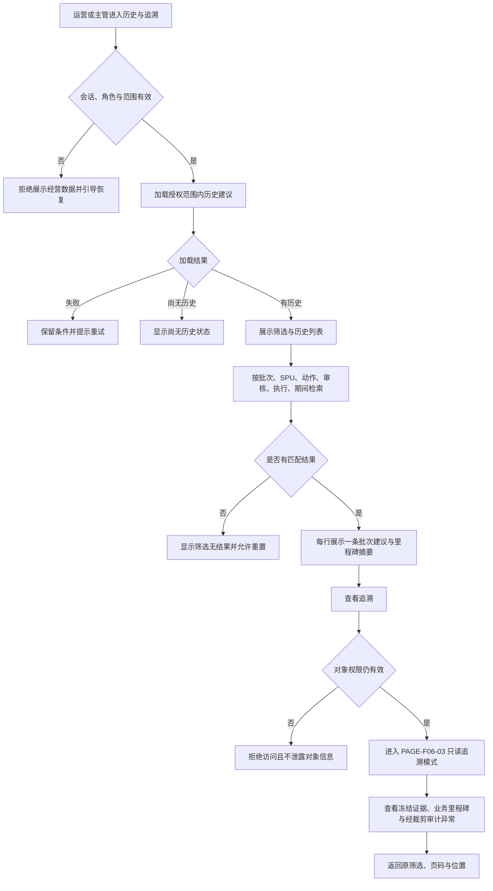

# 页面名称：历史与追溯列表页

## 1. 文档元信息

| 项目 | 内容 |
| :--- | :--- |
| 页面 ID | `PAGE-F08-01` |
| Source IDs | `REQ-F05-01`, `REQ-F08-01`, `REQ-F08-02`, `AC-F05-02`, `AC-F08-01`, `AC-F08-02`, `AC-F08-03`, `AC-F08-04`, `NFR-005` |
| 产品 | 趣然 AI 商品经营利润决策助手 |
| 模块 | 历史与追溯 |
| 阶段 | 阶段 1（MVP） |
| 页面类型 | 历史建议检索列表 |
| 适用终端 | PC Web，建议视口宽度不低于 1024px |
| 目标角色 | 运营、运营主管 |
| 上游入口 | 运营工作台、主管工作台、一级导航“历史与追溯” |
| 下游页面 | `PAGE-F06-03` 建议详情的只读追溯模式 |
| 文档状态 | 可进入高保真设计与验收设计 |

## 2. 页面概述

### 2.1 一句话定位

供运营和运营主管按批次、SPU、动作、审核状态、执行状态与业务期间检索历史建议，并进入只读详情复核“当时为什么这样建议、后来如何处理”的追溯入口。

### 2.2 存在理由

新数据会持续形成新批次，但不能覆盖旧批次的建议、审核、动作和结果记录。该页面把同一 SPU 在不同业务期间形成的多条建议明确分开，让用户可以围绕某一批次的原始规则与数据快照还原决策，而不是凭当前数据反推过去。

页面同时承担两类查证：一是沿业务里程碑查看建议生成、主管审核、运营动作、采购动作和业务结果；二是在授权范围内查看 AI 失败、越权拒绝、并发冲突和重复请求等审计异常，确认异常没有抹去既有成功事件。

### 2.3 页面目标（可衡量）

1. 历史结果中 100% 的行均能明确识别业务批次和 SPU，且每行只代表该批次的一条建议。
2. 用户可组合使用六类检索条件，并在返回列表、刷新页面后恢复筛选条件与页码。
3. 任一结果进入详情后，100% 显示该建议生成时冻结的批次、业务截止日、数据期间、规则版本、触发规则、原始关键值与生成时间。
4. 100% 的成功状态变化以追加方式呈现前后状态、操作者、时间和备注，不被后续状态覆盖。
5. 历史详情中不存在审核、执行或结果修改入口；误操作触发数为 0。
6. 运营与运营主管仅能查看其授权事业部和业务对象；采购计划无法进入通用历史列表。

### 2.4 不做什么（范围边界）

- 不提供趋势图、跨批次指标对比、同比或环比分析。
- 不把同一 SPU 的多个批次合并为一条记录，也不生成第二套“历史建议”身份。
- 不允许在本页或只读追溯详情中审核、执行、回填结果、删除或改写历史事件。
- 不提供自由排序来重新定义经营优先级；历史结果采用稳定顺序。
- 不提供批量操作、导出或跨事业部汇总。
- 不处理 SKU，历史对象粒度仅为 SPU（商品链接）。

## 3. 用户与场景

### 3.1 目标用户

| 用户 | 使用目的 | 可见范围 | 不可执行事项 |
| :--- | :--- | :--- | :--- |
| 运营 | 查找本人授权范围内的历史建议，复盘经营动作及结果 | 授权事业部内完整经营建议、本人可见的审核/动作/结果与审计记录 | 不得在历史模式修改审核、动作或结果 |
| 运营主管 | 复核某批次的建议依据、审核过程与跨角色执行结果 | 授权事业部内完整建议、审核、动作、结果及按权限开放的审计异常 | 不得在历史模式重新审核或改写既有事件 |
| 采购计划 | 不属于本页目标用户 | 无通用历史入口；仅可从本人采购任务进入经裁剪的任务详情 | 不得通过地址、筛选或追溯旁路查看完整利润、推广、售后和经营历史 |

### 3.2 核心使用场景

#### 场景 A：主管复核某次止损建议的完整链路

- 时机：周会复盘时，主管需要确认某 SPU 为什么在上月被建议“推广止损”。
- 前置条件：主管已登录并拥有该事业部查看权限；目标建议属于已完成处理的历史批次。
- 用户动作：选择业务期间和“推广止损”，再按 SPU 搜索；打开匹配行的只读详情，先核对冻结的利润率和触发规则，再沿业务里程碑查看审核、运营执行与结果记录，必要时展开审计异常。
- 期望结果：主管能够区分业务成功事件与失败请求，确认后续导入没有改写原建议，也不会在复盘过程中误触发重新审核。
- 用户感受：有据可查、结论可信，不必向多个部门逐份索要旧表。

#### 场景 B：运营追查同一 SPU 跨批次出现不同建议的原因

- 时机：运营发现同一 SPU 本周为“清仓”，但记得两个月前曾是“加投”。
- 前置条件：两个批次均在该运营授权范围内，且都保留原始快照。
- 用户动作：输入 SPU 标识，不限制动作，查看同一 SPU 在不同批次形成的独立结果行；分别进入两条建议的只读详情，核对各自业务截止日、数据期间、规则版本和关键值。
- 期望结果：两条记录不会被合并；运营能依据各自冻结数据理解差异，但页面不自动生成跨批次指标比较或趋势结论。
- 用户感受：历史口径清楚，不会把当前规则误当作过去的判断依据。

#### 场景 C：主管核查并发冲突是否影响已成功审核

- 时机：主管获知同一建议曾发生两人同时审核，需要确认最终业务状态是否完整。
- 前置条件：目标建议存在一次成功审核和至少一次并发冲突事件。
- 用户动作：从历史列表打开只读详情，查看业务里程碑中的成功审核，再展开审计异常查看并发冲突。
- 期望结果：成功审核仍作为业务主线保留；冲突作为异常事件单独出现，不替代、不删除成功事件。
- 用户感受：能看清“业务结果”和“失败请求”的区别，不会被异常记录误导。

#### 场景 D：筛选无结果时调整检索范围

- 时机：运营使用过窄的期间、动作和状态组合后没有匹配结果。
- 前置条件：系统已有历史记录，但当前组合条件无匹配项。
- 用户动作：查看空结果说明，逐项移除条件或一键重置筛选。
- 期望结果：页面明确这是“筛选无结果”而不是“系统尚无历史”，并保留用户当前条件供其判断。
- 用户感受：知道下一步如何恢复，不会误以为历史数据丢失。

### 3.3 用户核心诉求（优先级排序）

1. 准确找到指定批次或 SPU 的历史建议。
2. 确认历史建议引用的是生成时冻结的规则和数据，而非当前值。
3. 看清建议经过了哪些审核、执行和结果里程碑。
4. 在必要时核查审计异常，但不让异常淹没业务主线。
5. 明确角色边界，避免历史检索成为越权查看经营数据的旁路。

## 4. 信息架构

### 4.1 区域划分

1. 页面上下文区：说明当前事业部、当前角色和“历史只读”属性。
2. 检索条件区：承载批次、SPU、动作、审核状态、执行状态和业务期间。
3. 结果摘要区：显示匹配数量、已启用条件和重置入口。
4. 历史建议列表区：每行对应某一批次的一条 SPU 建议。
5. 分页区：承载页码、每页数量和总记录数。
6. 状态反馈区：承载加载、空结果、无历史、失败、失权与会话失效提示。

### 4.2 区域内容

| 区域 | 必须展示 | 业务目的 |
| :--- | :--- | :--- |
| 页面上下文区 | 页面标题、事业部、角色、只读说明 | 防止用户误认为可在历史页继续办理 |
| 检索条件区 | 六类检索条件、查询、重置 | 快速缩小历史范围 |
| 结果摘要区 | 匹配条数、当前条件摘要 | 让用户理解结果口径 |
| 历史建议列表区 | 批次、业务期间/截止日、SPU、建议动作、审核状态、执行状态、业务里程碑摘要、审计异常提示、查看追溯 | 识别对象并判断是否值得进入详情 |
| 分页区 | 上一页、下一页、页码、20/50/100 条选择 | 稳定浏览历史记录 |
| 状态反馈区 | 状态原因、恢复动作 | 区分无数据、无匹配和加载故障 |

列表中的“业务里程碑摘要”只概括已发生的生成、审核、运营动作、采购动作和业务结果，不以一条聚合状态替代各动作的真实状态。“审计异常提示”仅提示存在 AI 失败、越权拒绝、并发冲突或重复请求；完整内容在授权用户打开只读详情后查看。

## 5. 界面内容

### 5.1 元素清单

| 编号 | 元素 | 类型 | 展示内容 | 操作与反馈 | 权限/状态约束 |
| :--- | :--- | :--- | :--- | :--- | :--- |
| E01 | 页面标题 | 只读信息 | 历史与追溯、历史记录不可修改 | 无 | 所有获准进入本页者可见 |
| E02 | 事业部上下文 | 只读信息 | 当前授权事业部 | 无 | 不提供跨事业部切换越权范围 |
| E03 | 批次条件 | 精确选择/搜索 | 批次标识及可辨识的业务截止日 | 选择后收窄结果 | 仅返回授权范围内批次 |
| E04 | SPU 条件 | 搜索框 | SPU 标识或名称 | 查询匹配的历史建议 | 不支持 SKU 查询 |
| E05 | 动作条件 | 多选 | 加投、观察、推广止损、清仓、补货、禁止补货 | 支持一个或多个动作 | 选项不改变原建议动作 |
| E06 | 审核状态条件 | 多选 | 待审核、已通过、已驳回等既有状态 | 收窄结果 | 以建议整体审核状态为准 |
| E07 | 执行状态条件 | 多选 | 待执行、执行中、已执行、已记录结果、已关闭等 | 收窄结果 | 同时覆盖经营与采购动作；列表仍分别显示真实进度 |
| E08 | 业务期间条件 | 期间范围 | 起始期间、结束期间 | 仅检索落入范围的批次建议 | 起始不得晚于结束 |
| E09 | 查询 | 主操作 | 应用全部合法条件 | 刷新结果与结果摘要 | 加载期间防止重复触发 |
| E10 | 重置筛选 | 次操作 | 清除全部检索条件 | 恢复授权范围内历史结果 | 不改变任何历史记录 |
| E11 | 结果摘要 | 只读信息 | 匹配条数、当前条件 | 无 | 加载失败时不显示伪造数量 |
| E12 | 历史建议行 | 只读记录 | 批次、截止日、期间、SPU、动作、审核及分动作执行状态 | 整行或“查看追溯”进入只读详情 | 一行仅对应一个批次的一条建议 |
| E13 | 业务里程碑摘要 | 只读摘要 | 已生成、已审核、运营动作、采购动作、业务结果的实际进度 | 可进入详情查看完整事件 | 未发生的里程碑明确为未发生，不推断完成 |
| E14 | 审计异常提示 | 状态标识 | 异常类型及数量提示 | 在详情中按权限展开 | 不覆盖业务里程碑，不暴露无权内容 |
| E15 | 查看追溯 | 链接操作 | 查看该建议历史证据 | 打开 `PAGE-F06-03` 只读追溯模式 | 无对象权限时拒绝且不返回对象信息 |
| E16 | 分页 | 导航操作 | 页码、总数、每页 20/50/100 条 | 切页并保留条件 | 默认每页 50 条 |

### 5.2 辅助信息

- 页面顶部固定提示：“历史记录为生成时快照，仅供追溯，不可在此修改审核、执行或结果。”
- 同一 SPU 出现在多个批次时，每行必须同时展示批次和业务截止日，避免用户误认重复数据。
- 状态文案使用业务语义，不把“待执行”“执行中”“已记录结果”混为一个完成状态。
- 审计异常提示采用中性文案，例如“存在 2 条审计异常”，不直接把异常等同于业务失败。
- 加载失败显示“历史记录暂未加载成功”，不得显示“暂无历史”。
- 窄于支持范围时提示使用电脑端查看完整表格与追溯信息，不删减关键金额、比例、阈值、动作或状态语义。

## 6. 交互流程

### 6.1 页面加载与初始化

1. 校验当前会话、角色、事业部和历史列表访问范围。
2. 若用户无通用历史权限，停止展示业务内容并引导返回本人工作台；采购计划不显示本页导航入口。
3. 读取页面中已保留的检索条件、页码和每页数量；不存在已保留条件时展示授权范围内的历史建议。
4. 加载期间展示列表骨架及“正在读取历史记录”，不展示旧结果冒充新结果。
5. 加载成功后显示结果摘要、稳定顺序的历史建议和分页；加载失败进入可重试状态。

### 6.2 核心操作流程

#### 流程一：组合检索历史建议

1. 用户选择业务期间，可继续选择批次、动作、审核状态和执行状态，或输入 SPU。
2. 页面在提交查询前校验期间范围与条件合法性；非法条件原位提示且不发起查询。
3. 用户点击“查询”，页面保留完整条件并展示加载状态。
4. 返回结果后，页面只收窄可见记录，不修改原建议内容、状态或顺序依据。
5. 若无匹配项，显示“当前条件无匹配历史”，并提供移除条件和重置筛选。

#### 流程二：进入只读追溯详情

1. 用户在目标行点击“查看追溯”。
2. 页面再次校验当前用户对该建议的对象权限。
3. 校验通过后进入 `PAGE-F06-03` 的只读追溯模式，显示该建议生成时冻结的数据、规则、业务里程碑和按角色裁剪的审计详情。
4. 详情中的审核、执行和结果表单均不出现；任何当前规则或新批次数据都不能替换历史快照。
5. 用户返回时恢复原筛选条件、页码和列表位置。

#### 流程三：查看业务里程碑与审计异常

1. 用户先在列表行查看业务里程碑摘要，判断建议已走到哪个业务阶段。
2. 若行上提示存在审计异常，用户进入只读详情后主动展开审计详情。
3. 业务时间线仅按发生顺序显示成功的生成、审核、执行和结果事件。
4. AI 失败、越权拒绝、并发冲突和重复请求作为独立审计异常呈现。
5. 异常事件不得替换同一建议既有的成功事件，也不得将业务状态回退为失败请求的状态。

### 6.3 辅助操作

- 用户可一键重置全部条件，重置后回到第一页。
- 切换每页数量后回到能包含当前浏览位置的有效页，并保留全部检索条件。
- 刷新页面或从详情返回时恢复条件和页码；若原页因权限变化已不存在，显示可见范围内的首个有效页。
- 会话失效时引导重新进行钉钉认证；认证成功且权限仍有效时返回原检索上下文。

## 7. 状态与边界

### 7.1 页面状态全景

| 状态 | 触发条件 | 页面表现 | 可恢复动作 |
| :--- | :--- | :--- | :--- |
| 首次加载 | 已获权，正在读取历史 | 列表骨架、加载说明，检索暂不可重复提交 | 等待或重试 |
| 正常有结果 | 存在匹配历史 | 显示结果摘要、历史行与分页 | 调整条件、查看追溯 |
| 尚无历史 | 授权范围内从未形成历史建议 | 明确说明“尚无历史建议”，不显示空表误导 | 返回工作台或数据批次 |
| 筛选无结果 | 已有历史但当前条件无匹配 | 显示当前条件摘要及重置入口 | 移除条件或重置 |
| 加载失败 | 历史记录未成功读取 | 保留检索条件，显示失败原因与重试 | 重试或稍后再试 |
| 部分信息不可用 | 列表可读但某条里程碑/异常摘要暂未完整取得 | 明确标记“部分追溯信息暂不可用”，不得推断为无事件 | 重试该记录或进入详情核查 |
| 无通用历史权限 | 采购计划、无角色或已失权用户访问 | 不显示记录、数量、筛选选项和对象身份 | 返回本人工作台或联系运维/系统管理员 |
| 对象失权 | 打开某行时已失去对象权限 | 停止进入详情，不显示该对象新信息 | 返回已裁剪列表 |
| 会话失效 | 登录态过期 | 清除页面中的经营内容并进入认证恢复 | 重新钉钉认证 |

### 7.2 边界与容错

1. **网络中断**：保留当前检索条件与页码；未成功取得的新结果不覆盖已明确标识的上次结果，用户可重试。
2. **会话在浏览中失效**：立即停止返回经营数据；重新认证后再次校验角色和对象权限，再决定是否恢复原位置。
3. **业务期间非法**：起始期间晚于结束期间、格式无效或超出可选历史范围时原位提示，不执行查询。
4. **筛选条件失效**：角色变化后原条件包含无权批次或对象时，移除无权结果并提示权限范围已更新，不暴露被移除对象信息。
5. **同一 SPU 跨批次重复出现**：保留为多行，以批次、业务期间和截止日区分；不得合并、去重或用新记录覆盖旧记录。
6. **新批次在浏览期间生成**：当前页面不自动改写已有行；用户主动刷新后可看到新批次，原历史建议与状态保持不变。
7. **浏览期间状态有新增事件**：刷新后追加展示新事件，但生成时的规则版本、触发规则和关键值不变化。
8. **业务事件与审计异常并存**：成功业务里程碑保留在主线；AI 失败、越权拒绝、并发冲突和重复请求仅进入审计异常，不互相覆盖。
9. **部分事件读取失败**：明确提示追溯信息不完整，不把“未读取到”显示为“从未发生”。
10. **直接访问无权详情**：拒绝进入，不返回建议身份、SPU、状态、利润、推广、售后或库存信息。
11. **重复打开同一建议**：始终进入同一历史建议身份，不复制记录，不新增事件。
12. **列表页码失效**：筛选后总页数减少时自动落到有效页，并保持筛选条件，不展示空白死页。

## 8. 业务规则与校验

### 8.1 字段定义

| 字段 | 含义 | 列表展示 | 详情要求 |
| :--- | :--- | :---: | :--- |
| 业务批次 | 一次有效导入与决策形成的唯一业务批次 | 是 | 显示完整批次标识 |
| 业务期间 | 建议所依据的数据自然月 | 是 | 显示起止期间 |
| 业务截止日 | 冻结新品判断及滚动口径的业务基准日 | 是 | 必须显示 |
| SPU | 商品链接粒度的经营对象 | 是 | 显示 SPU 标识和名称 |
| 规则版本 | 生成该建议时使用的固定规则版本 | 可在追溯入口提示 | 必须显示冻结版本 |
| 触发规则 | 原始值与阈值比较后命中的业务规则 | 否 | 必须显示且不可被当前规则替换 |
| 原始关键值 | 生成建议时采用的销售、利润、品退、库存等关键依据 | 否 | 按角色显示原始值、采用值、周期、阈值和比较关系 |
| 建议动作 | 该批次形成的经营主动作及补货/禁补动作 | 是 | 显示完整冻结动作组合 |
| 审核状态 | 建议整体的主管审核结果 | 是 | 显示完整审核事件 |
| 经营动作状态 | 运营负责动作的执行与结果进度 | 是 | 显示状态变化事件 |
| 采购动作状态 | 补货或禁补动作的执行与结果进度 | 是（存在时） | 显示状态变化事件 |
| 业务里程碑 | 建议生成、审核、经营动作、采购动作和业务结果的成功事件 | 摘要 | 按发生顺序显示 |
| 审计异常 | AI 失败、越权拒绝、并发冲突、重复请求等非业务成功事件 | 仅提示 | 按权限展开 |

### 8.2 校验规则

1. 批次、SPU、动作、状态和期间条件只能作用于当前角色获准查看的历史范围。
2. 业务期间的起始值不得晚于结束值；清空任一端时按已选择的有效范围检索。
3. 每个列表行必须唯一对应一个“业务批次 + SPU”建议，不得因多个动作或多个事件拆成重复建议行。
4. 一个建议存在经营与采购双动作时，列表分别展示其执行进度；不得用聚合状态隐藏部分执行。
5. 查看追溯前必须再次确认对象权限；列表曾经可见不代表详情访问永久有效。
6. 事件展示必须包含可用的前状态、后状态、操作者、时间和备注；确无备注时明确显示“未填写备注”，不得伪造内容。
7. 加载失败、字段无权和业务值为空必须使用不同语义，不得统一显示为 0 或“无异常”。

### 8.3 特殊业务规则

- 新批次只新增一份属于该批次的行动清单及建议，不覆盖任一历史批次的建议、审核、动作或结果记录。
- 历史建议始终引用生成时冻结的业务期间、截止日、规则版本、触发规则、商品类型、关键值和动作组合。
- 业务时间线只展示成功的业务状态迁移及备注；失败请求进入审计异常。
- 已驳回、部分执行、并发冲突或 AI 失败不得删除此前已成功记录的事件。
- 运营和运营主管按授权范围查看完整经营追溯；采购计划不拥有本页入口，只能从本人采购任务进入经裁剪的只读任务信息。
- 页面不根据当前数据重新计算历史建议，也不对跨批次差异给出自动趋势或优劣结论。

## 9. 页面流转

### 9.1 流转图

### 9.2 与其他模块的关系

| 关联模块/页面 | 关系 |
| :--- | :--- |
| 运营工作台 `PAGE-F05-01` | 提供通用历史入口；返回后仍按当前授权范围展示工作台 |
| 主管工作台 `PAGE-F06-01` | 提供主管复盘入口；不在历史页发起新审核 |
| 行动清单 `PAGE-F05-02` | 当前批次与历史批次共享同一建议身份；历史页不复制行动清单 |
| 建议详情 `PAGE-F06-03` | 复用同一详情页，以只读追溯模式展示冻结证据、业务里程碑和审计详情 |
| 采购工作台 `PAGE-F06-02` | 不跳转到通用历史页；采购仅从本人任务进入裁剪后的任务详情 |
| 认证恢复 `PAGE-F07-02` | 会话失效、无角色或失权时承接恢复，不显示经营数据 |

### 9.3 扩展预案

- 后续若增加评价、退款原因、广告明细或外部回执，只能作为版本化证据或事件追加到既有批次/SPU 建议身份，不能改写旧快照。
- 后续若引入 SKU，必须先重新确认产品需求，并作为 SPU 的下级对象扩展；本页既有 SPU 历史身份保持不变。
- 后续若增加跨批次分析，应建立独立需求和独立分析页面；不得把趋势图或指标比较混入本 MVP 追溯列表。

## 10. 数据需求

### 10.1 页面需要什么数据

| 数据组 | 必要内容 | 用途 |
| :--- | :--- | :--- |
| 用户上下文 | 当前身份、角色、事业部、会话状态、对象可见范围 | 决定页面与记录是否可见 |
| 批次摘要 | 批次标识、事业部、业务期间、业务截止日、生成时间 | 检索并区分历史建议 |
| 建议身份 | SPU 标识、SPU 名称、批次内建议身份 | 保证一行一条批次建议 |
| 决策摘要 | 商品类型、建议动作组合、规则版本 | 识别建议及追溯入口 |
| 状态摘要 | 建议审核状态、经营动作状态、采购动作状态、结果状态 | 展示真实处理进度 |
| 业务里程碑摘要 | 已发生里程碑、最近业务事件时间 | 帮助用户判断处理阶段 |
| 审计异常摘要 | 是否存在异常、授权可见的异常类型与数量 | 提示用户进入详情核查 |
| 详情追溯 | 冻结规则、触发条件、原始关键值、成功事件、异常事件 | 在 `PAGE-F06-03` 只读模式还原完整依据 |
| 分页信息 | 总记录数、当前页、每页数量 | 稳定浏览历史 |

### 10.2 页面提交什么数据

本页只提交检索和导航意图，不提交任何经营状态变化：

- 批次、SPU、动作、审核状态、执行状态和业务期间条件。
- 当前页码与每页数量。
- 进入只读详情时的历史建议身份和返回列表上下文。
- 重试加载或重新认证后的返回意图。

本页不得提交审核决定、执行确认、结果、业务备注、规则调整或历史修订。

### 10.3 明确排除的数据

- SKU 及 SKU 级费用、销量或库存。
- 趋势序列、同比/环比、跨批次指标差异结论。
- 广告明细、退款原因、评价明细等尚未纳入首版的经营明细。
- 消费者个人信息。
- LiteLLM 部署密钥、认证凭据或内部错误敏感信息。
- 用户无权查看的其他事业部、其他对象和采购角色不必要的利润、推广、售后字段。

## 11. 验收标准

### 11.1 功能验收

- [ ] 运营和运营主管可分别按批次、SPU、动作、审核状态、执行状态和业务期间检索其授权范围内的历史建议。
- [ ] 六类条件可组合使用；查询、重置、刷新和从详情返回后，筛选条件与页码表现一致。
- [ ] 历史列表每行只代表某一批次的一条 SPU 建议；同一 SPU 在不同批次显示为独立行，并展示可区分的期间或截止日。
- [ ] 新批次建立后，历史批次的建议、审核、动作和结果仍可见，且内容未被覆盖。
- [ ] 每行展示建议动作、整体审核状态、经营动作状态，并在存在采购动作时独立展示采购动作状态。
- [ ] 每行提供业务里程碑摘要；存在 AI 失败、越权拒绝、并发冲突或重复请求时提供审计异常提示。
- [ ] 点击“查看追溯”进入 `PAGE-F06-03` 的只读追溯模式，不创建第二套详情或历史身份。
- [ ] 只读详情显示导入批次、业务截止日、数据期间、规则版本、触发规则、原始关键值和生成时间。
- [ ] 每次成功审核或动作状态变化均以追加事件显示前状态、后状态、操作者、时间和备注。
- [ ] 已驳回、部分执行、并发冲突与 AI 失败均不会删除或替换既有成功事件。
- [ ] 列表使用传统分页，默认每页 50 条，并可切换 20、50、100 条。
- [ ] 页面不提供趋势图、跨批次指标比较、批量操作、导出或历史编辑能力。

### 11.2 体验验收

- [ ] 用户能在第一屏识别当前事业部、当前角色及“历史只读”属性。
- [ ] “尚无历史”“筛选无结果”“加载失败”使用不同说明和恢复动作，不会相互伪装。
- [ ] 同一 SPU 多批次出现时，批次、业务期间和截止日足以让用户快速辨别，不被误认为重复行。
- [ ] 业务里程碑与审计异常使用不同层级表达，用户不会把失败请求误认为最终业务状态。
- [ ] 经营与采购动作进度不一致时，列表明确显示各自动作状态，不以“已完成”掩盖部分执行。
- [ ] 查询加载、失败重试、重置筛选和分页切换均保留用户仍需的上下文。
- [ ] 从只读详情返回后恢复原筛选、页码与浏览位置。
- [ ] 部分追溯信息读取失败时明确提示“不完整”，不显示为“无事件”或 0。
- [ ] 视口不足时提示使用电脑端，不截断金额、比例、阈值、动作和状态的完整语义。

### 11.3 安全验收（产品层）

- [ ] 只有获准的运营和运营主管可进入通用历史列表；采购计划无该导航入口，直接访问也不返回列表内容。
- [ ] 页面加载、检索、分页、查看详情、错误提示和审计详情均按当前角色、事业部与对象权限裁剪。
- [ ] 无角色、会话失效或对象失权时，不展示记录数量、筛选选项、批次、SPU、状态或任何经营数据。
- [ ] 采购计划只能从本人采购任务进入必要的裁剪详情，不得借本页看到完整利润、推广、售后或其他经营历史。
- [ ] 历史列表和追溯详情均不出现审核、执行、结果修改、删除或规则调整入口。
- [ ] 历史建议始终显示生成时冻结的规则版本、触发规则和关键值，不被当前规则、源表变化或后续状态覆盖。
- [ ] 成功事件和审计异常只能追加展示；任何后续事件不得覆盖或删除既有事件。
- [ ] 越权访问和加载错误文案不泄露其他角色、模块、建议身份、对象状态、敏感字段或 LiteLLM 凭据。
- [ ] 用户从列表进入详情时重新校验对象权限，不能依赖进入列表时的旧授权结果。
- [ ] 会话失效后必须重新钉钉认证并再次确认权限，不能凭历史页面缓存继续查看经营数据。
