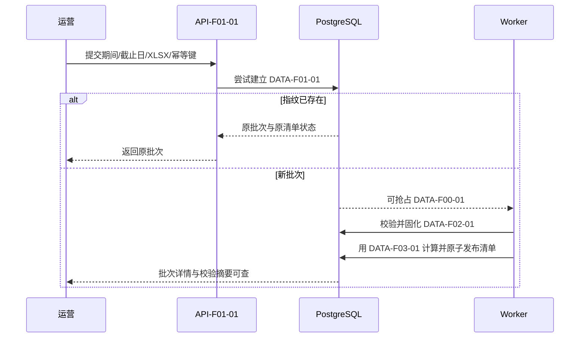
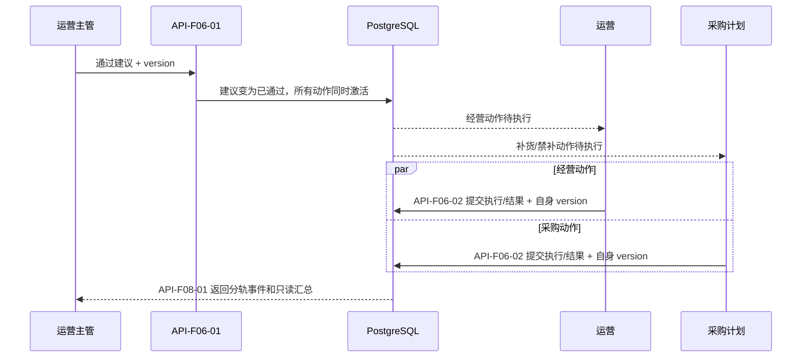

# 趣然 AI 商品经营与利润决策助手技术方案

> 生成时间：2026-08-04  
> 基于 PRD：`PRD详细版.md`  
> 基于设计：`设计决策蓝图.md`（用户已总确认）  
> 上游契约：`requirements.md` revision 2  
> 技术方案版本：v1.0

## 1. 产品技术画像

这是一个面向趣然电商玩具事业部的内部 PC Web 工作台。MVP 每周处理一批 XLSX，以 SPU 为唯一决策粒度，先用确定性规则生成唯一经营动作和补货/禁补动作，再异步请求现有 LiteLLM 网关增强解释；运营主管整体审核，运营与采购计划分别执行。首轮只有 10—20 个 SPU，真正的技术难点不是吞吐量，而是批次幂等、规则确定性、状态与审计原子一致、采购最小可见以及 AI 失败不阻塞，因此推荐单数据库的模块化单体。

### 1.1 产品形态

- 产品类型：内部 PC Web App。
- 主要入口：桌面浏览器，通过产品登录页发起钉钉统一身份认证。
- 端的数量：单端；1440px 为主画布，最低支持 1280px，不建设移动业务端。
- 决策粒度：只到 SPU/商品链接，不处理 SKU。

### 1.2 核心技术约束

| 约束 | 来源 | 技术含义 |
| :--- | :--- | :--- |
| 每周一导入 XLSX，首轮 10—20 个真实 SPU | PRD §0.1、§0.2、FR-1 | 服务端解析文件即可；不需要流式数据平台、对象存储或分布式计算。 |
| 相同事业部、期间、截止日和文件内容必须返回原批次 | PRD FR-1、AC-F01-02 | 在数据库建立批次指纹唯一约束；接口重试不能创建第二套批次、清单或事件。 |
| 字段错误按影响范围降级，只有身份失败才拒绝整行 | PRD §3.2、FR-1、FR-2 | 保存原始值、采用值、源行号和质量标记；解析器不能用默认值或 AI 猜值。 |
| 同一快照与规则版本必须产生相同分类和动作 | PRD §3、NFR-001 | 规则引擎写成纯确定性领域模块；业务截止日、规则版本和输入快照全部冻结。 |
| 止损/清仓与禁补原子生成；建议整体审核、动作分别执行 | PRD §3.5、§6.3—§6.4 | 决策、动作项和事件在同一 PostgreSQL 事务提交；建议与动作使用独立状态机。 |
| 所有状态提交携带 version，旧页面不得覆盖新状态 | PRD FR-6、AC-F06-06 | 使用乐观锁条件更新；冲突返回最新状态、操作者和时间，不提供强制覆盖。 |
| AI 只解释，等待、失败或越界不能阻塞规则清单 | PRD FR-4、NFR-004 | 规则结果先提交，LiteLLM 由数据库任务表和独立 Worker 异步调用；结构化兜底始终可用。 |
| 钉钉是唯一身份入口，角色由 IT 维护 | PRD §0.2、FR-7、REQ-F07-03 | 服务端完成钉钉回调与角色映射；无认证或无映射默认拒绝，不建设密码和角色后台。 |
| 采购只能看补货任务及必要库存、销量依据 | PRD §2.1、FR-7、NFR-002 | 后端使用独立采购读模型/响应 DTO；不能依赖前端隐藏字段。 |
| 历史快照和成功事件不可被后续导入或状态更新覆盖 | PRD FR-8、NFR-005 | 决策快照不可变、事件只追加；状态改变与审计事件同事务成功或失败。 |
| 国内内部使用，不增加海外托管或新付费服务 | 设计蓝图 §8—§9 | 容器运行在公司可达 Linux；字体、部署、存储和监控不依赖海外 SaaS/PaaS。 |
| 不自动修改广告、采购或库存系统 | PRD §2.3、FR-6 | MVP 只记录人工执行事实；不得把人工确认表达为外部系统回执。 |

### 1.3 团队与规模画像

- 团队规模假设：PRD 未指定；实施按 2—4 人小队（前端、后端、测试/产品可兼任）规划。
- 技术栈偏好：已由总确认蓝图确定为 React + TypeScript + Vite、FastAPI、PostgreSQL。
- 用户规模预期：单事业部 MVP/早期内部试点；首轮 10—20 个 SPU，周度批处理，低并发。
- 上线时间压力：中偏紧；应优先跑通导入→规则→审核→分动作→追溯的最小闭环。

### 1.4 非功能性需求

| 维度 | MVP 目标 |
| :--- | :--- |
| 确定性 | 相同快照和规则版本逐项产生相同商品类型、主动作和库存动作。 |
| 一致性 | 决策与动作原子生成；状态迁移与审计事件同事务提交。 |
| 安全 | 钉钉认证、服务端 RBAC 默认拒绝、安全 Cookie、CSRF 防护、上传资源限制、凭据不入响应和业务日志。 |
| 最小可见 | 采购的页面、接口、错误和追溯路径均不返回利润、推广、品退或售后字段。 |
| 可恢复 | PostgreSQL 每日加密备份，保留 30 天；设计目标 RPO 不超过 24 小时、RTO 不超过 4 小时，上线前以恢复演练校准。 |
| 可审计 | 批次、规则版本、关键值、操作者、时间、前后状态与冲突/拒绝事件可追溯。 |
| AI 降级 | LiteLLM 不可用或输出越界时，结构化四要素、审核和执行仍可用。 |

## 2. 技术栈总览（一张图）

```text
┌─────────────────────────────────────────────────────────────────────────┐
│ 前端层 │ React 19.2.8 + TypeScript 7.0.2 + Vite 8.2.0 + Ant Design 6.5.3 │
│        │ React Router 7.18.2 + TanStack Query 5.101.4 + tokens.css       │
├─────────────────────────────────────────────────────────────────────────┤
│ 后端层 │ FastAPI 0.128.8 + Pydantic 2.13.4 + SQLAlchemy 2.0.51          │
│        │ Alembic 1.16.5 + psycopg 3.2.13 + openpyxl 3.1.5               │
├─────────────────────────────────────────────────────────────────────────┤
│ 数据层 │ PostgreSQL 单实例；无 Redis、无独立缓存、无搜索引擎             │
├─────────────────────────────────────────────────────────────────────────┤
│ 任务层 │ PostgreSQL 任务表 + 独立 Worker；行锁/租约抢占、幂等重试        │
├─────────────────────────────────────────────────────────────────────────┤
│ AI 层  │ 现有 LiteLLM 网关 + HTTP 适配器；无 RAG/Agent/向量库/Embedding │
├─────────────────────────────────────────────────────────────────────────┤
│ 基础设施│ 公司可达 Linux 容器 + 钉钉认证 + 结构化日志/健康检查/数据库备份 │
└─────────────────────────────────────────────────────────────────────────┘
```

所有维度均采用用户已确认蓝图中的直接默认方案。MVP 不再制造候选矩阵，也不引入蓝图外服务、账号或付费资源。

### 2.1 稳定工程设计契约

#### API 契约 ID

| Design ID | 责任边界 | 主要来源 |
| :--- | :--- | :--- |
| API-F01-01 | 建立批次、指纹幂等、提交校验/规则处理 | REQ-F01-01—REQ-F01-02 |
| API-F01-02 | 查询批次列表、批次详情、校验结果和指标/规则投影 | REQ-F01-01—REQ-F03-03 |
| API-F04-01 | 查询 AI 解释状态和已过滤的增强解释 | REQ-F04-01—REQ-F04-03 |
| API-F05-01 | 查询角色化工作台、行动清单和建议详情读模型 | REQ-F05-01—REQ-F05-03, REQ-F07-01—REQ-F07-02 |
| API-F06-01 | 运营主管整体通过/驳回建议，校验 version 并原子追加审核事件 | REQ-F06-01, REQ-F06-03 |
| API-F06-02 | 运营/采购分别更新本角色动作和结果，校验 version 并追加事件 | REQ-F06-02—REQ-F06-03 |
| API-F07-01 | 钉钉认证回调、会话建立/失效、IT 角色映射解析与默认拒绝 | REQ-F07-01—REQ-F07-03 |
| API-F08-01 | 按角色裁剪查询批次、建议、审核、动作与结果事件 | REQ-F08-01—REQ-F08-02 |

#### 数据契约 ID

| Design ID | 实体/不变性 | 主要来源 |
| :--- | :--- | :--- |
| DATA-F01-01 | ImportBatch、ImportError、DataQualityFlag；批次指纹唯一，发布后不覆盖 | REQ-F01-01—REQ-F01-02 |
| DATA-F02-01 | SpuSnapshot；期间、业务截止日、指标原值和质量标记冻结 | REQ-F02-01—REQ-F02-03 |
| DATA-F03-01 | RuleVersion、DecisionRecord；同一输入与版本的结论确定 | REQ-F03-01—REQ-F03-03, NFR-001 |
| DATA-F04-01 | AIExplanation；与 decision_id 绑定，独立状态，不改写决策字段 | REQ-F04-01—REQ-F04-03 |
| DATA-F06-01 | ActionItem、ActionResult；建议级审核与动作级执行分离，每动作独立 version | REQ-F06-01—REQ-F06-03 |
| DATA-F07-01 | AuthenticatedActor、RoleMapping；稳定 actor_ref 与有效业务角色同时存在才授权 | REQ-F07-01—REQ-F07-03, NFR-002 |
| DATA-F08-01 | ReviewEvent、ActionEvent；只追加、不被当前状态更新覆盖 | REQ-F08-01—REQ-F08-02, NFR-005 |
| DATA-F00-01 | ProcessingJob；用于批次和 AI 任务租约/重试，不是业务真值源 | design-derived: DEC-001 |

#### 关键流程 ID 与时序

- `SEQ-F01-01`：批次导入、幂等、校验、固定规则和清单发布。
- `SEQ-F04-01`：清单就绪后异步 LiteLLM 解释与降级。
- `SEQ-F06-01`：建议整体审核，通过后激活经营/采购动作并独立记录结果。
- `SEQ-F07-01`：钉钉认证、角色映射与默认拒绝。
- `SEQ-F08-01`：按角色裁剪追溯历史快照与事件。





#### 状态与冲突契约

| 实体 | 合法迁移 | 非法迁移 | 并发冲突 |
| :--- | :--- | :--- | :--- |
| ImportBatch | 已接收→校验中→规则处理中→清单就绪；校验中→失败 | 失败/清单就绪后覆盖同批次快照 | 同指纹只返回首个批次，不生成第二事件链 |
| AIExplanation | 待生成→生成中→已生成/生成失败 | AI 状态改变批次清单就绪或决策字段 | 任务租约与幂等键保证单次结果绑定 |
| DecisionRecord | 待审核→已通过/已驳回 | 终态直接改回待审核；主动作和补货动作分别审核 | version 不匹配则不改状态，返回最新操作人/时间 |
| ActionItem | 待审核激活→待执行/随建议驳关闭；待执行→已执行→已记录结果 | 未通过就执行；运营更新采购动作或反向更新 | 每个动作独立 version，冲突不覆盖且追加审计拒绝事件 |

## 3. 前端技术选型

### 3.1 推荐：React + TypeScript + Vite 单页应用

- **推荐方案**：React 19.2.8、TypeScript 7.0.2、Vite 8.2.0；组件基础使用 Ant Design 6.5.3，路由使用 React Router DOM 7.18.2，服务端状态使用 TanStack Query 5.101.4。
- **决策证据**：蓝图已明确 PC Web、React + TypeScript + Vite；9 个 MVP 页面以表格、筛选、表单、状态标签、Tabs 和确认弹窗为主，Ant Design 可在不新增托管服务的前提下覆盖这些企业组件。
- **当前代价**：这是客户端渲染应用，不提供 SEO 或服务端渲染；Ant Design 默认视觉必须经 `tokens.css` 与 `ConfigProvider` 收敛，不能直接使用默认品牌外观。
- **升级触发条件**：只有公开站点需要 SEO/首屏服务端渲染，或出现独立移动端正式需求时，才重新评估前端渲染与多端架构；内部工作台不因此预建 SSR。

### 3.2 核心配置建议

- 路由：按认证、工作台、批次、行动、追溯五个业务分区组织；登录回跳使用短期一次性 `state` 防重放，业务筛选写入 URL 查询参数。
- 状态管理：TanStack Query 管理服务端状态和缓存失效；页面瞬时状态使用 React 本地状态；不引入 Redux 或新的全局状态基础设施。
- 权限：路由守卫只负责体验；后端响应 DTO 与写接口仍执行最终权限裁剪。采购端不接收完整对象后再由前端删除字段。
- 样式：`tokens.css` 是视觉契约，Ant Design 主题令牌只做映射；页面使用项目 CSS，不加载境外 Web Font。
- 表单：导入、审核、执行和结果表单提交时携带 `version`；冲突后丢弃本地成功态并刷新服务器真值。
- 构建：前端静态产物由应用容器内同源服务提供，避免为 MVP 增加 CDN 或独立静态托管账号。

### 3.3 风险与缓解

- 风险：Ant Design 的默认大尺寸组件降低 1440px 数据密度。→ 缓解：用设计 token 统一紧凑间距、表格行高和固定关键列，并在 1440/1280 两档做视觉回归。
- 风险：前端误把权限隐藏当作数据隔离。→ 缓解：为运营/主管/采购分别定义响应模型和契约测试，浏览器缓存不持久化完整经营对象。

## 4. 后端技术选型

### 4.1 推荐：FastAPI 模块化单体 + 独立 Worker

- **推荐方案**：FastAPI 0.128.8、Pydantic 2.13.4、SQLAlchemy 2.0.51、Alembic 1.16.5、psycopg 3.2.13；XLSX 使用 openpyxl 3.1.5，外部 HTTP 使用 httpx 0.28.1。
- **决策证据**：蓝图已确认 Python + FastAPI；规则计算和 XLSX 解析适合服务端 Python，且批次、建议、动作和事件需要共享一个事务边界。首轮低并发不需要拆微服务。
- **当前代价**：Web 与 Worker 共用代码库和数据库，错误隔离弱于多服务；必须通过模块依赖规则和独立进程避免后台任务阻塞请求。
- **升级触发条件**：只有单个模块出现独立扩缩容需求、发布节奏冲突或可测量的资源争用，才把该模块从单体边界剥离；不能以未来可能增长为理由提前拆分。

### 4.2 模块与事务边界

```text
app/
├── identity_access     钉钉身份、会话、RoleMapping、RBAC
├── import_batches      XLSX 临时解析、指纹、校验、SPU 快照
├── metrics_rules       指标口径、规则版本、确定性规则引擎
├── decisions_ai        DecisionRecord、结构化兜底、LiteLLM 适配器
├── workflow            建议审核、ActionItem、ActionResult、乐观锁
├── trace               不可变快照、追加事件、角色化追溯读模型
└── jobs                ProcessingJob、租约、重试、Worker 入口
```

- 新批次事务：先用指纹唯一约束建立批次；指纹冲突直接读取原批次，不新增建议或事件。
- 规则发布事务：指标快照、决策、经营动作、补货/禁补动作和初始事件一次提交；任一写入失败则整体回滚。
- 审核/执行事务：以 `id + version + allowed_state` 条件更新，并在同一事务追加事件；受影响行数为 0 即返回冲突或既有结果。
- AI 事务：只更新 `AIExplanation` 和 AI 事件，不允许修改规则结论、审核状态和动作状态。

### 4.3 API 与后台任务

- API 使用同源 REST/JSON，所有列表采用服务端分页；错误响应使用稳定错误码，不在无权限响应中返回对象身份。
- 导入接口完成文件级安全检查和批次幂等建立即返回批次处理状态；解析和规则处理由 Worker 执行，页面轮询批次状态即可，MVP 不增加 WebSocket。
- `ProcessingJob` 使用 PostgreSQL 行锁与租约抢占；任务记录业务幂等键、尝试次数、下次执行时间、租约到期和最后错误摘要。
- LiteLLM 重试只针对明确可重试的超时/临时错误，使用有限次数与退避；最终失败写入失败状态并保留结构化兜底。

### 4.4 风险与缓解

- 风险：Worker 崩溃后任务长期占用。→ 缓解：租约到期可被重新抢占，任务处理器以批次/解释幂等键重复执行。
- 风险：规则逻辑与页面展示各自实现导致边界不一致。→ 缓解：规则只在后端领域模块实现，前端只展示服务器返回的规则路径和阈值。

## 5. 数据层选型

### 5.1 主数据库：PostgreSQL 单实例

- **推荐方案**：公司 Linux 环境内的单实例 PostgreSQL，生产部署固定受支持稳定主版本与镜像摘要；应用通过 SQLAlchemy + psycopg 访问，Alembic 管理迁移。
- **决策证据**：批次指纹唯一性、决策/动作/事件原子性、`version` 乐观锁、任务抢占和历史查询都需要可靠关系事务；蓝图已明确 PostgreSQL。
- **当前代价**：数据库既承载业务真值又承载任务队列，长事务或低效查询会互相影响；MVP 必须保持任务短事务、分页查询和明确索引。
- **升级触发条件**：只有监控证明任务抢占影响业务请求、单实例资源持续饱和或出现已批准的多实例高可用目标时，才分别评估专用队列、只读副本或高可用数据库；MVP 不先引入。

### 5.2 核心数据约束

- `import_batch`：对事业部、数据期间、业务截止日和文件内容组成的指纹建立唯一约束。
- `spu_snapshot`：保存身份快照、原始字段、采用值、统计期间和质量标记；历史批次不可被新导入更新。
- `rule_version` 与 `decision_record`：保存规则版本、分类、唯一主动作、补货结论、触发阈值和结构化四要素。
- `action_item`：经营动作与采购动作独立行；止损/清仓与禁补在同一事务建立。
- `review_event`、`action_event`：只追加，不使用覆盖式“最后一条日志”代替历史。
- `processing_job`：唯一业务幂等键、任务状态、租约、重试与错误摘要；不保存 deployment secret。
- 金额使用定点数，比例按统一精度存储，业务日期与绝对事件时间分列；规则计算禁止使用页面格式化后的值。

### 5.3 缓存层：不激活

- **推荐方案**：不使用 Redis 或应用级共享缓存。
- **决策证据**：内部低并发、首轮 10—20 个 SPU、默认 20 条分页，PostgreSQL 索引足以支持。
- **当前代价**：重复列表请求会直接查询数据库。
- **升级触发条件**：只有真实监控显示相同读查询持续成为数据库瓶颈，且索引和查询改写不能解决时，才设计可失效缓存；权限裁剪结果不得跨角色复用。

### 5.4 搜索引擎：不激活

- **推荐方案**：使用 PostgreSQL 精确筛选、索引和有限文本匹配，不部署独立搜索引擎。
- **决策证据**：MVP 只需按批次、SPU、动作、状态、操作者和时间筛选，无全文检索或海量日志搜索需求。
- **当前代价**：不支持复杂相关性搜索和跨字段模糊检索。
- **升级触发条件**：只有历史数据增长后出现明确全文检索需求且 PostgreSQL 查询达不到已确认响应目标时再评估；当前不预建索引服务。

## 6. AI 能力选型

### 6.1 LLM 接入：现有 LiteLLM 网关

- **推荐方案**：产品后端仅调用运维现有 LiteLLM 网关的逻辑路由，使用 httpx 0.28.1 封装适配器；产品不直接持有模型厂商账号或用户级密钥。
- **主模型**：不在产品层指定。具体模型由运维在既有 LiteLLM 路由中配置和轮换，产品契约只依赖结构化响应能力。
- **备用模型**：产品层不新增备用模型；网关不可用或所有路由失败时，直接使用固定规则生成的结构化四要素兜底。
- **决策证据**：上游只确认已有 LiteLLM 网关和 deployment secret 配置责任，没有确认厂商、模型名称或额外账号；AI 又不能决定或阻塞业务动作。
- **当前代价**：产品无法保证某个模型的固定文风或延迟；解释质量受网关路由影响。
- **升级触发条件**：只有运维提供已批准模型 SLA、成本和数据边界，且业务明确需要模型级质量门槛时，才在部署配置中固定逻辑路由版本；不把厂商模型写死到领域代码。

### 6.2 调用边界与越界防护

- Worker 只发送白名单字段：SPU 展示身份、规则结论、关键值、期间、阈值和数据质量标记；不发送钉钉票据、deployment secret 或不相关人员信息。
- 请求和响应都使用版本化结构 Schema；返回内容先做结构校验，再检查动作冲突、虚构数值、广告明细、售后归因和 SKU 越界。
- 规则结果先提交并开放审核；AI 只能追加解释和状态，不能更新 `DecisionRecord` 的分类、动作或阈值。
- 日志仅记录调用 ID、耗时、状态和已脱敏错误类型，不记录密钥和完整提示内容。

### 6.3 RAG、向量数据库、Agent 与 Embedding：不激活

- **推荐方案**：不建设 RAG，不使用向量数据库、Embedding 模型或 Agent/编排框架；LiteLLM 仅执行一次受约束的解释调用。
- **决策证据**：输入是单条结构化规则快照，没有知识库检索、工具调用、多步自主决策或语义召回需求；固定规则拥有最终裁决权。
- **当前代价**：AI 不会检索评价、退款原因、广告明细或企业知识库，也不会自主执行外部动作。
- **升级触发条件**：只有后续阶段正式立项知识库检索或多步工具执行，并补齐数据、权限、可审计性和回滚需求后，才分别评估 RAG 或 Agent；二者不会因为“AI 产品”标签自动激活。

## 7. 基础设施选型

### 7.1 部署与托管

- **推荐方案**：在公司网络可稳定访问且可连通钉钉和现有 LiteLLM 的 Linux 主机上容器化部署；采用单机容器编排清单运行 Web、Worker 和 PostgreSQL，前端构建产物由 Web 应用同源提供。
- **决策证据**：蓝图已确认公司可达 Linux 容器、单实例 PostgreSQL和独立 Worker；内部低并发不需要 Kubernetes、Serverless 或 CDN。
- **当前代价**：单机存在维护窗口和主机级故障影响，不能承诺跨可用区高可用。
- **升级触发条件**：只有业务给出更高可用目标、单机资源瓶颈或多实例发布要求时，才评估高可用数据库和容器编排；升级前先明确共享文件与 Worker 幂等边界。

### 7.2 认证与授权

- **推荐方案**：FastAPI 服务端钉钉 OAuth/SSO 适配器 + IT 维护的 `RoleMapping` + 服务端 RBAC 默认拒绝；会话存入 HttpOnly、Secure、SameSite Cookie，并启用 CSRF 防护。
- **决策证据**：REQ-F07-03 已确认钉钉唯一入口和 IT 映射责任；蓝图禁止密码、注册、找回密码和业务角色管理后台。
- **当前代价**：钉钉不可用或角色未映射时用户不能进入系统，这是有意的安全失败方式。
- **升级触发条件**：只有企业正式批准新的身份提供方并补齐认证/映射契约时才新增适配器；不能降级为共享账号。

### 7.3 可观测性与备份

- **推荐方案**：应用输出结构化日志到标准输出，提供 Web/Worker/数据库健康检查和批次任务指标；复用公司现有日志采集能力，不新增监控 SaaS。PostgreSQL 每日执行加密备份并保留 30 天。
- **决策证据**：蓝图明确结构化日志、健康检查、任务指标、每日备份和恢复演练，同时禁止新增付费监控服务。
- **当前代价**：没有独立 APM 的完整调用链和长期指标分析；MVP 主要依赖关联 ID、结构化日志与数据库任务状态定位问题。
- **升级触发条件**：只有现有日志无法满足已确认的故障定位时限，且公司已有可复用平台或批准新基础设施后，才接入更完整的指标/链路系统。
- 关键指标：批次处理耗时与失败率、任务租约超时、AI 兜底率、权限拒绝数、version 冲突数、数据库连接/慢查询。
- 备份验证：备份写入公司控制的受保护目录；上线前完成一次恢复演练，确认 RPO≤24h、RTO≤4h，并记录校验结果。

### 7.4 CI/CD

- **推荐方案**：使用现有 GitHub 仓库的仓库内 CI 工作流，不新增平台账号或付费资源；流水线依次执行前端类型检查/构建、后端格式与静态检查、单元测试、数据库迁移检查和容器构建。
- **决策证据**：项目已有 GitHub 远程与协作基线；真实技术栈确定后即可把可执行命令设为合并门禁。
- **当前代价**：MVP 部署仍由运维按已验证镜像和迁移步骤执行，不自动发布生产，避免扩大生产权限。
- **升级触发条件**：只有测试环境、镜像仓库和发布审批责任正式明确后，才增加自动部署阶段；生产 deploy 仍保留人工批准。

### 7.5 条件能力

- **文件上传已激活**：只接收 XLSX。服务端校验扩展名、MIME/文件特征、大小、解压资源和表格结构；文件名不参与服务器路径拼接。
- **推荐方案**：文件仅在受保护临时目录解析；入库快照后清理原 XLSX，不引入对象存储。
- **决策证据**：MVP 是单实例，数据库磁盘持久化；每周只有一份小规模 XLSX，无客户端直传、CDN、跨实例共享或原件长期留存需求。
- **当前代价**：不能下载原文件；原始追溯依赖数据库中的文件名、指纹、快照和源行定位。
- **升级触发条件**：正式出现多实例共享、原件合规留存、客户端直传或大规模文件中的任一项后，再比较公司批准的共享存储方案。
- **实时通信不激活**：页面轮询批次和 AI 状态；没有协同编辑、IM 或实时推送需求。
- **支付/计费不激活**：内部经营工具无交易结算。
- **多端不激活**：MVP 不建设移动端业务操作。

## 8. 实施建议与风险全景

### 8.1 推荐技术栈一览（最终决断）

| 层级 | 推荐技术 | 版本 / 备注 |
| :--- | :--- | :--- |
| 前端框架 | React + TypeScript + Vite | React 19.2.8；TypeScript 7.0.2；Vite 8.2.0 |
| UI 与数据交互 | Ant Design + React Router DOM + TanStack Query | 6.5.3；7.18.2；5.101.4 |
| 后端 | FastAPI + Pydantic + Uvicorn | 0.128.8；2.13.4；0.39.0 |
| 数据访问 | SQLAlchemy + Alembic + psycopg | 2.0.51；1.16.5；3.2.13 |
| XLSX / HTTP | openpyxl + httpx | 3.1.5；0.28.1 |
| 主数据库 | PostgreSQL 单实例 | 生产固定受支持稳定主版本与镜像摘要 |
| 后台任务 | PostgreSQL 任务表 + 独立 Worker | 行锁/租约、业务幂等键、有限重试；无 Redis/Celery |
| AI | 现有 LiteLLM 网关 | 运维维护 deployment secret；结构化兜底为业务保障 |
| 认证 | 钉钉服务端适配器 + RoleMapping + RBAC | IT 维护角色映射；无密码或角色后台 |
| 部署 | 公司可达 Linux 容器 | 单机编排；不依赖海外托管/CDN/SaaS |
| 可观测与备份 | 结构化日志、健康检查、任务指标、PostgreSQL 每日加密备份 | 不新增监控 SaaS；备份 30 天，恢复演练校准 RPO/RTO |

上述 npm/PyPI 版本均于 2026-08-04 通过 `npm view <pkg> version` 或 `python3 -m pip index versions <pkg>` 实时验证；实施时应由 lockfile 固定完整依赖树，不使用浮动 latest。

### 8.2 第一周脚手架建议（MVP 范围）

1. 建立前后端、Worker 与数据库的单仓模块边界，提交 lockfile 和容器化本地运行清单。
2. 建立 Alembic 基线，先实现批次、快照、规则版本、决策、动作、事件、任务和角色映射表及关键唯一约束。
3. 完成钉钉适配器接口与本地受控假实现；联调前不以共享账号代替真实认证。
4. 完成 XLSX 安全接收、临时文件清理、指纹幂等、行拒绝和字段降级流水线。
5. 把指标与固定规则实现为无外部依赖的确定性领域模块，并覆盖所有阈值边界。
6. 完成规则发布事务、结构化四要素、行动清单分页和角色化读模型。
7. 完成建议整体审核、两类动作状态机、`version` 乐观锁与同事务审计事件。
8. 接入数据库任务表与 Worker，再通过 LiteLLM 适配器加入异步解释、结构校验和兜底。
9. 串联 9 个页面并执行运营、主管、采购三角色的接口权限回归、导入幂等和 AI 失败冒烟。
10. 在现有 GitHub 仓库启用类型检查、测试、迁移检查和容器构建门禁，完成数据库恢复演练后再进入试点部署。

> 以上脚手架仅覆盖 MVP。后续候选能力在正式立项并补齐需求契约后再实施。

### 8.3 后续阶段扩展预留

| 扩展点 | 为哪个后续能力预留 | 预留方式（只留边界，不实现） |
| :--- | :--- | :--- |
| `ImportSourceAdapter` | 数据源连接管理 | 让 XLSX 继续作为一个来源适配器；外部连接必须形成新不可变批次。 |
| `EvidenceSource` | 评价/退款原因分析 | 新证据引用与权限字段独立，不把明细伪装成现有 SPU 汇总字段。 |
| `ActionTarget` | 广告明细决策 | 动作可引用扩展对象，但 MVP 规则与 API 仍拒绝广告计划、关键词和素材对象。 |
| `ExternalReceiptRef` | 外部系统自动写入 | 动作事件预留外部回执引用；人工确认和外部成功保持不同语义。 |
| `subject_type + subject_id` | SKU 级决策 | 数据层允许未来增加对象类型；MVP 只接受 `SPU`，不实现 SKU 规则或分摊。 |
| `IdentityProviderAdapter` | 企业新增身份源 | 钉钉映射保持当前唯一实现；只有新需求契约批准后才增加实现。 |

### 8.4 全局风险与缓解

| 风险 | 影响 | 缓解措施 |
| :--- | :--- | :--- |
| 钉钉与 LiteLLM 的真实协议、连通性和错误码尚未实施验证 | 登录或 AI 增强在试点环境不可用 | 第一周先验证钉钉 `actor_ref`/角色映射和 LiteLLM 最小调用；认证失败默认拒绝，AI 失败回到结构化兜底。 |
| 采购字段通过通用 DTO、错误或审计旁路泄露 | 违反 NFR-002，暴露利润、推广和售后数据 | 独立采购读模型、服务端字段白名单、默认拒绝，并对页面/API/错误/历史路径做角色契约测试。 |
| 数据库同时承载业务真值与任务队列 | 长任务或锁竞争拖慢审核、执行 | Worker 只用短事务抢占，处理阶段在事务外计算，监控租约超时和慢查询；真实瓶颈出现后再拆队列。 |

### 8.5 技术负责人的最终结论

#### 是否可以立即开工

- 明确选择：**有条件开工**。模块化单体、数据模型、规则引擎、页面 API 和本地 Worker 可以立即开发；钉钉和 LiteLLM 上线联调以 IT/运维提供真实接入参数并完成连通性验证为条件。

#### 最大的技术不确定性

> 钉钉身份回调如何稳定映射到唯一 `actor_ref + role`，以及现有 LiteLLM 网关的结构化输出、超时和限流契约，尚无实施文档和连通性证据。前者决定能否安全进入业务页，后者只影响 AI 增强、不影响规则闭环。

#### 现在最不应该做的事

> 不要把固定规则改成 Agent 决策，也不要为首轮 10—20 个 SPU 引入微服务、Redis/Celery、向量库、对象存储、Kubernetes 或新的海外/付费托管服务；这些都会扩大故障面，却不解决当前的幂等、权限、状态一致性和追溯问题。
