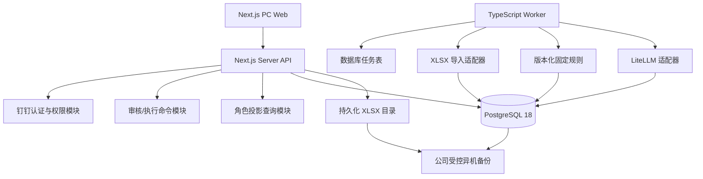
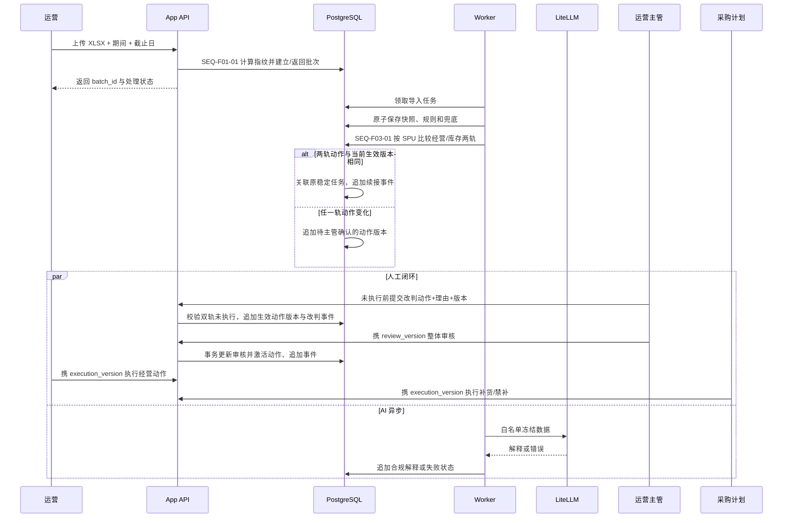

# 趣然 AI 商品经营与利润决策助手技术方案

> 生成时间：2026-08-04  
> 基于 PRD：`PRD详细版.md`、`requirements.md` revision 5、已确认《设计决策蓝图》
> 技术方案版本：v1.1

## 1. 产品技术画像

本产品是玩具事业部内部使用的单端 PC Web 工作台。它不做预测和自动执行，而是把每周 XLSX 数据固化为不可变 SPU 快照，用版本化固定规则生成经营/库存双动作，再通过钉钉身份完成审核、执行、结果与追溯轻闭环。技术方案的第一目标是确定性、权限最小化和历史可重放，第二目标才是 AI 解释的可读性。

### 1.1 产品形态

- 产品类型：内部 PC Web App。
- 主要入口：公司钉钉工作台或普通桌面浏览器。
- 端的数量：单端；`1024px` 以下不提供完整经营操作。
- 首轮规模：一个事业部、10—20 个真实 SPU；该数量是验收样本，不是运行硬上限。
- 数据节奏：每周一人工导入新表；周内更新审核、执行和结果状态。

### 1.2 核心技术约束

| 约束 | 来源 | 技术含义 |
| :--- | :--- | :--- |
| 同一快照和规则版本必须结论一致 | PRD §3、NFR-001 | 规则必须是版本化纯函数；不能依赖访问时间、AI 或可变外部数据 |
| 止损/清仓与禁补必须原子生成 | PRD §3.5、REQ-F03-03 | 决策记录和两个动作槽在一个数据库事务内提交 |
| AI 失败不阻塞 | REQ-F04-01～03、NFR-004 | AI 任务异步；结构化四要素和人工闭环先就绪 |
| 采购字段最小可见 | REQ-F07-02、NFR-002 | 服务端按角色和对象关系投影字段，不能只靠前端隐藏 |
| 批次、规则和事件不可覆盖 | REQ-F08-01～02、NFR-005 | 快照与事件追加写；纠错形成新事件，不做原位修订 |
| 重复导入和状态重试必须幂等 | AC-F01-02、AC-F06-06 | 批次指纹、业务唯一键、幂等键和 version 乐观并发 |
| 同 SPU 同动作跨周不重建任务 | REQ-F05-04 | 决策快照与稳定任务分表；每轨比较动作指纹，相同则关联，变化则追加待审版本 |
| 国内网络可达 | 蓝图 §8 | 自托管在公司内网或国内云；不依赖海外 PaaS、字体和运行时 |
| 会话最长 12h、闲置 2h | 蓝图 §9 | 服务端会话表记录绝对到期和最后活动时间；每请求复核角色 |
| RPO≤24h、RTO≤4h | 蓝图 §9 | 每晚数据库、XLSX、元数据和配置清单异机备份；季度恢复演练 |

### 1.3 团队与规模画像

- 团队规模假设：2—5 人的小型产品研发团队。
- 技术栈偏好：蓝图已确认全 TypeScript 模块化单体。
- 用户规模预期：事业部内部早期工具，低并发、历史持续增长。
- 上线压力：以首轮真实 SPU 验证为目标，优先交付完整闭环。
- 运维能力：可提供 Linux 主机、Docker Compose、钉钉配置、LiteLLM 部署密钥和异机备份目标。

### 1.4 非功能性需求

- 一致性：批次、决策、审核和状态事件使用 PostgreSQL 事务保证。
- 安全：默认拒绝；页面、接口、错误和审计都使用同一权限投影。
- 可恢复：AI、网络和并发失败保留确定性结果与未提交输入。
- 可审计：每次成功变化记录操作者、时间、前后版本和备注。
- 可运维：结构化日志保留 90 天；备份保留 30 日备份和 12 月归档。
- 性能：首轮规模不需要缓存或搜索引擎；分页、索引和批次查询覆盖历史增长。

### 1.5 激活维度与决策深度

| 维度 | 是否激活 | 决策深度 | 原因 |
| :--- | :---: | :--- | :--- |
| 前端、后端、主数据库 | 是 | 用户已在蓝图确认，按直接默认落地 | 技术方向已拍板，不重新制造候选 |
| AI / LLM | 是 | 直接默认 | 已有 LiteLLM，只需单轮结构化解释，不需 Agent/RAG |
| 文件 | 是 | 直接默认 | 单实例、持久化磁盘、周度 XLSX、无直传/CDN需求 |
| 认证 | 是 | 直接默认 | 唯一入口为钉钉，无自建账号体系 |
| 可观测、备份 | 是 | 直接默认 | 目标和责任已确认，不引入新 SaaS |
| 实时通信、支付、多端 | 否 | 不写实现 | requirements 没有对应能力 |

## 2. 技术栈总览（一张图）

```text
┌────────────────────────────────────────────────────────────────┐
│ PC Web     Next.js 16.2.12 + React 19.2.8 + TypeScript 7.0.2   │
├────────────────────────────────────────────────────────────────┤
│ Web/API    Next.js Node Runtime，服务端认证、查询与命令接口      │
├────────────────────────────────────────────────────────────────┤
│ Worker     Node.js 24 LTS，同仓独立进程，XLSX/规则/AI 异步任务   │
├────────────────────────────────────────────────────────────────┤
│ Data       PostgreSQL 18.4 + Drizzle ORM 0.45.2 + pg 8.22.0     │
├────────────────────────────────────────────────────────────────┤
│ Import     ExcelJS 4.4.0 + Zod 4.4.3，标准化快照与字段质量       │
├────────────────────────────────────────────────────────────────┤
│ AI         现有 LiteLLM HTTP 网关，结构化单轮解释，无 Agent/RAG  │
├────────────────────────────────────────────────────────────────┤
│ Runtime    Nginx + Docker Compose 5.1.2 + 持久化 Linux 主机      │
└────────────────────────────────────────────────────────────────┘
```

### 2.1 模块拓扑



### 2.2 模块化单体边界

| 模块 | 责任 | 禁止越界 |
| :--- | :--- | :--- |
| `identity` | 钉钉回调、会话、角色映射、对象授权 | 不配置业务角色审批，不保存钉钉密码 |
| `imports` | 文件指纹、解析、字段映射、错误和快照 | 不直接产生 AI 结论 |
| `metrics` | 自然月、7 日、14 日指标与质量状态 | 不用缺失值补 0 |
| `rules` | 分类、主动作、库存动作和规则证据 | 不调用 LiteLLM，不读取当前日期重算历史 |
| `explanations` | 四要素兜底、LiteLLM 白名单、越界过滤 | 不修改规则结果 |
| `workflow` | 建议审核、动作执行、结果与 version | 不二次创建规则动作 |
| `history` | 快照、业务时间线、审计事件与角色裁剪 | 不覆盖旧事件 |

## 3. 前端技术选型

### 3.1 推荐：Next.js 16.2.12 + React 19.2.8

这是蓝图已确认的直接默认，不重新比较 Vue、Svelte 或独立 SPA。

**决策证据**：

1. 产品只有 PC Web，一个仓库需要同时承载页面、服务端接口和钉钉回调。
2. 团队规模小，模块化单体比前后端双仓和多套部署更易维护。
3. 行动清单、详情和工作台是典型 React 数据界面，生态与 AI 编码语料成熟。
4. 自托管 Node Runtime 满足国内可达，未依赖 Vercel 托管。

**核心配置建议**：

- App Router 组织路由，业务页默认服务端鉴权后再渲染。
- React Server Components 只用于只读首屏数据；表单、筛选和交互组件使用 Client Components。
- URL 保存批次、页签、搜索、筛选和页码；不引入全局状态库。
- 表单使用原生受控状态与 Zod 共享校验；网络/冲突失败保留本地输入。
- 页面样式以 `tokens.css` 为唯一视觉契约，生产代码不依赖 Tailwind CDN。
- PC 断点按蓝图执行；小于 1024px 进入受控提示。

**当前代价**：

- Web/API 在同一 Next.js 进程内，无法像微服务独立扩缩。
- App Router 的服务端/客户端边界需要代码评审，避免敏感字段序列化到客户端。

**升级触发条件**：

- 若 Web 与 API 出现独立发布节奏或资源竞争的真实证据，再拆独立 API 服务。
- 若客户端跨十余页面共享高频可变状态，再评估轻量状态库。

### 3.2 前端安全边界

- 页面导航隐藏不作为权限控制；每个 loader/query/command 重新鉴权。
- 采购接口使用独立 DTO 白名单，不从完整对象删除字段后返回。
- 页面错误不回显堆栈、SQL、LiteLLM 原文或目标对象身份。
- 会话 Cookie 使用 `HttpOnly`、`Secure`、`SameSite=Lax`；前端不可读角色签名或部署密钥。

### 3.3 前端风险与缓解

- 风险：服务端组件误序列化完整建议给采购页面。缓解：角色专用查询函数和响应契约测试。
- 风险：多个页签保留旧 version 后提交覆盖。缓解：命令必须携带 version，冲突返回最新状态并保留输入。

## 4. 后端技术选型

### 4.1 推荐：Next.js Node Runtime + 独立 TypeScript Worker

这是蓝图确认的直接默认。

**决策证据**：

- 导入、规则和 AI 需要脱离 HTTP 请求生命周期，但规模不足以引入消息中间件。
- API 和 Worker 共享同一套 TypeScript 领域模型、Zod schema 和规则函数，可减少口径漂移。
- Node.js 24.18.0 为官方 LTS；生产只使用 LTS，不采用 Node 26 Current。

**进程职责**：

| 进程 | 同步职责 | 异步职责 |
| :--- | :--- | :--- |
| App | 登录、查询、审核、执行、结果、历史 | 创建持久任务，不等待 AI |
| Worker | 领取任务、续租、幂等完成 | XLSX、指标、规则、AI 解释、备份触发记录 |

**任务持久化**：

- PostgreSQL `job` 表保存任务类型、业务键、状态、尝试次数、可执行时间和租约。
- Worker 使用事务领取待处理任务；任务业务键唯一，重启后继续。
- 导入任务和规则任务失败不把未完成批次标为成功。
- AI 重试绑定原 `decision_id`，只追加解释版本和状态。

**当前代价**：

- 单 Worker 吞吐有限，但首轮每周 10—20 个 SPU 足够。
- 数据库任务表不适合高吞吐事件流。

**升级触发条件**：

- 连续四周任务积压超过一个导入周期，或数据库任务锁竞争成为主要延迟，再评估 Redis/消息队列。
- 需要多实例独立发布和跨服务 SLA 时再拆服务。

### 4.2 关键接口契约

| Design ID | 方法与路径 | 角色 | 关键行为 |
| :--- | :--- | :--- | :--- |
| `API-F07-01` | `GET /auth/dingtalk/start`、回调、`POST /auth/logout` | 未登录/全角色 | 钉钉认证、建立服务端会话、恢复原安全路径 |
| `API-F01-01` | `POST /api/batches` | 运营 | 接收元数据与 XLSX，指纹幂等返回原批次 |
| `API-F01-02` | `GET /api/batches/:id` | 运营/主管 | 批次、校验、指标和字段质量投影 |
| `API-F05-01` | `GET /api/actions` | 三角色 | URL 条件分页；返回批次决策、稳定任务 ID、续接/变更状态；采购使用独立最小字段投影 |
| `API-F06-01` | `GET /api/suggestions/:id`、`POST .../review` | 授权角色/主管 | 详情投影、整体审核、review_version 检查 |
| `API-F06-02` | `POST /api/actions/:id/execute`、`.../result` | 责任角色 | execution_version、幂等键、角色动作边界 |
| `API-F06-03` | `POST /api/suggestions/:id/override` | 运营主管 | 新经营/库存动作、必填理由、review/action version；保留原规则，已执行返回 `409` 并要求先终止 |
| `API-F04-01` | `POST /api/suggestions/:id/ai-retry` | 运营/主管 | 原冻结数据重试，不改规则或状态 |
| `API-F08-01` | `GET /api/history` | 运营/主管 | 历史分页与不可变快照；按角色裁剪 |

所有命令响应返回当前业务版本、最新状态、操作者和时间；冲突使用明确的 `409` 语义，重复幂等请求返回既有成功结果。

### 4.3 核心时序



时序稳定 ID：`SEQ-F01-01` 覆盖批次幂等；`SEQ-F03-01` 覆盖规则与双动作原子生成；`SEQ-F06-01` 覆盖审核和双轨执行；`SEQ-F04-01` 覆盖 AI 降级。

## 5. 数据层选型

### 5.1 主数据库推荐：PostgreSQL 18.4

这是蓝图已确认的直接默认。PostgreSQL 18.4 是 2026-05-14 发布的 18 系列稳定维护版本；不采用仍为 Beta 的 PostgreSQL 19。

**决策证据**：

- 批次、建议、动作和事件关系明确，需要事务、唯一约束和乐观并发。
- 清仓/止损与禁补必须原子生成，状态变化与事件必须一起成功。
- 历史按批次、SPU、动作和状态检索，关系索引足够。

**数据访问推荐**：Drizzle ORM 0.45.2 + `pg` 8.22.0。

- Drizzle 提供类型化 schema 与迁移，但关键事务和索引仍显式表达。
- `pg` 作为稳定 PostgreSQL 驱动；不引入数据库代理或云专属 SDK。

**当前代价**：

- 单机 PostgreSQL 与应用同主机，不具备主从高可用。
- 运维需负责安全补丁、容量和真实恢复演练。

**升级触发条件**：

- 明确出现多实例高可用要求、单机恢复无法满足更严 RTO，或事业部扩张产生持续资源争用时，再迁移国内云托管 PostgreSQL/主备。

### 5.2 数据实体

| Design ID | 实体 | 关键约束 |
| :--- | :--- | :--- |
| `DATA-F07-01` | `user_session`、`role_mapping_snapshot` | 钉钉身份唯一；绝对/闲置到期；每请求复核角色 |
| `DATA-F01-01` | `import_batch`、`import_file`、`import_error` | 指纹唯一；期间/截止日冻结；文件摘要唯一语义 |
| `DATA-F02-01` | `spu_snapshot`、`metric_quality` | `batch_id + spu_id` 唯一；原始值、采用值、周期分离 |
| `DATA-F03-01` | `rule_version`、`decision_record` | 规则版本不可变；分类、主动作、库存动作同事务 |
| `DATA-F04-01` | `ai_explanation` | 版本化解释；状态独立；不保存密钥和越界原文 |
| `DATA-F05-01` | `spu_action_task`、`decision_task_link`、`action_revision` | `business_unit_id + spu_id` 拥有稳定任务身份；每周决策关联当时版本；动作相同不创建新任务，变化版本只追加，仅一个当前生效版本 |
| `DATA-F06-01` | `action_item`、`action_result`、`effective_action_revision` | 一个稳定任务最多有经营/库存两轨；原规则动作不变；生效动作修订追加；review/execution version 单调递增 |
| `DATA-F08-01` | `review_event`、`action_event`、`correction_event` | 追加写；含前后状态、操作者、时间、原因 |
| `DATA-F01-02` | `job` | 业务键唯一；租约、重试和最终状态可恢复 |

### 5.3 事务与不变量

- 批次指纹命中时只读返回既有对象，不创建第二清单。
- 规则事务先写不可变 `decision_record` 和结构化四要素，再在同一事务内按 SPU 锁定 `spu_action_task`，分别比较经营/库存动作指纹。
- 动作指纹相同时只写 `decision_task_link` 和续接事件，不新建 `action_item`、不改变 review/execution version；指纹不同时追加待主管确认的 `action_revision`。
- 审核事务同时更新建议 version、激活动作并追加审核事件。
- 改判事务先锁定建议并验证两轨均未执行；保留 `decision_record` 原规则动作，追加 `effective_action_revision` 和改判事件。清仓改加投时，新库存动作不得为禁补。
- 执行/结果事务只更新当前角色负责的动作 version 并追加事件。
- 纠错不修改旧快照；创建新批次或追加 correction event。

### 5.4 缓存与搜索

**推荐：MVP 不引入 Redis 和搜索引擎。**

**决策证据**：首轮 10—20 个 SPU、内部低并发、查询条件结构化。

**当前代价**：历史增长后复杂筛选依赖数据库索引和分页。

**升级触发条件**：以真实慢查询和容量证据为准；优先补复合索引和归档策略，再考虑独立基础设施。

## 6. AI 能力选型

### 6.1 推荐：现有 LiteLLM 网关的结构化单轮调用

MVP 只需把已固化规则解释为对象、问题、依据和动作，不需要 RAG、Embedding、向量数据库、工具调用或自主 Agent。

**决策证据**：

- 固定规则拥有唯一的原始建议决定权；主管人工改判是独立、追加式的生效动作版本。
- 输入只有单条 SPU 的冻结白名单数据。
- AI 失败必须降级且不阻塞。
- 网关和部署密钥已由运维提供。

**调用契约**：

1. 输入：SPU 展示身份、指标实际值、周期、阈值、比较关系、最终动作和数据质量标记。
2. 输出：严格结构化的 `problem/evidence/action/summary`。
3. 校验：Zod 4.4.3 校验结构；动作、数字、粒度和敏感字段二次白名单检查。
4. 越界：舍弃不合规字段，保留固定规则兜底；日志只记非敏感追踪 ID 和受控错误码。
5. 重试：运营或主管可基于同一 `decision_id` 请求重试；旧合规版本保留到新版本成功。

**当前代价**：不支持跨 SPU 预算优化、知识检索、自动工具执行或多步推理。

**升级触发条件**：只有新的稳定 REQ 明确需要跨文档检索、工具调用或自主多步任务，才分别评估 RAG 或 Agent 框架。

### 6.2 明确不引入

- 不引入 Vercel AI SDK：当前 LiteLLM REST 适配层足够，增加抽象不能改变网关责任。
- 不引入 LangChain/LangGraph/Mastra：没有多步工具调用需求。
- 不引入 pgvector/Milvus/Qdrant：没有知识库检索需求。
- 不在方案中指定模型名称、网关地址、密钥变量名、超时和成本阈值；这些由运维环境与实施验证确定。

### 6.3 AI 风险与缓解

- 虚构数值：输出数字必须存在于输入白名单，否则丢弃。
- 动作冲突：推荐动作从规则字段渲染，不采信模型动作文本。
- 敏感泄露：不发送人员标识、完整 XLSX、日志、密钥、采购不可见经营字段。
- 网关失败：结构化四要素先就绪，AI 状态独立，业务继续。

## 7. 基础设施选型

### 7.1 部署与托管

**推荐：公司内网或国内云单台持久化 Linux 主机 + Docker Compose 5.1.2。**

**决策证据**：低并发内部工具、单实例已确认、需要常驻 Worker、数据库和 XLSX 持久化、国内可达。

**服务组成**：Nginx、App、Worker、PostgreSQL 四个服务；数据库和 XLSX 使用显式持久卷/目录。

**当前代价**：主机是单点；升级和回滚由运维窗口完成。

**升级触发条件**：业务明确要求多实例、无停机发布或更严可用性，再比较国内容器服务；MVP 不引入 Kubernetes。

### 7.2 认证与授权

**推荐：钉钉统一身份 + 产品服务端会话 + PostgreSQL 角色映射快照。**

**决策证据**：钉钉为唯一入口；事业部负责人审批，运维/系统管理员配置；无映射默认拒绝。

**当前代价**：接入协议、应用配置和稳定 actor_ref 需实施验证。

**升级触发条件**：只有公司统一 IDaaS 替换钉钉或新增稳定需求时，才替换认证适配器；业务授权模型保持不变。

### 7.3 文件存储

**推荐：服务器持久化目录 + PostgreSQL 文件元数据。**

| 判断事实 | 当前结论 |
| :--- | :--- |
| 实例 | 单实例 |
| 磁盘 | 持久化 Linux 磁盘 |
| 文件规模 | 每周 XLSX，首轮 10—20 SPU，无大文件证据 |
| 直传/CDN | 不需要 |
| 跨实例共享 | 不需要 |
| 备份 | 每晚异机，RPO≤24h、RTO≤4h |

当前不引入 OSS/COS/MinIO。多实例共享、临时磁盘、文件量显著增长或客户端直传/CDN任一真实出现时，再做增量选型。

### 7.4 可观测性

**推荐：结构化 JSON 应用日志 + Nginx 访问日志 + Docker 健康检查 + PostgreSQL 业务审计。**

不引入海外 Sentry SaaS、PostHog Cloud 或新付费监控平台。若公司已有主机/日志平台，由运维接入标准输出，不改变应用契约。

日志保留 90 天，不记录部署密钥、完整 XLSX、LiteLLM 原始请求或被过滤内容。建议指标包括导入成功率、字段降级数、规则处理时长、AI 成功率、审核冲突数、任务积压、备份结果与恢复演练结果。

**当前代价**：没有集中式调用链和错误平台。

**升级触发条件**：排障耗时或多实例上线形成真实需求时，再接公司现有可观测平台或自托管 OpenTelemetry/Grafana；不得静默新增外部服务。

### 7.5 备份与恢复

- 每晚备份 PostgreSQL、原始 XLSX、文件元数据和配置清单到公司受控异机存储。
- 保留 30 个日备份和 12 个每月归档。
- 每次备份产生非敏感清单、校验和、开始/结束时间和状态。
- 每季度在隔离环境真实恢复数据库和文件，核验批次、建议、事件和文件关联。
- 恢复演练耗时超过 4 小时或最新可恢复点超过 24 小时即判定目标未达成。

### 7.6 CI/CD

**推荐：GitHub Actions 在代码与测试命令建立后运行 lint、类型检查、单元/集成测试和镜像构建；部署由运维受控执行。**

当前仓库已有 GitHub 协作基线但尚无代码测试栈，因此本设计阶段不生成虚假的通过门禁。首个可运行脚手架合入时再提交 CI workflow；生产部署和密钥变更不由普通 PR 自动执行。

## 8. 实施建议与风险全景

### 8.1 推荐技术栈一览（最终决断）

| 层级 | 推荐技术 | 版本 / 备注 |
| :--- | :--- | :--- |
| Node Runtime | Node.js | 24.18.0 LTS，官方发布页核验 |
| Web/API | Next.js | 16.2.12，`npm view` 核验 |
| UI | React | 19.2.8，`npm view` 核验 |
| 语言 | TypeScript | 7.0.2，`npm view` 核验 |
| 数据库 | PostgreSQL | 18.4，官方发布说明核验 |
| ORM/驱动 | Drizzle ORM + pg | 0.45.2 / 8.22.0，`npm view` 核验 |
| XLSX | ExcelJS | 4.4.0，`npm view` 核验 |
| Schema | Zod | 4.4.3，`npm view` 核验 |
| AI | 现有 LiteLLM 网关 | 版本、模型和地址由运维实施验证 |
| 部署 | Docker Compose | 5.1.2，Docker 官方安装文档核验 |
| 文件 | Linux 持久化目录 | 与数据库统一异机备份 |

版本核验日期均为 2026-08-04。正式锁文件生成前先做 Next.js 与 TypeScript 7 的脚手架兼容性烟测；若框架 peer range 未接纳 TypeScript 7，则在不改变架构的前提下锁定其最新兼容稳定版并记录证据。

### 8.2 第一周脚手架建议（MVP 范围）

1. 建立 Next.js App Router、共享 TypeScript 配置和 Worker 入口。
2. 建立 Drizzle schema、迁移和 PostgreSQL 测试数据库。
3. 实现会话、角色映射与服务端权限投影骨架。
4. 实现批次上传、文件摘要、幂等指纹和持久化文件目录。
5. 实现 ExcelJS 解析、Zod 字段校验、ImportError 与 SPU 快照。
6. 以纯函数实现规则版本、分类、主动作和原子库存动作。
7. 实现行动清单、建议详情和三角色投影接口。
8. 实现审核、动作、结果 version 并发与追加事件。
9. 接入 LiteLLM 适配器和结构化兜底，验证失败降级。
10. 建立 Docker Compose、备份清单、恢复演练脚本与测试门禁。

### 8.3 后续阶段扩展预留

| 扩展点 | 触发能力 | 预留方式 |
| :--- | :--- | :--- |
| 数据源适配器 | 新 API/模板 | 保留 `source_type/source_version`，不实现连接器 |
| 证据类型 | 评价、退款原因、广告明细 | 版本化 evidence union，不在 MVP 建表堆空字段 |
| 动作回执 | 外部系统自动写回 | `external_receipt_ref` 为空，不触发外部调用 |
| 决策对象 | SKU | 未来作为 SPU 下级对象，不改变历史 SPU 主键与快照 |

这些候选没有稳定后续需求 ID。正式建设前必须回到 PRD 形成 REQ/AC，再做增量设计。

### 8.4 全局风险与缓解

| 风险 | 影响 | 缓解措施 |
| :--- | :--- | :--- |
| 钉钉接入或角色映射不可用 | 真实经营数据无法安全开放 | 上线前使用三角色和无角色账号验证；失败默认拒绝 |
| 数据字段周期不可信 | 观察、加投或补货误判 | 字段级降级、周期显式展示、缺失不补 0 |
| 单机和本地文件故障 | 批次、事件、XLSX 同时丢失 | 每晚异机备份、校验和、季度真实恢复演练 |
| LiteLLM 越界或失败 | 解释误导或不可用 | 白名单、结构校验、动作字段只读、结构化兜底 |
| 并发与网络重试 | 重复审核或后写覆盖 | 指纹、业务唯一键、幂等键、version 和追加事件 |

### 8.5 技术负责人的最终结论

#### 是否可以立即开工

- 明确选择：有条件开工。
- 条件：运维提供可验证的钉钉应用配置、LiteLLM 产品环境连接、持久化 Linux 主机和公司受控异机备份目标。

#### 最大的技术不确定性

> 不是规则算法，而是实施环境的钉钉身份映射、LiteLLM 连通性和真实恢复能力；三者必须以测试证据验收，不能只凭配置声明。

#### 现在最不应该做的事

> 不要引入微服务、Redis、搜索引擎、对象存储、Agent 框架或 Kubernetes，也不要在缺少周期和字段时用 AI 补数据。它们不能解决当前跨部门利润与库存断点，只会扩大首版故障面。

### 8.6 版本核验来源

- Node.js Releases：`https://nodejs.org/en/about/previous-releases`
- PostgreSQL 18.4 Release Notes：`https://www.postgresql.org/docs/release/18.4/`
- Docker Compose install：`https://docs.docker.com/compose/install/linux/`
- npm 包版本：2026-08-04 使用 `npm view <package> version` 实测。
