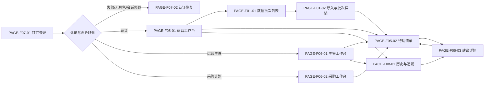
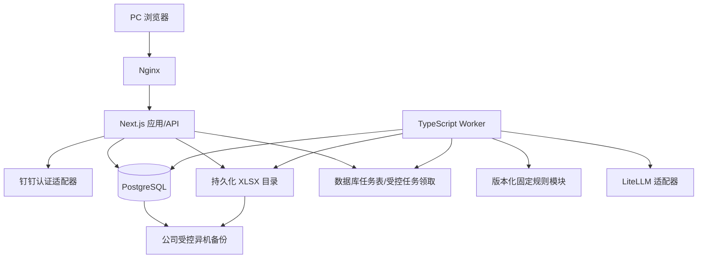

# 趣然 AI 商品经营与利润决策助手 · 设计决策蓝图

> 状态：阶段 I 总蓝图已由用户确认
> 上游契约：`PRD详细版.md`、`requirements.md` revision 3、`requirements-analysis.md`  
> 工作模式：`standard`  
> 设计原则：全产品定骨架，V0 MVP 出施工图；固定规则是唯一决策源，AI 只解释。

## 1 盘子

### 1.1 端形态与响应式

- 产品形态：玩具事业部内部 PC Web 经营工作台，不面向消费者、外部商家或移动端值守。
- 主工作区：`1024px` 及以上。宽屏采用左侧导航、顶部上下文栏和多栏内容区；较窄 PC 收起侧栏，保留完整表格与详情能力。
- 低于 `1024px`：显示“请使用电脑访问”的受控提示，不提供手机完整适配，也不允许关键金额、阈值、动作和状态被截断后继续提交。
- 首版只处理 SPU，SPU 等同商品链接；不展示或计算 SKU 级利润、库存与动作。

### 1.2 登录后工作台聚合

| 角色 | 首屏目标 | 默认聚合内容 | 主要去向 |
| :--- | :--- | :--- | :--- |
| 运营 | 快速确认本周数据与本人经营动作 | 当前批次、最近更新时间、导入状态、待执行经营动作、待补录结果、数据限制 | 导入批次、行动清单、建议详情 |
| 运营主管 | 快速完成整体审核 | 当前批次、待审核建议、按清仓/止损/观察/加投分组的风险数量、异常与冲突提醒 | 行动清单、建议详情审核栏 |
| 采购计划 | 只处理补货或禁补 | 当前批次、待补货、待确认禁补、已处理采购任务、必要库存与销量限制 | 采购任务列表、采购裁剪详情 |

三类工作台都固定显示事业部、当前数据批次、业务期间、业务截止日和最后更新时间，避免用户把旧批次当成本周任务处理。

## 2 信息架构与站点地图

### 2.1 导航模式

- 左侧任务型导航；顶部上下文栏固定显示事业部、当前批次、当前角色和用户。
- 运营与运营主管一级导航：`工作台 / 行动中心 / 数据批次 / 历史与追溯`。
- 采购计划一级导航：`工作台 / 采购任务`；只可从本人任务进入有权的建议详情，不展示完整行动中心、数据批次或通用历史入口。
- 全站使用面包屑、批次标识和返回来源；筛选条件写入 URL，返回列表时恢复页码与筛选状态。

### 2.2 页面调用关系骨架

### 2.3 关键跳转约束

- 新批次完成固定规则后，从批次详情进入该批次唯一行动清单；AI 未完成不阻塞跳转。
- 行动清单进入建议详情；详情支持上一条/下一条，并返回原批次、页码和筛选条件。
- 历史与追溯进入同一建议详情的只读追溯模式，不另建第二套详情页或历史数据身份。
- 采购计划使用同一行动清单和建议详情的服务端字段投影，只呈现采购任务及必要依据，不复制一套易漂移的采购业务模型。

## 3 角色与权限

### 3.1 认证与恢复

- 唯一认证入口：钉钉统一身份认证。钉钉环境优先自动授权；普通浏览器显示钉钉登录或扫码入口。
- 角色来源：事业部负责人审批运营、运营主管、采购计划角色变更；运维/系统管理员按审批结果配置映射。
- 产品不提供账号密码、注册、找回密码、共享账号、角色编辑后台或 LiteLLM 密钥配置页。
- 登录失败可重试；会话失效后重新钉钉认证并返回原页面；无角色映射时只显示当前身份和联系运维/系统管理员的指引，不显示任何经营数据。
- 已登录但无权访问某业务对象时返回本人工作台；恢复页和错误信息不泄露其他角色、模块、建议身份或状态。

### 3.2 权限矩阵

| 能力 | 运营 | 运营主管 | 采购计划 |
| :--- | :---: | :---: | :---: |
| 导入 XLSX、查看校验与完整批次 | ✓ | 查看 | — |
| 查看完整销售、利润、推广、品退、库存 | ✓ | ✓ | — |
| 查看行动清单和完整规则证据 | ✓ | ✓ | 仅本人采购任务投影 |
| 整体通过/驳回建议 | — | ✓ | — |
| 执行加投、观察、SPU 推广止损、清仓 | ✓ | — | — |
| 记录经营结果 | ✓ | — | — |
| 执行补货或确认禁补 | — | — | ✓ |
| 查看历史与审计 | 授权范围 | 完整审核范围 | 仅本人采购任务必要事件 |

### 3.3 同页差异

- 无权限模块与敏感字段直接隐藏；隐藏只是界面表现，所有请求仍执行服务端角色与对象关系校验。
- 用户有页面权限但因状态不可操作时，按钮置灰并显示具体原因，例如“建议尚未通过”或“状态已被他人更新”。
- 采购计划只接收 SPU 身份、补货/禁补结论、仓内与在途库存、最近 14 天销量/日均销量、库存可售天数、采购动作状态和结果。
- 每次请求重新校验服务端角色；角色变更后旧会话不能沿用原权限。

## 4 页面地图与设计深度

### 4.1 MVP 页面清单

| Page ID | 页面 | 主要骨架 | 加载/空/错误/无权限状态 |
| :--- | :--- | :--- | :--- |
| `PAGE-F07-01` | 钉钉登录 | 产品说明、钉钉环境自动授权状态、普通浏览器登录/扫码入口、隐私与内部使用提示 | 授权中骨架；认证失败可重试；钉钉不可用联系运维；已登录自动跳转 |
| `PAGE-F07-02` | 认证恢复 | 会话失效、无角色映射、认证失败、访问被拒四类受控状态及单一恢复动作 | 不展示经营数据；无角色显示当前身份；重认证保留原安全路径；无权返回本人工作台 |
| `PAGE-F05-01` | 运营工作台 | 当前批次卡、导入状态、待执行经营动作、待补录结果、数据限制与最近处理 | 无成功批次引导导入；加载失败保留批次上下文；无经营待办与筛选无结果分开 |
| `PAGE-F06-01` | 主管工作台 | 待审核总数、动作风险分布、待审核列表、冲突/异常提醒、最近审核 | 无待审核显示本周已处理；规则处理中单独提示；网络错误不伪装为空 |
| `PAGE-F06-02` | 采购工作台 | 待补货、待确认禁补、已处理任务、库存/销量数据限制 | 无采购任务明确说明；受限字段从响应中不存在；无权任务不返回对象身份 |
| `PAGE-F01-01` | 数据批次列表 | 当前/历史批次表、状态、期间、截止日、有效/拒绝/降级数量、导入入口 | 首次无批次；处理中；导入失败；列表加载失败；非运营隐藏导入入口 |
| `PAGE-F01-02` | 导入与批次详情 | 导入表单、处理阶段、校验摘要、分组错误、SPU 指标总表、证据抽屉、进入行动清单 | 文件/期间错误原位显示；重复提交返回原批次；规则处理中；无有效 SPU；字段级降级；无权限 |
| `PAGE-F05-02` | 行动清单 | 当前批次、待我处理/全部/处理中/已完成页签、搜索筛选、密集表格、固定排序、分页 | 规则处理中；确无待办；筛选无结果；网络失败；历史批次只读提示；无权限 |
| `PAGE-F06-03` | 建议详情 | 四要素、冻结指标、规则证据链、双轨决策脊线、AI 辅助解读、主管审核栏、角色动作卡、结果表单、业务时间线与审计详情 | AI 生成中/失败/未采用；数据限制；并发冲突；网络失败保留输入；历史只读；采购裁剪；无权不泄露对象 |
| `PAGE-F08-01` | 历史与追溯 | 按批次/SPU/动作/审核/执行/期间筛选的历史建议表，业务里程碑摘要 | 尚无历史；筛选无结果；加载失败；采购无通用入口；点击复用 `PAGE-F06-03` 只读模式 |

### 4.2 F01—F08 页面落点

| 功能 | 深设计页面与组件落点 | 关键状态 |
| :--- | :--- | :--- |
| F01 数据导入与校验 | `PAGE-F01-01/02`；`CMP-BATCH-IMPORT`、`CMP-VALIDATION-SUMMARY`、`CMP-IMPORT-ERROR-TABLE` | 幂等返回原批次、批次级拒绝、行拒绝、字段级降级、处理失败 |
| F02 SPU 经营指标 | `PAGE-F01-02`、`PAGE-F06-03`；`CMP-SPU-METRIC-TABLE`、`CMP-EVIDENCE-DRAWER` | 缺失不是 0；品退未校验；库存不足；无近期销量；冻结周期 |
| F03 固定规则决策 | `PAGE-F05-02`、`PAGE-F06-03`；`CMP-RULE-PATH`、`CMP-DUAL-TRACK-SPINE` | 实际值→阈值→优先级→最终动作；被覆盖条件仍可见；主动作唯一 |
| F04 AI 建议解释 | `PAGE-F05-02`、`PAGE-F06-03`；`CMP-AI-ASSIST` | 四要素始终先显示；AI 异步生成、失败、内容未采用；重试不改变冻结规则或数据 |
| F05 行动清单 | `PAGE-F05-01/02`、`PAGE-F06-01/02`；`CMP-ACTION-TABLE` | 最新批次“待我处理”；固定排序；历史批次；无待办与加载失败分离 |
| F06 审核与执行跟踪 | `PAGE-F06-01/02/03`；`CMP-REVIEW-BAR`、`CMP-ACTION-CARD`、`CMP-RESULT-FORM` | 整体审核；双动作独立执行；聚合只读；version 冲突；重试幂等 |
| F07 权限隔离 | `PAGE-F07-01/02` 与全部业务页的服务端投影；`CMP-ROLE-CONTEXT` | 认证失败、无角色、失权、对象无权、字段裁剪、每请求重校验 |
| F08 规则与数据溯源 | `PAGE-F06-03`、`PAGE-F08-01`；`CMP-BUSINESS-TIMELINE`、`CMP-AUDIT-DETAILS` | 不可变快照；成功业务事件主线；AI 失败、越权、冲突、重复请求为审计详情 |

### 4.3 建议详情施工骨架

1. 顶部：SPU 身份、批次/期间/截止日、规则版本、审核与总览状态。
2. 第一屏四要素：具体对象、发现问题、关键依据、推荐动作；AI 失败时仍完整。
3. 中部“双轨决策脊线”：经营动作轨与库存动作轨并列，以规则证据节点连接；止损/清仓与禁补成对展示。
4. 证据区：原始值、采用值、周期、阈值、比较关系、被覆盖条件和数据限制。
5. AI 辅助区：中性视觉、默认折叠；运营与主管可见完整解释，采购不可见完整解释。AI 失败后的重新生成仅使用原冻结数据，不能变更分类、动作、阈值或审核状态。
6. 操作区：主管固定审核栏；审核通过后按当前角色显示经营或采购动作卡；经营执行与后续经营结果分两次记录。
7. 底部：业务里程碑时间线；审计详情按权限展开；历史入口进入只读模式。

### 4.4 后续阶段与不可逆约束

- 上游只把评价、退款原因、广告明细、外部系统自动写入和 SKU 级能力列为“后续候选”，没有稳定后续 REQ/AC/NFR ID，因此本蓝图不创建虚假 `planned` 页面。
- MVP 仅保留兼容缝：数据源类型与版本、版本化证据类型、动作的外部回执引用空字段、SPU 历史主键与快照不可变。
- 未来 SKU 能力必须重新进入 PRD，以 SPU 下级对象扩展，不改变历史 SPU 主键、批次快照和既有建议身份。
- 未来任何新页面、连接器或自动写回必须先获得稳定需求 ID，再进入页面地图与深设计。

## 5 通用交互范式

### 5.1 列表

- 传统分页表格，默认每页 50 条，可切换 20/50/100；表头吸顶。
- 搜索、筛选、页签、批次和页码写入 URL；返回、刷新或分享后恢复。
- 只采用固定动作优先级及稳定次序，不提供会改变经营判断的自由排序。
- 首版不支持批量审核、批量执行或批量结果回填，避免 10—20 个试点 SPU 中的误操作与审计歧义。

### 5.2 表单

- 必填项显式标记；失焦校验，提交时完整校验。
- 短表单不自动保存草稿；有未提交内容时离开提醒。
- 网络失败或并发冲突保留用户输入；冲突时同时显示最新操作者、时间和状态，用户重新判断后提交。
- XLSX 导入开始后锁定事业部、期间、截止日和文件；重复提交返回原批次。

### 5.3 反馈

- 通过、驳回、确认执行和记录结果前二次确认；驳回原因必填，通过备注可选。
- 成功后 Toast 提示，并立即更新原操作区、列表状态和时间线。
- 失败在原操作区说明原因与恢复动作；不把网络错误、AI 错误或权限错误伪装成空状态。
- AI 使用独立状态，不阻塞固定规则清单、审核或执行；重新生成期间保留上一版已通过内容。

## 6 视觉风格锚点

- 明暗：浅色。
- 风格：冷静、可信、密集但不拥挤的经营中台；不做炫技 AI 控制台。
- Category：`E-Commerce & Retail`。
- 情绪：理性掌控、风险可见、动作可执行。
- 色彩：云白与浅蓝灰底，深海军蓝为品牌主色；清仓红、止损橙、观察琥珀、加投绿、补货蓝为动作语义色。
- 交互哲学：全站采用色彩响应，不使用卡片物理位移；动画仅用于短时、低幅度状态变化。
- 字体：系统中文无衬线字体；数字启用等宽数字特性，不依赖境外字体服务。
- 信息密度：列表使用紧凑表格；详情使用 Bento 分区；色彩必须同时配合文字和图标，不能只靠颜色传意。
- AI 区：中性紫灰或蓝灰，视觉层级低于固定规则证据。
- 设计签名：`双轨决策脊线`——经营动作轨与库存动作轨由规则证据节点连接，清仓/止损与禁补成对呈现。

## 7 数据与集成

### 7.1 核心实体

`BusinessUnit / ImportBatch / ImportError / SpuSnapshot / RuleVersion / DecisionRecord / ActionItem / AIExplanation / ReviewEvent / ActionEvent / ActionResult`。

- `ImportBatch`、`SpuSnapshot`、`DecisionRecord` 和规则输入快照建立后不可覆盖。
- 一个批次一个清单；一个批次内一个 SPU 一条建议；一条建议最多一个经营动作槽和一个库存动作槽。
- 当前状态使用版本保护；审核、执行、结果和纠错使用追加事件保存。

### 7.2 外部对接与同步

| 对接 | MVP 方式 | 同步节奏 | 责任与降级 |
| :--- | :--- | :--- | :--- |
| 数据支持经营表 | 运营人工上传 XLSX，经独立导入适配层标准化 | 每周一有新数据后生成一次新批次清单；周内只更新状态 | 数据支持部门提供；缺字段按行拒绝或字段级降级，不虚构结论 |
| 钉钉 | 服务端认证接口和回调适配层 | 登录、恢复及每次请求角色复核 | 事业部负责人审批，运维/系统管理员配置；失败或无映射默认拒绝 |
| LiteLLM | 服务端网关适配层，使用运维部署密钥 | 规则固化后异步生成或基于同一冻结数据重试 | 网关失败时使用结构化四要素，业务闭环继续；普通用户不可见密钥 |

固定规则只读取标准化快照，不直接解析页面表单、原始 XLSX 或 AI 文本。MVP 不直连广告、采购、库存数据库，也不自动写入外部系统。

### 7.3 方案前置能力

| 前置能力 | 状态 | 负责人 | 证据/确认点 | 替代方案与阻塞范围 |
| :--- | :--- | :--- | :--- | :--- |
| 每周 SPU 经营表 | 数据供给 ready，字段覆盖部分具备 | 数据支持部门 | 已提供真实样表；每周一可提供经营表 | 销售、利润可继续；库存/14 日销量缺失时不补货；7 日品退未验证时不观察或依赖低品退率加投 |
| LiteLLM 网关 | ready，产品环境连通性待实施验证 | 运维人员 | 用户确认网关已存在且密钥由运维维护 | 结构化四要素兜底；不阻塞 F04、F05、F06 |
| 钉钉身份与三角色映射 | committed，接入连通性待实施验证 | 事业部负责人审批；运维/系统管理员配置 | 用户确认唯一认证入口与双重责任 | 不可用时拒绝业务页，阻塞真实数据访问，不降级为账号密码 |
| 公司受控异机备份存储 | 上线前由运维提供 | 运维人员 | 备份位置与访问权限需在部署验收时形成证据 | 未验证恢复前不得把生产备份目标标记达成 |

## 8 技术栈、架构与部署

### 8.1 技术选择

- 全 TypeScript 模块化单体。
- Next.js 承载 PC Web、服务端业务接口和钉钉认证回调。
- 同一仓库部署独立 Worker，处理 XLSX 校验、固定规则、批次清单生成和 LiteLLM 异步解释。
- PostgreSQL 保存快照、建议、动作当前状态和追加事件。
- MVP 不引入 Redis、搜索引擎、微服务、Agent 框架、Kubernetes、对象存储或海外 PaaS。
- 具体依赖版本在阶段 II 生成《技术方案》时通过官方包源实测，不从训练记忆推断。

### 8.2 架构骨架

模块边界：认证与权限、导入与校验、指标快照、规则决策、AI 解释、行动清单、审核执行、审计追溯。模块在一个部署单元内通过明确接口协作，避免小规模内部工具被微服务复杂度拖慢。

### 8.3 部署

- 公司内网或国内云的单台持久化 Linux 主机。
- Docker Compose 运行 Nginx、应用、Worker 和 PostgreSQL；原始 XLSX 使用服务器持久化目录。
- 仅使用中国网络环境可稳定访问的运行依赖；不依赖海外托管运行时、海外字体或海外静态资源。
- 数据库任务表承担 MVP 异步任务持久化和幂等领取，避免为 10—20 个首轮 SPU 引入 Redis；扩容前先用真实吞吐证据评估。

## 9 安全与运维

### 9.1 会话与授权

- 应用会话最长 12 小时；连续 2 小时无操作失效。
- 重新钉钉认证后返回原页面；安全校验不通过时退回认证恢复页。
- 每次请求重新校验服务端角色与对象关系；权限只减不降级，未知角色默认拒绝。
- LiteLLM 部署密钥只存在于服务端部署环境，普通用户不可见，由运维更新、轮换和撤销。

### 9.2 数据与日志

- 当前 V0 数据不包含消费者个人信息；若数据范围变化，必须先回 PRD 修订隐私边界。
- 日志不记录部署密钥、完整 XLSX、LiteLLM 原始请求或被过滤的模型输出。
- 技术访问与错误日志保留 90 天。
- 批次快照、规则结论、审核、动作和结果事件在产品生命周期内保留，不提供删除或覆盖入口。
- 纠错追加纠正事件，记录原值、修正值、操作者、时间和原因，不改写历史事实。

### 9.3 备份与恢复

- 每晚自动备份 PostgreSQL、原始 XLSX、文件元数据和配置清单到运维提供的公司受控异机存储。
- 保留 30 个日备份和 12 个每月归档。
- 目标：`RPO ≤ 24 小时`，`RTO ≤ 4 小时`。
- 每季度执行一次真实恢复演练；只有恢复结果、耗时和数据完整性均形成记录后，才判定备份机制有效。

### 9.4 风险与缓解

| 失败模式 | 影响 | 缓解与验收门槛 |
| :--- | :--- | :--- |
| 钉钉连通性或角色映射未验证 | 用户无法安全进入，或错误授权经营数据 | 上线前用三种角色和无角色账号验证；失败默认拒绝，禁止共享账号兜底 |
| LiteLLM 超时、失效或越界 | AI 解释缺失或误导业务 | 固定规则与四要素先就绪；越界内容舍弃；审核执行不依赖 AI |
| 库存、14 日销量或可信 7 日品退缺失 | 补货、观察、加投覆盖不足 | 字段级降级并显式提示；不把缺失当 0；止损/清仓及禁补继续按可用事实判定 |
| 单机或同机磁盘故障 | 数据库与 XLSX 同时丢失 | 异机每日备份、季度真实恢复演练；异机目标未验收前不得宣称达到 RPO/RTO |
| 并发或网络重试重复写入 | 重复审核、动作或结果覆盖 | 指纹幂等、业务唯一键、version 乐观并发和追加事件；失败提交不改变状态 |

## 10 需求覆盖承诺

### 10.1 稳定需求基线

- 上游：`requirements.md` revision 3，`workflow_mode: standard`，全部状态为 active、阶段均为 MVP。
- 需求总数：22 个 REQ、41 个 AC、5 个 NFR。
- REQ：`REQ-F01-01`、`REQ-F01-02`；`REQ-F02-01`～`REQ-F02-03`；`REQ-F03-01`～`REQ-F03-03`；`REQ-F04-01`～`REQ-F04-03`；`REQ-F05-01`～`REQ-F05-03`；`REQ-F06-01`～`REQ-F06-03`；`REQ-F07-01`～`REQ-F07-03`；`REQ-F08-01`～`REQ-F08-02`。
- AC：`AC-F01-01`～`AC-F01-04`；`AC-F02-01`～`AC-F02-06`；`AC-F03-01`～`AC-F03-06`；`AC-F04-01`～`AC-F04-04`；`AC-F05-01`～`AC-F05-05`；`AC-F06-01`～`AC-F06-06`；`AC-F07-01`～`AC-F07-06`；`AC-F08-01`～`AC-F08-04`。
- NFR：`NFR-001`～`NFR-005`。

### 10.2 覆盖承诺

| 需求组 | 设计落点 | 技术/数据落点 | 覆盖状态 |
| :--- | :--- | :--- | :--- |
| F01 / AC-F01 | `PAGE-F01-01/02` | 导入适配、批次指纹、校验错误与字段级降级 | MVP 施工图承诺 |
| F02 / AC-F02 | `PAGE-F01-02`、`PAGE-F06-03` | 标准化快照、周期与质量标记 | MVP 施工图承诺 |
| F03 / AC-F03 | `PAGE-F05-02`、`PAGE-F06-03` | 版本化纯规则、原子双动作 | MVP 施工图承诺 |
| F04 / AC-F04 | `PAGE-F05-02`、`PAGE-F06-03` | LiteLLM 适配、白名单输入、结构化兜底 | MVP 施工图承诺 |
| F05 / AC-F05 | `PAGE-F05-01/02`、`PAGE-F06-01/02` | 批次唯一清单投影、稳定排序与分页 | MVP 施工图承诺 |
| F06 / AC-F06 | `PAGE-F06-01/02/03` | 建议审核、双动作状态机、version 并发与结果 | MVP 施工图承诺 |
| F07 / AC-F07 | `PAGE-F07-01/02` 及全站角色投影 | 钉钉适配、服务端 RBAC/对象授权、字段白名单 | MVP 施工图承诺 |
| F08 / AC-F08 | `PAGE-F06-03`、`PAGE-F08-01` | 不可变快照、追加事件、角色裁剪历史 | MVP 施工图承诺 |
| NFR-001～005 | 全部相关页面状态、§7～§9 | 确定性、最小可见、凭据保密、AI 降级、审计追溯 | MVP 施工图承诺 |

- MVP 暂无详细设计落点的稳定 ID：`0`。
- 后续阶段稳定 ID：`0`；当前后续候选没有稳定 ID，不虚构 `planned` 页面，只有 §4.4 的不可逆扩展边界。
- 阶段 II 必须为上述全部 active REQ/AC/NFR 建立《设计追溯矩阵》真实行；MVP 状态只能是 `covered`，不允许缺失、模糊占位或仅标 `planned`。

### 10.3 收敛闸门结论

基于已逐轮确认的产品骨架、三角色流程、页面状态、视觉方向、数据与集成、技术架构以及安全运维边界，当前不存在会使 MVP 解决路径跑偏或迫使核心模型高成本返工的关键未知。剩余的钉钉/LiteLLM 连通性、异机备份目标和缺失经营字段属于实施验证或字段级降级，不改变已确认产品骨架。
