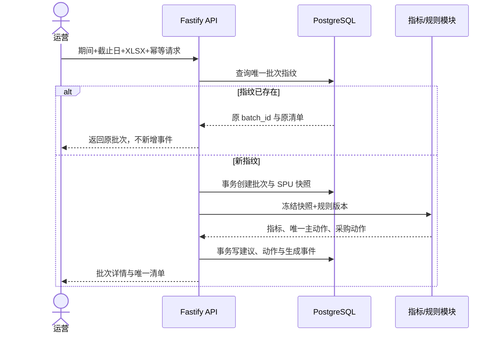
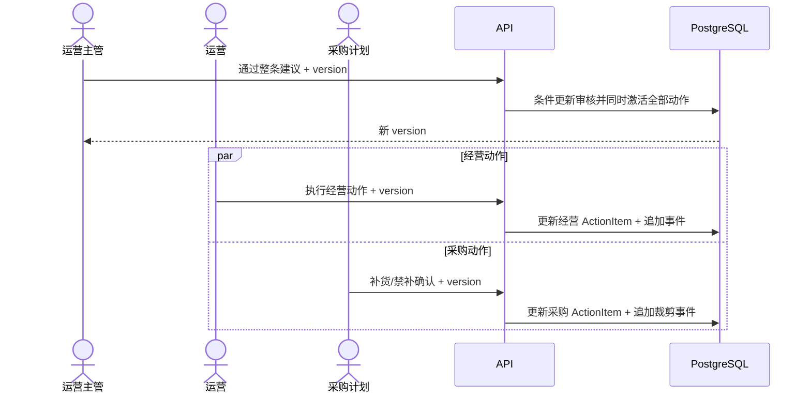
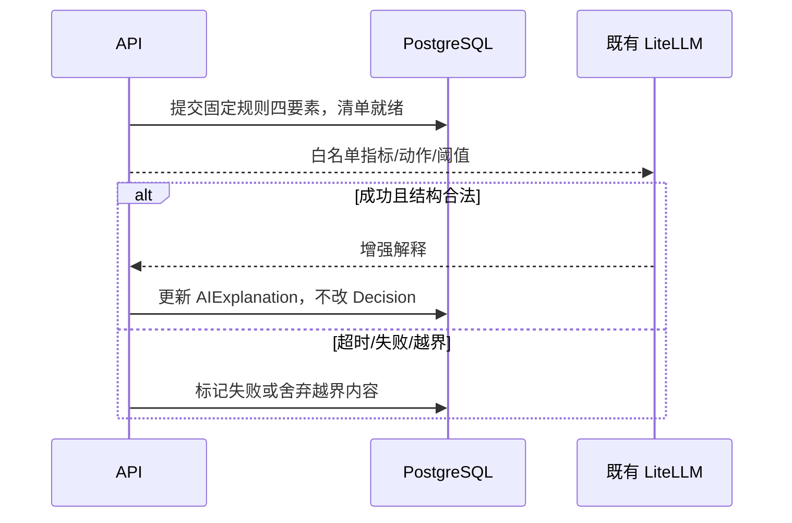

# 设计追溯矩阵

> Source：requirements revision 2。全部 active source 均属于 MVP，必须施工级 covered。

| Source ID | Source Revision | Design IDs | Artifact | Error/Invariant | Verification Surface | Status |
| :--- | :--- | :--- | :--- | :--- | :--- | :--- |
| REQ-F01-01 | 1 | PAGE-F01-01, PAGE-F01-02, PAGE-F01-03, API-F01-01, DATA-F01-01, SEQ-F01-01 | pages/阶段1_数据批次_批次列表.md; pages/阶段1_数据批次_批次列表.html; pages/阶段1_数据批次_新建数据导入.md; pages/阶段1_数据批次_新建数据导入.html; pages/阶段1_数据批次_批次详情与校验结果.md; pages/阶段1_数据批次_批次详情与校验结果.html; 技术方案.md §4-5 | 指纹重复→返回原批次；必要身份拒绝行，其他字段只按依赖降级；不得生成第二清单 | component + contract + integration + role e2e + audit measurement | covered |
| REQ-F01-02 | 1 | PAGE-F01-01, PAGE-F01-02, PAGE-F01-03, API-F01-01, DATA-F01-01, SEQ-F01-01 | pages/阶段1_数据批次_批次列表.md; pages/阶段1_数据批次_批次列表.html; pages/阶段1_数据批次_新建数据导入.md; pages/阶段1_数据批次_新建数据导入.html; pages/阶段1_数据批次_批次详情与校验结果.md; pages/阶段1_数据批次_批次详情与校验结果.html; 技术方案.md §4-5 | 指纹重复→返回原批次；必要身份拒绝行，其他字段只按依赖降级；不得生成第二清单 | component + contract + integration + role e2e + audit measurement | covered |
| AC-F01-01 | 1 | PAGE-F01-01, PAGE-F01-02, PAGE-F01-03, API-F01-01, DATA-F01-01, SEQ-F01-01 | pages/阶段1_数据批次_批次列表.md; pages/阶段1_数据批次_批次列表.html; pages/阶段1_数据批次_新建数据导入.md; pages/阶段1_数据批次_新建数据导入.html; pages/阶段1_数据批次_批次详情与校验结果.md; pages/阶段1_数据批次_批次详情与校验结果.html; 技术方案.md §4-5 | 指纹重复→返回原批次；必要身份拒绝行，其他字段只按依赖降级；不得生成第二清单 | component + contract + integration + role e2e + audit measurement | covered |
| AC-F01-02 | 1 | PAGE-F01-01, PAGE-F01-02, PAGE-F01-03, API-F01-01, DATA-F01-01, SEQ-F01-01 | pages/阶段1_数据批次_批次列表.md; pages/阶段1_数据批次_批次列表.html; pages/阶段1_数据批次_新建数据导入.md; pages/阶段1_数据批次_新建数据导入.html; pages/阶段1_数据批次_批次详情与校验结果.md; pages/阶段1_数据批次_批次详情与校验结果.html; 技术方案.md §4-5 | 指纹重复→返回原批次；必要身份拒绝行，其他字段只按依赖降级；不得生成第二清单 | component + contract + integration + role e2e + audit measurement | covered |
| AC-F01-03 | 1 | PAGE-F01-01, PAGE-F01-02, PAGE-F01-03, API-F01-01, DATA-F01-01, SEQ-F01-01 | pages/阶段1_数据批次_批次列表.md; pages/阶段1_数据批次_批次列表.html; pages/阶段1_数据批次_新建数据导入.md; pages/阶段1_数据批次_新建数据导入.html; pages/阶段1_数据批次_批次详情与校验结果.md; pages/阶段1_数据批次_批次详情与校验结果.html; 技术方案.md §4-5 | 指纹重复→返回原批次；必要身份拒绝行，其他字段只按依赖降级；不得生成第二清单 | component + contract + integration + role e2e + audit measurement | covered |
| AC-F01-04 | 1 | PAGE-F01-01, PAGE-F01-02, PAGE-F01-03, API-F01-01, DATA-F01-01, SEQ-F01-01 | pages/阶段1_数据批次_批次列表.md; pages/阶段1_数据批次_批次列表.html; pages/阶段1_数据批次_新建数据导入.md; pages/阶段1_数据批次_新建数据导入.html; pages/阶段1_数据批次_批次详情与校验结果.md; pages/阶段1_数据批次_批次详情与校验结果.html; 技术方案.md §4-5 | 指纹重复→返回原批次；必要身份拒绝行，其他字段只按依赖降级；不得生成第二清单 | component + contract + integration + role e2e + audit measurement | covered |
| REQ-F02-01 | 1 | PAGE-F01-03, PAGE-F05-02, API-F02-01, DATA-F02-01 | pages/阶段1_数据批次_批次详情与校验结果.md; pages/阶段1_数据批次_批次详情与校验结果.html; pages/阶段1_行动清单_建议详情.md; pages/阶段1_行动清单_建议详情.html; 技术方案.md §4-5 | 周期/分母/字段非法→不计算并显示原因；不得猜默认值；同冻结快照指标一致 | component + contract + integration + role e2e + audit measurement | covered |
| REQ-F02-02 | 1 | PAGE-F01-03, PAGE-F05-02, API-F02-01, DATA-F02-01 | pages/阶段1_数据批次_批次详情与校验结果.md; pages/阶段1_数据批次_批次详情与校验结果.html; pages/阶段1_行动清单_建议详情.md; pages/阶段1_行动清单_建议详情.html; 技术方案.md §4-5 | 周期/分母/字段非法→不计算并显示原因；不得猜默认值；同冻结快照指标一致 | component + contract + integration + role e2e + audit measurement | covered |
| REQ-F02-03 | 1 | PAGE-F01-03, PAGE-F05-02, API-F02-01, DATA-F02-01 | pages/阶段1_数据批次_批次详情与校验结果.md; pages/阶段1_数据批次_批次详情与校验结果.html; pages/阶段1_行动清单_建议详情.md; pages/阶段1_行动清单_建议详情.html; 技术方案.md §4-5 | 周期/分母/字段非法→不计算并显示原因；不得猜默认值；同冻结快照指标一致 | component + contract + integration + role e2e + audit measurement | covered |
| AC-F02-01 | 1 | PAGE-F01-03, PAGE-F05-02, API-F02-01, DATA-F02-01 | pages/阶段1_数据批次_批次详情与校验结果.md; pages/阶段1_数据批次_批次详情与校验结果.html; pages/阶段1_行动清单_建议详情.md; pages/阶段1_行动清单_建议详情.html; 技术方案.md §4-5 | 周期/分母/字段非法→不计算并显示原因；不得猜默认值；同冻结快照指标一致 | component + contract + integration + role e2e + audit measurement | covered |
| AC-F02-02 | 1 | PAGE-F01-03, PAGE-F05-02, API-F02-01, DATA-F02-01 | pages/阶段1_数据批次_批次详情与校验结果.md; pages/阶段1_数据批次_批次详情与校验结果.html; pages/阶段1_行动清单_建议详情.md; pages/阶段1_行动清单_建议详情.html; 技术方案.md §4-5 | 周期/分母/字段非法→不计算并显示原因；不得猜默认值；同冻结快照指标一致 | component + contract + integration + role e2e + audit measurement | covered |
| AC-F02-03 | 1 | PAGE-F01-03, PAGE-F05-02, API-F02-01, DATA-F02-01 | pages/阶段1_数据批次_批次详情与校验结果.md; pages/阶段1_数据批次_批次详情与校验结果.html; pages/阶段1_行动清单_建议详情.md; pages/阶段1_行动清单_建议详情.html; 技术方案.md §4-5 | 周期/分母/字段非法→不计算并显示原因；不得猜默认值；同冻结快照指标一致 | component + contract + integration + role e2e + audit measurement | covered |
| AC-F02-05 | 1 | PAGE-F01-03, PAGE-F05-02, API-F02-01, DATA-F02-01 | pages/阶段1_数据批次_批次详情与校验结果.md; pages/阶段1_数据批次_批次详情与校验结果.html; pages/阶段1_行动清单_建议详情.md; pages/阶段1_行动清单_建议详情.html; 技术方案.md §4-5 | 周期/分母/字段非法→不计算并显示原因；不得猜默认值；同冻结快照指标一致 | component + contract + integration + role e2e + audit measurement | covered |
| AC-F02-04 | 1 | PAGE-F01-03, PAGE-F05-02, API-F02-01, DATA-F02-01 | pages/阶段1_数据批次_批次详情与校验结果.md; pages/阶段1_数据批次_批次详情与校验结果.html; pages/阶段1_行动清单_建议详情.md; pages/阶段1_行动清单_建议详情.html; 技术方案.md §4-5 | 周期/分母/字段非法→不计算并显示原因；不得猜默认值；同冻结快照指标一致 | component + contract + integration + role e2e + audit measurement | covered |
| AC-F02-06 | 1 | PAGE-F01-03, PAGE-F05-02, API-F02-01, DATA-F02-01 | pages/阶段1_数据批次_批次详情与校验结果.md; pages/阶段1_数据批次_批次详情与校验结果.html; pages/阶段1_行动清单_建议详情.md; pages/阶段1_行动清单_建议详情.html; 技术方案.md §4-5 | 周期/分母/字段非法→不计算并显示原因；不得猜默认值；同冻结快照指标一致 | component + contract + integration + role e2e + audit measurement | covered |
| REQ-F03-01 | 1 | PAGE-F05-02, API-F03-01, DATA-F03-01, SEQ-F03-01 | pages/阶段1_行动清单_建议详情.md; pages/阶段1_行动清单_建议详情.html; 技术方案.md §4-5 | 分类或依赖不足→明确不判定；主动作唯一；止损/清仓与禁补同事务原子生成 | component + contract + integration + role e2e + audit measurement | covered |
| REQ-F03-02 | 1 | PAGE-F05-02, API-F03-01, DATA-F03-01, SEQ-F03-01 | pages/阶段1_行动清单_建议详情.md; pages/阶段1_行动清单_建议详情.html; 技术方案.md §4-5 | 分类或依赖不足→明确不判定；主动作唯一；止损/清仓与禁补同事务原子生成 | component + contract + integration + role e2e + audit measurement | covered |
| REQ-F03-03 | 1 | PAGE-F05-02, API-F03-01, DATA-F03-01, SEQ-F03-01 | pages/阶段1_行动清单_建议详情.md; pages/阶段1_行动清单_建议详情.html; 技术方案.md §4-5 | 分类或依赖不足→明确不判定；主动作唯一；止损/清仓与禁补同事务原子生成 | component + contract + integration + role e2e + audit measurement | covered |
| AC-F03-01 | 1 | PAGE-F05-02, API-F03-01, DATA-F03-01, SEQ-F03-01 | pages/阶段1_行动清单_建议详情.md; pages/阶段1_行动清单_建议详情.html; 技术方案.md §4-5 | 分类或依赖不足→明确不判定；主动作唯一；止损/清仓与禁补同事务原子生成 | component + contract + integration + role e2e + audit measurement | covered |
| AC-F03-02 | 1 | PAGE-F05-02, API-F03-01, DATA-F03-01, SEQ-F03-01 | pages/阶段1_行动清单_建议详情.md; pages/阶段1_行动清单_建议详情.html; 技术方案.md §4-5 | 分类或依赖不足→明确不判定；主动作唯一；止损/清仓与禁补同事务原子生成 | component + contract + integration + role e2e + audit measurement | covered |
| AC-F03-03 | 1 | PAGE-F05-02, API-F03-01, DATA-F03-01, SEQ-F03-01 | pages/阶段1_行动清单_建议详情.md; pages/阶段1_行动清单_建议详情.html; 技术方案.md §4-5 | 分类或依赖不足→明确不判定；主动作唯一；止损/清仓与禁补同事务原子生成 | component + contract + integration + role e2e + audit measurement | covered |
| AC-F03-04 | 1 | PAGE-F05-02, API-F03-01, DATA-F03-01, SEQ-F03-01 | pages/阶段1_行动清单_建议详情.md; pages/阶段1_行动清单_建议详情.html; 技术方案.md §4-5 | 分类或依赖不足→明确不判定；主动作唯一；止损/清仓与禁补同事务原子生成 | component + contract + integration + role e2e + audit measurement | covered |
| AC-F03-05 | 1 | PAGE-F05-02, API-F03-01, DATA-F03-01, SEQ-F03-01 | pages/阶段1_行动清单_建议详情.md; pages/阶段1_行动清单_建议详情.html; 技术方案.md §4-5 | 分类或依赖不足→明确不判定；主动作唯一；止损/清仓与禁补同事务原子生成 | component + contract + integration + role e2e + audit measurement | covered |
| AC-F03-06 | 1 | PAGE-F05-02, API-F03-01, DATA-F03-01, SEQ-F03-01 | pages/阶段1_行动清单_建议详情.md; pages/阶段1_行动清单_建议详情.html; 技术方案.md §4-5 | 分类或依赖不足→明确不判定；主动作唯一；止损/清仓与禁补同事务原子生成 | component + contract + integration + role e2e + audit measurement | covered |
| REQ-F04-01 | 1 | PAGE-F05-02, API-F04-01, DATA-F04-01, SEQ-F04-01 | pages/阶段1_行动清单_建议详情.md; pages/阶段1_行动清单_建议详情.html; 技术方案.md §6 | AI 等待/失败/越界→结构化四要素继续；不得改写类型、动作、阈值或虚构值 | component + contract + integration + role e2e + audit measurement | covered |
| REQ-F04-02 | 1 | PAGE-F05-02, API-F04-01, DATA-F04-01, SEQ-F04-01 | pages/阶段1_行动清单_建议详情.md; pages/阶段1_行动清单_建议详情.html; 技术方案.md §6 | AI 等待/失败/越界→结构化四要素继续；不得改写类型、动作、阈值或虚构值 | component + contract + integration + role e2e + audit measurement | covered |
| REQ-F04-03 | 1 | PAGE-F05-02, API-F04-01, DATA-F04-01, SEQ-F04-01 | pages/阶段1_行动清单_建议详情.md; pages/阶段1_行动清单_建议详情.html; 技术方案.md §6 | AI 等待/失败/越界→结构化四要素继续；不得改写类型、动作、阈值或虚构值 | component + contract + integration + role e2e + audit measurement | covered |
| AC-F04-01 | 1 | PAGE-F05-02, API-F04-01, DATA-F04-01, SEQ-F04-01 | pages/阶段1_行动清单_建议详情.md; pages/阶段1_行动清单_建议详情.html; 技术方案.md §6 | AI 等待/失败/越界→结构化四要素继续；不得改写类型、动作、阈值或虚构值 | component + contract + integration + role e2e + audit measurement | covered |
| AC-F04-02 | 1 | PAGE-F05-02, API-F04-01, DATA-F04-01, SEQ-F04-01 | pages/阶段1_行动清单_建议详情.md; pages/阶段1_行动清单_建议详情.html; 技术方案.md §6 | AI 等待/失败/越界→结构化四要素继续；不得改写类型、动作、阈值或虚构值 | component + contract + integration + role e2e + audit measurement | covered |
| AC-F04-03 | 1 | PAGE-F05-02, API-F04-01, DATA-F04-01, SEQ-F04-01 | pages/阶段1_行动清单_建议详情.md; pages/阶段1_行动清单_建议详情.html; 技术方案.md §6 | AI 等待/失败/越界→结构化四要素继续；不得改写类型、动作、阈值或虚构值 | component + contract + integration + role e2e + audit measurement | covered |
| AC-F04-04 | 1 | PAGE-F05-02, API-F04-01, DATA-F04-01, SEQ-F04-01 | pages/阶段1_行动清单_建议详情.md; pages/阶段1_行动清单_建议详情.html; 技术方案.md §6 | AI 等待/失败/越界→结构化四要素继续；不得改写类型、动作、阈值或虚构值 | component + contract + integration + role e2e + audit measurement | covered |
| REQ-F05-01 | 1 | PAGE-F05-01, PAGE-F05-02, API-F05-01, DATA-F05-01 | pages/阶段1_行动清单_行动清单列表.md; pages/阶段1_行动清单_行动清单列表.html; pages/阶段1_行动清单_建议详情.md; pages/阶段1_行动清单_建议详情.html; 技术方案.md §3-5 | 筛选空与加载失败分离；固定动作层级不被 AI 改变；纯维持且无采购动作不入清单 | component + contract + integration + role e2e + audit measurement | covered |
| REQ-F05-02 | 1 | PAGE-F05-01, PAGE-F05-02, API-F05-01, DATA-F05-01 | pages/阶段1_行动清单_行动清单列表.md; pages/阶段1_行动清单_行动清单列表.html; pages/阶段1_行动清单_建议详情.md; pages/阶段1_行动清单_建议详情.html; 技术方案.md §3-5 | 筛选空与加载失败分离；固定动作层级不被 AI 改变；纯维持且无采购动作不入清单 | component + contract + integration + role e2e + audit measurement | covered |
| REQ-F05-03 | 1 | PAGE-F05-01, PAGE-F05-02, API-F05-01, DATA-F05-01 | pages/阶段1_行动清单_行动清单列表.md; pages/阶段1_行动清单_行动清单列表.html; pages/阶段1_行动清单_建议详情.md; pages/阶段1_行动清单_建议详情.html; 技术方案.md §3-5 | 筛选空与加载失败分离；固定动作层级不被 AI 改变；纯维持且无采购动作不入清单 | component + contract + integration + role e2e + audit measurement | covered |
| AC-F05-01 | 1 | PAGE-F05-01, PAGE-F05-02, API-F05-01, DATA-F05-01 | pages/阶段1_行动清单_行动清单列表.md; pages/阶段1_行动清单_行动清单列表.html; pages/阶段1_行动清单_建议详情.md; pages/阶段1_行动清单_建议详情.html; 技术方案.md §3-5 | 筛选空与加载失败分离；固定动作层级不被 AI 改变；纯维持且无采购动作不入清单 | component + contract + integration + role e2e + audit measurement | covered |
| AC-F05-02 | 1 | PAGE-F05-01, PAGE-F05-02, API-F05-01, DATA-F05-01 | pages/阶段1_行动清单_行动清单列表.md; pages/阶段1_行动清单_行动清单列表.html; pages/阶段1_行动清单_建议详情.md; pages/阶段1_行动清单_建议详情.html; 技术方案.md §3-5 | 筛选空与加载失败分离；固定动作层级不被 AI 改变；纯维持且无采购动作不入清单 | component + contract + integration + role e2e + audit measurement | covered |
| AC-F05-03 | 1 | PAGE-F05-01, PAGE-F05-02, API-F05-01, DATA-F05-01 | pages/阶段1_行动清单_行动清单列表.md; pages/阶段1_行动清单_行动清单列表.html; pages/阶段1_行动清单_建议详情.md; pages/阶段1_行动清单_建议详情.html; 技术方案.md §3-5 | 筛选空与加载失败分离；固定动作层级不被 AI 改变；纯维持且无采购动作不入清单 | component + contract + integration + role e2e + audit measurement | covered |
| AC-F05-04 | 1 | PAGE-F05-01, PAGE-F05-02, API-F05-01, DATA-F05-01 | pages/阶段1_行动清单_行动清单列表.md; pages/阶段1_行动清单_行动清单列表.html; pages/阶段1_行动清单_建议详情.md; pages/阶段1_行动清单_建议详情.html; 技术方案.md §3-5 | 筛选空与加载失败分离；固定动作层级不被 AI 改变；纯维持且无采购动作不入清单 | component + contract + integration + role e2e + audit measurement | covered |
| AC-F05-05 | 1 | PAGE-F05-01, PAGE-F05-02, API-F05-01, DATA-F05-01 | pages/阶段1_行动清单_行动清单列表.md; pages/阶段1_行动清单_行动清单列表.html; pages/阶段1_行动清单_建议详情.md; pages/阶段1_行动清单_建议详情.html; 技术方案.md §3-5 | 筛选空与加载失败分离；固定动作层级不被 AI 改变；纯维持且无采购动作不入清单 | component + contract + integration + role e2e + audit measurement | covered |
| REQ-F06-01 | 1 | PAGE-F05-02, PAGE-F06-01, PAGE-F06-02, PAGE-F06-03, PAGE-F06-04, API-F06-01, DATA-F06-01, SEQ-F06-01 | pages/阶段1_行动清单_建议详情.md; pages/阶段1_行动清单_建议详情.html; pages/阶段1_审核执行_建议审核表单.md; pages/阶段1_审核执行_建议审核表单.html; pages/阶段1_审核执行_经营动作执行表单.md; pages/阶段1_审核执行_经营动作执行表单.html; pages/阶段1_审核执行_采购动作执行表单.md; pages/阶段1_审核执行_采购动作执行表单.html; pages/阶段1_审核执行_经营结果记录表单.md; pages/阶段1_审核执行_经营结果记录表单.html; 技术方案.md §4-5 | 非责任角色/非法迁移/version 过期→拒绝且返回最新状态；成功事件不被覆盖或重复追加 | component + contract + integration + role e2e + audit measurement | covered |
| REQ-F06-02 | 1 | PAGE-F05-02, PAGE-F06-01, PAGE-F06-02, PAGE-F06-03, PAGE-F06-04, API-F06-01, DATA-F06-01, SEQ-F06-01 | pages/阶段1_行动清单_建议详情.md; pages/阶段1_行动清单_建议详情.html; pages/阶段1_审核执行_建议审核表单.md; pages/阶段1_审核执行_建议审核表单.html; pages/阶段1_审核执行_经营动作执行表单.md; pages/阶段1_审核执行_经营动作执行表单.html; pages/阶段1_审核执行_采购动作执行表单.md; pages/阶段1_审核执行_采购动作执行表单.html; pages/阶段1_审核执行_经营结果记录表单.md; pages/阶段1_审核执行_经营结果记录表单.html; 技术方案.md §4-5 | 非责任角色/非法迁移/version 过期→拒绝且返回最新状态；成功事件不被覆盖或重复追加 | component + contract + integration + role e2e + audit measurement | covered |
| REQ-F06-03 | 1 | PAGE-F05-02, PAGE-F06-01, PAGE-F06-02, PAGE-F06-03, PAGE-F06-04, API-F06-01, DATA-F06-01, SEQ-F06-01 | pages/阶段1_行动清单_建议详情.md; pages/阶段1_行动清单_建议详情.html; pages/阶段1_审核执行_建议审核表单.md; pages/阶段1_审核执行_建议审核表单.html; pages/阶段1_审核执行_经营动作执行表单.md; pages/阶段1_审核执行_经营动作执行表单.html; pages/阶段1_审核执行_采购动作执行表单.md; pages/阶段1_审核执行_采购动作执行表单.html; pages/阶段1_审核执行_经营结果记录表单.md; pages/阶段1_审核执行_经营结果记录表单.html; 技术方案.md §4-5 | 非责任角色/非法迁移/version 过期→拒绝且返回最新状态；成功事件不被覆盖或重复追加 | component + contract + integration + role e2e + audit measurement | covered |
| AC-F06-01 | 1 | PAGE-F05-02, PAGE-F06-01, PAGE-F06-02, PAGE-F06-03, PAGE-F06-04, API-F06-01, DATA-F06-01, SEQ-F06-01 | pages/阶段1_行动清单_建议详情.md; pages/阶段1_行动清单_建议详情.html; pages/阶段1_审核执行_建议审核表单.md; pages/阶段1_审核执行_建议审核表单.html; pages/阶段1_审核执行_经营动作执行表单.md; pages/阶段1_审核执行_经营动作执行表单.html; pages/阶段1_审核执行_采购动作执行表单.md; pages/阶段1_审核执行_采购动作执行表单.html; pages/阶段1_审核执行_经营结果记录表单.md; pages/阶段1_审核执行_经营结果记录表单.html; 技术方案.md §4-5 | 非责任角色/非法迁移/version 过期→拒绝且返回最新状态；成功事件不被覆盖或重复追加 | component + contract + integration + role e2e + audit measurement | covered |
| AC-F06-02 | 1 | PAGE-F05-02, PAGE-F06-01, PAGE-F06-02, PAGE-F06-03, PAGE-F06-04, API-F06-01, DATA-F06-01, SEQ-F06-01 | pages/阶段1_行动清单_建议详情.md; pages/阶段1_行动清单_建议详情.html; pages/阶段1_审核执行_建议审核表单.md; pages/阶段1_审核执行_建议审核表单.html; pages/阶段1_审核执行_经营动作执行表单.md; pages/阶段1_审核执行_经营动作执行表单.html; pages/阶段1_审核执行_采购动作执行表单.md; pages/阶段1_审核执行_采购动作执行表单.html; pages/阶段1_审核执行_经营结果记录表单.md; pages/阶段1_审核执行_经营结果记录表单.html; 技术方案.md §4-5 | 非责任角色/非法迁移/version 过期→拒绝且返回最新状态；成功事件不被覆盖或重复追加 | component + contract + integration + role e2e + audit measurement | covered |
| AC-F06-03 | 1 | PAGE-F05-02, PAGE-F06-01, PAGE-F06-02, PAGE-F06-03, PAGE-F06-04, API-F06-01, DATA-F06-01, SEQ-F06-01 | pages/阶段1_行动清单_建议详情.md; pages/阶段1_行动清单_建议详情.html; pages/阶段1_审核执行_建议审核表单.md; pages/阶段1_审核执行_建议审核表单.html; pages/阶段1_审核执行_经营动作执行表单.md; pages/阶段1_审核执行_经营动作执行表单.html; pages/阶段1_审核执行_采购动作执行表单.md; pages/阶段1_审核执行_采购动作执行表单.html; pages/阶段1_审核执行_经营结果记录表单.md; pages/阶段1_审核执行_经营结果记录表单.html; 技术方案.md §4-5 | 非责任角色/非法迁移/version 过期→拒绝且返回最新状态；成功事件不被覆盖或重复追加 | component + contract + integration + role e2e + audit measurement | covered |
| AC-F06-04 | 1 | PAGE-F05-02, PAGE-F06-01, PAGE-F06-02, PAGE-F06-03, PAGE-F06-04, API-F06-01, DATA-F06-01, SEQ-F06-01 | pages/阶段1_行动清单_建议详情.md; pages/阶段1_行动清单_建议详情.html; pages/阶段1_审核执行_建议审核表单.md; pages/阶段1_审核执行_建议审核表单.html; pages/阶段1_审核执行_经营动作执行表单.md; pages/阶段1_审核执行_经营动作执行表单.html; pages/阶段1_审核执行_采购动作执行表单.md; pages/阶段1_审核执行_采购动作执行表单.html; pages/阶段1_审核执行_经营结果记录表单.md; pages/阶段1_审核执行_经营结果记录表单.html; 技术方案.md §4-5 | 非责任角色/非法迁移/version 过期→拒绝且返回最新状态；成功事件不被覆盖或重复追加 | component + contract + integration + role e2e + audit measurement | covered |
| AC-F06-05 | 1 | PAGE-F05-02, PAGE-F06-01, PAGE-F06-02, PAGE-F06-03, PAGE-F06-04, API-F06-01, DATA-F06-01, SEQ-F06-01 | pages/阶段1_行动清单_建议详情.md; pages/阶段1_行动清单_建议详情.html; pages/阶段1_审核执行_建议审核表单.md; pages/阶段1_审核执行_建议审核表单.html; pages/阶段1_审核执行_经营动作执行表单.md; pages/阶段1_审核执行_经营动作执行表单.html; pages/阶段1_审核执行_采购动作执行表单.md; pages/阶段1_审核执行_采购动作执行表单.html; pages/阶段1_审核执行_经营结果记录表单.md; pages/阶段1_审核执行_经营结果记录表单.html; 技术方案.md §4-5 | 非责任角色/非法迁移/version 过期→拒绝且返回最新状态；成功事件不被覆盖或重复追加 | component + contract + integration + role e2e + audit measurement | covered |
| AC-F06-06 | 1 | PAGE-F05-02, PAGE-F06-01, PAGE-F06-02, PAGE-F06-03, PAGE-F06-04, API-F06-01, DATA-F06-01, SEQ-F06-01 | pages/阶段1_行动清单_建议详情.md; pages/阶段1_行动清单_建议详情.html; pages/阶段1_审核执行_建议审核表单.md; pages/阶段1_审核执行_建议审核表单.html; pages/阶段1_审核执行_经营动作执行表单.md; pages/阶段1_审核执行_经营动作执行表单.html; pages/阶段1_审核执行_采购动作执行表单.md; pages/阶段1_审核执行_采购动作执行表单.html; pages/阶段1_审核执行_经营结果记录表单.md; pages/阶段1_审核执行_经营结果记录表单.html; 技术方案.md §4-5 | 非责任角色/非法迁移/version 过期→拒绝且返回最新状态；成功事件不被覆盖或重复追加 | component + contract + integration + role e2e + audit measurement | covered |
| REQ-F07-01 | 1 | PAGE-F07-01, PAGE-F07-02, PAGE-F05-02, API-F07-01, DATA-F07-01, SEQ-F07-01 | pages/阶段1_身份权限_钉钉认证门禁.md; pages/阶段1_身份权限_钉钉认证门禁.html; pages/阶段1_身份权限_权限不足.md; pages/阶段1_身份权限_权限不足.html; pages/阶段1_行动清单_建议详情.md; pages/阶段1_行动清单_建议详情.html; 技术方案.md §7 | 认证失败/无角色/越权→默认拒绝且不返回对象身份；采购路径不得出现受限经营字段 | component + contract + integration + role e2e + audit measurement | covered |
| REQ-F07-02 | 1 | PAGE-F07-01, PAGE-F07-02, PAGE-F05-02, API-F07-01, DATA-F07-01, SEQ-F07-01 | pages/阶段1_身份权限_钉钉认证门禁.md; pages/阶段1_身份权限_钉钉认证门禁.html; pages/阶段1_身份权限_权限不足.md; pages/阶段1_身份权限_权限不足.html; pages/阶段1_行动清单_建议详情.md; pages/阶段1_行动清单_建议详情.html; 技术方案.md §7 | 认证失败/无角色/越权→默认拒绝且不返回对象身份；采购路径不得出现受限经营字段 | component + contract + integration + role e2e + audit measurement | covered |
| REQ-F07-03 | 2 | PAGE-F07-01, PAGE-F07-02, PAGE-F05-02, API-F07-01, DATA-F07-01, SEQ-F07-01 | pages/阶段1_身份权限_钉钉认证门禁.md; pages/阶段1_身份权限_钉钉认证门禁.html; pages/阶段1_身份权限_权限不足.md; pages/阶段1_身份权限_权限不足.html; pages/阶段1_行动清单_建议详情.md; pages/阶段1_行动清单_建议详情.html; 技术方案.md §7 | 认证失败/无角色/越权→默认拒绝且不返回对象身份；采购路径不得出现受限经营字段 | component + contract + integration + role e2e + audit measurement | covered |
| AC-F07-01 | 1 | PAGE-F07-01, PAGE-F07-02, PAGE-F05-02, API-F07-01, DATA-F07-01, SEQ-F07-01 | pages/阶段1_身份权限_钉钉认证门禁.md; pages/阶段1_身份权限_钉钉认证门禁.html; pages/阶段1_身份权限_权限不足.md; pages/阶段1_身份权限_权限不足.html; pages/阶段1_行动清单_建议详情.md; pages/阶段1_行动清单_建议详情.html; 技术方案.md §7 | 认证失败/无角色/越权→默认拒绝且不返回对象身份；采购路径不得出现受限经营字段 | component + contract + integration + role e2e + audit measurement | covered |
| AC-F07-02 | 1 | PAGE-F07-01, PAGE-F07-02, PAGE-F05-02, API-F07-01, DATA-F07-01, SEQ-F07-01 | pages/阶段1_身份权限_钉钉认证门禁.md; pages/阶段1_身份权限_钉钉认证门禁.html; pages/阶段1_身份权限_权限不足.md; pages/阶段1_身份权限_权限不足.html; pages/阶段1_行动清单_建议详情.md; pages/阶段1_行动清单_建议详情.html; 技术方案.md §7 | 认证失败/无角色/越权→默认拒绝且不返回对象身份；采购路径不得出现受限经营字段 | component + contract + integration + role e2e + audit measurement | covered |
| AC-F07-03 | 1 | PAGE-F07-01, PAGE-F07-02, PAGE-F05-02, API-F07-01, DATA-F07-01, SEQ-F07-01 | pages/阶段1_身份权限_钉钉认证门禁.md; pages/阶段1_身份权限_钉钉认证门禁.html; pages/阶段1_身份权限_权限不足.md; pages/阶段1_身份权限_权限不足.html; pages/阶段1_行动清单_建议详情.md; pages/阶段1_行动清单_建议详情.html; 技术方案.md §7 | 认证失败/无角色/越权→默认拒绝且不返回对象身份；采购路径不得出现受限经营字段 | component + contract + integration + role e2e + audit measurement | covered |
| AC-F07-04 | 1 | PAGE-F07-01, PAGE-F07-02, PAGE-F05-02, API-F07-01, DATA-F07-01, SEQ-F07-01 | pages/阶段1_身份权限_钉钉认证门禁.md; pages/阶段1_身份权限_钉钉认证门禁.html; pages/阶段1_身份权限_权限不足.md; pages/阶段1_身份权限_权限不足.html; pages/阶段1_行动清单_建议详情.md; pages/阶段1_行动清单_建议详情.html; 技术方案.md §7 | 认证失败/无角色/越权→默认拒绝且不返回对象身份；采购路径不得出现受限经营字段 | component + contract + integration + role e2e + audit measurement | covered |
| AC-F07-05 | 1 | PAGE-F07-01, PAGE-F07-02, PAGE-F05-02, API-F07-01, DATA-F07-01, SEQ-F07-01 | pages/阶段1_身份权限_钉钉认证门禁.md; pages/阶段1_身份权限_钉钉认证门禁.html; pages/阶段1_身份权限_权限不足.md; pages/阶段1_身份权限_权限不足.html; pages/阶段1_行动清单_建议详情.md; pages/阶段1_行动清单_建议详情.html; 技术方案.md §7 | 认证失败/无角色/越权→默认拒绝且不返回对象身份；采购路径不得出现受限经营字段 | component + contract + integration + role e2e + audit measurement | covered |
| AC-F07-06 | 1 | PAGE-F07-01, PAGE-F07-02, PAGE-F05-02, API-F07-01, DATA-F07-01, SEQ-F07-01 | pages/阶段1_身份权限_钉钉认证门禁.md; pages/阶段1_身份权限_钉钉认证门禁.html; pages/阶段1_身份权限_权限不足.md; pages/阶段1_身份权限_权限不足.html; pages/阶段1_行动清单_建议详情.md; pages/阶段1_行动清单_建议详情.html; 技术方案.md §7 | 认证失败/无角色/越权→默认拒绝且不返回对象身份；采购路径不得出现受限经营字段 | component + contract + integration + role e2e + audit measurement | covered |
| REQ-F08-01 | 1 | PAGE-F08-01, PAGE-F05-02, API-F08-01, DATA-F08-01 | pages/阶段1_历史追溯_历史追溯索引.md; pages/阶段1_历史追溯_历史追溯索引.html; pages/阶段1_行动清单_建议详情.md; pages/阶段1_行动清单_建议详情.html; 技术方案.md §4-5 | 历史源文件或规则变化→继续显示固化快照；事件追加写；审计写失败则状态事务不成功 | component + contract + integration + role e2e + audit measurement | covered |
| REQ-F08-02 | 1 | PAGE-F08-01, PAGE-F05-02, API-F08-01, DATA-F08-01 | pages/阶段1_历史追溯_历史追溯索引.md; pages/阶段1_历史追溯_历史追溯索引.html; pages/阶段1_行动清单_建议详情.md; pages/阶段1_行动清单_建议详情.html; 技术方案.md §4-5 | 历史源文件或规则变化→继续显示固化快照；事件追加写；审计写失败则状态事务不成功 | component + contract + integration + role e2e + audit measurement | covered |
| AC-F08-01 | 1 | PAGE-F08-01, PAGE-F05-02, API-F08-01, DATA-F08-01 | pages/阶段1_历史追溯_历史追溯索引.md; pages/阶段1_历史追溯_历史追溯索引.html; pages/阶段1_行动清单_建议详情.md; pages/阶段1_行动清单_建议详情.html; 技术方案.md §4-5 | 历史源文件或规则变化→继续显示固化快照；事件追加写；审计写失败则状态事务不成功 | component + contract + integration + role e2e + audit measurement | covered |
| AC-F08-02 | 1 | PAGE-F08-01, PAGE-F05-02, API-F08-01, DATA-F08-01 | pages/阶段1_历史追溯_历史追溯索引.md; pages/阶段1_历史追溯_历史追溯索引.html; pages/阶段1_行动清单_建议详情.md; pages/阶段1_行动清单_建议详情.html; 技术方案.md §4-5 | 历史源文件或规则变化→继续显示固化快照；事件追加写；审计写失败则状态事务不成功 | component + contract + integration + role e2e + audit measurement | covered |
| AC-F08-03 | 1 | PAGE-F08-01, PAGE-F05-02, API-F08-01, DATA-F08-01 | pages/阶段1_历史追溯_历史追溯索引.md; pages/阶段1_历史追溯_历史追溯索引.html; pages/阶段1_行动清单_建议详情.md; pages/阶段1_行动清单_建议详情.html; 技术方案.md §4-5 | 历史源文件或规则变化→继续显示固化快照；事件追加写；审计写失败则状态事务不成功 | component + contract + integration + role e2e + audit measurement | covered |
| AC-F08-04 | 1 | PAGE-F08-01, PAGE-F05-02, API-F08-01, DATA-F08-01 | pages/阶段1_历史追溯_历史追溯索引.md; pages/阶段1_历史追溯_历史追溯索引.html; pages/阶段1_行动清单_建议详情.md; pages/阶段1_行动清单_建议详情.html; 技术方案.md §4-5 | 历史源文件或规则变化→继续显示固化快照；事件追加写；审计写失败则状态事务不成功 | component + contract + integration + role e2e + audit measurement | covered |
| NFR-001 | 1 | PAGE-F05-02, API-F03-01, DATA-F03-01, SEQ-F03-01 | pages/阶段1_行动清单_建议详情.md; pages/阶段1_行动清单_建议详情.html; 技术方案.md §4-5 | 分类或依赖不足→明确不判定；主动作唯一；止损/清仓与禁补同事务原子生成 | component + contract + integration + role e2e + audit measurement | covered |
| NFR-002 | 2 | PAGE-F07-01, PAGE-F07-02, PAGE-F05-02, API-F07-01, DATA-F07-01, SEQ-F07-01 | pages/阶段1_身份权限_钉钉认证门禁.md; pages/阶段1_身份权限_钉钉认证门禁.html; pages/阶段1_身份权限_权限不足.md; pages/阶段1_身份权限_权限不足.html; pages/阶段1_行动清单_建议详情.md; pages/阶段1_行动清单_建议详情.html; 技术方案.md §7 | 认证失败/无角色/越权→默认拒绝且不返回对象身份；采购路径不得出现受限经营字段 | component + contract + integration + role e2e + audit measurement | covered |
| NFR-003 | 1 | PAGE-F05-02, API-F04-01, DATA-F04-01, SEQ-F04-01 | pages/阶段1_行动清单_建议详情.md; pages/阶段1_行动清单_建议详情.html; 技术方案.md §6 | AI 等待/失败/越界→结构化四要素继续；不得改写类型、动作、阈值或虚构值 | component + contract + integration + role e2e + audit measurement | covered |
| NFR-004 | 1 | PAGE-F05-02, API-F04-01, DATA-F04-01, SEQ-F04-01 | pages/阶段1_行动清单_建议详情.md; pages/阶段1_行动清单_建议详情.html; 技术方案.md §6 | AI 等待/失败/越界→结构化四要素继续；不得改写类型、动作、阈值或虚构值 | component + contract + integration + role e2e + audit measurement | covered |
| NFR-005 | 1 | PAGE-F08-01, PAGE-F05-02, API-F08-01, DATA-F08-01 | pages/阶段1_历史追溯_历史追溯索引.md; pages/阶段1_历史追溯_历史追溯索引.html; pages/阶段1_行动清单_建议详情.md; pages/阶段1_行动清单_建议详情.html; 技术方案.md §4-5 | 历史源文件或规则变化→继续显示固化快照；事件追加写；审计写失败则状态事务不成功 | component + contract + integration + role e2e + audit measurement | covered |

## 关键时序

### SEQ-F01-01 批次导入与唯一清单

### SEQ-F06-01 整体审核与分动作执行

### SEQ-F04-01 AI 非阻塞解释

## 状态与并发不变式

- ImportBatch：新建→校验中→规则处理中→清单就绪；无可识别 SPU 或期间无效进入失败。AI 状态独立，不把清单就绪改回失败。
- DecisionRecord：待审核→已通过或已驳回，终态不可覆盖；同一旧 version 只允许首个合法提交成功。
- ActionItem：待审核激活→待执行→已执行→已记录结果；建议驳回时进入随建议驳关闭。不同动作可处于不同进度，总览只读聚合。
- 非法迁移、重复请求、越权与 version 冲突均不改变业务状态；失败请求进入按权限裁剪的安全审计。

## NFR 测量点

- NFR-001：以冻结快照与规则版本重放，逐项比较类型、主动作、采购动作，差异数必须为 0。
- NFR-002：采购页面、接口、错误和审计路径执行字段快照负向测试，受限字段出现数必须为 0。
- NFR-003：前端包、响应、日志与错误扫描 deployment secret 及可恢复片段，命中数必须为 0。
- NFR-004：模拟 LiteLLM 超时/失败时，清单可审核与动作可执行检查必须通过。
- NFR-005：随机建议核对批次、期间、规则版本、关键值、actor、时间和事件链，完整率必须为 100%。
