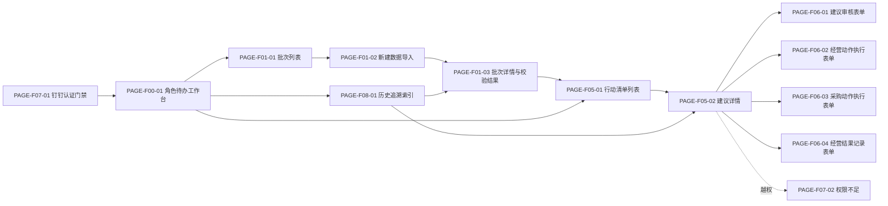

# 全量页面与功能清单

| 页面 ID | Source IDs | 所属阶段 | 功能模块 | 页面名称 | 功能范围描述 |
| :--- | :--- | :--- | :--- | :--- | :--- |
| PAGE-F00-01 | design-derived: DEC-001, DEC-002 | 阶段1(MVP) | 工作台 | 角色待办工作台 | 按当前角色聚合最新批次、风险概览、待审核/待执行/待记录结果与跨部门卡点，并跳转到对应批次或建议。 |
| PAGE-F01-01 | REQ-F01-01, REQ-F01-02, REQ-F05-01, AC-F01-02, AC-F05-02 | 阶段1(MVP) | 数据批次 | 批次列表 | 分页展示历史批次、期间、业务截止日、校验/规则/AI 状态和清单入口；指纹命中时回到原批次。 |
| PAGE-F01-02 | REQ-F01-01, REQ-F01-02, AC-F01-01, AC-F01-03 | 阶段1(MVP) | 数据批次 | 新建数据导入 | 运营填写事业部、完整自然月期间、业务截止日并选择 XLSX；校验必填、日期和文件，提交后进入批次详情。 |
| PAGE-F01-03 | REQ-F01-02, REQ-F02-01, REQ-F02-02, REQ-F02-03, AC-F01-04, AC-F02-01, AC-F02-02, AC-F02-03, AC-F02-04, AC-F02-05, AC-F02-06 | 阶段1(MVP) | 数据批次 | 批次详情与校验结果 | 展示批次摘要、有效/拒绝/降级统计、行字段问题、指标结果与处理状态；明确失败、部分成功、处理中和数据不足。 |
| PAGE-F05-01 | REQ-F05-01, REQ-F05-02, REQ-F05-03, AC-F05-01, AC-F05-03, AC-F05-04, AC-F05-05 | 阶段1(MVP) | 行动清单 | 行动清单列表 | 每批次唯一清单；服务端分页，按固定动作层级排序并支持动作、店铺、责任运营、审核与执行状态筛选。 |
| PAGE-F05-02 | REQ-F03-01, REQ-F03-02, REQ-F03-03, REQ-F04-01, REQ-F04-02, REQ-F04-03, REQ-F06-01, REQ-F06-02, REQ-F06-03, REQ-F08-01, REQ-F08-02 | 阶段1(MVP) | 行动清单 | 建议详情 | 展示结构化四要素、利润—库存双轨决策带、指标/规则快照、AI 独立状态、审核与分动作状态、结果和按角色裁剪的时间线。 |
| PAGE-F06-01 | REQ-F06-01, AC-F06-01, AC-F06-02, AC-F06-06 | 阶段1(MVP) | 审核执行 | 建议审核表单 | 运营主管对整条待审核建议一次通过或驳回；驳回备注必填，提交携带 version，冲突不覆盖现状。 |
| PAGE-F06-02 | REQ-F06-02, REQ-F06-03, AC-F06-03, AC-F06-06 | 阶段1(MVP) | 审核执行 | 经营动作执行表单 | 运营确认加投、观察、SPU 推广止损或清仓的线下执行事实、时间与备注；观察必须记录非空观察备注。 |
| PAGE-F06-03 | REQ-F06-02, REQ-F06-03, AC-F06-04, AC-F06-06 | 阶段1(MVP) | 审核执行 | 采购动作执行表单 | 采购计划确认补货或禁补动作并填写时间、备注和最小结果；页面仅返回库存销量必要依据。 |
| PAGE-F06-04 | REQ-F06-03, AC-F06-05, AC-F06-06 | 阶段1(MVP) | 审核执行 | 经营结果记录表单 | 运营在经营动作执行后记录结果周期、销售额、利润、库存结果或明确未提供；version 冲突保留输入。 |
| PAGE-F07-01 | REQ-F07-03, AC-F07-05, AC-F07-06 | 阶段1(MVP) | 身份权限 | 钉钉认证门禁 | 未登录时仅提供钉钉认证；认证失败、登录态失效或无有效角色时拒绝业务数据并提供重新认证/联系 IT 路径。 |
| PAGE-F07-02 | REQ-F07-01, REQ-F07-02, AC-F07-01, AC-F07-02, AC-F07-03, AC-F07-04 | 阶段1(MVP) | 身份权限 | 权限不足 | 越权直达时显示应用壳内拒绝状态，不返回建议身份、状态及任何受限经营字段。 |
| PAGE-F08-01 | REQ-F08-01, REQ-F08-02, AC-F08-01, AC-F08-02, AC-F08-03, AC-F08-04 | 阶段1(MVP) | 历史追溯 | 历史追溯索引 | 按批次检索历史建议与事件，复用批次详情和建议详情作为真实落点；新批次不覆盖旧快照，采购结果按角色裁剪。 |
| PAGE-P02-01 | design-derived: DEC-004 | 阶段2 | 候选能力 | 经营明细洞察 | planned；依赖：评价、退款原因、广告计划/关键词/素材明细及责任人；与 MVP 关系：挂接稳定 batch/spu/decision 主体；功能范围：评价主题、退款原因和广告明细洞察，启动阶段 2 时重新形成 REQ 并深设计。 |
| PAGE-P02-02 | design-derived: DEC-004 | 阶段2 | 候选能力 | 外部动作写入 | planned；依赖：广告、采购、库存系统接口、审批与回执责任；与 MVP 关系：从稳定 action_id 追加外部回执，不改写人工历史；功能范围：经确认后自动写入外部系统。 |
| PAGE-P03-01 | design-derived: DEC-004 | 阶段3 | 候选能力 | SKU 经营视图 | planned；依赖：SPU—SKU 映射、SKU 成本/库存/销量及费用分摊规则；与 MVP 关系：保留 SPU 为上层稳定主体；功能范围：SKU 级指标、决策与动作，启动阶段 3 时重新深设计。 |

## 页面调用关系

阶段 1 共 13 页；后续 planned 共 3 页。本轮仅为阶段 1 页面生成详细文档和高保真 HTML。
